# Web3 全局主题导航与分层索引

## 一级主题

- [01_Foundations](01_Foundations/)
- [02_Consensus_Theory](02_Consensus_Theory/)
- [03_Architecture](03_Architecture/)
- [04_Scalability](04_Scalability/)
- [05_Security_Privacy](05_Security_Privacy/)
- [06_Identity](06_Identity/)
- [07_Advanced_Topics](07_Advanced_Topics/)
- [08_Economic_Models](08_Economic_Models/)
- [09_Smart_Contracts](09_Smart_Contracts/)
- [10_Applications](10_Applications/)
- [11_Cross_Chain](11_Cross_Chain/)
- [12_Governance_Compliance](12_Governance_Compliance/)
- [13_Industry_Applications](13_Industry_Applications/)
- [14_Emerging_Technologies](14_Emerging_Technologies/)
- [15_Methodology](15_Methodology/)
- [16_Information_Theory](16_Information_Theory/)
- [17_Systems_Theory](17_Systems_Theory/)
- [18_Optimization_Complexity](18_Optimization_Complexity/)
- [19_Control_Theory](19_Control_Theory/)
- [20_Data_Structures_Protocols](20_Data_Structures_Protocols/)
- [21_Formal_Verification](21_Formal_Verification/)
- [22_Layer2_Scaling](22_Layer2_Scaling/)
- [23_Progress_Tracking](23_Progress_Tracking/)
- [00-备份](00-备份/)

## 交叉引用

- [知识图谱](00_Knowledge_Graph.md)
- [术语标准](00_Terminology_Standards.md)
- [内容关系图谱](00_Content_Relationship_Map.md)
- [目录命名规范](00_Directory_Naming_Guidelines.md)

## Mermaid知识图谱锚点

```mermaid
graph TD
  A[Web3] --> B[01_Foundations]
  A --> C[02_Consensus_Theory]
  A --> D[03_Architecture]
  A --> E[04_Scalability]
  A --> F[05_Security_Privacy]
  A --> G[06_Identity]
  A --> H[07_Advanced_Topics]
  A --> I[08_Economic_Models]
  A --> J[09_Smart_Contracts]
  A --> K[10_Applications]
  A --> L[11_Cross_Chain]
  A --> M[12_Governance_Compliance]
  A --> N[13_Industry_Applications]
  A --> O[14_Emerging_Technologies]
  A --> P[15_Methodology]
  A --> Q[16_Information_Theory]
  A --> R[17_Systems_Theory]
  A --> S[18_Optimization_Complexity]
  A --> T[19_Control_Theory]
  A --> U[20_Data_Structures_Protocols]
  A --> V[21_Formal_Verification]
  A --> W[22_Layer2_Scaling]
  A --> X[23_Progress_Tracking]
```

