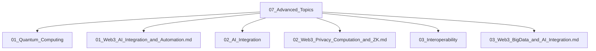

# 07_Advanced_Topics 高级主题分层导航

## 目录结构

- 量子计算与安全
- AI与Web3集成
- 隐私计算与ZK
- 互操作性
- 大数据与AI
- 归档（见 99_Recycle_Bin 或 00-备份）

## 主题导航

- 返回 [全局索引](../00_Index_and_Classification.md)
- 交叉引用：[知识图谱](../00_Knowledge_Graph.md)

## Mermaid知识图谱锚点

# Advanced Topics in Web3

This directory contains in-depth analysis of advanced and emerging topics in Web3 technology, with a focus on formal mathematical models, rigorous proofs, and practical implementations.

## Directory Structure

1. **01_Quantum_Computing** - Analysis of quantum computing implications for Web3
   - Quantum resistance
   - Post-quantum cryptography
   - Quantum algorithms for blockchain

2. **02_AI_Integration** - Integration of AI with Web3 systems
   - AI for consensus optimization
   - Machine learning for security analysis
   - Decentralized AI systems

3. **03_Interoperability** - Cross-chain and cross-system interoperability
   - Formal models for interoperable systems
   - Cross-chain communication protocols
   - Unified formal semantics

4. **04_Temporal_Logic** - Applications of temporal logic in Web3
   - Smart contract verification
   - Consensus protocol analysis
   - State transition systems

5. **05_Type_Theory** - Type theoretic foundations for Web3
   - Dependent type systems
   - Linear types for resource management
   - Formal verification using types

## Document Format

Each document in this section follows the standard structure:

1. Abstract and introduction
2. Formal mathematical definitions using LaTeX
3. Theorems with complete proofs
4. Practical Rust implementations
5. Applications and case studies
6. Security and performance analysis
7. References to related work

## Relationships to Other Sections

The Advanced Topics section builds upon foundations established in:

- 01_Foundations - Basic mathematical and theoretical foundations
- 02_Consensus_Theory - Core consensus mechanisms and protocols
- 05_Security_Privacy - Security models and privacy techniques

And connects to practical implementations in:

- 10_Applications - Real-world applications leveraging advanced concepts
- 09_Smart_Contracts - Implementation in smart contract systems
- 11_Cross_Chain - Practical interoperability systems

## Key Theoretical Frameworks

- Category Theory
- Type Theory
- Process Algebra
- Modal Logic
- Information Theory
- Quantum Information Theory
- Game Theory
- Formal Language Theory

## Status

This section is under active development, with continuous refinement of formal models and practical implementations.

---

-*Last Updated: December 2024*
