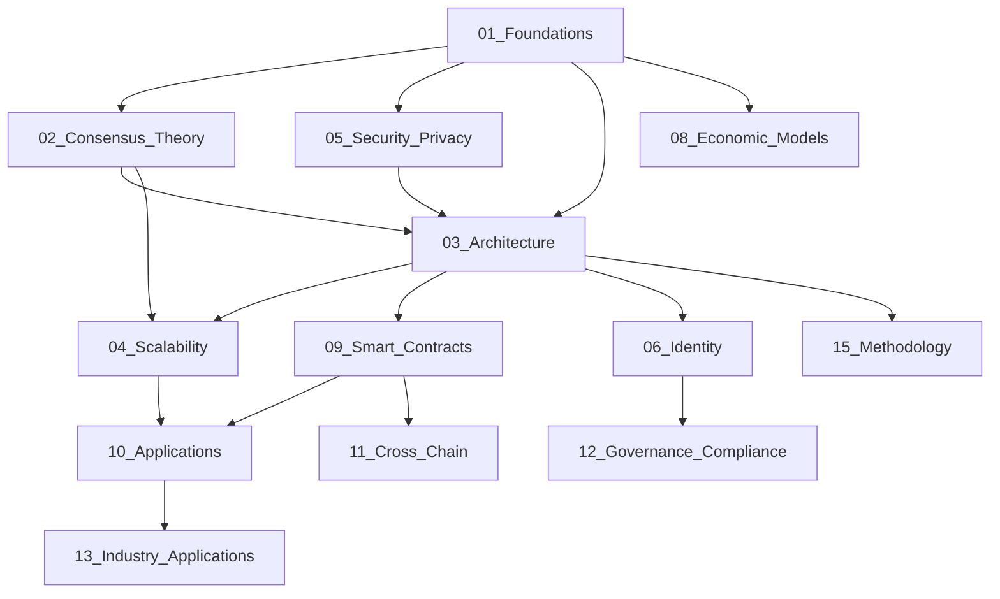

# Web3 Analysis 主题关系映射

## 目的

本文档创建于2025年6月21日，旨在描述Web3分析文档库中各主题之间的关系和依赖性，帮助研究人员更好地理解不同领域之间的联系。

## 核心主题关系图

## 主题内容映射

### 1. 基础层 (Foundational Layer)

这个层级包含Web3技术的基础理论，是其他所有主题的基础。

**核心目录**:

- `01_Foundations/` (基础理论)
- `16_Information_Theory/` (信息论)
- `17_Systems_Theory/` (系统理论)
- `18_Optimization_Complexity/` (优化与复杂度)
- `19_Control_Theory/` (控制理论)

**关系描述**:

- 基础理论为共识机制提供数学基础
- 信息论支持安全与隐私设计
- 系统理论影响整体架构设计
- 优化理论支持可扩展性设计
- 控制理论应用于系统治理

### 2. 协议层 (Protocol Layer)

这个层级关注区块链的底层协议设计和实现。

**核心目录**:

- `02_Consensus_Theory/` (共识理论)
- `04_Scalability/` (可扩展性)
- `05_Security_Privacy/` (安全与隐私)
- `20_Data_Structures_Protocols/` (数据结构与协议)
- `22_Layer2_Scaling/` (Layer2扩展)

**关系描述**:

- 共识理论是区块链协议的核心
- 可扩展性解决方案依赖于共识机制
- 安全性和隐私保护贯穿协议设计
- Layer2扩展是可扩展性研究的延伸
- 数据结构设计影响协议效率和安全性

### 3. 架构层 (Architectural Layer)

这个层级关注系统和软件架构设计。

**核心目录**:

- `03_Architecture/` (架构设计)
- `11_Cross_Chain/` (跨链技术)
- `21_Formal_Verification/` (形式验证)

**关系描述**:

- 架构设计整合共识、安全和可扩展性考量
- 跨链技术扩展架构边界
- 形式验证确保架构的正确性和安全性

### 4. 应用层 (Application Layer)

这个层级关注实际应用和落地场景。

**核心目录**:

- `09_Smart_Contracts/` (智能合约)
- `10_Applications/` (应用层)
- `13_Industry_Applications/` (行业应用)
- `14_Emerging_Technologies/` (新兴技术)

**关系描述**:

- 智能合约是应用层的基础构建块
- 应用层依赖于底层架构和协议
- 行业应用是通用应用的具体落地
- 新兴技术推动应用创新

### 5. 治理层 (Governance Layer)

这个层级关注系统治理和经济模型。

**核心目录**:

- `06_Identity/` (身份管理)
- `08_Economic_Models/` (经济模型)
- `12_Governance_Compliance/` (治理与合规)

**关系描述**:

- 身份管理是治理的基础
- 经济模型激励系统参与者
- 治理与合规确保系统长期可持续发展

### 6. 研究与方法层 (Research & Methodology Layer)

这个层级关注研究方法和高级主题。

**核心目录**:

- `07_Advanced_Topics/` (高级主题)
- `15_Methodology/` (方法论)
- `23_Progress_Tracking/` (进度跟踪)

**关系描述**:

- 方法论指导整个研究过程
- 高级主题整合多个领域的知识
- 进度跟踪监控研究进展

## 跨主题概念

以下是贯穿多个主题的核心概念：

1. **去中心化** - 影响架构、共识和应用设计
2. **安全性** - 从基础密码学到应用层安全
3. **可扩展性** - 从协议设计到实际应用
4. **互操作性** - 从跨链协议到应用集成
5. **形式化方法** - 从数学基础到验证工具

## 主题发展路径

研究这些主题的建议顺序：

1. **基础入门**: 基础理论 → 系统理论 → 信息论
2. **协议理解**: 共识理论 → 安全与隐私 → 数据结构与协议
3. **架构设计**: 架构理论 → 形式验证 → 可扩展性
4. **应用开发**: 智能合约 → 应用层 → 行业应用
5. **系统治理**: 经济模型 → 身份管理 → 治理与合规
6. **前沿探索**: 新兴技术 → 高级主题 → 跨链技术

## 缺失的主题领域

在当前文档结构中，以下领域可能需要加强：

1. **用户体验与界面设计** - Web3应用的用户交互
2. **隐私计算技术** - 安全多方计算、零知识证明等深度研究
3. **法律法规研究** - 区块链技术的法律框架与合规要求
4. **社会科学视角** - Web3社区治理的社会学分析
5. **可持续发展** - 区块链能耗与环境影响研究

## 主题整合建议

为提高研究效率，以下主题可考虑整合：

1. 将`06_Identity/`和`12_Governance_Compliance/`整合为"身份与治理"
2. 将`04_Scalability/`和`22_Layer2_Scaling/`整合为"可扩展性研究"
3. 将`16_Information_Theory/`、`17_Systems_Theory/`、`18_Optimization_Complexity/`和`19_Control_Theory/`整合为"理论基础"

## 结论

Web3文档库的主题结构已形成较为完整的知识体系，涵盖从基础理论到实际应用的各个方面。通过理解各主题间的关系，可以更好地导航和利用这些知识资源，以推动Web3技术的研究与应用。
