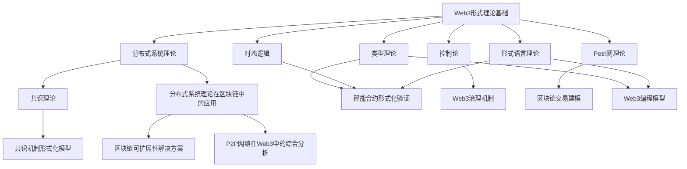
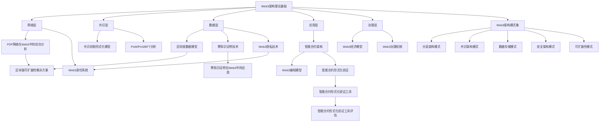
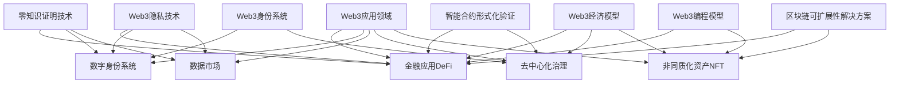

# Web3内容关系图谱

## 目录

1. [概述](#1-概述)
2. [核心理论关系](#2-核心理论关系)
3. [技术架构关系](#3-技术架构关系)
4. [应用领域关系](#4-应用领域关系)
5. [文档间引用关系](#5-文档间引用关系)
6. [维护与扩展](#6-维护与扩展)

## 1. 概述

本文档提供了Web3分析内容的关系图谱，展示各文档间的内在联系和知识脉络。通过可视化这些关系，可以更好地理解知识体系的整体结构，帮助读者在不同主题间建立联系。

### 1.1 图谱目的

- 展示文档间的逻辑关联和依赖关系
- 提供知识导航，指引深入阅读路径
- 识别知识覆盖和潜在空白
- 支持文档间的交叉引用

### 1.2 图谱组织方式

关系图谱按以下维度组织：

1. 理论基础关系：基础理论之间的关联
2. 技术架构关系：架构组件和层次之间的关联
3. 应用领域关系：不同应用场景之间的关联
4. 文档直接引用：文档间的显式引用关系

## 2. 核心理论关系

### 2.1 理论关系说明

- **形式理论基础**是Web3分析的理论核心，提供了数学化和形式化的基础框架
- **分布式系统理论**是区块链技术的直接理论源头，通过共识理论与区块链实现连接
- **类型理论**和**时态逻辑**为智能合约验证提供了形式化方法
- **控制论**为治理机制设计提供理论基础
- **Petri网理论**为交易流程和并发性建模提供工具

### 2.2 核心概念映射

| 理论领域 | 核心概念 | 应用于Web3的方面 |
|---------|---------|----------------|
| 类型理论 | 线性类型、依赖类型 | 资源安全、合约验证 |
| 时态逻辑 | LTL、CTL、模型检验 | 协议安全性、活性验证 |
| 分布式系统 | CAP定理、FLP不可能性 | 共识设计、系统权衡 |
| 控制论 | 反馈控制、稳定性 | 代币经济、自适应机制 |
| 形式语言 | 文法、自动机 | 合约语言设计、验证 |
| Petri网 | 并发建模、可达性 | 交易流程、资源竞争 |

## 3. 技术架构关系

### 3.1 架构层次关系

Web3架构按以下层次组织，各层次通过接口进行互操作：

1. **网络层**：负责节点发现和数据传播
2. **共识层**：负责状态同步和交易排序
3. **数据层**：负责数据组织和存储
4. **应用层**：负责业务逻辑实现
5. **治理层**：负责参数调整和协议演进

### 3.2 技术组件关系

| 架构层次 | 核心组件 | 关联文档 |
|---------|---------|---------|
| 网络层 | P2P网络、DHT、Gossip | P2P网络在Web3中的综合分析 |
| 共识层 | 共识算法、验证机制 | 共识机制形式化模型 |
| 数据层 | Merkle树、状态存储 | 区块链数据模型 |
| 应用层 | 智能合约、DApps | Web3编程模型、智能合约形式化验证 |
| 治理层 | 治理机制、经济模型 | Web3经济模型、Web3治理机制 |

## 4. 应用领域关系

### 4.1 应用领域交叉关系

Web3的不同应用领域之间存在广泛的技术共享和互操作性需求：

1. **DeFi与身份系统**：KYC/AML合规与隐私保护
2. **数据市场与隐私技术**：数据货币化与隐私保护
3. **去中心化治理与经济模型**：治理代币与激励机制
4. **NFT与可扩展性**：大规模NFT应用的性能需求

### 4.2 技术在应用中的体现

| 应用领域 | 关键技术 | 实现挑战 |
|---------|---------|---------|
| DeFi | 智能合约、形式化验证、可扩展性 | 安全性、流动性、互操作性 |
| 身份系统 | 零知识证明、隐私技术、密码学 | 隐私与合规平衡、互操作性 |
| 数据市场 | 隐私计算、代币经济、存储证明 | 数据隐私、激励对齐 |
| 去中心化治理 | 投票机制、经济模型、DAO | 参与度、专业知识、效率 |
| NFT生态 | 内容寻址、元数据标准、可扩展性 | 版权保护、互操作性、用户体验 |

## 5. 文档间引用关系

### 5.1 直接引用关系

以下是文档间的主要直接引用关系：

1. **Web3形式理论基础** 被引用于：
   - 分布式系统理论在区块链中的应用
   - 智能合约形式化验证
   - Web3编程模型

2. **分布式系统理论在区块链中的应用** 被引用于：
   - 区块链可扩展性解决方案
   - P2P网络在Web3中的综合分析
   - 共识机制形式化模型

3. **智能合约形式化验证** 被引用于：
   - 智能合约形式化验证工具
   - Web3编程模型
   - DeFi安全分析

4. **Web3架构理论基础** 被引用于：
   - Web3架构模式集
   - 区块链可扩展性解决方案
   - Web3编程模型

### 5.2 知识路径图

以下知识路径提供了系统学习Web3技术的推荐阅读顺序：

1. **基础理论路径**：
   Web3形式理论基础 → 分布式系统理论在区块链中的应用 → 共识机制形式化模型

2. **架构设计路径**：
   Web3架构理论基础 → Web3架构模式集 → 特定架构模式深入

3. **智能合约开发路径**：
   Web3编程模型 → 智能合约形式化验证 → 智能合约形式化验证工具

4. **隐私技术路径**：
   Web3隐私技术 → 零知识证明技术 → 零知识证明在特定应用中的应用

## 6. 维护与扩展

### 6.1 关系图谱维护

本关系图谱应随着文档内容的发展而更新：

1. 新文档添加时，应在相应关系图中增加节点和连接
2. 文档内容更新时，应检查并更新关系描述
3. 确保图谱中的每个节点都有对应文档，每个关系都有明确定义

### 6.2 未来扩展方向

关系图谱的计划扩展方向：

1. 增加**量化指标**，表示文档间关联强度
2. 开发**交互式可视化**，便于导航和探索
3. 针对特定应用领域创建**专题图谱**
4. 增加与外部资源和标准的**映射关系**

---

**最后更新日期**：2023年11月15日  
**维护负责人**：Web3内容分析团队
