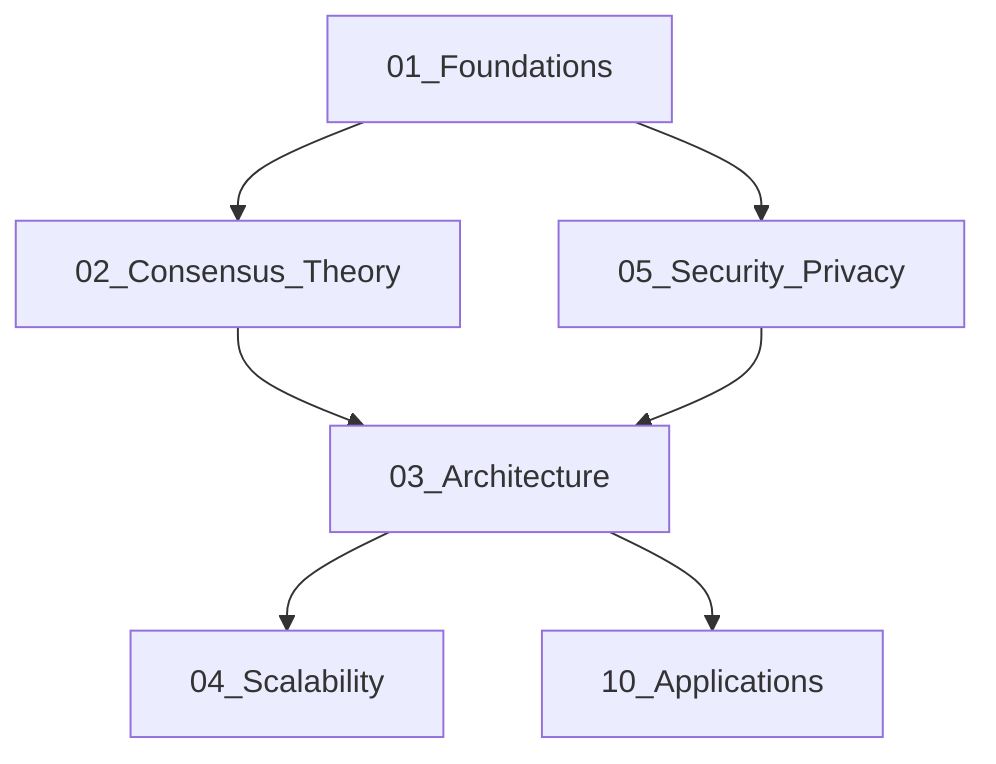

# Web3 Analysis 索引更新建议

## 概述

本文档提供对`00_Index_and_Classification.md`的更新建议，使其与当前文件结构保持一致，并改进索引的组织方式。

## 问题分析

1. **索引与实际结构不符**：索引中列出的许多文件已被移至回收站
2. **缺少清理后的目录结构**：索引未反映最新的清理结果
3. **分类不准确**：部分文件分类需要调整

## 更新建议

### 1. 更新索引标题和说明

```markdown
# Web3架构分析文档分类索引 (2025版)

## 文档分类体系

本文档建立了Web3架构分析文档的完整分类体系，将所有文档按主题、层次和类型进行系统化组织。本索引反映2025年6月清理后的文档结构。
```

### 2. 更新目录结构说明

```markdown
## 分类目录总览

文档库已整理为以下24个主题目录：

1. `01_Foundations/` - 基础理论
2. `02_Consensus_Theory/` - 共识理论
3. `03_Architecture/` - 架构设计
4. `04_Scalability/` - 可扩展性
5. `05_Security_Privacy/` - 安全与隐私
...
24. `99_Recycle_Bin/` - 回收站(存放待确认删除的文件)
```

### 3. 更新各目录内容索引

示例(基础理论目录)：

```markdown
### 1. 基础理论类 (01_Foundations/)

**1.1 核心子目录**

- `01_Formal_Theory/` - 形式化理论
- `01_Set_Theory_and_Logic/` - 集合论与逻辑
- `01_Type_Theory/` - 类型理论
- `02_Algebraic_Structures/` - 代数结构
- `02_Formal_Science/` - 形式科学
- `02_Mathematics/` - 数学
- `03_Cryptographic_Mathematics/` - 密码学数学
- `03_Formal_Language_Theory/` - 形式语言理论
- `04_Probability_and_Statistics/` - 概率与统计学

**1.2 核心文档**

- `README.md` - 基础理论目录说明
```

### 4. 更新文件组织建议

```markdown
## 文件组织建议

### 文件命名规范

1. **主目录**: 使用数字前缀 `XX_主题名称`
2. **子目录**: 使用数字前缀 `XX_子主题名称`
3. **文档文件**: 使用格式 `XX_主题_详细描述.md`
4. **版本标记**: 需要标记版本时使用 `_vX` 格式
```

### 5. 添加文档状态标记

```markdown
## 文档状态标记

为便于管理，建议在文档中使用以下状态标记：

- 📝 (进行中) - 文档正在编写或更新
- ✅ (已完成) - 文档已完成并审核
- 🔍 (需审查) - 文档需要技术审查
- 🔄 (需更新) - 文档需要更新或修订
```

### 6. 更新文档关系图

```markdown
## 主要文档关系

可以使用Mermaid图表来展示主要文档间的关系：



### 7. 更新文档索引表

建议创建一个更简洁的文档索引表，按照目录组织，仅列出每个目录下的核心文档和子目录，而非所有文件。这样可以提高索引的可用性。

## 实施计划

1. **备份当前索引**: 在更新前保存当前版本
2. **更新目录结构**: 反映当前的24个主题目录
3. **更新文件列表**: 删除已移至回收站的文件引用
4. **添加新增内容**: 增加清理总结文件等新增内容
5. **完善文档关系**: 添加文档间关系的可视化图表

## 长期维护建议

1. **自动化索引更新**: 开发脚本定期扫描目录结构并更新索引
2. **添加元数据**: 在文档中添加YAML前置元数据，便于自动化管理
3. **定期审核**: 每季度审核一次索引与实际结构的一致性
