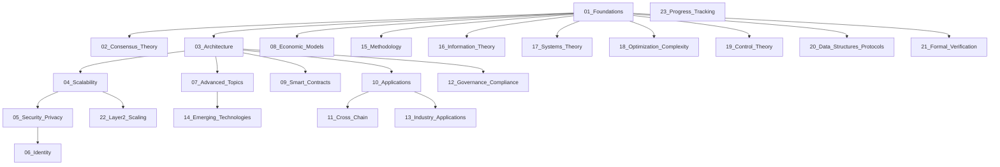

# Web3 知识体系全局知识网络图谱

```mermaid
graph TD
  F[01_Foundations] --> C[02_Consensus_Theory]
  F --> A[03_Architecture]
  A --> S[04_Scalability]
  S --> SP[05_Security_Privacy]
  SP --> ID[06_Identity]
  A --> AT[07_Advanced_Topics]
  F --> EM[08_Economic_Models]
  A --> SC[09_Smart_Contracts]
  A --> AP[10_Applications]
  AP --> CC[11_Cross_Chain]
  A --> GC[12_Governance_Compliance]
  AP --> IA[13_Industry_Applications]
  AT --> ET[14_Emerging_Technologies]
  F --> M[15_Methodology]
  F --> IT[16_Information_Theory]
  F --> ST[17_Systems_Theory]
  F --> OC[18_Optimization_Complexity]
  F --> CT[19_Control_Theory]
  F --> DP[20_Data_Structures_Protocols]
  F --> FV[21_Formal_Verification]
  S --> L2S[22_Layer2_Scaling]
  PT[23_Progress_Tracking]
```

> 主题节点可跳转至各自README，子主题与交叉引用详见各主题分层README。
