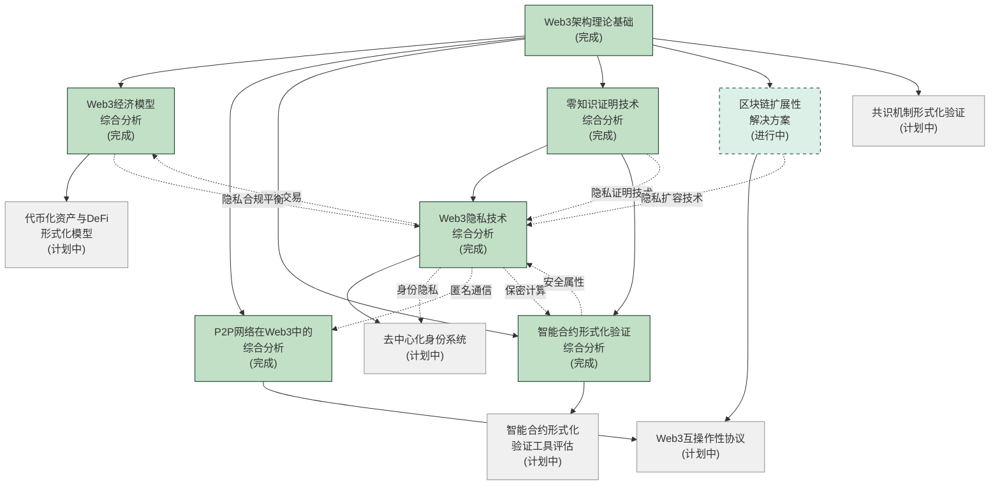

# Web3技术分析知识图谱

## 1. 知识图谱概述

本图谱展示了Web3技术分析文档间的逻辑关系与知识连接，帮助理解不同主题间的关联和继承关系。

## 2. 主题关联详解

### 2.1 核心主题关联

| 关联主题 | 关联强度 | 关系描述 |
|---------|----------|---------|
| 架构理论 → 经济模型 | 强 | 架构设计直接影响经济激励结构和治理机制 |
| 架构理论 → P2P网络 | 强 | 区块链架构依赖P2P网络作为通信基础设施 |
| 架构理论 → 智能合约验证 | 中 | 架构决定了智能合约的执行环境和安全边界 |
| 架构理论 → 零知识证明 | 中 | ZK技术为区块链架构提供隐私和可扩展性能力 |
| 零知识证明 → 隐私技术 | 强 | ZK是核心隐私保护密码学工具 |
| 零知识证明 → 智能合约验证 | 中 | ZK可用于证明合约执行正确性 |
| 隐私技术 → 身份系统 | 强 | 隐私保护身份是去中心化身份系统的核心需求 |
| 隐私技术 → 经济模型 | 中 | 隐私交易与合规需求影响经济设计 |
| 隐私技术 → P2P网络 | 中 | 网络层隐私是全面隐私保护的基础 |

### 2.2 完成文档集

已完成的核心文档构成了Web3技术的基础理论框架:

1. **[Web3架构理论基础](../03_Architecture/Web3_Architecture_Theory_Foundations.md)** - 奠定整体架构理论
2. **[零知识证明技术综合分析](../05_Security_Privacy/Zero_Knowledge_Proofs_Comprehensive.md)** - 提供密码学保障
3. **[Web3经济模型综合分析](../08_Economic_Models/Web3_Economic_Models_Comprehensive.md)** - 建立经济激励框架
4. **[P2P网络在Web3中的综合分析](../20_Data_Structures_Protocols/P2P_Networks_In_Web3_Comprehensive.md)** - 构建通信基础
5. **[智能合约形式化验证综合分析](../21_Formal_Verification/Smart_Contract_Formal_Verification.md)** - 确保代码安全
6. **[Web3隐私技术综合分析](../05_Security_Privacy/Web3_Privacy_Technologies.md)** - 构建全面隐私保护

### 2.3 知识扩展方向

当前知识图谱的主要扩展方向:

1. **纵深发展** - 对现有主题进行更深入的技术实现分析
   - 智能合约形式化验证 → 验证工具评估
   - P2P网络 → 网络安全性与性能优化
   - 隐私技术 → 具体应用场景实现

2. **横向拓展** - 连接相关但尚未深入研究的领域
   - 去中心化身份与隐私技术的结合
   - 互操作性协议与跨链通信
   - DeFi协议的形式化验证与风险分析

3. **应用层整合** - 将理论框架映射到具体应用领域
   - 行业应用映射分析
   - 用户体验与接口设计
   - 监管与合规框架

## 3. 后续计划

根据知识图谱关系，建议的优先开发顺序:

1. 完成**区块链扩展性解决方案**分析，与现有架构和隐私技术文档形成完整三角关系
2. 开发**智能合约验证工具评估**，作为智能合约形式化验证的实用延伸
3. 启动**去中心化身份系统**研究，与隐私技术形成应用层连接

## 4. 知识图谱维护

本知识图谱将随文档集的扩展而更新，确保:

1. 新增文档被适当连接到现有知识网络
2. 关联强度和关系描述保持准确
3. 交叉主题得到充分展示

随着文档数量增加，将考虑采用分层知识图谱以保持可读性和导航性。

---

**最后更新**: 2023年11月5日  
**图谱版本**: v3.0
