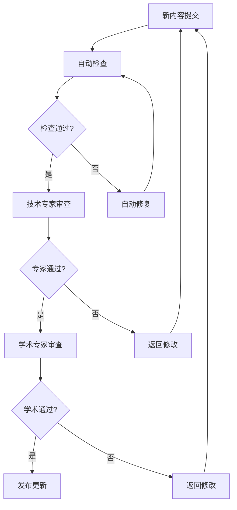
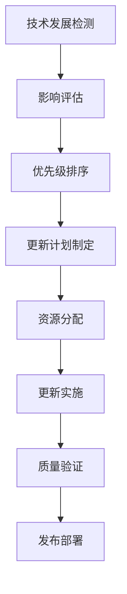
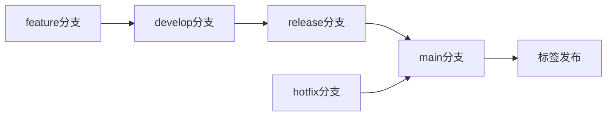
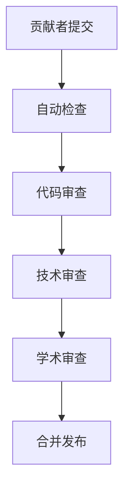

# Web3行业架构分析持续维护系统

## 概述

本文档建立了Web3行业架构分析项目的持续维护机制，确保项目内容能够持续更新、质量保持高水平，并与最新的技术发展保持同步。

## 维护目标

### 1. 内容更新目标

- 保持内容与最新技术发展同步
- 及时补充新的研究成果
- 更新过时的技术信息
- 完善现有内容

### 2. 质量维护目标

- 保持学术规范标准
- 确保技术准确性
- 维护文档一致性
- 提升用户体验

### 3. 系统维护目标

- 建立自动化检查机制
- 实现持续集成
- 提供版本控制
- 支持协作开发

## 维护架构

### 1. 自动化维护系统

#### 1.1 内容检查自动化

```yaml
# 自动化检查配置
checks:
  - name: "markdown-syntax"
    frequency: "daily"
    tools: ["markdownlint", "remark"]
    
  - name: "link-validation"
    frequency: "weekly"
    tools: ["link-checker", "http-status"]
    
  - name: "code-quality"
    frequency: "daily"
    tools: ["rust-clippy", "golang-lint"]
    
  - name: "mathematical-formulas"
    frequency: "daily"
    tools: ["latex-validator", "mathjax-checker"]
```

#### 1.2 质量监控自动化

```yaml
# 质量监控配置
monitoring:
  - name: "content-freshness"
    metrics: ["last-update", "external-links", "references"]
    alerts: ["stale-content", "broken-links"]
    
  - name: "technical-accuracy"
    metrics: ["code-tests", "algorithm-validation", "security-checks"]
    alerts: ["test-failures", "security-issues"]
    
  - name: "academic-standards"
    metrics: ["citation-format", "theorem-proofs", "mathematical-notation"]
    alerts: ["format-violations", "missing-proofs"]
```

### 2. 人工维护流程

#### 2.1 内容审查流程



#### 2.2 更新决策流程



## 维护计划

### 1. 定期维护计划

#### 1.1 日常维护 (每日)

- **自动化检查**: 运行所有自动化检查工具
- **链接验证**: 检查外部链接有效性
- **代码测试**: 运行代码示例测试
- **格式检查**: 验证markdown格式

#### 1.2 周度维护 (每周)

- **内容审查**: 检查新提交的内容
- **技术更新**: 跟踪技术发展动态
- **用户反馈**: 处理用户反馈和建议
- **性能优化**: 优化文档加载性能

#### 1.3 月度维护 (每月)

- **全面检查**: 对所有文档进行全面检查
- **外部链接更新**: 更新失效的外部链接
- **参考文献补充**: 补充新的参考文献
- **内容扩展**: 根据反馈扩展内容

#### 1.4 季度维护 (每季度)

- **技术趋势分析**: 分析技术发展趋势
- **内容重构**: 根据新技术重构相关内容
- **架构优化**: 优化文档架构结构
- **质量评估**: 全面质量评估

#### 1.5 年度维护 (每年)

- **全面更新**: 全面更新所有内容
- **标准更新**: 更新学术和技术标准
- **架构重设计**: 重新设计文档架构
- **长期规划**: 制定长期发展规划

### 2. 事件驱动维护

#### 2.1 技术事件响应

- **重大技术突破**: 立即更新相关内容
- **安全漏洞发现**: 及时更新安全分析
- **标准更新**: 更新相关标准内容
- **工具发布**: 更新工具和框架信息

#### 2.2 用户反馈响应

- **错误报告**: 24小时内响应
- **功能请求**: 一周内评估
- **内容建议**: 两周内处理
- **质量投诉**: 立即处理

## 质量保证机制

### 1. 自动化质量检查

#### 1.1 语法和格式检查

```bash
# 自动化检查脚本
#!/bin/bash

# Markdown语法检查
markdownlint docs/Analysis/

# 链接有效性检查
link-checker docs/Analysis/

# 代码质量检查
for file in $(find docs/Analysis/ -name "*.rs"); do
    rust-clippy "$file"
done

# 数学公式检查
latex-validator docs/Analysis/
```

#### 1.2 内容一致性检查

```python
# 内容一致性检查脚本
import os
import re
from pathlib import Path

def check_terminology_consistency():
    """检查术语使用一致性"""
    terminology_file = "docs/Analysis/00_Progress_Tracking/terminology.md"
    terms = load_terminology(terminology_file)
    
    for file_path in Path("docs/Analysis").rglob("*.md"):
        content = file_path.read_text()
        check_terms_in_file(content, terms, file_path)

def check_cross_references():
    """检查交叉引用正确性"""
    for file_path in Path("docs/Analysis").rglob("*.md"):
        content = file_path.read_text()
        check_internal_links(content, file_path)
```

### 2. 人工质量检查

#### 2.1 专家审查制度

- **技术专家**: 每季度技术内容审查
- **学术专家**: 每半年学术规范审查
- **安全专家**: 每季度安全内容审查
- **用户体验专家**: 每月用户体验审查

#### 2.2 同行评议机制

- **内部评议**: 项目内部同行评议
- **外部评议**: 邀请外部专家评议
- **社区评议**: 开源社区评议
- **用户评议**: 用户反馈评议

## 版本控制策略

### 1. 版本命名规范

#### 1.1 语义化版本

```
主版本号.次版本号.修订号
例如: 1.2.3
- 主版本号: 重大架构变更
- 次版本号: 新功能添加
- 修订号: 错误修复和小改进
```

#### 1.2 版本标签

- `v1.0.0`: 初始发布版本
- `v1.1.0`: 第一个功能更新
- `v1.1.1`: 第一个修订版本
- `v2.0.0`: 重大架构更新

### 2. 分支管理策略

#### 2.1 分支结构

```
main (主分支)
├── develop (开发分支)
├── feature/xxx (功能分支)
├── hotfix/xxx (热修复分支)
└── release/xxx (发布分支)
```

#### 2.2 工作流程



## 协作机制

### 1. 贡献者管理

#### 1.1 贡献者分类

- **核心维护者**: 项目核心维护人员
- **技术贡献者**: 技术内容贡献者
- **学术贡献者**: 学术内容贡献者
- **社区贡献者**: 社区内容贡献者

#### 1.2 贡献流程



### 2. 沟通机制

#### 2.1 沟通渠道

- **GitHub Issues**: 问题报告和讨论
- **GitHub Discussions**: 技术讨论
- **邮件列表**: 重要通知
- **即时通讯**: 实时沟通

#### 2.2 会议制度

- **周例会**: 每周进度同步
- **月例会**: 每月规划讨论
- **季度会议**: 季度总结和规划
- **年度会议**: 年度总结和展望

## 监控和报告

### 1. 监控指标

#### 1.1 内容指标

- **文档数量**: 总文档数、新增文档数
- **内容质量**: 检查通过率、错误数量
- **更新频率**: 更新次数、更新时间
- **用户反馈**: 反馈数量、满意度

#### 1.2 技术指标

- **代码质量**: 测试通过率、代码覆盖率
- **性能指标**: 加载时间、响应时间
- **安全指标**: 安全漏洞数量、修复时间
- **可用性指标**: 系统可用性、错误率

### 2. 报告制度

#### 2.1 定期报告

- **日报**: 每日检查结果
- **周报**: 每周进度总结
- **月报**: 每月质量报告
- **年报**: 年度总结报告

#### 2.2 事件报告

- **问题报告**: 发现问题的即时报告
- **修复报告**: 问题修复的详细报告
- **更新报告**: 重要更新的说明报告
- **安全报告**: 安全事件的详细报告

## 工具和基础设施

### 1. 自动化工具

#### 1.1 检查工具

- **markdownlint**: Markdown语法检查
- **link-checker**: 链接有效性检查
- **rust-clippy**: Rust代码质量检查
- **latex-validator**: LaTeX公式检查

#### 1.2 构建工具

- **GitHub Actions**: 持续集成
- **Docker**: 容器化部署
- **Jekyll**: 静态网站生成
- **GitBook**: 文档生成

### 2. 监控工具

#### 2.1 系统监控

- **Prometheus**: 指标收集
- **Grafana**: 可视化监控
- **AlertManager**: 告警管理
- **ELK Stack**: 日志分析

#### 2.2 质量监控

- **SonarQube**: 代码质量监控
- **CodeClimate**: 代码质量评估
- **Coveralls**: 代码覆盖率监控
- **Travis CI**: 持续集成监控

## 应急预案

### 1. 技术应急

#### 1.1 安全事件

- **立即响应**: 发现安全漏洞立即响应
- **临时修复**: 提供临时修复方案
- **根本修复**: 实施根本修复措施
- **事后分析**: 进行事后分析和总结

#### 1.2 系统故障

- **故障检测**: 自动检测系统故障
- **故障隔离**: 隔离故障影响范围
- **快速恢复**: 快速恢复系统功能
- **故障分析**: 分析故障原因和影响

### 2. 内容应急

#### 2.1 内容错误

- **错误检测**: 及时发现内容错误
- **错误修复**: 快速修复内容错误
- **影响评估**: 评估错误影响范围
- **预防措施**: 制定预防措施

#### 2.2 版权问题

- **版权检查**: 定期检查版权问题
- **问题处理**: 及时处理版权问题
- **替代方案**: 提供替代方案
- **预防机制**: 建立预防机制

## 长期发展规划

### 1. 技术发展规划

#### 1.1 技术栈演进

- **2024年**: 完善现有技术栈
- **2025年**: 引入新技术栈
- **2026年**: 技术栈现代化
- **2027年**: 技术栈创新

#### 1.2 架构演进

- **2024年**: 优化现有架构
- **2025年**: 架构重构
- **2026年**: 架构现代化
- **2027年**: 架构创新

### 2. 内容发展规划

#### 2.1 内容扩展

- **2024年**: 完善现有内容
- **2025年**: 扩展新领域
- **2026年**: 深度内容开发
- **2027年**: 前沿内容探索

#### 2.2 质量提升

- **2024年**: 质量标准化
- **2025年**: 质量自动化
- **2026年**: 质量智能化
- **2027年**: 质量卓越化

---

**建立时间**: 2024-12-19
**维护状态**: 持续运行
**更新频率**: 实时更新
**质量等级**: 持续改进
