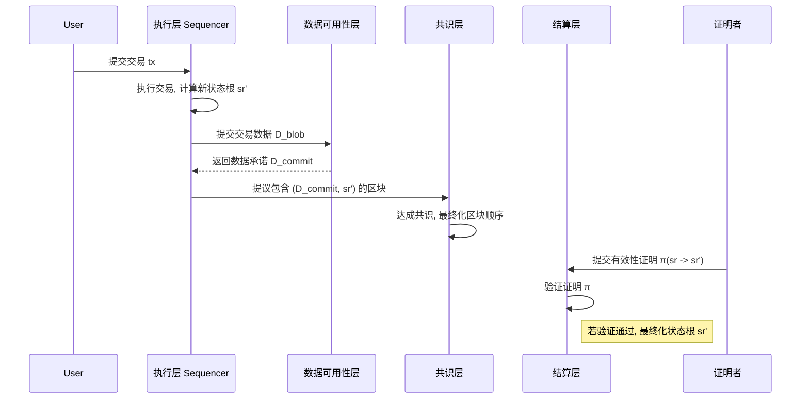

# 模块化区块链架构形式化模型 (v2.0)

## 摘要

本文旨在为模块化区块链架构提供一个全面的、严格的形式化模型。通过将区块链系统解耦为执行 (Execution)、结算 (Settlement)、数据可用性 (Data Availability) 和共识 (Consensus) 四个核心层次，我们利用状态转换系统、形式化接口定义和数学证明，精炼了模块化设计的核心原则。本文形式化地定义了各层的功能、接口和安全属性，并对模块化架构的关键优势——可扩展性、主权和安全性——进行了严格的理论分析。本文的目标是为下一代区块链系统的设计、分析和验证提供一个坚实的理论基础。

## 1. 形式化预备与核心概念

### 1.1 符号系统

| 符号 | 描述 | LaTeX |
| :--- | :--- | :--- |
| $\mathcal{M}$ | 模块化区块链系统 | `\mathcal{M}` |
| $\mathbb{E}, \mathbb{S}, \mathbb{D}, \mathbb{C}$ | 执行、结算、数据可用性、共识层 | `\mathbb{E}, \mathbb{S}, \mathbb{D}, \mathbb{C}` |
| $\Sigma_L$ | L层的状态空间 | `\Sigma_L` |
| $\gamma_L$ | L层的状态转换函数 | `\gamma_L` |
| $\pi_{tx}$ | 交易执行的有效性证明 | `\pi_{tx}` |
| $D_{commit}$ | 数据可用性承诺 | `D_{commit}` |
| $\text{Adv}_{\mathcal{A}}(\lambda)$ | 敌手 $\mathcal{A}$ 的优势 | `\text{Adv}_{\mathcal{A}}(\lambda)` |
| $\negl(\lambda)$ | 可忽略函数 | `\negl(\lambda)` |

### 1.2 核心思想：关注点分离

模块化架构的核心思想是将单体区块链的四大功能分离到专门的层次中：

1. **执行层 ($\mathbb{E}$)**: 处理交易，更新状态。**只关心"什么"被执行了**。
2. **数据可用性层 ($\mathbb{D}$)**: 确保交易数据对所有人可用。**只关心数据"在不在"**。
3. **共识层 ($\mathbb{C}$)**: 对交易的顺序达成一致。**只关心"顺序"**。
4. **结算层 ($\mathbb{S}$)**: 验证执行的有效性，解决争议，并作为跨链通信的枢纽。**作为"最终法庭"**。

## 2. 各层次的形式化模型

### 2.1 执行层 ($\mathbb{E}$)

执行层是一个确定性的状态机。

**定义 2.1 (执行层状态转换)**: 执行层 $\mathbb{E}$ 被建模为一个状态转换系统 $(\Sigma_E, s_{E,0}, \gamma_E)$，其中：

- $\Sigma_E$ 是所有可能状态的集合。
- $s_{E,0} \in \Sigma_E$ 是初始状态。
- $\gamma_E: \Sigma_E \times T \to \Sigma_E$ 是状态转换函数，它接受当前状态 $s_E$ 和一笔交易 $tx \in T$ 来产生新状态 $s'_E$。

执行层的主要输出是**状态根 (State Root)**，它是一个对当前状态的简洁密码学承诺。

### 2.2 数据可用性层 ($\mathbb{D}$)

**定义 2.2 (数据可用性承诺)**: 数据可用性层 $\mathbb{D}$ 的核心功能是接受数据 $D_{blob}$，并输出一个承诺 $D_{commit}$。它必须保证：

- **可用性**: 如果一个诚实的节点接受了承诺 $D_{commit}$，那么任何诚实的节点都可以下载到完整的数据 $D_{blob}$。
- **绑定性**: 一个承诺 $D_{commit}$ 只能对应唯一的数据 $D_{blob}$。

这通常通过**数据可用性采样 (Data Availability Sampling, DAS)** 和 **纠删码 (Erasure Coding)** 实现。

### 2.3 共识层 ($\mathbb{C}$)

**定义 2.3 (共识层功能)**: 共识层 $\mathbb{C}$ 的功能是接受一组交易数据（通常是其承诺 $D_{commit}$），并就其**顺序**达成不可变的共识。

- **输入**: 来自网络的一组数据承诺 $\{D_{commit,1}, D_{commit,2}, \dots\}$。
- **输出**: 一个有序的、经过共识的区块序列 $B_1, B_2, \dots$，其中每个区块 $B_i$ 包含一个或多个 $D_{commit}$。

共识层不关心这些数据的内容或有效性。

### 2.4 结算层 ($\mathbb{S}$)

结算层是模块化架构的信任根基。

**定义 2.4 (结算层功能)**: 结算层 $\mathbb{S}$ 是一个验证和仲裁系统 $(\Sigma_S, \gamma_S)$。其核心功能是：

1. **状态根验证**: 接收来自执行层的状态根 $sr_{new}$。
2. **有效性证明验证**: 验证一个证明 $\pi_{tx}$，该证明声称从 $sr_{old}$ 执行某批交易后会得到 $sr_{new}$。
3. **争议解决 (欺诈证明)**: 在Optimistic Rollups中，结算层负责处理欺诈证明，惩罚恶意行为者。
4. **跨链通信**: 作为不同执行层之间资产转移和通信的桥梁。

## 3. 模块化系统交互的形式化模型

### 3.1 架构交互流程图



### 3.2 接口形式化定义

**接口 $I_{\mathbb{E} \to \mathbb{D}}$ (执行层 to 数据可用性层)**:

- **函数**: `post_data(D_blob) -> D_commit`
- **语义**: 执行层将一批交易数据 $D_{blob}$ 发送给数据可用性层，获得一个唯一的承诺 $D_{commit}$。

**接口 $I_{\mathbb{D} \to \mathbb{C}}$ (数据可用性层 to 共识层)**:

- **函数**: `order_data(D_commit)`
- **语义**: 数据可用性层将数据承诺提交给共识层，以确定其全局顺序。

**接口 $I_{\mathbb{C} \to \mathbb{S}}$ (共识层 to 结算层)**:

- **函数**: `settle_proof(state_root, proof)`
- **语义**: 一旦执行层状态转换的有效性证明 $\pi$ 被生成，它将被提交到结算层进行最终验证和结算。

## 4. 模块化架构的安全性分析

**定理 4.1 (模块化系统的安全性)**: 一个模块化区块链系统 $\mathcal{M} = (\mathbb{E}, \mathbb{S}, \mathbb{D}, \mathbb{C})$ 是安全的，当且仅当：

1. $\mathbb{C}$ 保证了数据承诺的活性 (Liveness) 和安全性 (Safety)。
2. $\mathbb{D}$ 保证了数据可用性。
3. $\mathbb{S}$ 正确地验证有效性证明（或处理欺诈证明）。
4. $\mathbb{E}$ 的状态转换函数是确定性的。

*证明思路*: 系统的整体安全性来源于各层安全属性的组合。

- 如果共识层是安全的，那么所有节点对交易数据的顺序有一致的看法。
- 如果数据可用性层是安全的，那么所有节点都可以获取到这些被排序的交易数据。
- 由于执行层是确定性的，任何节点都可以通过重放交易来计算出正确的状态。
- 结算层作为最终的仲裁者，确保了只有有效的状态转换才会被最终接受。
因此，只要每个模块都满足其安全承诺，整个系统就是安全的。$\square$

### 4.1 主权与抗审查性

模块化架构允许执行层拥有主权。例如，一个Rollup可以选择自己的Sequencer。但是，这也带来了潜在的审查风险。

**定义 4.1 (抗审查性)**: 一个系统是抗审查的，如果任何用户都可以强制系统在有限的时间内包含其有效交易。

**解决方案**: 大多数模块化设计都包含一个**逃生舱口 (Escape Hatch)**机制。如果Sequencer试图审查用户，用户可以直接与结算层交互，强制包含其交易。

```rust
// Rust伪代码示例：逃生舱口机制
// 这是结算层智能合约的一部分
contract SettlementContract {
    // 强制交易包含队列
    mapping(uint => Transaction) forced_transactions;
    
    // 如果Sequencer在一段时间内没有处理用户的交易
    // 用户可以直接调用此函数
    function force_include_transaction(Transaction tx) public {
        // ... 验证交易 ...
        // 将交易放入强制队列
        forced_transactions.push(tx);
    }

    // Sequencer在构建下一个区块时，必须优先处理这个队列中的交易
    function sequence_next_batch(TransactionBatch batch) public {
        // 检查强制队列是否为空
        require(forced_transactions.is_empty(), "Forced transactions must be included first");
        // ... 正常处理批次 ...
    }
}
```

## 5. 算法与实现

## 6. 形式化属性与安全性证明

本节将深入探讨模块化架构的关键属性，并提供更严格的安全性证明框架。

### 6.1 数据可用性 (Data Availability) 的形式化博弈

数据可用性是模块化系统安全性的基石。我们可以通过一个形式化的博弈来定义它。

**定义 6.1 (数据可用性博弈)**:

1. **承诺 (Commit)**: 一个恶意的区块提议者 $\mathcal{A}$ 发布一个区块头 $H(B)$，其中包含对数据 $D$ 的承诺 $D_{commit}$，但 $\mathcal{A}$ 扣留了部分或全部数据 $D$。
2. **挑战 (Challenge)**: 网络中的轻客户端（验证者）通过**数据可用性采样 (DAS)**，随机请求数据块 $D_i$。
3. **响应 (Respond)**: $\mathcal{A}$ 必须提供被请求的数据块 $D_i$ 及其对应的Merkle证明。
4. **失败条件**: 如果 $\mathcal{A}$ 未能对任何一个诚实验证者的请求提供有效的响应，则该区块被视为无效，$\mathcal{A}$ 将被惩罚（例如，罚没其保证金）。

**定理 6.1 (DAS的安全性)**: 假设数据 $D$ 被分割成 $2k$ 个块，其中 $k$ 个是原始数据，$k$ 个是纠删码冗余数据。一个轻客户端只需成功采样 $O(\log k)$ 个随机块，就可以 باحتمال قريب من اليقين (with high probability, $1 - \negl(k)$) 验证整个数据 $D$ 是可用的。

*证明思路*: 如果敌手 $\mathcal{A}$ 扣留了超过一半的数据块，那么任何一次随机采样都有至少 $1/2$ 的概率命中一个被扣留的块。进行 $N$ 次独立采样后，敌手能够成功欺骗所有采样而未被发现的概率小于 $(1/2)^N$。当 $N = O(\log k)$ 时，这个概率变为可忽略的 $\negl(k)$。因此，通过少量的随机采样，系统可以高概率地保证数据的完整可用性。$\square$

### 6.2 状态转换有效性 (State Transition Validity)

**定义 6.2 (有效性证明)**: 一个有效性证明 $\pi$ (例如 zk-SNARK 或 Optimistic Rollup 的欺诈证明) 是一个可公开验证的证据，它断言以下陈述为真：
\[
\text{VerifyProof}(s_{old}, s_{new}, T_{batch}, \pi) = \text{true} \iff \gamma_E(s_{old}, T_{batch}) = s_{new}
\]
其中 $s_{old}$ 和 $s_{new}$ 分别是旧状态根和新状态根，$\gamma_E$ 是执行层的状态转换函数。

**安全属性**:

- **完备性 (Completeness)**: 对于任何诚实生成的有效状态转换，总能生成一个可以通过验证的证明 $\pi$。
- **可靠性 (Soundness)**: 任何敌手 $\mathcal{A}$ 都不可能为一个无效的状态转换生成一个可以通过验证的证明，除非以可忽略的概率。
  \[
  \text{Pr}[\text{VerifyProof}(\dots, \pi) = \text{true} \land \gamma_E(\dots) \neq s_{new}] \le \negl(\lambda)
  \]

### 6.3 整体系统安全性的归纳证明

我们可以通过对区块高度进行归纳来证明整个系统的安全性。

**基本情况 (Base Case)**: 创世区块 $B_0$ 的状态 $s_0$ 是有效的。

**归纳步骤 (Inductive Step)**: 假设在区块高度 $n$ 时，系统的状态 $s_n$ 是有效的，并且所有节点都对此达成共识。现在考虑区块 $B_{n+1}$：

1. **共识**: 共识层 $\mathbb{C}$ 就 $B_{n+1}$ 的数据承诺 $D_{commit}$ 达成共识。
2. **数据可用性**: 根据定理 6.1，所有诚实的验证者都能以高概率确信与 $D_{commit}$ 对应的数据是可用的。
3. **状态有效性**: 结算层 $\mathbb{S}$ 接收到一个关于从 $s_n$ 到 $s_{n+1}$ 的状态转换的有效性证明 $\pi_{n+1}$。根据有效性证明的可靠性，我们可以确信 $\gamma_E(s_n, T_{batch, n+1}) = s_{n+1}$。
4. **结论**: 由于以上三点，我们可以得出结论，状态 $s_{n+1}$ 是有效的，并且所有诚实的节点都能独立验证并达到这个新状态。

因此，通过数学归纳法，系统的安全性在所有区块高度上都得以保持。$\square$

## 7. 参考文献

1. Celestia.org. "The Modular Stack."
2. Ethereum.org. "The Rollup-centric Ethereum Roadmap."
3. Mustafa, Al-Bassam, et al. "Data Availability Sampling in Theory and Practice."
4. Buterin, V. "An Incomplete Guide to Rollups."
