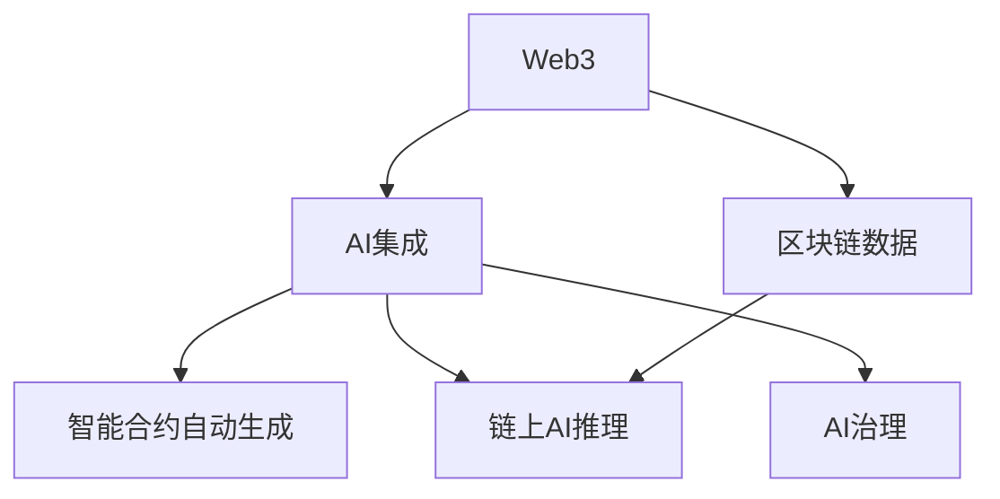

# 1. Web3+AI集成与自动化

## 1.1 AI驱动的智能合约生成

- 基于大模型的智能合约自动生成与验证
- 代码生成、漏洞检测、形式化验证自动化
- Rust/Golang+AI集成代码片段

## 1.2 链上AI推理与AI治理

- 链上AI推理服务、去中心化AI模型市场
- AI驱动的链上治理、DAO自动化决策

## 1.3 AI安全与可信AI

- AI模型安全、抗攻击、模型溯源与审计
- 区块链保障AI数据与模型的可追溯性

## 1.4 AI与区块链协同架构

- AI+区块链混合架构、数据流、共识与推理协同
- 典型应用：AI预言机、链上AI数据分析、AI驱动的NFT

## 1.5 自动化内容生成与知识管理实操

- 自动化内容归纳、去重、重构、交叉引用脚本设计
- Mermaid/Graphviz知识图谱自动生成代码示例

### Mermaid知识图谱示例

## 1.6 参考与工具

- [OpenAI API](https://platform.openai.com/)
- [Mermaid](https://mermaid-js.github.io/)
- [Graphviz](https://graphviz.gitlab.io/)
