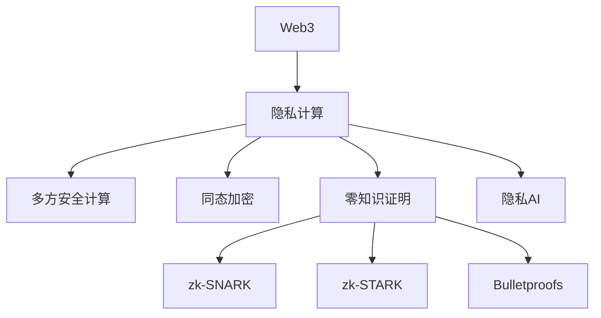

# 2. Web3隐私计算与零知识证明

## 2.1 多方安全计算与同态加密

- 多方安全计算（MPC）协议、应用场景
- 同态加密算法、链上链下协同
- Rust/Golang代码片段

## 2.2 零知识证明技术

- zk-SNARK、zk-STARK、Bulletproofs原理与对比
- 零知识电路设计、证明生成与验证流程
- 隐私AI与零知识AI集成

## 2.3 链上隐私协议与应用

- 隐私币（Zcash、Monero）、隐私DEX、链上隐私合约
- 隐私保护的DAO、链上身份与数据授权

## 2.4 行业案例与最佳实践

- Zcash、Aztec、Tornado Cash等隐私协议
- 行业最佳实践与标准化建议

## 2.5 Mermaid知识图谱示例

## 2.6 参考文献与外部链接

- [Zcash技术文档](https://z.cash/technology/)
- [Aztec协议](https://aztec.network/)
- [Bulletproofs论文](https://eprint.iacr.org/2017/1066)
