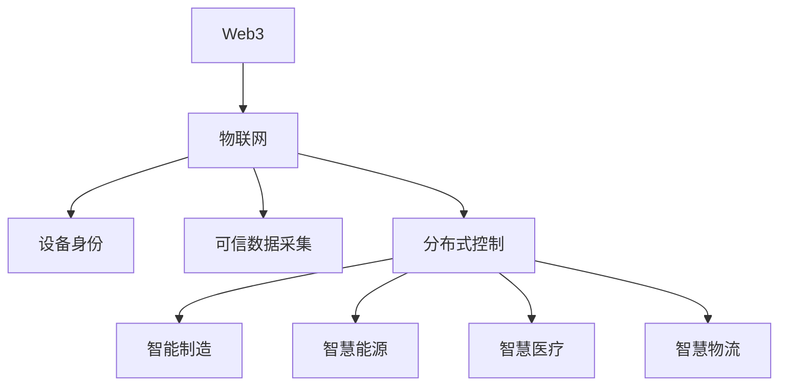

# 4. Web3物联网与行业融合

## 4.1 Web3+IoT架构与设备身份

- 去中心化设备身份（DID）、链上注册与认证
- 可信数据采集、数据上链、边缘计算与区块链协同

## 4.2 分布式控制与自动化

- 分布式控制系统、链上自动化执行、智能合约驱动的IoT
- Rust/Golang代码片段

## 4.3 行业应用场景

- 智能制造：设备溯源、生产数据上链、自动化质检
- 智慧能源：分布式能源管理、碳排放追踪、能源交易
- 智慧医疗：医疗设备数据上链、远程监控、数据隐私保护
- 智慧物流：供应链追踪、冷链监控、自动结算

## 4.4 行业案例与最佳实践

- IoTeX、Helium、Ambrosus等Web3+IoT项目
- 行业最佳实践与标准化建议

## 4.5 Mermaid知识图谱示例

## 4.6 参考文献与外部链接

- [IoTeX](https://iotex.io/)
- [Helium](https://www.helium.com/)
- [Ambrosus](https://ambrosus.io/)
