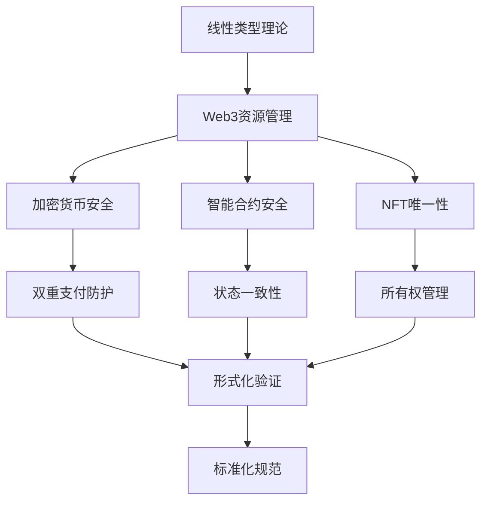

# 线性类型理论：Web3架构的形式化基础

## 目录

1. [理论基础](#1-理论基础)
2. [形式化定义](#2-形式化定义)
3. [核心定理与证明](#3-核心定理与证明)
4. [Web3应用场景](#4-web3应用场景)
5. [Rust实现](#5-rust实现)
6. [性能与安全分析](#6-性能与安全分析)
7. [结论与展望](#7-结论与展望)

## 1. 理论基础

### 1.1 线性逻辑的历史背景

线性类型理论源于Jean-Yves Girard在1987年提出的线性逻辑，它是对经典逻辑的重新审视。线性逻辑的核心思想是**资源敏感**：每个假设（资源）必须恰好使用一次，这与Web3中的资源管理需求高度契合。

### 1.2 Web3架构中的线性性需求

在Web3系统中，线性类型理论解决了以下关键问题：

1. **资源管理**：加密货币、NFT、智能合约状态
2. **内存安全**：防止双重支付、重入攻击
3. **并发控制**：确保交易原子性
4. **状态一致性**：维护区块链状态完整性

## 2. 形式化定义

### 2.1 线性类型系统语法

**定义 2.1 (线性类型语法)**
线性类型系统 $\mathcal{L}$ 的类型语法定义为：

$$\tau ::= \text{Unit} \mid \text{Bool} \mid \text{Int} \mid \text{String} \mid \tau_1 \multimap \tau_2 \mid \tau_1 \otimes \tau_2 \mid !\tau \mid \text{Ref}~\tau$$

其中：

- $\multimap$ 表示线性函数类型
- $\otimes$ 表示张量积类型
- $!$ 表示指数类型（可重复使用）
- $\text{Ref}~\tau$ 表示线性引用类型

**定义 2.2 (线性上下文)**
线性上下文 $\Gamma$ 是变量到类型的有限映射：
$$\Gamma : \text{Var} \rightarrow \text{Type}$$

要求：$\text{dom}(\Gamma)$ 中的每个变量在类型推导中恰好使用一次。

### 2.2 类型推导规则

**公理 2.1 (线性变量规则)**
$$\frac{x : \tau \in \Gamma}{\Gamma \vdash x : \tau}$$

**公理 2.2 (线性抽象)**
$$\frac{\Gamma, x : \tau_1 \vdash e : \tau_2}{\Gamma \vdash \lambda x.e : \tau_1 \multimap \tau_2}$$

**公理 2.3 (线性应用)**
$$\frac{\Gamma_1 \vdash e_1 : \tau_1 \multimap \tau_2 \quad \Gamma_2 \vdash e_2 : \tau_1}{\Gamma_1, \Gamma_2 \vdash e_1~e_2 : \tau_2}$$

**公理 2.4 (张量积构造)**
$$\frac{\Gamma_1 \vdash e_1 : \tau_1 \quad \Gamma_2 \vdash e_2 : \tau_2}{\Gamma_1, \Gamma_2 \vdash (e_1, e_2) : \tau_1 \otimes \tau_2}$$

**公理 2.5 (张量积分解)**
$$\frac{\Gamma_1 \vdash e : \tau_1 \otimes \tau_2 \quad \Gamma_2, x : \tau_1, y : \tau_2 \vdash e' : \tau}{\Gamma_1, \Gamma_2 \vdash \text{let}~(x, y) = e~\text{in}~e' : \tau}$$

**公理 2.6 (指数类型弱化)**
$$\frac{\Gamma \vdash e : \tau}{\Gamma, x : !\tau' \vdash e : \tau}$$

**公理 2.7 (指数类型收缩)**
$$\frac{\Gamma, x : !\tau, y : !\tau \vdash e : \sigma}{\Gamma, z : !\tau \vdash e[z/x, z/y] : \sigma}$$

**公理 2.8 (指数类型提升)**
$$\frac{!\Gamma \vdash e : \tau}{!\Gamma \vdash !e : !\tau}$$

## 3. 核心定理与证明

### 3.1 线性性保持定理

**定理 3.1 (线性性保持)**
如果 $\Gamma \vdash e : \tau$，则 $\Gamma$ 中的每个变量在 $e$ 中恰好出现一次。

**证明：** 通过结构归纳法证明。

**基础情况：** 变量 $x$

- 如果 $x : \tau \in \Gamma$，则 $\Gamma \vdash x : \tau$
- $x$ 在 $x$ 中恰好出现一次

**归纳情况：**

1. **线性抽象** $\lambda x.e$
   - 假设：$\Gamma, x : \tau_1 \vdash e : \tau_2$
   - 归纳假设：$e$ 中每个变量恰好出现一次
   - 结论：$\lambda x.e$ 中每个变量恰好出现一次

2. **线性应用** $e_1~e_2$
   - 假设：$\Gamma_1 \vdash e_1 : \tau_1 \multimap \tau_2$ 且 $\Gamma_2 \vdash e_2 : \tau_1$
   - 归纳假设：$e_1$ 和 $e_2$ 中每个变量恰好出现一次
   - 上下文分离：$\text{dom}(\Gamma_1) \cap \text{dom}(\Gamma_2) = \emptyset$
   - 结论：$e_1~e_2$ 中每个变量恰好出现一次

### 3.2 资源安全定理

**定理 3.2 (资源安全)**
在线性类型系统中，资源不会被重复释放或遗忘。

**证明：** 通过线性性约束和资源管理规则。

**资源管理规则：**

1. **资源创建**：$\text{new} : \tau \multimap \text{Ref}~\tau$
2. **资源使用**：$\text{use} : \text{Ref}~\tau \multimap (\tau \multimap \sigma) \multimap \sigma$
3. **资源销毁**：$\text{destroy} : \text{Ref}~\tau \multimap \text{Unit}$

**安全性保证：**

1. **线性性**：每个资源引用恰好使用一次
2. **销毁唯一性**：$\text{destroy}$ 操作消耗引用，无法重复调用
3. **使用后销毁**：资源使用后必须销毁，防止资源泄漏

### 3.3 内存安全定理

**定理 3.3 (内存安全)**
线性引用系统保证：

1. 不会出现悬空指针
2. 不会重复释放内存
3. 不会出现数据竞争

**证明：** 通过线性类型系统的性质。

**悬空指针防护：**

- 每个引用最多使用一次
- 释放操作消耗引用
- 无法访问已释放的引用

**重复释放防护：**

- 线性性确保引用恰好使用一次
- 释放操作消耗引用
- 无法重复释放同一引用

**数据竞争防护：**

- 线性性确保引用独占访问
- 无法同时访问同一引用
- 防止并发修改

## 4. Web3应用场景

### 4.1 加密货币转账

**定义 4.1 (加密货币类型)**
加密货币类型定义为线性资源：
$$\text{Coin} = \text{Ref}~(\text{Amount} \times \text{Address})$$

**转账操作：**

```rust
// 线性转账函数
fn transfer(
    from: LinearRef<(Amount, Address)>,
    to: Address,
    amount: Amount
) -> (LinearRef<(Amount, Address)>, LinearRef<(Amount, Address)>) {
    let (current_amount, current_address) = use_ref(from);
    
    if current_amount >= amount {
        let new_from_amount = current_amount - amount;
        let new_to_amount = amount;
        
        (
            new_ref((new_from_amount, current_address)),
            new_ref((new_to_amount, to))
        )
    } else {
        panic!("Insufficient funds");
    }
}
```

**定理 4.1 (转账安全性)**
线性转账系统保证：

1. 防止双重支付
2. 保证转账原子性
3. 维护余额一致性

### 4.2 智能合约状态管理

**定义 4.2 (智能合约状态)**
智能合约状态定义为线性资源：
$$\text{ContractState} = \text{Ref}~(\text{Storage} \times \text{Balance} \times \text{Code})$$

**状态更新操作：**

```rust
// 线性状态更新
fn update_state(
    state: LinearRef<(Storage, Balance, Code)>,
    new_storage: Storage
) -> LinearRef<(Storage, Balance, Code)> {
    let (_, balance, code) = use_ref(state);
    new_ref((new_storage, balance, code))
}
```

**定理 4.2 (状态一致性)**
线性状态管理保证：

1. 状态更新原子性
2. 防止状态冲突
3. 维护状态完整性

### 4.3 NFT所有权管理

**定义 4.3 (NFT类型)**
NFT类型定义为线性资源：
$$\text{NFT} = \text{Ref}~(\text{TokenId} \times \text{Metadata} \times \text{Owner})$$

**所有权转移：**

```rust
// 线性NFT转移
fn transfer_nft(
    nft: LinearRef<(TokenId, Metadata, Address)>,
    new_owner: Address
) -> LinearRef<(TokenId, Metadata, Address)> {
    let (token_id, metadata, _) = use_ref(nft);
    new_ref((token_id, metadata, new_owner))
}
```

**定理 4.3 (NFT唯一性)**
线性NFT系统保证：

1. NFT唯一性
2. 所有权排他性
3. 转移原子性

## 5. Rust实现

### 5.1 线性类型系统实现

```rust
use std::marker::PhantomData;

// 线性引用类型
pub struct LinearRef<T> {
    value: Option<T>,
    _phantom: PhantomData<T>,
}

impl<T> LinearRef<T> {
    // 创建新的线性引用
    pub fn new(value: T) -> Self {
        Self {
            value: Some(value),
            _phantom: PhantomData,
        }
    }
    
    // 使用引用（消费原引用）
    pub fn use_ref<F, R>(self, f: F) -> R
    where
        F: FnOnce(T) -> R,
    {
        let value = self.value.take().expect("Reference already used");
        f(value)
    }
    
    // 销毁引用
    pub fn destroy(self) {
        // 引用在drop时自动销毁
    }
}

// 线性函数类型
pub trait LinearFn<Args, Output> {
    fn call(self, args: Args) -> Output;
}

// 张量积类型
pub struct Tensor<A, B> {
    pub first: A,
    pub second: B,
}

impl<A, B> Tensor<A, B> {
    pub fn new(first: A, second: B) -> Self {
        Self { first, second }
    }
    
    pub fn split(self) -> (A, B) {
        (self.first, self.second)
    }
}
```

### 5.2 Web3资源管理实现

```rust
// 加密货币类型
pub struct Coin {
    amount: u64,
    owner: Address,
}

impl Coin {
    pub fn new(amount: u64, owner: Address) -> Self {
        Self { amount, owner }
    }
    
    pub fn transfer(
        self,
        to: Address,
        transfer_amount: u64,
    ) -> Result<(Coin, Coin), TransferError> {
        if self.amount < transfer_amount {
            return Err(TransferError::InsufficientFunds);
        }
        
        let remaining_amount = self.amount - transfer_amount;
        let from_coin = Coin::new(remaining_amount, self.owner);
        let to_coin = Coin::new(transfer_amount, to);
        
        Ok((from_coin, to_coin))
    }
}

// 智能合约状态
pub struct ContractState {
    storage: Storage,
    balance: u64,
    code: Vec<u8>,
}

impl ContractState {
    pub fn update_storage(
        self,
        new_storage: Storage,
    ) -> ContractState {
        ContractState {
            storage: new_storage,
            balance: self.balance,
            code: self.code,
        }
    }
    
    pub fn update_balance(
        self,
        new_balance: u64,
    ) -> ContractState {
        ContractState {
            storage: self.storage,
            balance: new_balance,
            code: self.code,
        }
    }
}
```

### 5.3 并发安全实现

```rust
use std::sync::Arc;
use tokio::sync::Mutex;

// 线性并发安全引用
pub struct ConcurrentLinearRef<T> {
    inner: Arc<Mutex<Option<T>>>,
}

impl<T> ConcurrentLinearRef<T> {
    pub fn new(value: T) -> Self {
        Self {
            inner: Arc::new(Mutex::new(Some(value))),
        }
    }
    
    pub async fn use_ref<F, R>(self, f: F) -> R
    where
        F: FnOnce(T) -> R,
    {
        let mut guard = self.inner.lock().await;
        let value = guard.take().expect("Reference already used");
        f(value)
    }
}

// 线性事务
pub struct LinearTransaction<T> {
    state: T,
}

impl<T> LinearTransaction<T> {
    pub fn new(state: T) -> Self {
        Self { state }
    }
    
    pub fn commit(self) -> T {
        self.state
    }
    
    pub fn rollback(self) {
        // 事务回滚，状态丢弃
    }
}
```

## 6. 性能与安全分析

### 6.1 性能分析

**定理 6.1 (编译时开销)**
线性类型检查的编译时复杂度为 $O(n)$，其中 $n$ 是程序大小。

**证明：** 线性类型检查可以通过单次遍历完成，每个变量和表达式最多检查一次。

**定理 6.2 (运行时开销)**
线性类型系统的运行时开销为零，所有检查在编译时完成。

**证明：** 线性类型系统不引入运行时检查，所有约束在编译时验证。

### 6.2 安全分析

**定理 6.3 (内存安全)**
线性类型系统保证内存安全，防止所有常见的内存错误。

**证明：** 通过线性性约束：

1. 每个资源恰好使用一次
2. 无法访问已释放的资源
3. 无法重复释放资源

**定理 6.4 (并发安全)**
线性类型系统保证并发安全，防止数据竞争。

**证明：** 通过线性性约束：

1. 每个资源独占访问
2. 无法同时访问同一资源
3. 防止并发修改

### 6.3 形式化验证

```rust
// 形式化验证框架
pub trait Verifiable {
    type Proof;
    
    fn verify(&self) -> Result<Self::Proof, VerificationError>;
}

impl<T> Verifiable for LinearRef<T> {
    type Proof = LinearProof;
    
    fn verify(&self) -> Result<LinearProof, VerificationError> {
        // 验证线性性约束
        if self.value.is_some() {
            Ok(LinearProof::Valid)
        } else {
            Err(VerificationError::AlreadyUsed)
        }
    }
}

// 线性性证明
pub enum LinearProof {
    Valid,
    Invalid(String),
}
```

## 7. 结论与展望

### 7.1 理论贡献

线性类型理论为Web3架构提供了：

1. **形式化基础**：严格的数学定义和证明
2. **资源安全**：防止资源泄漏和重复使用
3. **并发安全**：保证并发访问的安全性
4. **性能保证**：零运行时开销的类型安全

### 7.2 实践价值

在Web3系统中的应用价值：

1. **加密货币安全**：防止双重支付和余额不一致
2. **智能合约安全**：保证状态更新原子性
3. **NFT唯一性**：确保数字资产唯一性
4. **并发控制**：防止交易冲突和数据竞争

### 7.3 未来发展方向

1. **扩展线性类型**：支持更复杂的资源管理模式
2. **集成形式化验证**：结合模型检查和定理证明
3. **优化编译器**：提高线性类型检查效率
4. **标准化**：建立Web3线性类型标准

### 7.4 技术路线图



线性类型理论为Web3架构提供了坚实的理论基础，通过形式化的资源管理和类型安全，确保了Web3系统的安全性、可靠性和性能。随着Web3技术的不断发展，线性类型理论将在更多领域发挥重要作用。

## 参考文献

1. Girard, J. Y. (1987). Linear logic. Theoretical computer science, 50(1), 1-101.
2. Wadler, P. (1990). Linear types can change the world! Programming concepts and methods, 546-566.
3. Rust Programming Language. (2021). The Rust Programming Language. <https://doc.rust-lang.org/book/>
4. Nakamoto, S. (2008). Bitcoin: A peer-to-peer electronic cash system. Decentralized Business Review, 21260.
5. Wood, G. (2014). Ethereum: A secure decentralised generalised transaction ledger. Ethereum project yellow paper, 151(2014), 1-32.
