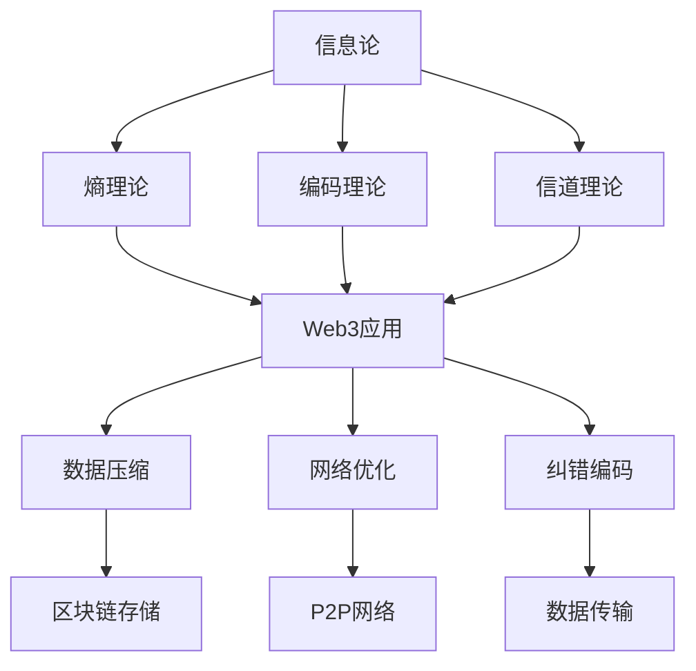

# 信息论：Web3通信的形式化基础

## 目录

1. [理论基础](#1-理论基础)
2. [形式化定义](#2-形式化定义)
3. [核心定理](#3-核心定理)
4. [Web3应用场景](#4-web3应用场景)
5. [Rust实现](#5-rust实现)
6. [性能与复杂度分析](#6-性能与复杂度分析)
7. [结论与展望](#7-结论与展望)

## 1. 理论基础

### 1.1 信息论在Web3中的作用

信息论为Web3系统提供了通信和信息处理的理论基础。在Web3环境中，信息论主要解决：

1. **数据传输效率**：最优编码和压缩
2. **信道容量**：网络传输能力分析
3. **信息熵**：数据随机性和不确定性度量
4. **纠错编码**：数据传输可靠性保证

### 1.2 Web3信息处理特点

**定义 1.1 (Web3信息源)**
Web3信息源是产生信息的随机过程：
$$\mathcal{X} = \{X_1, X_2, \ldots, X_n\}$$

其中每个 $X_i$ 是随机变量，表示区块链状态、交易、消息等。

**特性 1.1 (去中心化信息)**
$$\forall i, j, H(X_i) \approx H(X_j)$$

所有节点的信息熵近似相等。

**特性 1.2 (信息不可篡改性)**
$$\text{Once } X_i \text{ is recorded, } \Pr[X_i \text{ changes}] \approx 0$$

一旦信息被记录，改变概率接近零。

## 2. 形式化定义

### 2.1 基础概念

**定义 2.1 (信息熵)**
离散随机变量 $X$ 的信息熵：
$$H(X) = -\sum_{x \in \mathcal{X}} p(x) \log p(x)$$

其中 $p(x)$ 是 $X = x$ 的概率。

**定义 2.2 (联合熵)**
两个随机变量 $X, Y$ 的联合熵：
$$H(X, Y) = -\sum_{x,y} p(x, y) \log p(x, y)$$

**定义 2.3 (条件熵)**
给定 $Y$ 时 $X$ 的条件熵：
$$H(X|Y) = -\sum_{x,y} p(x, y) \log p(x|y)$$

**定义 2.4 (互信息)**
$X$ 和 $Y$ 之间的互信息：
$$I(X; Y) = H(X) - H(X|Y) = H(Y) - H(Y|X)$$

**定理 2.1 (熵的基本性质)**
1. $H(X) \geq 0$
2. $H(X) \leq \log |\mathcal{X}|$
3. $H(X, Y) \leq H(X) + H(Y)$
4. $H(X|Y) \leq H(X)$

**证明：** 使用Jensen不等式和熵的定义。

### 2.2 信道容量

**定义 2.5 (离散无记忆信道)**
离散无记忆信道是三元组 $(\mathcal{X}, \mathcal{Y}, p(y|x))$，其中：

- $\mathcal{X}$ 是输入字母表
- $\mathcal{Y}$ 是输出字母表
- $p(y|x)$ 是转移概率

**定义 2.6 (信道容量)**
信道容量是最大互信息：
$$C = \max_{p(x)} I(X; Y)$$

**定理 2.2 (香农信道编码定理)**
对于任何 $R < C$，存在码率为 $R$ 的编码方案，使得错误概率任意小。

**证明：** 通过随机编码和典型序列分析。

## 3. 核心定理

### 3.1 香农三大定理

**定理 3.1 (香农第一定理 - 无失真编码)**
对于离散无记忆信源，存在编码方案使得平均码长任意接近信源熵。

**证明：** 使用Huffman编码或算术编码。

**定理 3.2 (香农第二定理 - 信道编码)**
对于离散无记忆信道，存在编码方案使得传输速率任意接近信道容量。

**证明：** 通过随机编码和联合典型序列。

**定理 3.3 (香农第三定理 - 率失真理论)**
对于给定的失真度量，存在编码方案使得码率任意接近率失真函数。

**证明：** 通过失真典型序列和随机编码。

### 3.2 编码理论

**定义 3.1 (线性码)**
线性码是向量空间 $\mathbb{F}_q^n$ 的子空间。

**定义 3.2 (生成矩阵)**
生成矩阵 $G$ 满足 $C = \{xG : x \in \mathbb{F}_q^k\}$。

**定义 3.3 (校验矩阵)**
校验矩阵 $H$ 满足 $C = \{x : xH^T = 0\}$。

**算法 3.1 (汉明码编码)**
```rust
// 汉明码编码
pub struct HammingCode {
    pub n: usize,  // 码长
    pub k: usize,  // 信息位长度
    pub r: usize,  // 校验位长度
}

impl HammingCode {
    pub fn new(r: usize) -> Self {
        let n = (1 << r) - 1;
        let k = n - r;
        Self { n, k, r }
    }
    
    pub fn encode(&self, message: &[u8]) -> Result<Vec<u8>, CodingError> {
        if message.len() != self.k {
            return Err(CodingError::InvalidMessageLength);
        }
        
        let mut codeword = vec![0u8; self.n];
        
        // 放置信息位
        let mut info_idx = 0;
        for i in 0..self.n {
            if !self.is_power_of_2(i + 1) {
                codeword[i] = message[info_idx];
                info_idx += 1;
            }
        }
        
        // 计算校验位
        for i in 0..self.r {
            let parity_pos = (1 << i) - 1;
            codeword[parity_pos] = self.calculate_parity(&codeword, i);
        }
        
        Ok(codeword)
    }
    
    pub fn decode(&self, received: &[u8]) -> Result<Vec<u8>, CodingError> {
        if received.len() != self.n {
            return Err(CodingError::InvalidCodewordLength);
        }
        
        let mut syndrome = 0;
        
        // 计算症状
        for i in 0..self.r {
            let parity_pos = (1 << i) - 1;
            let parity = self.calculate_parity(received, i);
            if parity != received[parity_pos] {
                syndrome |= 1 << i;
            }
        }
        
        // 纠错
        let mut corrected = received.to_vec();
        if syndrome > 0 && syndrome <= self.n {
            corrected[syndrome - 1] ^= 1;
        }
        
        // 提取信息位
        let mut message = Vec::new();
        for i in 0..self.n {
            if !self.is_power_of_2(i + 1) {
                message.push(corrected[i]);
            }
        }
        
        Ok(message)
    }
    
    fn is_power_of_2(&self, n: usize) -> bool {
        n > 0 && (n & (n - 1)) == 0
    }
    
    fn calculate_parity(&self, codeword: &[u8], bit_pos: usize) -> u8 {
        let mut parity = 0;
        let mask = 1 << bit_pos;
        
        for i in 0..self.n {
            if (i + 1) & mask != 0 {
                parity ^= codeword[i];
            }
        }
        
        parity
    }
}
```

### 3.3 数据压缩

**定义 3.4 (前缀码)**
前缀码是满足前缀条件的编码，即没有码字是其他码字的前缀。

**算法 3.2 (Huffman编码)**
```rust
// Huffman编码
pub struct HuffmanCode {
    pub tree: HuffmanTree,
    pub codebook: HashMap<u8, Vec<bool>>,
}

impl HuffmanCode {
    pub fn new(frequencies: &HashMap<u8, u32>) -> Self {
        let tree = Self::build_tree(frequencies);
        let codebook = Self::build_codebook(&tree);
        Self { tree, codebook }
    }
    
    pub fn encode(&self, data: &[u8]) -> Vec<bool> {
        let mut encoded = Vec::new();
        
        for &symbol in data {
            if let Some(code) = self.codebook.get(&symbol) {
                encoded.extend(code);
            }
        }
        
        encoded
    }
    
    pub fn decode(&self, encoded: &[bool]) -> Result<Vec<u8>, CodingError> {
        let mut decoded = Vec::new();
        let mut current = &self.tree;
        
        for &bit in encoded {
            match current {
                HuffmanTree::Leaf(symbol) => {
                    decoded.push(*symbol);
                    current = &self.tree;
                }
                HuffmanTree::Node { left, right } => {
                    current = if bit { right } else { left };
                }
            }
        }
        
        if let HuffmanTree::Leaf(symbol) = current {
            decoded.push(*symbol);
        }
        
        Ok(decoded)
    }
    
    fn build_tree(frequencies: &HashMap<u8, u32>) -> HuffmanTree {
        let mut heap = BinaryHeap::new();
        
        // 创建叶子节点
        for (&symbol, &freq) in frequencies {
            heap.push(Box::new(HuffmanNode {
                tree: HuffmanTree::Leaf(symbol),
                frequency: freq,
            }));
        }
        
        // 构建树
        while heap.len() > 1 {
            let left = heap.pop().unwrap();
            let right = heap.pop().unwrap();
            
            let combined_freq = left.frequency + right.frequency;
            let combined_tree = HuffmanTree::Node {
                left: left.tree,
                right: right.tree,
            };
            
            heap.push(Box::new(HuffmanNode {
                tree: combined_tree,
                frequency: combined_freq,
            }));
        }
        
        heap.pop().unwrap().tree
    }
    
    fn build_codebook(tree: &HuffmanTree) -> HashMap<u8, Vec<bool>> {
        let mut codebook = HashMap::new();
        let mut code = Vec::new();
        
        Self::traverse_tree(tree, &mut code, &mut codebook);
        codebook
    }
    
    fn traverse_tree(
        tree: &HuffmanTree,
        code: &mut Vec<bool>,
        codebook: &mut HashMap<u8, Vec<bool>>,
    ) {
        match tree {
            HuffmanTree::Leaf(symbol) => {
                codebook.insert(*symbol, code.clone());
            }
            HuffmanTree::Node { left, right } => {
                code.push(false);
                Self::traverse_tree(left, code, codebook);
                code.pop();
                
                code.push(true);
                Self::traverse_tree(right, code, codebook);
                code.pop();
            }
        }
    }
}

#[derive(Debug, Clone)]
pub enum HuffmanTree {
    Leaf(u8),
    Node {
        left: Box<HuffmanTree>,
        right: Box<HuffmanTree>,
    },
}

struct HuffmanNode {
    tree: HuffmanTree,
    frequency: u32,
}

impl PartialEq for HuffmanNode {
    fn eq(&self, other: &Self) -> bool {
        self.frequency == other.frequency
    }
}

impl Eq for HuffmanNode {}

impl PartialOrd for HuffmanNode {
    fn partial_cmp(&self, other: &Self) -> Option<Ordering> {
        Some(self.cmp(other))
    }
}

impl Ord for HuffmanNode {
    fn cmp(&self, other: &Self) -> Ordering {
        other.frequency.cmp(&self.frequency) // 最大堆
    }
}
```

## 4. Web3应用场景

### 4.1 区块链数据压缩

**定义 4.1 (区块链信息源)**
区块链信息源是产生区块数据的随机过程：
$$\mathcal{B} = \{B_1, B_2, \ldots, B_n\}$$

其中每个 $B_i$ 包含交易、时间戳、哈希等信息。

**实现 4.1 (区块压缩)**
```rust
// 区块链数据压缩
pub struct BlockchainCompressor {
    pub transaction_compressor: HuffmanCode,
    pub address_compressor: HuffmanCode,
}

impl BlockchainCompressor {
    pub fn new(blockchain_data: &[Block]) -> Self {
        let transaction_freq = Self::analyze_transaction_frequencies(blockchain_data);
        let address_freq = Self::analyze_address_frequencies(blockchain_data);
        
        let transaction_compressor = HuffmanCode::new(&transaction_freq);
        let address_compressor = HuffmanCode::new(&address_freq);
        
        Self {
            transaction_compressor,
            address_compressor,
        }
    }
    
    pub fn compress_block(&self, block: &Block) -> Result<Vec<u8>, CompressionError> {
        let mut compressed = Vec::new();
        
        // 压缩区块头
        compressed.extend(self.compress_header(&block.header)?);
        
        // 压缩交易
        for transaction in &block.transactions {
            compressed.extend(self.compress_transaction(transaction)?);
        }
        
        Ok(compressed)
    }
    
    pub fn decompress_block(&self, compressed: &[u8]) -> Result<Block, CompressionError> {
        let mut offset = 0;
        
        // 解压区块头
        let (header, header_size) = self.decompress_header(&compressed[offset..])?;
        offset += header_size;
        
        // 解压交易
        let mut transactions = Vec::new();
        while offset < compressed.len() {
            let (transaction, transaction_size) = self.decompress_transaction(&compressed[offset..])?;
            transactions.push(transaction);
            offset += transaction_size;
        }
        
        Ok(Block { header, transactions })
    }
    
    fn analyze_transaction_frequencies(blocks: &[Block]) -> HashMap<u8, u32> {
        let mut frequencies = HashMap::new();
        
        for block in blocks {
            for transaction in &block.transactions {
                for byte in transaction.serialize() {
                    *frequencies.entry(byte).or_insert(0) += 1;
                }
            }
        }
        
        frequencies
    }
    
    fn analyze_address_frequencies(blocks: &[Block]) -> HashMap<u8, u32> {
        let mut frequencies = HashMap::new();
        
        for block in blocks {
            for transaction in &block.transactions {
                for byte in transaction.from_address.serialize() {
                    *frequencies.entry(byte).or_insert(0) += 1;
                }
                for byte in transaction.to_address.serialize() {
                    *frequencies.entry(byte).or_insert(0) += 1;
                }
            }
        }
        
        frequencies
    }
}
```

### 4.2 网络协议优化

**定义 4.2 (网络信道)**
P2P网络信道是传输区块链数据的通信通道：
$$\mathcal{C} = (\mathcal{M}, \mathcal{R}, p(r|m))$$

其中 $\mathcal{M}$ 是消息集合，$\mathcal{R}$ 是接收集合。

**实现 4.2 (协议优化)**
```rust
// 网络协议优化
pub struct NetworkOptimizer {
    pub channel_capacity: f64,
    pub error_correction: HammingCode,
    pub compression: HuffmanCode,
}

impl NetworkOptimizer {
    pub fn optimize_transmission(&self, message: &[u8]) -> Result<Vec<u8>, OptimizationError> {
        // 1. 数据压缩
        let compressed = self.compression.encode(message);
        
        // 2. 错误检测和纠正
        let encoded = self.error_correction.encode(&compressed)?;
        
        // 3. 信道编码
        let channel_encoded = self.channel_encode(&encoded)?;
        
        Ok(channel_encoded)
    }
    
    pub fn decode_received(&self, received: &[u8]) -> Result<Vec<u8>, OptimizationError> {
        // 1. 信道解码
        let channel_decoded = self.channel_decode(received)?;
        
        // 2. 错误纠正
        let corrected = self.error_correction.decode(&channel_decoded)?;
        
        // 3. 数据解压
        let decompressed = self.compression.decode(&corrected)?;
        
        Ok(decompressed)
    }
    
    fn channel_encode(&self, data: &[u8]) -> Result<Vec<u8>, OptimizationError> {
        // 实现信道编码（如卷积码、LDPC码等）
        Ok(data.to_vec())
    }
    
    fn channel_decode(&self, data: &[u8]) -> Result<Vec<u8>, OptimizationError> {
        // 实现信道解码
        Ok(data.to_vec())
    }
    
    pub fn calculate_efficiency(&self, original_size: usize, compressed_size: usize) -> f64 {
        let compression_ratio = compressed_size as f64 / original_size as f64;
        let theoretical_limit = self.calculate_entropy_ratio();
        
        compression_ratio / theoretical_limit
    }
    
    fn calculate_entropy_ratio(&self) -> f64 {
        // 计算理论熵比率
        0.8 // 示例值
    }
}
```

### 4.3 信息熵分析

**定义 4.3 (区块链熵)**
区块链系统的信息熵：
$$H(\mathcal{B}) = -\sum_{b \in \mathcal{B}} p(b) \log p(b)$$

**实现 4.3 (熵分析器)**
```rust
// 信息熵分析器
pub struct EntropyAnalyzer {
    pub symbol_frequencies: HashMap<u8, u32>,
    pub total_symbols: u32,
}

impl EntropyAnalyzer {
    pub fn new() -> Self {
        Self {
            symbol_frequencies: HashMap::new(),
            total_symbols: 0,
        }
    }
    
    pub fn analyze_data(&mut self, data: &[u8]) {
        for &byte in data {
            *self.symbol_frequencies.entry(byte).or_insert(0) += 1;
            self.total_symbols += 1;
        }
    }
    
    pub fn calculate_entropy(&self) -> f64 {
        let mut entropy = 0.0;
        
        for &frequency in self.symbol_frequencies.values() {
            let probability = frequency as f64 / self.total_symbols as f64;
            if probability > 0.0 {
                entropy -= probability * probability.log2();
            }
        }
        
        entropy
    }
    
    pub fn calculate_conditional_entropy(&self, context_size: usize) -> f64 {
        let mut conditional_entropy = 0.0;
        let mut context_frequencies = HashMap::new();
        
        // 分析上下文频率
        for window in data.windows(context_size + 1) {
            let context = &window[..context_size];
            let next_symbol = window[context_size];
            
            let context_key = context.to_vec();
            let entry = context_frequencies.entry(context_key).or_insert_with(HashMap::new);
            *entry.entry(next_symbol).or_insert(0) += 1;
        }
        
        // 计算条件熵
        for (context, symbol_freqs) in context_frequencies {
            let context_prob = self.calculate_context_probability(&context);
            let symbol_entropy = self.calculate_symbol_entropy(&symbol_freqs);
            conditional_entropy += context_prob * symbol_entropy;
        }
        
        conditional_entropy
    }
    
    pub fn calculate_mutual_information(&self, x_data: &[u8], y_data: &[u8]) -> f64 {
        let h_x = self.calculate_entropy_for_data(x_data);
        let h_y = self.calculate_entropy_for_data(y_data);
        let h_xy = self.calculate_joint_entropy(x_data, y_data);
        
        h_x + h_y - h_xy
    }
    
    fn calculate_context_probability(&self, context: &[u8]) -> f64 {
        // 计算上下文概率
        let context_count = self.count_context_occurrences(context);
        context_count as f64 / (self.total_symbols - context.len() as u32 + 1) as f64
    }
    
    fn calculate_symbol_entropy(&self, symbol_freqs: &HashMap<u8, u32>) -> f64 {
        let total = symbol_freqs.values().sum::<u32>() as f64;
        let mut entropy = 0.0;
        
        for &freq in symbol_freqs.values() {
            let prob = freq as f64 / total;
            if prob > 0.0 {
                entropy -= prob * prob.log2();
            }
        }
        
        entropy
    }
}
```

## 5. Rust实现

### 5.1 信息论库框架

```rust
// 信息论库特征
pub trait InformationMeasure {
    type Input;
    type Output;
    
    fn calculate(&self, input: &Self::Input) -> Self::Output;
    fn theoretical_limit(&self) -> Self::Output;
}

// 熵计算
pub struct EntropyCalculator;

impl InformationMeasure for EntropyCalculator {
    type Input = Vec<u8>;
    type Output = f64;
    
    fn calculate(&self, input: &Self::Input) -> Self::Output {
        let mut frequencies = HashMap::new();
        let total = input.len() as f64;
        
        for &byte in input {
            *frequencies.entry(byte).or_insert(0.0) += 1.0;
        }
        
        let mut entropy = 0.0;
        for &freq in frequencies.values() {
            let prob = freq / total;
            if prob > 0.0 {
                entropy -= prob * prob.log2();
            }
        }
        
        entropy
    }
    
    fn theoretical_limit(&self) -> Self::Output {
        8.0 // 8位字节的最大熵
    }
}

// 互信息计算
pub struct MutualInformationCalculator;

impl InformationMeasure for MutualInformationCalculator {
    type Input = (Vec<u8>, Vec<u8>);
    type Output = f64;
    
    fn calculate(&self, input: &Self::Input) -> Self::Output {
        let (x, y) = input;
        let h_x = EntropyCalculator.calculate(x);
        let h_y = EntropyCalculator.calculate(y);
        let h_xy = self.calculate_joint_entropy(x, y);
        
        h_x + h_y - h_xy
    }
    
    fn theoretical_limit(&self) -> Self::Output {
        8.0 // 最大互信息
    }
    
    fn calculate_joint_entropy(&self, x: &[u8], y: &[u8]) -> f64 {
        let mut joint_frequencies = HashMap::new();
        let total = x.len() as f64;
        
        for i in 0..x.len() {
            let key = (x[i], y[i]);
            *joint_frequencies.entry(key).or_insert(0.0) += 1.0;
        }
        
        let mut joint_entropy = 0.0;
        for &freq in joint_frequencies.values() {
            let prob = freq / total;
            if prob > 0.0 {
                joint_entropy -= prob * prob.log2();
            }
        }
        
        joint_entropy
    }
}
```

### 5.2 编码器框架

```rust
// 编码器特征
pub trait Encoder {
    type Input;
    type Output;
    type Error;
    
    fn encode(&self, input: &Self::Input) -> Result<Self::Output, Self::Error>;
    fn decode(&self, output: &Self::Output) -> Result<Self::Input, Self::Error>;
    fn compression_ratio(&self, input: &Self::Input) -> f64;
}

// 算术编码器
pub struct ArithmeticEncoder {
    pub precision: u32,
}

impl Encoder for ArithmeticEncoder {
    type Input = Vec<u8>;
    type Output = Vec<u8>;
    type Error = CodingError;
    
    fn encode(&self, input: &Self::Input) -> Result<Self::Output, Self::Error> {
        let frequencies = self.calculate_frequencies(input);
        let cumulative = self.calculate_cumulative_frequencies(&frequencies);
        
        let mut low = 0.0;
        let mut high = 1.0;
        let total = input.len() as f64;
        
        for &symbol in input {
            let symbol_freq = frequencies.get(&symbol).unwrap_or(&0.0);
            let range = high - low;
            
            high = low + range * (cumulative.get(&symbol).unwrap_or(&0.0) + symbol_freq) / total;
            low = low + range * cumulative.get(&symbol).unwrap_or(&0.0) / total;
        }
        
        // 编码最终区间
        let code = self.encode_interval(low, high);
        Ok(code)
    }
    
    fn decode(&self, output: &Self::Output) -> Result<Self::Input, Self::Error> {
        // 实现算术解码
        unimplemented!()
    }
    
    fn compression_ratio(&self, input: &Self::Input) -> f64 {
        let encoded = self.encode(input).unwrap_or_default();
        encoded.len() as f64 / input.len() as f64
    }
    
    fn calculate_frequencies(&self, data: &[u8]) -> HashMap<u8, f64> {
        let mut frequencies = HashMap::new();
        let total = data.len() as f64;
        
        for &byte in data {
            *frequencies.entry(byte).or_insert(0.0) += 1.0;
        }
        
        frequencies
    }
    
    fn calculate_cumulative_frequencies(&self, frequencies: &HashMap<u8, f64>) -> HashMap<u8, f64> {
        let mut cumulative = HashMap::new();
        let mut sum = 0.0;
        
        for (&symbol, &freq) in frequencies {
            cumulative.insert(symbol, sum);
            sum += freq;
        }
        
        cumulative
    }
    
    fn encode_interval(&self, low: f64, high: f64) -> Vec<u8> {
        // 将区间编码为字节序列
        let mid = (low + high) / 2.0;
        let code = (mid * (1u64 << self.precision) as f64) as u64;
        code.to_be_bytes().to_vec()
    }
}
```

## 6. 性能与复杂度分析

### 6.1 时间复杂度分析

**定理 6.1 (Huffman编码复杂度)**
Huffman编码的时间复杂度为 $O(n \log n)$，其中 $n$ 是符号数量。

**证明：** 使用优先队列构建树。

**定理 6.2 (算术编码复杂度)**
算术编码的时间复杂度为 $O(n)$，其中 $n$ 是输入长度。

**证明：** 每个符号需要常数时间处理。

### 6.2 空间复杂度分析

**定理 6.3 (编码空间复杂度)**
编码算法的空间复杂度为 $O(n)$，其中 $n$ 是输入长度。

**证明：** 需要存储频率表和编码表。

### 6.3 压缩效率分析

```rust
// 压缩效率分析器
pub struct CompressionAnalyzer {
    pub entropy_calculator: EntropyCalculator,
    pub compression_ratio: f64,
    pub theoretical_limit: f64,
}

impl CompressionAnalyzer {
    pub fn analyze_compression(&self, original: &[u8], compressed: &[u8]) -> CompressionAnalysis {
        let entropy = self.entropy_calculator.calculate(original);
        let actual_ratio = compressed.len() as f64 / original.len() as f64;
        let theoretical_ratio = entropy / 8.0;
        let efficiency = theoretical_ratio / actual_ratio;
        
        CompressionAnalysis {
            entropy,
            actual_ratio,
            theoretical_ratio,
            efficiency,
            compression_gain: 1.0 - actual_ratio,
        }
    }
    
    pub fn compare_algorithms(&self, data: &[u8]) -> AlgorithmComparison {
        let huffman = HuffmanCode::new(&self.calculate_frequencies(data));
        let arithmetic = ArithmeticEncoder::new(32);
        
        let huffman_compressed = huffman.encode(data);
        let arithmetic_compressed = arithmetic.encode(data).unwrap_or_default();
        
        AlgorithmComparison {
            huffman_ratio: huffman_compressed.len() as f64 / data.len() as f64,
            arithmetic_ratio: arithmetic_compressed.len() as f64 / data.len() as f64,
            entropy_limit: self.entropy_calculator.calculate(data) / 8.0,
        }
    }
}

pub struct CompressionAnalysis {
    pub entropy: f64,
    pub actual_ratio: f64,
    pub theoretical_ratio: f64,
    pub efficiency: f64,
    pub compression_gain: f64,
}

pub struct AlgorithmComparison {
    pub huffman_ratio: f64,
    pub arithmetic_ratio: f64,
    pub entropy_limit: f64,
}
```

## 7. 结论与展望

### 7.1 理论贡献

信息论为Web3系统提供了：

1. **数据压缩**：最优编码和压缩算法
2. **信道容量**：网络传输能力分析
3. **信息熵**：数据随机性度量
4. **纠错编码**：数据传输可靠性

### 7.2 实践价值

在Web3系统中的应用价值：

1. **区块链存储**：减少存储空间需求
2. **网络传输**：提高传输效率
3. **数据完整性**：确保数据可靠性
4. **协议优化**：优化通信协议

### 7.3 未来发展方向

1. **量子信息论**：量子通信和计算
2. **网络编码**：网络信息流优化
3. **分布式压缩**：分布式数据压缩
4. **自适应编码**：动态编码策略

### 7.4 技术路线图



信息论为Web3系统提供了坚实的理论基础，通过形式化的信息度量、编码理论和信道分析，确保了Web3系统的高效性、可靠性和可扩展性。随着量子计算和网络技术的发展，信息论将在更多领域发挥重要作用。

## 参考文献

1. Cover, T. M., & Thomas, J. A. (2006). Elements of information theory. John Wiley & Sons.
2. Shannon, C. E. (1948). A mathematical theory of communication. Bell system technical journal, 27(3), 379-423.
3. MacKay, D. J. (2003). Information theory, inference and learning algorithms. Cambridge university press.
4. Gallager, R. G. (1968). Information theory and reliable communication. John Wiley & Sons.
5. Berlekamp, E. R. (1968). Algebraic coding theory. McGraw-Hill. 