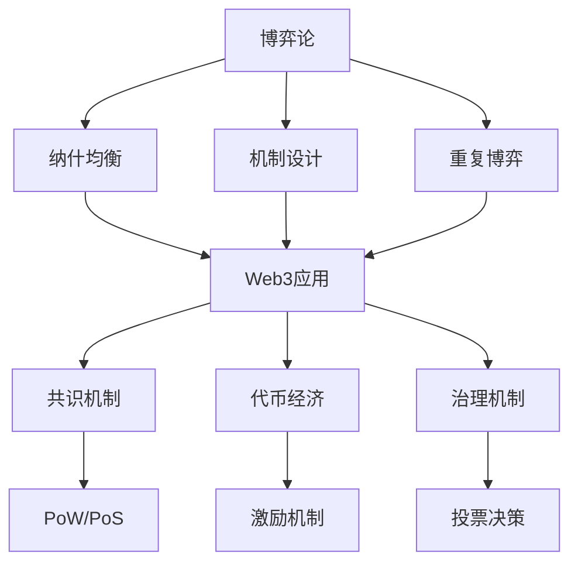

# 博弈论：Web3激励机制的形式化基础

## 目录

1. [理论基础](#1-理论基础)
2. [形式化定义](#2-形式化定义)
3. [核心定理](#3-核心定理)
4. [Web3应用场景](#4-web3应用场景)
5. [Rust实现](#5-rust实现)
6. [机制设计](#6-机制设计)
7. [结论与展望](#7-结论与展望)

## 1. 理论基础

### 1.1 博弈论在Web3中的作用

博弈论为Web3系统提供了激励机制和策略分析的理论基础。在Web3环境中，博弈论主要解决：

1. **共识机制设计**：PoW、PoS等共识算法的激励机制
2. **网络协作**：P2P网络中节点的合作策略
3. **代币经济学**：代币分配和激励机制设计
4. **治理机制**：DAO投票和决策机制

### 1.2 Web3博弈特点

**定义 1.1 (Web3博弈)**
Web3博弈是多参与者策略互动：
$$\mathcal{G} = (N, \{S_i\}_{i \in N}, \{u_i\}_{i \in N})$$

其中 $N$ 是参与者集合，$S_i$ 是策略集，$u_i$ 是效用函数。

**特性 1.1 (去中心化博弈)**
$$\forall i, j \in N, |S_i| \approx |S_j|$$

所有参与者的策略空间近似相等。

**特性 1.2 (透明博弈)**
$$\forall s \in S, u_i(s) \text{ is publicly verifiable}$$

所有参与者的效用都是公开可验证的。

## 2. 形式化定义

### 2.1 基础概念

**定义 2.1 (策略型博弈)**
策略型博弈是三元组 $G = (N, \{S_i\}_{i \in N}, \{u_i\}_{i \in N})$，其中：

- $N = \{1, 2, \ldots, n\}$ 是参与者集合
- $S_i$ 是参与者 $i$ 的策略集
- $u_i : S \rightarrow \mathbb{R}$ 是参与者 $i$ 的效用函数

**定义 2.2 (纳什均衡)**
策略组合 $s^* = (s_1^*, \ldots, s_n^*)$ 是纳什均衡，如果：
$$\forall i \in N, \forall s_i \in S_i, u_i(s^*) \geq u_i(s_i, s_{-i}^*)$$

**定义 2.3 (帕累托最优)**
策略组合 $s$ 是帕累托最优的，如果不存在 $s'$ 使得：
$$\forall i \in N, u_i(s') \geq u_i(s) \text{ and } \exists j \in N, u_j(s') > u_j(s)$$

**定理 2.1 (纳什均衡存在性)**
每个有限策略型博弈都存在混合策略纳什均衡。

**证明：** 使用Kakutani不动点定理。

### 2.2 扩展型博弈

**定义 2.4 (扩展型博弈)**
扩展型博弈是六元组 $G = (N, H, P, f, I, u)$，其中：

- $N$ 是参与者集合
- $H$ 是历史集合
- $P$ 是参与者函数
- $f$ 是行动函数
- $I$ 是信息分割
- $u$ 是效用函数

**定义 2.5 (子博弈完美均衡)**
策略组合是子博弈完美均衡，如果它在每个子博弈中都构成纳什均衡。

## 3. 核心定理

### 3.1 纳什均衡理论

**定理 3.1 (纳什定理)**
每个有限博弈都存在混合策略纳什均衡。

**证明：** 通过Brouwer不动点定理。

**算法 3.1 (纳什均衡计算)**
```rust
// 纳什均衡计算器
pub struct NashEquilibriumCalculator {
    pub game: StrategicGame,
}

impl NashEquilibriumCalculator {
    pub fn find_pure_nash_equilibria(&self) -> Vec<StrategyProfile> {
        let mut equilibria = Vec::new();
        let all_profiles = self.generate_all_strategy_profiles();
        
        for profile in all_profiles {
            if self.is_nash_equilibrium(&profile) {
                equilibria.push(profile);
            }
        }
        
        equilibria
    }
    
    pub fn find_mixed_nash_equilibrium(&self) -> Option<MixedStrategyProfile> {
        // 使用线性规划或迭代算法
        self.solve_linear_programming()
    }
    
    fn is_nash_equilibrium(&self, profile: &StrategyProfile) -> bool {
        for player in 0..self.game.num_players {
            let current_utility = self.game.get_utility(profile, player);
            
            for strategy in 0..self.game.strategy_counts[player] {
                let mut new_profile = profile.clone();
                new_profile[player] = strategy;
                let new_utility = self.game.get_utility(&new_profile, player);
                
                if new_utility > current_utility {
                    return false;
                }
            }
        }
        true
    }
    
    fn solve_linear_programming(&self) -> Option<MixedStrategyProfile> {
        // 实现线性规划求解
        unimplemented!()
    }
}

pub struct StrategicGame {
    pub num_players: usize,
    pub strategy_counts: Vec<usize>,
    pub utilities: Vec<Vec<f64>>,
}

impl StrategicGame {
    pub fn get_utility(&self, profile: &StrategyProfile, player: usize) -> f64 {
        let index = self.profile_to_index(profile);
        self.utilities[player][index]
    }
    
    fn profile_to_index(&self, profile: &StrategyProfile) -> usize {
        let mut index = 0;
        let mut multiplier = 1;
        
        for (i, &strategy) in profile.iter().enumerate() {
            index += strategy * multiplier;
            multiplier *= self.strategy_counts[i];
        }
        
        index
    }
}

pub type StrategyProfile = Vec<usize>;
pub type MixedStrategyProfile = Vec<Vec<f64>>;
```

### 3.2 重复博弈

**定义 3.1 (重复博弈)**
重复博弈是原博弈的多次重复：
$$G^T = (N, \{S_i^T\}_{i \in N}, \{U_i^T\}_{i \in N})$$

其中 $T$ 是重复次数。

**定理 3.2 (民间定理)**
在无限重复博弈中，任何可行的个体理性收益都可以通过子博弈完美均衡实现。

**实现 3.1 (重复博弈分析)**
```rust
// 重复博弈分析器
pub struct RepeatedGameAnalyzer {
    pub base_game: StrategicGame,
    pub discount_factor: f64,
}

impl RepeatedGameAnalyzer {
    pub fn analyze_infinite_repetition(&self) -> RepeatedGameResult {
        let minmax_values = self.calculate_minmax_values();
        let feasible_payoffs = self.calculate_feasible_payoffs();
        let individually_rational = self.calculate_individually_rational(minmax_values);
        
        RepeatedGameResult {
            minmax_values,
            feasible_payoffs,
            individually_rational,
            folk_theorem_applicable: self.check_folk_theorem_conditions(),
        }
    }
    
    pub fn find_trigger_strategies(&self) -> Vec<TriggerStrategy> {
        let mut strategies = Vec::new();
        
        for payoff in &self.calculate_individually_rational(self.calculate_minmax_values()) {
            if let Some(strategy) = self.construct_trigger_strategy(payoff) {
                strategies.push(strategy);
            }
        }
        
        strategies
    }
    
    fn calculate_minmax_values(&self) -> Vec<f64> {
        let mut minmax_values = Vec::new();
        
        for player in 0..self.base_game.num_players {
            let mut minmax = f64::INFINITY;
            
            // 计算其他参与者的最小化策略
            for opponent_profile in self.generate_opponent_profiles(player) {
                let mut max_utility = f64::NEG_INFINITY;
                
                for strategy in 0..self.base_game.strategy_counts[player] {
                    let mut profile = opponent_profile.clone();
                    profile.insert(player, strategy);
                    let utility = self.base_game.get_utility(&profile, player);
                    max_utility = max_utility.max(utility);
                }
                
                minmax = minmax.min(max_utility);
            }
            
            minmax_values.push(minmax);
        }
        
        minmax_values
    }
    
    fn construct_trigger_strategy(&self, target_payoff: &Vec<f64>) -> Option<TriggerStrategy> {
        // 构造触发策略
        let minmax_values = self.calculate_minmax_values();
        
        // 检查是否满足激励约束
        for (i, &target) in target_payoff.iter().enumerate() {
            let deviation_gain = self.calculate_deviation_gain(i, target_payoff);
            let punishment_loss = target - minmax_values[i];
            
            if deviation_gain > self.discount_factor * punishment_loss {
                return None; // 不满足激励约束
            }
        }
        
        Some(TriggerStrategy {
            cooperative_phase: target_payoff.clone(),
            punishment_phase: minmax_values,
            trigger_condition: self.define_trigger_condition(),
        })
    }
}

pub struct TriggerStrategy {
    pub cooperative_phase: Vec<f64>,
    pub punishment_phase: Vec<f64>,
    pub trigger_condition: TriggerCondition,
}

pub struct TriggerCondition {
    pub deviation_threshold: f64,
    pub punishment_length: usize,
}

pub struct RepeatedGameResult {
    pub minmax_values: Vec<f64>,
    pub feasible_payoffs: Vec<Vec<f64>>,
    pub individually_rational: Vec<Vec<f64>>,
    pub folk_theorem_applicable: bool,
}
```

## 4. Web3应用场景

### 4.1 共识机制博弈

**定义 4.1 (共识博弈)**
共识博弈是区块链网络中的策略互动：
$$\mathcal{G}_{consensus} = (N_{miners}, \{S_i\}, \{u_i\})$$

其中参与者是矿工，策略是挖矿行为。

**实现 4.1 (PoW博弈分析)**
```rust
// PoW共识博弈分析
pub struct PoWGameAnalyzer {
    pub network_hashrate: f64,
    pub block_reward: f64,
    pub difficulty: f64,
}

impl PoWGameAnalyzer {
    pub fn analyze_mining_equilibrium(&self, miners: &[Miner]) -> MiningEquilibrium {
        let mut equilibrium = MiningEquilibrium::new();
        
        // 计算每个矿工的最优策略
        for miner in miners {
            let optimal_hashrate = self.calculate_optimal_hashrate(miner);
            let expected_revenue = self.calculate_expected_revenue(miner, optimal_hashrate);
            let mining_cost = self.calculate_mining_cost(miner, optimal_hashrate);
            
            equilibrium.add_miner_strategy(
                miner.id,
                optimal_hashrate,
                expected_revenue - mining_cost,
            );
        }
        
        equilibrium
    }
    
    pub fn analyze_51_attack(&self, attacker: &Miner, defenders: &[Miner]) -> AttackAnalysis {
        let attacker_hashrate = attacker.hashrate;
        let total_defender_hashrate: f64 = defenders.iter().map(|m| m.hashrate).sum();
        
        let attack_success_prob = self.calculate_attack_success_probability(
            attacker_hashrate,
            total_defender_hashrate,
        );
        
        let attack_cost = self.calculate_attack_cost(attacker);
        let attack_revenue = self.calculate_attack_revenue(attacker);
        
        AttackAnalysis {
            success_probability: attack_success_prob,
            cost: attack_cost,
            revenue: attack_revenue,
            profitable: attack_revenue > attack_cost,
        }
    }
    
    fn calculate_optimal_hashrate(&self, miner: &Miner) -> f64 {
        // 使用边际分析计算最优算力
        let marginal_revenue = self.calculate_marginal_revenue(miner);
        let marginal_cost = self.calculate_marginal_cost(miner);
        
        // 最优算力满足边际收益等于边际成本
        self.solve_marginal_equality(marginal_revenue, marginal_cost)
    }
    
    fn calculate_attack_success_probability(&self, attacker_hashrate: f64, defender_hashrate: f64) -> f64 {
        // 使用概率论计算攻击成功概率
        let total_hashrate = attacker_hashrate + defender_hashrate;
        let attacker_ratio = attacker_hashrate / total_hashrate;
        
        // 简化模型：攻击者需要连续挖出多个区块
        attacker_ratio.powi(6) // 需要6个确认
    }
}

pub struct Miner {
    pub id: String,
    pub hashrate: f64,
    pub cost_per_hash: f64,
}

pub struct MiningEquilibrium {
    pub strategies: HashMap<String, (f64, f64)>, // (hashrate, profit)
}

impl MiningEquilibrium {
    pub fn new() -> Self {
        Self {
            strategies: HashMap::new(),
        }
    }
    
    pub fn add_miner_strategy(&mut self, miner_id: String, hashrate: f64, profit: f64) {
        self.strategies.insert(miner_id, (hashrate, profit));
    }
}

pub struct AttackAnalysis {
    pub success_probability: f64,
    pub cost: f64,
    pub revenue: f64,
    pub profitable: bool,
}
```

### 4.2 代币经济学博弈

**定义 4.2 (代币博弈)**
代币博弈是代币持有者之间的策略互动：
$$\mathcal{G}_{token} = (N_{holders}, \{S_i\}, \{u_i\})$$

**实现 4.2 (代币经济学分析)**
```rust
// 代币经济学博弈分析
pub struct TokenEconomicsAnalyzer {
    pub total_supply: f64,
    pub initial_distribution: HashMap<String, f64>,
    pub utility_function: Box<dyn Fn(f64) -> f64>,
}

impl TokenEconomicsAnalyzer {
    pub fn analyze_holding_equilibrium(&self, holders: &[TokenHolder]) -> HoldingEquilibrium {
        let mut equilibrium = HoldingEquilibrium::new();
        
        // 分析持有策略
        for holder in holders {
            let optimal_holding = self.calculate_optimal_holding(holder);
            let utility = self.calculate_utility(holder, optimal_holding);
            
            equilibrium.add_holder_strategy(holder.id.clone(), optimal_holding, utility);
        }
        
        equilibrium
    }
    
    pub fn analyze_liquidity_provision(&self, providers: &[LiquidityProvider]) -> LiquidityAnalysis {
        let mut analysis = LiquidityAnalysis::new();
        
        for provider in providers {
            let optimal_liquidity = self.calculate_optimal_liquidity(provider);
            let expected_fees = self.calculate_expected_fees(provider, optimal_liquidity);
            let impermanent_loss = self.calculate_impermanent_loss(provider, optimal_liquidity);
            
            analysis.add_provider_analysis(
                provider.id.clone(),
                optimal_liquidity,
                expected_fees - impermanent_loss,
            );
        }
        
        analysis
    }
    
    fn calculate_optimal_holding(&self, holder: &TokenHolder) -> f64 {
        // 使用效用最大化计算最优持有量
        let mut optimal = 0.0;
        let mut max_utility = f64::NEG_INFINITY;
        
        for holding in (0..=100).map(|x| x as f64 * 0.01) {
            let utility = self.calculate_utility(holder, holding);
            if utility > max_utility {
                max_utility = utility;
                optimal = holding;
            }
        }
        
        optimal
    }
    
    fn calculate_utility(&self, holder: &TokenHolder, holding: f64) -> f64 {
        let monetary_value = holding * self.get_token_price();
        let utility_value = (self.utility_function)(holding);
        
        holder.risk_aversion * monetary_value + (1.0 - holder.risk_aversion) * utility_value
    }
}

pub struct TokenHolder {
    pub id: String,
    pub initial_balance: f64,
    pub risk_aversion: f64,
}

pub struct LiquidityProvider {
    pub id: String,
    pub token_a_balance: f64,
    pub token_b_balance: f64,
    pub fee_tier: f64,
}

pub struct HoldingEquilibrium {
    pub strategies: HashMap<String, (f64, f64)>, // (holding, utility)
}

impl HoldingEquilibrium {
    pub fn new() -> Self {
        Self {
            strategies: HashMap::new(),
        }
    }
    
    pub fn add_holder_strategy(&mut self, holder_id: String, holding: f64, utility: f64) {
        self.strategies.insert(holder_id, (holding, utility));
    }
}

pub struct LiquidityAnalysis {
    pub analyses: HashMap<String, (f64, f64)>, // (liquidity, profit)
}

impl LiquidityAnalysis {
    pub fn new() -> Self {
        Self {
            analyses: HashMap::new(),
        }
    }
    
    pub fn add_provider_analysis(&mut self, provider_id: String, liquidity: f64, profit: f64) {
        self.analyses.insert(provider_id, (liquidity, profit));
    }
}
```

### 4.3 治理博弈

**定义 4.3 (治理博弈)**
治理博弈是DAO成员之间的投票决策：
$$\mathcal{G}_{governance} = (N_{voters}, \{S_i\}, \{u_i\})$$

**实现 4.3 (DAO治理分析)**
```rust
// DAO治理博弈分析
pub struct DAOGovernanceAnalyzer {
    pub voting_power_distribution: HashMap<String, f64>,
    pub proposal_threshold: f64,
    pub quorum_requirement: f64,
}

impl DAOGovernanceAnalyzer {
    pub fn analyze_voting_equilibrium(&self, proposal: &Proposal, voters: &[Voter]) -> VotingEquilibrium {
        let mut equilibrium = VotingEquilibrium::new();
        
        // 分析投票策略
        for voter in voters {
            let optimal_vote = self.calculate_optimal_vote(voter, proposal);
            let expected_utility = self.calculate_voting_utility(voter, proposal, optimal_vote);
            
            equilibrium.add_voter_strategy(voter.id.clone(), optimal_vote, expected_utility);
        }
        
        equilibrium
    }
    
    pub fn analyze_proposal_outcome(&self, proposal: &Proposal, votes: &HashMap<String, Vote>) -> ProposalOutcome {
        let total_voting_power: f64 = votes.iter()
            .map(|(voter_id, _)| self.voting_power_distribution.get(voter_id).unwrap_or(&0.0))
            .sum();
        
        let yes_voting_power: f64 = votes.iter()
            .filter(|(_, vote)| **vote == Vote::Yes)
            .map(|(voter_id, _)| self.voting_power_distribution.get(voter_id).unwrap_or(&0.0))
            .sum();
        
        let approval_ratio = yes_voting_power / total_voting_power;
        let meets_quorum = total_voting_power >= self.quorum_requirement;
        let approved = approval_ratio >= self.proposal_threshold && meets_quorum;
        
        ProposalOutcome {
            approval_ratio,
            total_voting_power,
            meets_quorum,
            approved,
        }
    }
    
    fn calculate_optimal_vote(&self, voter: &Voter, proposal: &Proposal) -> Vote {
        let yes_utility = self.calculate_voting_utility(voter, proposal, Vote::Yes);
        let no_utility = self.calculate_voting_utility(voter, proposal, Vote::No);
        
        if yes_utility > no_utility {
            Vote::Yes
        } else {
            Vote::No
        }
    }
    
    fn calculate_voting_utility(&self, voter: &Voter, proposal: &Proposal, vote: Vote) -> f64 {
        let voting_cost = self.calculate_voting_cost(voter);
        let policy_impact = self.calculate_policy_impact(voter, proposal, vote);
        
        policy_impact - voting_cost
    }
}

pub struct Proposal {
    pub id: String,
    pub description: String,
    pub impact_distribution: HashMap<String, f64>,
}

pub struct Voter {
    pub id: String,
    pub voting_power: f64,
    pub preferences: HashMap<String, f64>,
}

#[derive(Debug, Clone, PartialEq)]
pub enum Vote {
    Yes,
    No,
    Abstain,
}

pub struct VotingEquilibrium {
    pub strategies: HashMap<String, (Vote, f64)>, // (vote, utility)
}

impl VotingEquilibrium {
    pub fn new() -> Self {
        Self {
            strategies: HashMap::new(),
        }
    }
    
    pub fn add_voter_strategy(&mut self, voter_id: String, vote: Vote, utility: f64) {
        self.strategies.insert(voter_id, (vote, utility));
    }
}

pub struct ProposalOutcome {
    pub approval_ratio: f64,
    pub total_voting_power: f64,
    pub meets_quorum: bool,
    pub approved: bool,
}
```

## 5. Rust实现

### 5.1 博弈论库框架

```rust
// 博弈论库特征
pub trait Game {
    type Strategy;
    type Payoff;
    
    fn players(&self) -> Vec<Player>;
    fn strategies(&self, player: &Player) -> Vec<Self::Strategy>;
    fn payoff(&self, profile: &StrategyProfile<Self::Strategy>) -> HashMap<Player, Self::Payoff>;
}

// 策略型博弈
pub struct StrategicGame {
    pub players: Vec<Player>,
    pub strategy_sets: HashMap<Player, Vec<Strategy>>,
    pub payoff_matrix: HashMap<StrategyProfile, HashMap<Player, f64>>,
}

impl Game for StrategicGame {
    type Strategy = Strategy;
    type Payoff = f64;
    
    fn players(&self) -> Vec<Player> {
        self.players.clone()
    }
    
    fn strategies(&self, player: &Player) -> Vec<Self::Strategy> {
        self.strategy_sets.get(player).unwrap_or(&Vec::new()).clone()
    }
    
    fn payoff(&self, profile: &StrategyProfile<Self::Strategy>) -> HashMap<Player, Self::Payoff> {
        self.payoff_matrix.get(profile).unwrap_or(&HashMap::new()).clone()
    }
}

// 博弈求解器
pub struct GameSolver;

impl GameSolver {
    pub fn find_nash_equilibria<G: Game>(game: &G) -> Vec<StrategyProfile<G::Strategy>> {
        let mut equilibria = Vec::new();
        let all_profiles = Self::generate_all_profiles(game);
        
        for profile in all_profiles {
            if Self::is_nash_equilibrium(game, &profile) {
                equilibria.push(profile);
            }
        }
        
        equilibria
    }
    
    pub fn find_pareto_optima<G: Game>(game: &G) -> Vec<StrategyProfile<G::Strategy>> {
        let mut optima = Vec::new();
        let all_profiles = Self::generate_all_profiles(game);
        
        for profile in all_profiles {
            if Self::is_pareto_optimal(game, &profile, &all_profiles) {
                optima.push(profile);
            }
        }
        
        optima
    }
    
    fn is_nash_equilibrium<G: Game>(game: &G, profile: &StrategyProfile<G::Strategy>) -> bool {
        let payoffs = game.payoff(profile);
        
        for player in game.players() {
            let current_payoff = payoffs.get(&player).unwrap_or(&0.0);
            
            for strategy in game.strategies(&player) {
                let mut new_profile = profile.clone();
                new_profile.insert(player.clone(), strategy);
                let new_payoffs = game.payoff(&new_profile);
                let new_payoff = new_payoffs.get(&player).unwrap_or(&0.0);
                
                if new_payoff > current_payoff {
                    return false;
                }
            }
        }
        
        true
    }
    
    fn is_pareto_optimal<G: Game>(
        game: &G,
        profile: &StrategyProfile<G::Strategy>,
        all_profiles: &[StrategyProfile<G::Strategy>],
    ) -> bool {
        let payoffs = game.payoff(profile);
        
        for other_profile in all_profiles {
            if other_profile == profile {
                continue;
            }
            
            let other_payoffs = game.payoff(other_profile);
            let mut dominates = true;
            let mut strictly_dominates = false;
            
            for player in game.players() {
                let payoff = payoffs.get(&player).unwrap_or(&0.0);
                let other_payoff = other_payoffs.get(&player).unwrap_or(&0.0);
                
                if other_payoff < payoff {
                    dominates = false;
                    break;
                } else if other_payoff > payoff {
                    strictly_dominates = true;
                }
            }
            
            if dominates && strictly_dominates {
                return false; // 被其他策略组合帕累托支配
            }
        }
        
        true
    }
}

pub type Player = String;
pub type Strategy = String;
pub type StrategyProfile<S> = HashMap<Player, S>;
```

### 5.2 机制设计

```rust
// 机制设计
pub struct MechanismDesigner {
    pub agents: Vec<Agent>,
    pub outcomes: Vec<Outcome>,
}

impl MechanismDesigner {
    pub fn design_vcg_mechanism(&self) -> VCGMechanism {
        let allocation_rule = self.design_efficient_allocation();
        let payment_rule = self.design_vcg_payments(&allocation_rule);
        
        VCGMechanism {
            allocation_rule,
            payment_rule,
        }
    }
    
    pub fn design_auction_mechanism(&self, auction_type: AuctionType) -> AuctionMechanism {
        match auction_type {
            AuctionType::FirstPrice => self.design_first_price_auction(),
            AuctionType::SecondPrice => self.design_second_price_auction(),
            AuctionType::English => self.design_english_auction(),
            AuctionType::Dutch => self.design_dutch_auction(),
        }
    }
    
    fn design_efficient_allocation(&self) -> AllocationRule {
        AllocationRule {
            rule: Box::new(|bids: &HashMap<Agent, f64>| {
                // 选择出价最高的代理
                bids.iter()
                    .max_by(|(_, a), (_, b)| a.partial_cmp(b).unwrap())
                    .map(|(agent, _)| agent.clone())
                    .unwrap_or_default()
            }),
        }
    }
    
    fn design_vcg_payments(&self, allocation_rule: &AllocationRule) -> PaymentRule {
        PaymentRule {
            rule: Box::new(|bids: &HashMap<Agent, f64>, winner: &Agent| {
                let mut payments = HashMap::new();
                
                for agent in bids.keys() {
                    if agent == winner {
                        // 计算VCG支付：其他代理的社会福利损失
                        let payment = self.calculate_vcg_payment(bids, winner);
                        payments.insert(agent.clone(), payment);
                    } else {
                        payments.insert(agent.clone(), 0.0);
                    }
                }
                
                payments
            }),
        }
    }
    
    fn calculate_vcg_payment(&self, bids: &HashMap<Agent, f64>, winner: &Agent) -> f64 {
        // 计算没有winner时的社会福利
        let mut bids_without_winner = bids.clone();
        bids_without_winner.remove(winner);
        
        let welfare_without_winner: f64 = bids_without_winner.values().sum();
        let welfare_with_winner: f64 = bids.values().sum();
        
        welfare_without_winner - (welfare_with_winner - bids[winner])
    }
}

pub struct Agent {
    pub id: String,
    pub valuation: f64,
    pub budget: f64,
}

pub struct Outcome {
    pub id: String,
    pub value: f64,
}

pub struct AllocationRule {
    pub rule: Box<dyn Fn(&HashMap<Agent, f64>) -> Agent>,
}

pub struct PaymentRule {
    pub rule: Box<dyn Fn(&HashMap<Agent, f64>, &Agent) -> HashMap<Agent, f64>>,
}

pub struct VCGMechanism {
    pub allocation_rule: AllocationRule,
    pub payment_rule: PaymentRule,
}

pub enum AuctionType {
    FirstPrice,
    SecondPrice,
    English,
    Dutch,
}

pub struct AuctionMechanism {
    pub auction_type: AuctionType,
    pub allocation_rule: AllocationRule,
    pub payment_rule: PaymentRule,
}
```

## 6. 机制设计

### 6.1 激励相容性

**定义 6.1 (激励相容)**
机制是激励相容的，如果诚实报告是每个代理的占优策略。

**定理 6.1 (显示原理)**
任何社会选择函数都可以通过激励相容的直接机制实现。

**实现 6.1 (激励相容检查)**
```rust
// 激励相容性检查器
pub struct IncentiveCompatibilityChecker;

impl IncentiveCompatibilityChecker {
    pub fn check_truthful_reporting<M: Mechanism>(mechanism: &M) -> ICResult {
        let mut is_ic = true;
        let mut violations = Vec::new();
        
        for agent in mechanism.agents() {
            for true_type in mechanism.possible_types(&agent) {
                for reported_type in mechanism.possible_types(&agent) {
                    if true_type != reported_type {
                        let truthful_utility = mechanism.calculate_utility(&agent, &true_type, &true_type);
                        let misreported_utility = mechanism.calculate_utility(&agent, &true_type, &reported_type);
                        
                        if misreported_utility > truthful_utility {
                            is_ic = false;
                            violations.push(ICViolation {
                                agent: agent.clone(),
                                true_type,
                                reported_type,
                                truthful_utility,
                                misreported_utility,
                            });
                        }
                    }
                }
            }
        }
        
        ICResult {
            is_incentive_compatible: is_ic,
            violations,
        }
    }
}

pub trait Mechanism {
    fn agents(&self) -> Vec<Agent>;
    fn possible_types(&self, agent: &Agent) -> Vec<AgentType>;
    fn calculate_utility(&self, agent: &Agent, true_type: &AgentType, reported_type: &AgentType) -> f64;
}

pub struct ICResult {
    pub is_incentive_compatible: bool,
    pub violations: Vec<ICViolation>,
}

pub struct ICViolation {
    pub agent: Agent,
    pub true_type: AgentType,
    pub reported_type: AgentType,
    pub truthful_utility: f64,
    pub misreported_utility: f64,
}

pub type AgentType = f64; // 简化为单一数值类型
```

### 6.2 效率与公平性

**定义 6.2 (帕累托效率)**
机制是帕累托效率的，如果不存在其他结果使所有代理都更好。

**定义 6.3 (公平性)**
机制是公平的，如果满足某种公平标准（如无嫉妒、比例公平等）。

**实现 6.2 (效率公平性分析)**
```rust
// 效率公平性分析器
pub struct EfficiencyFairnessAnalyzer;

impl EfficiencyFairnessAnalyzer {
    pub fn analyze_pareto_efficiency<M: Mechanism>(mechanism: &M) -> EfficiencyAnalysis {
        let mut is_efficient = true;
        let mut inefficiencies = Vec::new();
        
        let all_outcomes = mechanism.all_possible_outcomes();
        
        for outcome in &all_outcomes {
            if !self.is_pareto_efficient(mechanism, outcome, &all_outcomes) {
                is_efficient = false;
                inefficiencies.push(outcome.clone());
            }
        }
        
        EfficiencyAnalysis {
            is_pareto_efficient: is_efficient,
            inefficiencies,
        }
    }
    
    pub fn analyze_fairness<M: Mechanism>(mechanism: &M) -> FairnessAnalysis {
        let envy_free = self.check_envy_freeness(mechanism);
        let proportional = self.check_proportionality(mechanism);
        let maxmin_fair = self.check_maxmin_fairness(mechanism);
        
        FairnessAnalysis {
            envy_free,
            proportional,
            maxmin_fair,
        }
    }
    
    fn is_pareto_efficient<M: Mechanism>(mechanism: &M, outcome: &Outcome, all_outcomes: &[Outcome]) -> bool {
        for other_outcome in all_outcomes {
            if other_outcome == outcome {
                continue;
            }
            
            let mut dominates = true;
            let mut strictly_dominates = false;
            
            for agent in mechanism.agents() {
                let outcome_utility = mechanism.get_utility(&agent, outcome);
                let other_utility = mechanism.get_utility(&agent, other_outcome);
                
                if other_utility < outcome_utility {
                    dominates = false;
                    break;
                } else if other_utility > outcome_utility {
                    strictly_dominates = true;
                }
            }
            
            if dominates && strictly_dominates {
                return false; // 被其他结果帕累托支配
            }
        }
        
        true
    }
}

pub struct EfficiencyAnalysis {
    pub is_pareto_efficient: bool,
    pub inefficiencies: Vec<Outcome>,
}

pub struct FairnessAnalysis {
    pub envy_free: bool,
    pub proportional: bool,
    pub maxmin_fair: bool,
}
```

## 7. 结论与展望

### 7.1 理论贡献

博弈论为Web3系统提供了：

1. **激励机制设计**：最优激励结构
2. **策略分析**：参与者行为预测
3. **均衡分析**：系统稳定性分析
4. **机制设计**：最优机制构造

### 7.2 实践价值

在Web3系统中的应用价值：

1. **共识机制**：PoW、PoS等激励机制
2. **代币经济**：代币分配和激励
3. **治理机制**：投票和决策机制
4. **网络协作**：P2P网络合作

### 7.3 未来发展方向

1. **算法博弈论**：计算复杂性分析
2. **演化博弈论**：动态策略演化
3. **行为博弈论**：非理性行为建模
4. **量子博弈论**：量子计算环境

### 7.4 技术路线图



博弈论为Web3系统提供了坚实的理论基础，通过形式化的策略分析、均衡理论和机制设计，确保了Web3系统的激励相容性、效率和公平性。随着算法博弈论和行为博弈论的发展，博弈论将在更多领域发挥重要作用。

## 参考文献

1. Osborne, M. J., & Rubinstein, A. (1994). A course in game theory. MIT press.
2. Myerson, R. B. (1991). Game theory: analysis of conflict. Harvard university press.
3. Fudenberg, D., & Tirole, J. (1991). Game theory. MIT press.
4. Mas-Colell, A., Whinston, M. D., & Green, J. R. (1995). Microeconomic theory. Oxford university press.
5. Nisan, N., Roughgarden, T., Tardos, E., & Vazirani, V. V. (2007). Algorithmic game theory. Cambridge university press. 