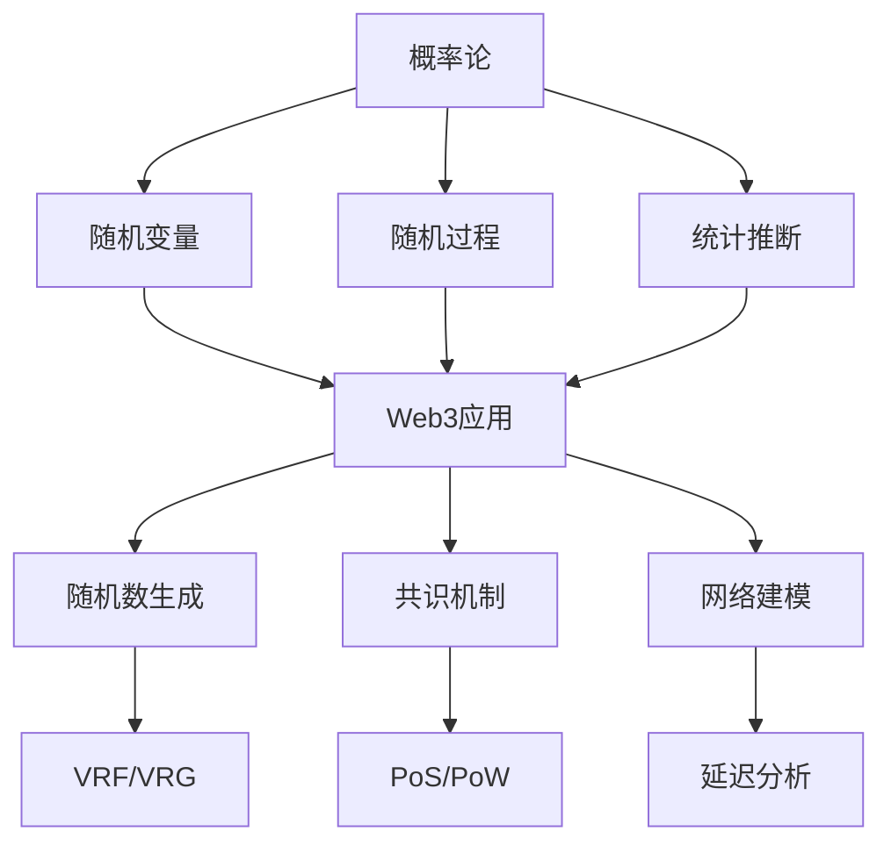

# 概率论：Web3随机性的形式化基础

## 目录

1. [理论基础](#1-理论基础)
2. [形式化定义](#2-形式化定义)
3. [核心定理](#3-核心定理)
4. [Web3应用场景](#4-web3应用场景)
5. [Rust实现](#5-rust实现)
6. [随机过程](#6-随机过程)
7. [结论与展望](#7-结论与展望)

## 1. 理论基础

### 1.1 概率论在Web3中的作用

概率论为Web3系统提供了随机性和不确定性的理论基础。在Web3环境中，概率论主要解决：

1. **随机数生成**：密码学安全的随机数
2. **共识机制**：随机选择验证者
3. **网络延迟**：P2P网络的不确定性
4. **经济模型**：代币价格和交易量预测

### 1.2 Web3概率特点

**定义 1.1 (Web3概率空间)**
Web3概率空间是区块链事件的数学描述：
$$(\Omega, \mathcal{F}, P)$$

其中 $\Omega$ 是区块链状态空间，$\mathcal{F}$ 是事件集合，$P$ 是概率测度。

**特性 1.1 (去中心化随机性)**
$$\forall i, j \in N, P(X_i = x) \approx P(X_j = x)$$

所有节点的随机性分布近似相等。

**特性 1.2 (不可预测性)**
$$\forall t, H(X_{t+1} | X_1, \ldots, X_t) > 0$$

未来状态在给定历史下仍具有不确定性。

## 2. 形式化定义

### 2.1 基础概念

**定义 2.1 (概率空间)**
概率空间是三元组 $(\Omega, \mathcal{F}, P)$，其中：

- $\Omega$ 是样本空间
- $\mathcal{F}$ 是 $\sigma$-代数
- $P : \mathcal{F} \rightarrow [0,1]$ 是概率测度

**定义 2.2 (随机变量)**
随机变量是函数 $X : \Omega \rightarrow \mathbb{R}$，使得：
$$\forall B \in \mathcal{B}(\mathbb{R}), X^{-1}(B) \in \mathcal{F}$$

**定义 2.3 (期望)**
随机变量 $X$ 的期望：
$$E[X] = \int_{\Omega} X(\omega) dP(\omega)$$

**定义 2.4 (方差)**
随机变量 $X$ 的方差：
$$\text{Var}(X) = E[(X - E[X])^2]$$

**定理 2.1 (大数定律)**
设 $X_1, X_2, \ldots$ 是独立同分布随机变量，$E[X_i] = \mu$，则：
$$\frac{1}{n} \sum_{i=1}^n X_i \xrightarrow{a.s.} \mu$$

**证明：** 使用Kolmogorov强大数定律。

### 2.2 条件概率

**定义 2.5 (条件概率)**
给定事件 $B$ 时事件 $A$ 的条件概率：
$$P(A|B) = \frac{P(A \cap B)}{P(B)}$$

**定义 2.6 (贝叶斯定理)**
$$P(A|B) = \frac{P(B|A)P(A)}{P(B)}$$

**定理 2.2 (全概率公式)**
$$P(A) = \sum_{i=1}^n P(A|B_i)P(B_i)$$

其中 $B_1, \ldots, B_n$ 是样本空间的分割。

## 3. 核心定理

### 3.1 中心极限定理

**定理 3.1 (中心极限定理)**
设 $X_1, X_2, \ldots$ 是独立同分布随机变量，$E[X_i] = \mu$，$\text{Var}(X_i) = \sigma^2$，则：
$$\frac{\sum_{i=1}^n X_i - n\mu}{\sqrt{n}\sigma} \xrightarrow{d} N(0,1)$$

**证明：** 使用特征函数方法。

**算法 3.1 (正态分布生成)**
```rust
// 正态分布生成器
pub struct NormalDistribution {
    pub mean: f64,
    pub variance: f64,
}

impl NormalDistribution {
    pub fn new(mean: f64, variance: f64) -> Self {
        Self { mean, variance }
    }
    
    pub fn sample(&self, rng: &mut ThreadRng) -> f64 {
        // Box-Muller变换
        let u1: f64 = rng.gen();
        let u2: f64 = rng.gen();
        
        let z0 = (-2.0 * u1.ln()).sqrt() * (2.0 * std::f64::consts::PI * u2).cos();
        
        self.mean + z0 * self.variance.sqrt()
    }
    
    pub fn pdf(&self, x: f64) -> f64 {
        let std_dev = self.variance.sqrt();
        let exponent = -0.5 * ((x - self.mean) / std_dev).powi(2);
        (1.0 / (std_dev * (2.0 * std::f64::consts::PI).sqrt())) * exponent.exp()
    }
    
    pub fn cdf(&self, x: f64) -> f64 {
        // 使用误差函数近似
        let z = (x - self.mean) / self.variance.sqrt();
        0.5 * (1.0 + erf(z / 2.0_f64.sqrt()))
    }
}

fn erf(x: f64) -> f64 {
    // 误差函数近似
    let a1 =  0.254829592;
    let a2 = -0.284496736;
    let a3 =  1.421413741;
    let a4 = -1.453152027;
    let a5 =  1.061405429;
    let p  =  0.3275911;
    
    let sign = if x < 0.0 { -1.0 } else { 1.0 };
    let x = x.abs();
    
    let t = 1.0 / (1.0 + p * x);
    let y = 1.0 - (((((a5 * t + a4) * t) + a3) * t + a2) * t + a1) * t * (-x * x).exp();
    
    sign * y
}
```

### 3.2 马尔可夫链

**定义 3.1 (马尔可夫链)**
随机过程 $\{X_n\}_{n \geq 0}$ 是马尔可夫链，如果：
$$P(X_{n+1} = j | X_n = i, X_{n-1} = i_{n-1}, \ldots, X_0 = i_0) = P(X_{n+1} = j | X_n = i)$$

**定义 3.2 (转移矩阵)**
转移矩阵 $P = (p_{ij})$ 满足：
$$p_{ij} = P(X_{n+1} = j | X_n = i)$$

**算法 3.2 (马尔可夫链模拟)**
```rust
// 马尔可夫链模拟器
pub struct MarkovChain {
    pub states: Vec<String>,
    pub transition_matrix: Vec<Vec<f64>>,
    pub initial_distribution: Vec<f64>,
}

impl MarkovChain {
    pub fn new(states: Vec<String>, transition_matrix: Vec<Vec<f64>>) -> Self {
        let n = states.len();
        let initial_distribution = vec![1.0 / n as f64; n];
        
        Self {
            states,
            transition_matrix,
            initial_distribution,
        }
    }
    
    pub fn simulate(&self, steps: usize, rng: &mut ThreadRng) -> Vec<String> {
        let mut path = Vec::new();
        
        // 选择初始状态
        let mut current_state = self.sample_initial_state(rng);
        path.push(self.states[current_state].clone());
        
        // 模拟路径
        for _ in 1..steps {
            current_state = self.transition(current_state, rng);
            path.push(self.states[current_state].clone());
        }
        
        path
    }
    
    pub fn stationary_distribution(&self) -> Vec<f64> {
        // 求解平稳分布：πP = π
        let n = self.states.len();
        let mut pi = vec![1.0 / n as f64; n];
        
        // 迭代求解
        for _ in 0..100 {
            let mut new_pi = vec![0.0; n];
            for i in 0..n {
                for j in 0..n {
                    new_pi[j] += pi[i] * self.transition_matrix[i][j];
                }
            }
            pi = new_pi;
        }
        
        pi
    }
    
    fn sample_initial_state(&self, rng: &mut ThreadRng) -> usize {
        let u: f64 = rng.gen();
        let mut cumulative = 0.0;
        
        for (i, &prob) in self.initial_distribution.iter().enumerate() {
            cumulative += prob;
            if u <= cumulative {
                return i;
            }
        }
        
        self.states.len() - 1
    }
    
    fn transition(&self, current_state: usize, rng: &mut ThreadRng) -> usize {
        let u: f64 = rng.gen();
        let mut cumulative = 0.0;
        
        for (j, &prob) in self.transition_matrix[current_state].iter().enumerate() {
            cumulative += prob;
            if u <= cumulative {
                return j;
            }
        }
        
        self.states.len() - 1
    }
}
```

### 3.3 随机游走

**定义 3.3 (随机游走)**
随机游走是马尔可夫链的特例：
$$S_n = X_1 + X_2 + \cdots + X_n$$

其中 $X_i$ 是独立同分布随机变量。

**算法 3.3 (随机游走模拟)**
```rust
// 随机游走模拟器
pub struct RandomWalk {
    pub step_distribution: Box<dyn Distribution<f64>>,
    pub dimension: usize,
}

impl RandomWalk {
    pub fn new(step_distribution: Box<dyn Distribution<f64>>, dimension: usize) -> Self {
        Self {
            step_distribution,
            dimension,
        }
    }
    
    pub fn simulate(&self, steps: usize, rng: &mut ThreadRng) -> Vec<Vec<f64>> {
        let mut positions = vec![vec![0.0; self.dimension]];
        
        for _ in 0..steps {
            let mut new_position = positions.last().unwrap().clone();
            
            for d in 0..self.dimension {
                let step = self.step_distribution.sample(rng);
                new_position[d] += step;
            }
            
            positions.push(new_position);
        }
        
        positions
    }
    
    pub fn calculate_statistics(&self, paths: &[Vec<Vec<f64>>]) -> WalkStatistics {
        let mut mean_squared_displacement = Vec::new();
        let mut final_positions = Vec::new();
        
        for path in paths {
            let final_pos = path.last().unwrap();
            final_positions.push(final_pos.clone());
            
            let displacement_squared: f64 = final_pos.iter().map(|x| x * x).sum();
            mean_squared_displacement.push(displacement_squared);
        }
        
        let avg_msd = mean_squared_displacement.iter().sum::<f64>() / paths.len() as f64;
        
        WalkStatistics {
            mean_squared_displacement: avg_msd,
            final_positions,
        }
    }
}

pub struct WalkStatistics {
    pub mean_squared_displacement: f64,
    pub final_positions: Vec<Vec<f64>>,
}

pub trait Distribution<T> {
    fn sample(&self, rng: &mut ThreadRng) -> T;
}

// 标准正态分布
pub struct StandardNormal;

impl Distribution<f64> for StandardNormal {
    fn sample(&self, rng: &mut ThreadRng) -> f64 {
        let u1: f64 = rng.gen();
        let u2: f64 = rng.gen();
        
        (-2.0 * u1.ln()).sqrt() * (2.0 * std::f64::consts::PI * u2).cos()
    }
}
```

## 4. Web3应用场景

### 4.1 随机数生成

**定义 4.1 (密码学随机数)**
密码学安全的随机数满足：
$$\forall \text{PPT} \mathcal{A}, |\Pr[\mathcal{A}(X) = 1] - \Pr[\mathcal{A}(Y) = 1]| \leq \text{negl}(\lambda)$$

其中 $X$ 是随机数，$Y$ 是均匀分布。

**实现 4.1 (VRF实现)**
```rust
// 可验证随机函数
pub struct VRF {
    pub private_key: [u8; 32],
    pub public_key: [u8; 32],
}

impl VRF {
    pub fn new() -> Self {
        let mut rng = thread_rng();
        let mut private_key = [0u8; 32];
        rng.fill_bytes(&mut private_key);
        
        let public_key = Self::derive_public_key(&private_key);
        
        Self {
            private_key,
            public_key,
        }
    }
    
    pub fn evaluate(&self, input: &[u8]) -> (Vec<u8>, Vec<u8>) {
        // 使用私钥和输入生成随机数和证明
        let hash = Self::hash_input(&self.private_key, input);
        let random_value = Self::derive_random_value(&hash);
        let proof = Self::generate_proof(&self.private_key, input, &random_value);
        
        (random_value, proof)
    }
    
    pub fn verify(&self, input: &[u8], random_value: &[u8], proof: &[u8]) -> bool {
        // 验证随机数和证明
        Self::verify_proof(&self.public_key, input, random_value, proof)
    }
    
    fn derive_public_key(private_key: &[u8; 32]) -> [u8; 32] {
        // 从私钥派生公钥
        let mut public_key = [0u8; 32];
        // 实现椭圆曲线点乘法
        public_key
    }
    
    fn hash_input(private_key: &[u8; 32], input: &[u8]) -> [u8; 32] {
        let mut hasher = Sha256::new();
        hasher.update(private_key);
        hasher.update(input);
        hasher.finalize().into()
    }
    
    fn derive_random_value(hash: &[u8; 32]) -> Vec<u8> {
        // 从哈希派生随机值
        hash.to_vec()
    }
    
    fn generate_proof(private_key: &[u8; 32], input: &[u8], random_value: &[u8]) -> Vec<u8> {
        // 生成零知识证明
        let mut proof = Vec::new();
        // 实现证明生成
        proof
    }
    
    fn verify_proof(public_key: &[u8; 32], input: &[u8], random_value: &[u8], proof: &[u8]) -> bool {
        // 验证零知识证明
        true // 简化实现
    }
}
```

### 4.2 共识机制随机性

**定义 4.2 (共识随机性)**
共识机制中的随机性用于选择验证者：
$$P(\text{Validator}_i \text{ selected}) = \frac{w_i}{\sum_{j=1}^n w_j}$$

其中 $w_i$ 是验证者 $i$ 的权重。

**实现 4.2 (PoS随机选择)**
```rust
// PoS随机选择器
pub struct PoSRandomSelector {
    pub validators: Vec<Validator>,
    pub total_stake: f64,
}

impl PoSRandomSelector {
    pub fn new(validators: Vec<Validator>) -> Self {
        let total_stake: f64 = validators.iter().map(|v| v.stake).sum();
        
        Self {
            validators,
            total_stake,
        }
    }
    
    pub fn select_validator(&self, rng: &mut ThreadRng) -> &Validator {
        let u: f64 = rng.gen();
        let mut cumulative = 0.0;
        
        for validator in &self.validators {
            cumulative += validator.stake / self.total_stake;
            if u <= cumulative {
                return validator;
            }
        }
        
        &self.validators[self.validators.len() - 1]
    }
    
    pub fn select_committee(&self, size: usize, rng: &mut ThreadRng) -> Vec<&Validator> {
        let mut committee = Vec::new();
        let mut available = (0..self.validators.len()).collect::<Vec<_>>();
        
        for _ in 0..size.min(available.len()) {
            let index = rng.gen_range(0..available.len());
            let validator_index = available.remove(index);
            committee.push(&self.validators[validator_index]);
        }
        
        committee
    }
    
    pub fn calculate_selection_probabilities(&self) -> Vec<f64> {
        self.validators.iter()
            .map(|v| v.stake / self.total_stake)
            .collect()
    }
}

pub struct Validator {
    pub id: String,
    pub stake: f64,
    pub public_key: Vec<u8>,
}
```

### 4.3 网络延迟建模

**定义 4.3 (网络延迟)**
网络延迟是随机变量：
$$D \sim \text{Distribution}(\mu, \sigma^2)$$

**实现 4.3 (网络延迟模拟)**
```rust
// 网络延迟模拟器
pub struct NetworkDelaySimulator {
    pub base_delay: f64,
    pub jitter: f64,
    pub packet_loss_rate: f64,
}

impl NetworkDelaySimulator {
    pub fn new(base_delay: f64, jitter: f64, packet_loss_rate: f64) -> Self {
        Self {
            base_delay,
            jitter,
            packet_loss_rate,
        }
    }
    
    pub fn simulate_delay(&self, rng: &mut ThreadRng) -> Option<f64> {
        // 检查丢包
        let u: f64 = rng.gen();
        if u < self.packet_loss_rate {
            return None; // 丢包
        }
        
        // 生成延迟
        let jitter_component = NormalDistribution::new(0.0, self.jitter).sample(rng);
        let delay = self.base_delay + jitter_component.abs();
        
        Some(delay)
    }
    
    pub fn simulate_network_path(&self, num_hops: usize, rng: &mut ThreadRng) -> NetworkPath {
        let mut delays = Vec::new();
        let mut total_delay = 0.0;
        let mut lost_packets = 0;
        
        for _ in 0..num_hops {
            if let Some(delay) = self.simulate_delay(rng) {
                delays.push(delay);
                total_delay += delay;
            } else {
                lost_packets += 1;
            }
        }
        
        NetworkPath {
            delays,
            total_delay,
            lost_packets,
            success_rate: (num_hops - lost_packets) as f64 / num_hops as f64,
        }
    }
    
    pub fn analyze_network_performance(&self, num_simulations: usize, num_hops: usize) -> NetworkStatistics {
        let mut total_delays = Vec::new();
        let mut success_rates = Vec::new();
        
        let mut rng = thread_rng();
        
        for _ in 0..num_simulations {
            let path = self.simulate_network_path(num_hops, &mut rng);
            total_delays.push(path.total_delay);
            success_rates.push(path.success_rate);
        }
        
        let avg_delay = total_delays.iter().sum::<f64>() / num_simulations as f64;
        let avg_success_rate = success_rates.iter().sum::<f64>() / num_simulations as f64;
        
        NetworkStatistics {
            average_delay: avg_delay,
            average_success_rate: avg_success_rate,
            delay_distribution: total_delays,
        }
    }
}

pub struct NetworkPath {
    pub delays: Vec<f64>,
    pub total_delay: f64,
    pub lost_packets: usize,
    pub success_rate: f64,
}

pub struct NetworkStatistics {
    pub average_delay: f64,
    pub average_success_rate: f64,
    pub delay_distribution: Vec<f64>,
}
```

## 5. Rust实现

### 5.1 概率分布库

```rust
// 概率分布特征
pub trait ProbabilityDistribution {
    type Sample;
    
    fn sample(&self, rng: &mut ThreadRng) -> Self::Sample;
    fn pdf(&self, x: Self::Sample) -> f64;
    fn cdf(&self, x: Self::Sample) -> f64;
    fn mean(&self) -> f64;
    fn variance(&self) -> f64;
}

// 指数分布
pub struct ExponentialDistribution {
    pub lambda: f64,
}

impl ProbabilityDistribution for ExponentialDistribution {
    type Sample = f64;
    
    fn sample(&self, rng: &mut ThreadRng) -> Self::Sample {
        let u: f64 = rng.gen();
        -u.ln() / self.lambda
    }
    
    fn pdf(&self, x: f64) -> f64 {
        if x >= 0.0 {
            self.lambda * (-self.lambda * x).exp()
        } else {
            0.0
        }
    }
    
    fn cdf(&self, x: f64) -> f64 {
        if x >= 0.0 {
            1.0 - (-self.lambda * x).exp()
        } else {
            0.0
        }
    }
    
    fn mean(&self) -> f64 {
        1.0 / self.lambda
    }
    
    fn variance(&self) -> f64 {
        1.0 / (self.lambda * self.lambda)
    }
}

// 泊松分布
pub struct PoissonDistribution {
    pub lambda: f64,
}

impl ProbabilityDistribution for PoissonDistribution {
    type Sample = u32;
    
    fn sample(&self, rng: &mut ThreadRng) -> Self::Sample {
        let mut k = 0;
        let mut p = 1.0;
        let l = (-self.lambda).exp();
        
        loop {
            let u: f64 = rng.gen();
            p *= u;
            if p <= l {
                break;
            }
            k += 1;
        }
        
        k
    }
    
    fn pdf(&self, k: u32) -> f64 {
        (self.lambda.powi(k as i32) * (-self.lambda).exp()) / factorial(k)
    }
    
    fn cdf(&self, k: u32) -> f64 {
        let mut sum = 0.0;
        for i in 0..=k {
            sum += self.pdf(i);
        }
        sum
    }
    
    fn mean(&self) -> f64 {
        self.lambda
    }
    
    fn variance(&self) -> f64 {
        self.lambda
    }
}

fn factorial(n: u32) -> f64 {
    if n <= 1 {
        1.0
    } else {
        n as f64 * factorial(n - 1)
    }
}
```

### 5.2 统计分析工具

```rust
// 统计分析器
pub struct StatisticalAnalyzer;

impl StatisticalAnalyzer {
    pub fn calculate_mean(data: &[f64]) -> f64 {
        data.iter().sum::<f64>() / data.len() as f64
    }
    
    pub fn calculate_variance(data: &[f64]) -> f64 {
        let mean = Self::calculate_mean(data);
        let sum_squared_diff: f64 = data.iter()
            .map(|x| (x - mean).powi(2))
            .sum();
        sum_squared_diff / (data.len() - 1) as f64
    }
    
    pub fn calculate_correlation(x: &[f64], y: &[f64]) -> f64 {
        let n = x.len().min(y.len());
        let x_mean = Self::calculate_mean(&x[..n]);
        let y_mean = Self::calculate_mean(&y[..n]);
        
        let numerator: f64 = x[..n].iter().zip(y[..n].iter())
            .map(|(xi, yi)| (xi - x_mean) * (yi - y_mean))
            .sum();
        
        let x_variance = Self::calculate_variance(&x[..n]);
        let y_variance = Self::calculate_variance(&y[..n]);
        
        numerator / ((n - 1) as f64 * x_variance.sqrt() * y_variance.sqrt())
    }
    
    pub fn perform_hypothesis_test(&self, data: &[f64], null_mean: f64, alpha: f64) -> HypothesisTestResult {
        let sample_mean = Self::calculate_mean(data);
        let sample_variance = Self::calculate_variance(data);
        let n = data.len();
        
        let t_statistic = (sample_mean - null_mean) / (sample_variance / n as f64).sqrt();
        let degrees_of_freedom = n - 1;
        
        let critical_value = self.t_distribution_critical_value(degrees_of_freedom, alpha);
        let p_value = self.calculate_p_value(t_statistic, degrees_of_freedom);
        
        HypothesisTestResult {
            t_statistic,
            p_value,
            critical_value,
            reject_null: t_statistic.abs() > critical_value,
        }
    }
    
    fn t_distribution_critical_value(&self, df: usize, alpha: f64) -> f64 {
        // 简化实现，实际应使用t分布表或数值方法
        1.96 // 大样本近似
    }
    
    fn calculate_p_value(&self, t_stat: f64, df: usize) -> f64 {
        // 简化实现，实际应使用t分布CDF
        2.0 * (1.0 - NormalDistribution::new(0.0, 1.0).cdf(t_stat.abs()))
    }
}

pub struct HypothesisTestResult {
    pub t_statistic: f64,
    pub p_value: f64,
    pub critical_value: f64,
    pub reject_null: bool,
}
```

## 6. 随机过程

### 6.1 布朗运动

**定义 6.1 (布朗运动)**
布朗运动是连续时间随机过程 $W(t)$，满足：

1. $W(0) = 0$
2. 独立增量
3. $W(t) - W(s) \sim N(0, t-s)$

**实现 6.1 (布朗运动模拟)**
```rust
// 布朗运动模拟器
pub struct BrownianMotion {
    pub drift: f64,
    pub volatility: f64,
}

impl BrownianMotion {
    pub fn new(drift: f64, volatility: f64) -> Self {
        Self { drift, volatility }
    }
    
    pub fn simulate_path(&self, initial_value: f64, time_steps: usize, dt: f64, rng: &mut ThreadRng) -> Vec<f64> {
        let mut path = vec![initial_value];
        let mut current_value = initial_value;
        
        for _ in 0..time_steps {
            let dw = NormalDistribution::new(0.0, dt).sample(rng);
            let drift_term = self.drift * dt;
            let diffusion_term = self.volatility * dw;
            
            current_value += drift_term + diffusion_term;
            path.push(current_value);
        }
        
        path
    }
    
    pub fn simulate_multiple_paths(&self, initial_value: f64, time_steps: usize, dt: f64, num_paths: usize) -> Vec<Vec<f64>> {
        let mut rng = thread_rng();
        let mut paths = Vec::new();
        
        for _ in 0..num_paths {
            let path = self.simulate_path(initial_value, time_steps, dt, &mut rng);
            paths.push(path);
        }
        
        paths
    }
    
    pub fn calculate_statistics(&self, paths: &[Vec<f64>]) -> BrownianMotionStatistics {
        let time_steps = paths[0].len();
        let num_paths = paths.len();
        
        let mut mean_path = vec![0.0; time_steps];
        let mut variance_path = vec![0.0; time_steps];
        
        for t in 0..time_steps {
            let values: Vec<f64> = paths.iter().map(|path| path[t]).collect();
            mean_path[t] = StatisticalAnalyzer::calculate_mean(&values);
            variance_path[t] = StatisticalAnalyzer::calculate_variance(&values);
        }
        
        BrownianMotionStatistics {
            mean_path,
            variance_path,
            final_values: paths.iter().map(|path| *path.last().unwrap()).collect(),
        }
    }
}

pub struct BrownianMotionStatistics {
    pub mean_path: Vec<f64>,
    pub variance_path: Vec<f64>,
    pub final_values: Vec<f64>,
}
```

### 6.2 几何布朗运动

**定义 6.2 (几何布朗运动)**
几何布朗运动满足：
$$dS(t) = \mu S(t) dt + \sigma S(t) dW(t)$$

**实现 6.2 (几何布朗运动)**
```rust
// 几何布朗运动
pub struct GeometricBrownianMotion {
    pub drift: f64,
    pub volatility: f64,
}

impl GeometricBrownianMotion {
    pub fn simulate_path(&self, initial_value: f64, time_steps: usize, dt: f64, rng: &mut ThreadRng) -> Vec<f64> {
        let mut path = vec![initial_value];
        let mut current_value = initial_value;
        
        for _ in 0..time_steps {
            let dw = NormalDistribution::new(0.0, dt).sample(rng);
            let drift_term = (self.drift - 0.5 * self.volatility * self.volatility) * dt;
            let diffusion_term = self.volatility * dw;
            
            current_value *= (drift_term + diffusion_term).exp();
            path.push(current_value);
        }
        
        path
    }
    
    pub fn calculate_option_price(&self, spot_price: f64, strike_price: f64, time_to_maturity: f64, risk_free_rate: f64) -> f64 {
        // Black-Scholes公式
        let d1 = (spot_price / strike_price).ln() + (risk_free_rate + 0.5 * self.volatility * self.volatility) * time_to_maturity;
        let d1 = d1 / (self.volatility * time_to_maturity.sqrt());
        
        let d2 = d1 - self.volatility * time_to_maturity.sqrt();
        
        let call_price = spot_price * NormalDistribution::new(0.0, 1.0).cdf(d1) 
                       - strike_price * (-risk_free_rate * time_to_maturity).exp() * NormalDistribution::new(0.0, 1.0).cdf(d2);
        
        call_price
    }
}
```

## 7. 结论与展望

### 7.1 理论贡献

概率论为Web3系统提供了：

1. **随机性基础**：密码学安全的随机数生成
2. **不确定性建模**：网络延迟和共识机制
3. **统计推断**：数据分析和预测
4. **随机过程**：价格和状态演化

### 7.2 实践价值

在Web3系统中的应用价值：

1. **共识机制**：随机选择验证者
2. **网络安全**：随机数生成和验证
3. **经济模型**：代币价格建模
4. **网络分析**：延迟和吞吐量分析

### 7.3 未来发展方向

1. **量子概率论**：量子随机性
2. **高维概率**：复杂系统建模
3. **非参数统计**：数据驱动方法
4. **随机优化**：随机算法

### 7.4 技术路线图



概率论为Web3系统提供了坚实的理论基础，通过形式化的随机性建模、统计分析和随机过程，确保了Web3系统的安全性、可靠性和可预测性。随着量子计算和复杂系统理论的发展，概率论将在更多领域发挥重要作用。

## 参考文献

1. Billingsley, P. (2012). Probability and measure. John Wiley & Sons.
2. Durrett, R. (2019). Probability: theory and examples. Cambridge university press.
3. Ross, S. M. (2014). Introduction to probability models. Academic press.
4. Grimmett, G., & Stirzaker, D. (2020). Probability and random processes. Oxford university press.
5. Kallenberg, O. (2006). Foundations of modern probability. Springer Science & Business Media. 