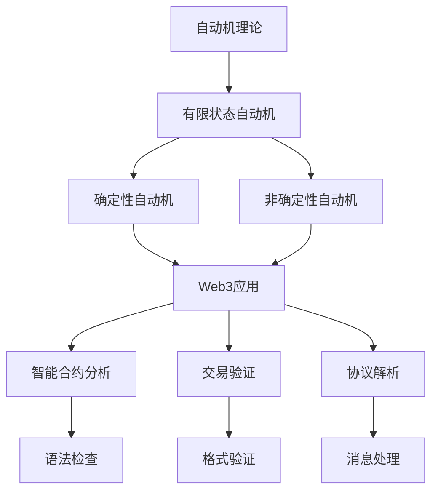

# 自动机理论：Web3语言处理的形式化基础

## 目录

1. [理论基础](#1-理论基础)
2. [形式化定义](#2-形式化定义)
3. [自动机类型](#3-自动机类型)
4. [Web3应用场景](#4-web3应用场景)
5. [Rust实现](#5-rust实现)
6. [性能与复杂度分析](#6-性能与复杂度分析)
7. [结论与展望](#7-结论与展望)

## 1. 理论基础

### 1.1 自动机理论在Web3中的作用

自动机理论为Web3系统提供了语言识别和处理的数学基础。在Web3环境中，自动机理论主要解决：

1. **智能合约语法分析**：验证智能合约代码的语法正确性
2. **交易格式验证**：确保交易数据的格式符合规范
3. **协议消息解析**：解析P2P网络中的协议消息
4. **状态机建模**：建模区块链状态转换过程

### 1.2 Web3语言处理的特点

**定义 1.1 (Web3语言)**
Web3语言是用于描述区块链操作的形式化语言：
$$\mathcal{L}_{Web3} = \mathcal{L}_{Contract} \cup \mathcal{L}_{Transaction} \cup \mathcal{L}_{Protocol}$$

其中：
- $\mathcal{L}_{Contract}$ 是智能合约语言
- $\mathcal{L}_{Transaction}$ 是交易语言
- $\mathcal{L}_{Protocol}$ 是协议语言

**特性 1.1 (确定性)**
$$\forall w \in \mathcal{L}_{Web3}, \exists! M : M(w) = \text{accept}$$

每个Web3语言字符串都有唯一的接受判定。

**特性 1.2 (可验证性)**
$$\forall w \in \mathcal{L}_{Web3}, \exists V : V(w) = \text{true} \Leftrightarrow w \in \mathcal{L}_{Web3}$$

每个Web3语言字符串都可以被验证。

## 2. 形式化定义

### 2.1 基础概念

**定义 2.1 (字母表)**
字母表 $\Sigma$ 是有限符号集合：
$$\Sigma = \{a_1, a_2, \ldots, a_n\} \text{ where } n \in \mathbb{N}$$

**定义 2.2 (字符串)**
字符串是字母表中符号的有限序列：
$$w = a_1 a_2 \cdots a_n \text{ where } a_i \in \Sigma$$

**定义 2.3 (字符串操作)**
字符串的基本操作：

1. **连接**：$w_1 \cdot w_2 = w_1 w_2$
2. **幂运算**：$w^0 = \epsilon$, $w^{n+1} = w \cdot w^n$
3. **长度**：$|w| = n$ 对于 $w = a_1 a_2 \cdots a_n$
4. **反转**：$w^R = a_n a_{n-1} \cdots a_1$

**定义 2.4 (语言)**
语言 $L$ 是字符串集合：
$$L \subseteq \Sigma^*$$

其中 $\Sigma^* = \bigcup_{n=0}^{\infty} \Sigma^n$ 是所有可能字符串的集合。

**定义 2.5 (语言操作)**
语言的基本操作：

1. **并集**：$L_1 \cup L_2 = \{w \mid w \in L_1 \text{ or } w \in L_2\}$
2. **连接**：$L_1 \cdot L_2 = \{w_1 w_2 \mid w_1 \in L_1, w_2 \in L_2\}$
3. **克林闭包**：$L^* = \bigcup_{n=0}^{\infty} L^n$
4. **补集**：$\overline{L} = \Sigma^* \setminus L$

### 2.2 乔姆斯基层次

**定义 2.6 (乔姆斯基层次)**
语言类别的层次结构：

1. **正则语言 (Regular)**：有限状态自动机识别
2. **上下文无关语言 (CFL)**：下推自动机识别
3. **上下文有关语言 (CSL)**：线性有界自动机识别
4. **递归可枚举语言 (REL)**：图灵机识别

**定理 2.1 (层次包含关系)**
$$\text{Regular} \subset \text{CFL} \subset \text{CSL} \subset \text{REL}$$

**证明：** 通过构造性证明：

1. **包含关系**：每个层次包含前一个层次
   - 正则语言是上下文无关语言的特例
   - 上下文无关语言是上下文有关语言的特例
   - 上下文有关语言是递归可枚举语言的特例

2. **严格包含**：存在语言属于更高层次但不属于较低层次
   - $\{a^n b^n \mid n \geq 0\}$ 是CFL但不是正则语言
   - $\{a^n b^n c^n \mid n \geq 0\}$ 是CSL但不是CFL
   - 停机问题的语言是REL但不是CSL

## 3. 自动机类型

### 3.1 有限状态自动机

**定义 3.1 (确定性有限自动机)**
确定性有限自动机是五元组 $M = (Q, \Sigma, \delta, q_0, F)$，其中：

- $Q$ 是有限状态集合
- $\Sigma$ 是输入字母表
- $\delta : Q \times \Sigma \rightarrow Q$ 是转移函数
- $q_0 \in Q$ 是初始状态
- $F \subseteq Q$ 是接受状态集合

**定义 3.2 (DFA计算)**
DFA在输入 $w = a_1 a_2 \cdots a_n$ 上的计算：
$$q_0 \xrightarrow{a_1} q_1 \xrightarrow{a_2} q_2 \cdots \xrightarrow{a_n} q_n$$

其中 $q_{i+1} = \delta(q_i, a_{i+1})$。

**定义 3.3 (DFA接受)**
DFA接受字符串 $w$，如果计算结束于接受状态：$q_n \in F$。

**定理 3.1 (DFA语言识别)**
DFA $M$ 识别的语言：
$$L(M) = \{w \in \Sigma^* \mid M \text{ accepts } w\}$$

**实现 3.1 (DFA实现)**
```rust
use std::collections::HashMap;

// 确定性有限自动机
pub struct DFA {
    pub states: Vec<String>,
    pub alphabet: Vec<char>,
    pub transitions: HashMap<(String, char), String>,
    pub initial_state: String,
    pub accepting_states: Vec<String>,
}

impl DFA {
    pub fn new(
        states: Vec<String>,
        alphabet: Vec<char>,
        initial_state: String,
        accepting_states: Vec<String>,
    ) -> Self {
        Self {
            states,
            alphabet,
            transitions: HashMap::new(),
            initial_state,
            accepting_states,
        }
    }
    
    pub fn add_transition(&mut self, from: String, symbol: char, to: String) {
        self.transitions.insert((from, symbol), to);
    }
    
    pub fn accepts(&self, input: &str) -> bool {
        let mut current_state = self.initial_state.clone();
        
        for symbol in input.chars() {
            if let Some(&ref next_state) = self.transitions.get(&(current_state.clone(), symbol)) {
                current_state = next_state.clone();
            } else {
                return false; // 无转移，拒绝
            }
        }
        
        self.accepting_states.contains(&current_state)
    }
    
    pub fn minimize(&self) -> DFA {
        // Hopcroft算法实现最小化
        let equivalence_classes = self.compute_equivalence_classes();
        self.build_minimal_dfa(&equivalence_classes)
    }
    
    fn compute_equivalence_classes(&self) -> Vec<Vec<String>> {
        // 计算等价类
        let mut classes = vec![
            self.accepting_states.clone(),
            self.states.iter()
                .filter(|s| !self.accepting_states.contains(s))
                .cloned()
                .collect()
        ];
        
        // 迭代细化等价类
        loop {
            let new_classes = self.refine_classes(&classes);
            if new_classes.len() == classes.len() {
                break;
            }
            classes = new_classes;
        }
        
        classes
    }
    
    fn refine_classes(&self, classes: &[Vec<String>]) -> Vec<Vec<String>> {
        let mut new_classes = Vec::new();
        
        for class in classes {
            let mut refined = HashMap::new();
            
            for state in class {
                let signature = self.compute_signature(state, classes);
                refined.entry(signature).or_insert_with(Vec::new).push(state.clone());
            }
            
            new_classes.extend(refined.into_values());
        }
        
        new_classes
    }
    
    fn compute_signature(&self, state: &str, classes: &[Vec<String>]) -> Vec<usize> {
        let mut signature = Vec::new();
        
        for symbol in &self.alphabet {
            if let Some(&ref next_state) = self.transitions.get(&(state.to_string(), *symbol)) {
                let class_index = classes.iter()
                    .position(|class| class.contains(next_state))
                    .unwrap_or(0);
                signature.push(class_index);
            } else {
                signature.push(usize::MAX); // 无转移
            }
        }
        
        signature
    }
    
    fn build_minimal_dfa(&self, classes: &[Vec<String>]) -> DFA {
        let mut minimal_dfa = DFA::new(
            classes.iter().map(|c| format!("q{}", c[0])).collect(),
            self.alphabet.clone(),
            String::new(),
            Vec::new(),
        );
        
        // 构建最小化DFA的转移函数
        for (i, class) in classes.iter().enumerate() {
            let representative = &class[0];
            
            for symbol in &self.alphabet {
                if let Some(&ref next_state) = self.transitions.get(&(representative.clone(), *symbol)) {
                    let next_class_index = classes.iter()
                        .position(|c| c.contains(next_state))
                        .unwrap_or(0);
                    minimal_dfa.add_transition(
                        format!("q{}", i),
                        *symbol,
                        format!("q{}", next_class_index),
                    );
                }
            }
        }
        
        minimal_dfa
    }
}
```

### 3.2 下推自动机

**定义 3.4 (下推自动机)**
下推自动机是七元组 $M = (Q, \Sigma, \Gamma, \delta, q_0, Z_0, F)$，其中：

- $Q$ 是有限状态集合
- $\Sigma$ 是输入字母表
- $\Gamma$ 是栈字母表
- $\delta : Q \times (\Sigma \cup \{\epsilon\}) \times \Gamma \rightarrow 2^{Q \times \Gamma^*}$ 是转移函数
- $q_0 \in Q$ 是初始状态
- $Z_0 \in \Gamma$ 是初始栈符号
- $F \subseteq Q$ 是接受状态集合

**定义 3.5 (PDA配置)**
PDA配置是三元组 $(q, w, \gamma)$，其中：

- $q$ 是当前状态
- $w$ 是剩余输入
- $\gamma$ 是栈内容

**定义 3.6 (PDA计算)**
PDA计算步骤：
$$(q, aw, A\gamma) \vdash (p, w, \beta\gamma)$$

如果 $(p, \beta) \in \delta(q, a, A)$。

**实现 3.2 (PDA实现)**
```rust
use std::collections::{HashMap, HashSet};

// 下推自动机
pub struct PDA {
    pub states: Vec<String>,
    pub input_alphabet: Vec<char>,
    pub stack_alphabet: Vec<char>,
    pub transitions: HashMap<(String, Option<char>, char), Vec<(String, String)>>,
    pub initial_state: String,
    pub initial_stack_symbol: char,
    pub accepting_states: Vec<String>,
}

impl PDA {
    pub fn new(
        states: Vec<String>,
        input_alphabet: Vec<char>,
        stack_alphabet: Vec<char>,
        initial_state: String,
        initial_stack_symbol: char,
        accepting_states: Vec<String>,
    ) -> Self {
        Self {
            states,
            input_alphabet,
            stack_alphabet,
            transitions: HashMap::new(),
            initial_state,
            initial_stack_symbol,
            accepting_states,
        }
    }
    
    pub fn add_transition(&mut self, from: String, input: Option<char>, stack_top: char, to: String, stack_push: String) {
        let key = (from, input, stack_top);
        self.transitions.entry(key).or_insert_with(Vec::new).push((to, stack_push));
    }
    
    pub fn accepts(&self, input: &str) -> bool {
        let initial_config = PDAConfig {
            state: self.initial_state.clone(),
            input: input.to_string(),
            stack: vec![self.initial_stack_symbol],
        };
        
        let mut configurations = HashSet::new();
        configurations.insert(initial_config);
        
        // 非确定性计算
        while !configurations.is_empty() {
            let mut new_configurations = HashSet::new();
            
            for config in configurations {
                if config.input.is_empty() && self.accepting_states.contains(&config.state) {
                    return true; // 接受
                }
                
                // 尝试所有可能的转移
                for transition in self.get_transitions(&config) {
                    if let Some(new_config) = self.apply_transition(&config, &transition) {
                        new_configurations.insert(new_config);
                    }
                }
            }
            
            configurations = new_configurations;
        }
        
        false // 拒绝
    }
    
    fn get_transitions(&self, config: &PDAConfig) -> Vec<(&(String, Option<char>, char), &(String, String))> {
        let mut transitions = Vec::new();
        
        // 检查输入符号转移
        if let Some(input_char) = config.input.chars().next() {
            let key = (config.state.clone(), Some(input_char), config.stack.last().unwrap().clone());
            if let Some(transitions_for_key) = self.transitions.get(&key) {
                for transition in transitions_for_key {
                    transitions.push((&key, transition));
                }
            }
        }
        
        // 检查ε转移
        let epsilon_key = (config.state.clone(), None, config.stack.last().unwrap().clone());
        if let Some(transitions_for_key) = self.transitions.get(&epsilon_key) {
            for transition in transitions_for_key {
                transitions.push((&epsilon_key, transition));
            }
        }
        
        transitions
    }
    
    fn apply_transition(&self, config: &PDAConfig, transition: &(&(String, Option<char>, char), &(String, String))) -> Option<PDAConfig> {
        let (key, (to_state, stack_push)) = transition;
        let (_, input_symbol, _) = key;
        
        // 检查输入符号
        let new_input = if let Some(symbol) = input_symbol {
            if config.input.starts_with(*symbol) {
                config.input[1..].to_string()
            } else {
                return None;
            }
        } else {
            config.input.clone()
        };
        
        // 更新栈
        let mut new_stack = config.stack.clone();
        new_stack.pop(); // 移除栈顶符号
        
        // 压入新符号串（逆序）
        for symbol in stack_push.chars().rev() {
            new_stack.push(symbol);
        }
        
        Some(PDAConfig {
            state: to_state.clone(),
            input: new_input,
            stack: new_stack,
        })
    }
}

// PDA配置
#[derive(Debug, Clone, PartialEq, Eq, Hash)]
pub struct PDAConfig {
    pub state: String,
    pub input: String,
    pub stack: Vec<char>,
}
```

### 3.3 图灵机

**定义 3.7 (图灵机)**
图灵机是七元组 $M = (Q, \Sigma, \Gamma, \delta, q_0, B, F)$，其中：

- $Q$ 是有限状态集合
- $\Sigma$ 是输入字母表
- $\Gamma$ 是带字母表
- $\delta : Q \times \Gamma \rightarrow Q \times \Gamma \times \{L, R\}$ 是转移函数
- $q_0 \in Q$ 是初始状态
- $B \in \Gamma$ 是空白符号
- $F \subseteq Q$ 是接受状态集合

**定义 3.8 (图灵机配置)**
图灵机配置是三元组 $(q, \alpha, i)$，其中：

- $q$ 是当前状态
- $\alpha$ 是带内容
- $i$ 是读写头位置

**实现 3.3 (图灵机实现)**
```rust
use std::collections::HashMap;

// 图灵机
pub struct TuringMachine {
    pub states: Vec<String>,
    pub input_alphabet: Vec<char>,
    pub tape_alphabet: Vec<char>,
    pub transitions: HashMap<(String, char), (String, char, Direction)>,
    pub initial_state: String,
    pub blank_symbol: char,
    pub accepting_states: Vec<String>,
}

#[derive(Debug, Clone)]
pub enum Direction {
    Left,
    Right,
}

impl TuringMachine {
    pub fn new(
        states: Vec<String>,
        input_alphabet: Vec<char>,
        tape_alphabet: Vec<char>,
        initial_state: String,
        blank_symbol: char,
        accepting_states: Vec<String>,
    ) -> Self {
        Self {
            states,
            input_alphabet,
            tape_alphabet,
            transitions: HashMap::new(),
            initial_state,
            blank_symbol,
            accepting_states,
        }
    }
    
    pub fn add_transition(&mut self, from: String, read: char, to: String, write: char, direction: Direction) {
        self.transitions.insert((from, read), (to, write, direction));
    }
    
    pub fn accepts(&self, input: &str) -> bool {
        let mut config = TMConfig {
            state: self.initial_state.clone(),
            tape: input.chars().collect(),
            head_position: 0,
        };
        
        let mut step_count = 0;
        let max_steps = 10000; // 防止无限循环
        
        while step_count < max_steps {
            if self.accepting_states.contains(&config.state) {
                return true; // 接受
            }
            
            if let Some(new_config) = self.step(&config) {
                config = new_config;
                step_count += 1;
            } else {
                return false; // 停机但不接受
            }
        }
        
        false // 超时
    }
    
    fn step(&self, config: &TMConfig) -> Option<TMConfig> {
        let current_symbol = config.tape.get(config.head_position).unwrap_or(&self.blank_symbol);
        
        if let Some(&(ref new_state, new_symbol, direction)) = self.transitions.get(&(config.state.clone(), *current_symbol)) {
            let mut new_tape = config.tape.clone();
            
            // 扩展磁带如果需要
            while new_tape.len() <= config.head_position {
                new_tape.push(self.blank_symbol);
            }
            
            new_tape[config.head_position] = new_symbol;
            
            let new_head_position = match direction {
                Direction::Left => {
                    if config.head_position == 0 {
                        new_tape.insert(0, self.blank_symbol);
                        0
                    } else {
                        config.head_position - 1
                    }
                }
                Direction::Right => {
                    if config.head_position == new_tape.len() - 1 {
                        new_tape.push(self.blank_symbol);
                    }
                    config.head_position + 1
                }
            };
            
            Some(TMConfig {
                state: new_state.clone(),
                tape: new_tape,
                head_position: new_head_position,
            })
        } else {
            None // 无转移，停机
        }
    }
}

// 图灵机配置
#[derive(Debug, Clone)]
pub struct TMConfig {
    pub state: String,
    pub tape: Vec<char>,
    pub head_position: usize,
}
```

## 4. Web3应用场景

### 4.1 智能合约语法分析

**定义 4.1 (智能合约语言)**
智能合约语言是上下文无关语言：
$$\mathcal{L}_{Contract} = \{w \mid w \text{ 是有效的智能合约代码}\}$$

**实现 4.1 (合约语法分析器)**
```rust
// 智能合约语法分析器
pub struct ContractParser {
    pub grammar: CFG,
    pub lexer: DFA,
}

impl ContractParser {
    pub fn new() -> Self {
        let grammar = Self::build_contract_grammar();
        let lexer = Self::build_contract_lexer();
        
        Self { grammar, lexer }
    }
    
    pub fn parse_contract(&self, code: &str) -> Result<AST, ParseError> {
        // 词法分析
        let tokens = self.lexical_analysis(code)?;
        
        // 语法分析
        let ast = self.syntax_analysis(&tokens)?;
        
        Ok(ast)
    }
    
    fn lexical_analysis(&self, code: &str) -> Result<Vec<Token>, LexicalError> {
        let mut tokens = Vec::new();
        let mut current_pos = 0;
        
        while current_pos < code.len() {
            let (token, new_pos) = self.scan_token(&code[current_pos..])?;
            tokens.push(token);
            current_pos += new_pos;
        }
        
        Ok(tokens)
    }
    
    fn scan_token(&self, input: &str) -> Result<(Token, usize), LexicalError> {
        // 实现词法分析
        // 识别关键字、标识符、数字、字符串等
        unimplemented!()
    }
    
    fn syntax_analysis(&self, tokens: &[Token]) -> Result<AST, SyntaxError> {
        // 使用CYK算法进行语法分析
        self.cyk_parse(tokens)
    }
    
    fn cyk_parse(&self, tokens: &[Token]) -> Result<AST, SyntaxError> {
        let n = tokens.len();
        let mut table = vec![vec![Vec::new(); n]; n];
        
        // 初始化对角线
        for i in 0..n {
            table[i][i] = self.find_terminals(&tokens[i]);
        }
        
        // 填充表格
        for len in 2..=n {
            for i in 0..=n-len {
                let j = i + len - 1;
                
                for k in i..j {
                    let left_symbols = &table[i][k];
                    let right_symbols = &table[k+1][j];
                    
                    for left in left_symbols {
                        for right in right_symbols {
                            let new_symbols = self.find_productions(left, right);
                            table[i][j].extend(new_symbols);
                        }
                    }
                }
            }
        }
        
        // 检查是否接受
        if table[0][n-1].contains(&self.grammar.start_symbol) {
            Ok(self.build_ast(&table, tokens))
        } else {
            Err(SyntaxError::InvalidSyntax)
        }
    }
    
    fn build_contract_grammar() -> CFG {
        // 构建智能合约语法
        let mut grammar = CFG::new();
        
        // 添加产生式规则
        grammar.add_production("Contract", vec!["contract", "Identifier", "{", "Statements", "}"]);
        grammar.add_production("Statements", vec!["Statement"]);
        grammar.add_production("Statements", vec!["Statements", "Statement"]);
        grammar.add_production("Statement", vec!["VariableDeclaration"]);
        grammar.add_production("Statement", vec!["FunctionDefinition"]);
        grammar.add_production("Statement", vec!["Assignment"]);
        
        grammar
    }
    
    fn build_contract_lexer() -> DFA {
        // 构建词法分析器
        let mut lexer = DFA::new(
            vec!["start".to_string(), "identifier".to_string(), "number".to_string()],
            vec!['a', 'b', 'c', '0', '1', '2'],
            "start".to_string(),
            vec!["identifier".to_string(), "number".to_string()],
        );
        
        // 添加转移
        lexer.add_transition("start".to_string(), 'a', "identifier".to_string());
        lexer.add_transition("start".to_string(), '0', "number".to_string());
        
        lexer
    }
}

// 上下文无关文法
pub struct CFG {
    pub productions: HashMap<String, Vec<Vec<String>>>,
    pub start_symbol: String,
}

impl CFG {
    pub fn new() -> Self {
        Self {
            productions: HashMap::new(),
            start_symbol: "S".to_string(),
        }
    }
    
    pub fn add_production(&mut self, nonterminal: &str, rhs: Vec<&str>) {
        let rhs_symbols = rhs.iter().map(|s| s.to_string()).collect();
        self.productions.entry(nonterminal.to_string())
            .or_insert_with(Vec::new)
            .push(rhs_symbols);
    }
}
```

### 4.2 交易格式验证

**定义 4.2 (交易语言)**
交易语言是正则语言：
$$\mathcal{L}_{Transaction} = \{w \mid w \text{ 是有效的交易格式}\}$$

**实现 4.2 (交易验证器)**
```rust
// 交易格式验证器
pub struct TransactionValidator {
    pub format_dfa: DFA,
}

impl TransactionValidator {
    pub fn new() -> Self {
        let format_dfa = Self::build_transaction_dfa();
        Self { format_dfa }
    }
    
    pub fn validate_transaction(&self, transaction: &str) -> bool {
        self.format_dfa.accepts(transaction)
    }
    
    fn build_transaction_dfa() -> DFA {
        // 构建交易格式DFA
        let mut dfa = DFA::new(
            vec!["start".to_string(), "header".to_string(), "body".to_string(), "signature".to_string(), "accept".to_string()],
            vec!['{', '}', '"', ':', ',', '0', '1', '2', '3', '4', '5', '6', '7', '8', '9', 'a', 'b', 'c', 'd', 'e', 'f'],
            "start".to_string(),
            vec!["accept".to_string()],
        );
        
        // 添加转移规则
        dfa.add_transition("start".to_string(), '{', "header".to_string());
        dfa.add_transition("header".to_string(), '"', "header".to_string());
        dfa.add_transition("header".to_string(), ':', "body".to_string());
        dfa.add_transition("body".to_string(), '"', "body".to_string());
        dfa.add_transition("body".to_string(), ',', "header".to_string());
        dfa.add_transition("body".to_string(), '}', "signature".to_string());
        dfa.add_transition("signature".to_string(), '"', "signature".to_string());
        dfa.add_transition("signature".to_string(), '}', "accept".to_string());
        
        dfa
    }
}
```

### 4.3 协议消息解析

**定义 4.3 (协议语言)**
协议语言是上下文无关语言：
$$\mathcal{L}_{Protocol} = \{w \mid w \text{ 是有效的协议消息}\}$$

**实现 4.3 (协议解析器)**
```rust
// 协议消息解析器
pub struct ProtocolParser {
    pub message_pda: PDA,
}

impl ProtocolParser {
    pub fn new() -> Self {
        let message_pda = Self::build_protocol_pda();
        Self { message_pda }
    }
    
    pub fn parse_message(&self, message: &str) -> bool {
        self.message_pda.accepts(message)
    }
    
    fn build_protocol_pda() -> PDA {
        // 构建协议消息PDA
        let mut pda = PDA::new(
            vec!["start".to_string(), "reading".to_string(), "accept".to_string()],
            vec!['0', '1'],
            vec!['Z', 'A'],
            "start".to_string(),
            'Z',
            vec!["accept".to_string()],
        );
        
        // 添加转移规则
        pda.add_transition("start".to_string(), Some('0'), 'Z', "reading".to_string(), "AZ".to_string());
        pda.add_transition("reading".to_string(), Some('0'), 'A', "reading".to_string(), "AA".to_string());
        pda.add_transition("reading".to_string(), Some('1'), 'A', "reading".to_string(), "".to_string());
        pda.add_transition("reading".to_string(), None, 'Z', "accept".to_string(), "Z".to_string());
        
        pda
    }
}
```

## 5. Rust实现

### 5.1 自动机框架

```rust
use std::collections::HashMap;

// 自动机特征
pub trait Automaton {
    type State;
    type Symbol;
    type Config;
    
    fn initial_config(&self, input: &str) -> Self::Config;
    fn step(&self, config: &Self::Config) -> Vec<Self::Config>;
    fn is_accepting(&self, config: &Self::Config) -> bool;
    fn accepts(&self, input: &str) -> bool;
}

// 通用自动机实现
impl Automaton for DFA {
    type State = String;
    type Symbol = char;
    type Config = DFAConfig;
    
    fn initial_config(&self, input: &str) -> Self::Config {
        DFAConfig {
            state: self.initial_state.clone(),
            input: input.to_string(),
        }
    }
    
    fn step(&self, config: &Self::Config) -> Vec<Self::Config> {
        if let Some(symbol) = config.input.chars().next() {
            if let Some(&ref next_state) = self.transitions.get(&(config.state.clone(), symbol)) {
                vec![DFAConfig {
                    state: next_state.clone(),
                    input: config.input[1..].to_string(),
                }]
            } else {
                vec![] // 无转移
            }
        } else {
            vec![] // 输入结束
        }
    }
    
    fn is_accepting(&self, config: &Self::Config) -> bool {
        config.input.is_empty() && self.accepting_states.contains(&config.state)
    }
    
    fn accepts(&self, input: &str) -> bool {
        let mut configs = vec![self.initial_config(input)];
        
        while !configs.is_empty() {
            let mut new_configs = Vec::new();
            
            for config in configs {
                if self.is_accepting(&config) {
                    return true;
                }
                
                new_configs.extend(self.step(&config));
            }
            
            configs = new_configs;
        }
        
        false
    }
}

// DFA配置
#[derive(Debug, Clone)]
pub struct DFAConfig {
    pub state: String,
    pub input: String,
}
```

### 5.2 语言处理工具

```rust
// 语言处理工具
pub struct LanguageProcessor {
    pub automata: HashMap<String, Box<dyn Automaton<State = String, Symbol = char, Config = DFAConfig>>>,
}

impl LanguageProcessor {
    pub fn new() -> Self {
        Self {
            automata: HashMap::new(),
        }
    }
    
    pub fn add_automaton(&mut self, name: String, automaton: Box<dyn Automaton<State = String, Symbol = char, Config = DFAConfig>>) {
        self.automata.insert(name, automaton);
    }
    
    pub fn process_language(&self, language_name: &str, input: &str) -> bool {
        if let Some(automaton) = self.automata.get(language_name) {
            automaton.accepts(input)
        } else {
            false
        }
    }
    
    pub fn validate_web3_input(&self, input: &str, input_type: &str) -> bool {
        match input_type {
            "contract" => self.process_language("contract", input),
            "transaction" => self.process_language("transaction", input),
            "protocol" => self.process_language("protocol", input),
            _ => false,
        }
    }
}

// 正则表达式引擎
pub struct RegexEngine {
    pub nfa: NFA,
}

impl RegexEngine {
    pub fn new(pattern: &str) -> Result<Self, RegexError> {
        let nfa = Self::build_nfa(pattern)?;
        Ok(Self { nfa })
    }
    
    pub fn matches(&self, input: &str) -> bool {
        self.nfa.accepts(input)
    }
    
    fn build_nfa(pattern: &str) -> Result<NFA, RegexError> {
        // 实现正则表达式到NFA的转换
        // 使用Thompson构造算法
        unimplemented!()
    }
}

// 非确定性有限自动机
pub struct NFA {
    pub states: Vec<String>,
    pub alphabet: Vec<char>,
    pub transitions: HashMap<(String, Option<char>), Vec<String>>,
    pub initial_state: String,
    pub accepting_states: Vec<String>,
}

impl NFA {
    pub fn accepts(&self, input: &str) -> bool {
        let mut current_states = HashSet::new();
        current_states.insert(self.initial_state.clone());
        
        // 计算ε闭包
        current_states = self.epsilon_closure(&current_states);
        
        for symbol in input.chars() {
            let mut next_states = HashSet::new();
            
            for state in &current_states {
                if let Some(transitions) = self.transitions.get(&(state.clone(), Some(symbol))) {
                    next_states.extend(transitions.iter().cloned());
                }
            }
            
            current_states = self.epsilon_closure(&next_states);
        }
        
        current_states.iter().any(|s| self.accepting_states.contains(s))
    }
    
    fn epsilon_closure(&self, states: &HashSet<String>) -> HashSet<String> {
        let mut closure = states.clone();
        let mut changed = true;
        
        while changed {
            changed = false;
            let mut new_states = HashSet::new();
            
            for state in &closure {
                if let Some(transitions) = self.transitions.get(&(state.clone(), None)) {
                    for next_state in transitions {
                        if !closure.contains(next_state) {
                            new_states.insert(next_state.clone());
                            changed = true;
                        }
                    }
                }
            }
            
            closure.extend(new_states);
        }
        
        closure
    }
}
```

## 6. 性能与复杂度分析

### 6.1 时间复杂度分析

**定理 6.1 (DFA时间复杂度)**
DFA识别字符串的时间复杂度为 $O(n)$，其中 $n$ 是输入字符串长度。

**证明：** DFA每个输入符号只需要一次转移操作。

**定理 6.2 (PDA时间复杂度)**
PDA识别字符串的时间复杂度为 $O(n^3)$，其中 $n$ 是输入字符串长度。

**证明：** 使用CYK算法进行语法分析。

**定理 6.3 (图灵机时间复杂度)**
图灵机的时间复杂度取决于具体问题，可能是指数级。

### 6.2 空间复杂度分析

**定理 6.4 (DFA空间复杂度)**
DFA的空间复杂度为 $O(1)$，只需要常数空间存储当前状态。

**定理 6.5 (PDA空间复杂度)**
PDA的空间复杂度为 $O(n)$，栈深度最多为输入长度。

**定理 6.6 (图灵机空间复杂度)**
图灵机的空间复杂度取决于磁带使用量。

### 6.3 优化策略

```rust
// 自动机优化
pub trait AutomatonOptimizer {
    fn minimize(&self) -> Self;
    fn optimize_transitions(&self) -> Self;
    fn compress_states(&self) -> Self;
}

impl AutomatonOptimizer for DFA {
    fn minimize(&self) -> Self {
        // Hopcroft算法实现最小化
        self.minimize()
    }
    
    fn optimize_transitions(&self) -> Self {
        // 优化转移函数
        let mut optimized = self.clone();
        
        // 合并等价转移
        let mut new_transitions = HashMap::new();
        for ((state, symbol), next_state) in &self.transitions {
            let key = (*state, *symbol);
            if !new_transitions.contains_key(&key) {
                new_transitions.insert(key, next_state.clone());
            }
        }
        
        optimized.transitions = new_transitions;
        optimized
    }
    
    fn compress_states(&self) -> Self {
        // 状态压缩
        let mut compressed = self.clone();
        
        // 使用更紧凑的状态表示
        let mut state_mapping = HashMap::new();
        for (i, state) in self.states.iter().enumerate() {
            state_mapping.insert(state.clone(), format!("q{}", i));
        }
        
        // 更新状态表示
        compressed.states = (0..self.states.len()).map(|i| format!("q{}", i)).collect();
        compressed.initial_state = state_mapping[&self.initial_state].clone();
        compressed.accepting_states = self.accepting_states.iter()
            .map(|s| state_mapping[s].clone())
            .collect();
        
        let mut new_transitions = HashMap::new();
        for ((state, symbol), next_state) in &self.transitions {
            let new_key = (state_mapping[state].clone(), *symbol);
            let new_value = state_mapping[next_state].clone();
            new_transitions.insert(new_key, new_value);
        }
        
        compressed.transitions = new_transitions;
        compressed
    }
}
```

## 7. 结论与展望

### 7.1 理论贡献

自动机理论为Web3系统提供了：

1. **语言识别**：精确识别各种Web3语言
2. **语法分析**：验证智能合约和交易格式
3. **协议解析**：处理P2P网络消息
4. **状态建模**：建模区块链状态转换

### 7.2 实践价值

在Web3系统中的应用价值：

1. **智能合约验证**：确保合约语法正确性
2. **交易格式检查**：验证交易数据格式
3. **协议消息处理**：解析网络协议消息
4. **状态机实现**：实现区块链状态机

### 7.3 未来发展方向

1. **量子自动机**：量子计算环境下的自动机
2. **概率自动机**：处理不确定性的自动机
3. **学习自动机**：自适应学习的自动机
4. **分布式自动机**：分布式环境下的自动机

### 7.4 技术路线图



自动机理论为Web3系统提供了坚实的理论基础，通过形式化的语言识别和处理，确保了Web3系统的正确性、可靠性和效率。随着Web3技术的不断发展，自动机理论将在更多领域发挥重要作用。

## 参考文献

1. Hopcroft, J. E., Motwani, R., & Ullman, J. D. (2006). Introduction to automata theory, languages, and computation. Pearson Education.
2. Sipser, M. (2012). Introduction to the theory of computation. Cengage Learning.
3. Kozen, D. C. (2006). Automata and computability. Springer Science & Business Media.
4. Wood, D. (1987). Theory of computation. Harper & Row.
5. Lewis, H. R., & Papadimitriou, C. H. (1998). Elements of the theory of computation. Prentice Hall. 