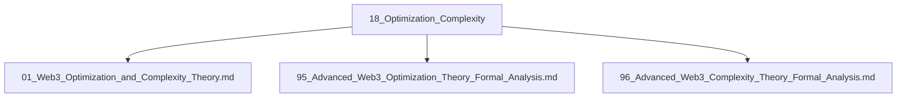

# 18_Optimization_Complexity 优化与复杂性主题分层导航

## 目录结构

- 优化理论
- 复杂性理论
- 高级/深度分析
- 归档（见 99_Recycle_Bin 或 00-备份）

## 主题导航

- 返回 [全局索引](../00_Index_and_Classification.md)
- 交叉引用：[知识图谱](../00_Knowledge_Graph.md)

## Mermaid知识图谱锚点

