# 01_Foundations - 基础理论类

## 目录说明

本目录包含Web3架构分析的基础理论文档，涵盖数学基础、系统科学基础、跨学科基础等核心理论。

## 子目录结构

### 数学和逻辑基础

- `01_Set_Theory_and_Logic/` - 集合论与逻辑
- `02_Algebraic_Structures/` - 代数结构
- `03_Cryptographic_Mathematics/` - 密码学数学
- `04_Probability_and_Statistics/` - 概率与统计学
- `06_Mathematics/` - 数学

### 理论基础

- `01_Formal_Theory/` - 形式化理论
- `05_Consensus_Theory/` - 共识理论
- `10_Type_Theory/` - 类型理论
- `11_System_Theory/` - 系统理论
- `12_Formal_Language_Theory/` - 形式语言理论
- `13_Formal_Science/` - 形式科学

### 技术基础

- `07_Control_Theory/` - 控制理论
- `08_Cryptography/` - 密码学
- `09_Distributed_Systems/` - 分布式系统

### 哲学基础

- `14_Philosophical/` - 哲学基础

### 其他

- `99_Recycle_Bin/` - 回收站

## 文档分类

### 数学基础

- 集合论文档保存在 `01_Set_Theory_and_Logic/` 子目录
- 代数结构文档保存在 `02_Algebraic_Structures/` 子目录
- 密码学数学文档保存在 `03_Cryptographic_Mathematics/` 子目录
- 概率统计文档保存在 `04_Probability_and_Statistics/` 子目录
- 一般数学文档保存在 `06_Mathematics/` 子目录

### 跨学科基础

- 认知科学与AI基础文档保存在 `13_Formal_Science/` 子目录
- 复杂系统理论文档保存在 `11_System_Theory/` 子目录
- Web3哲学理论文档保存在 `14_Philosophical/` 子目录

## 文件命名规范

1. 主题文件：`XX_主题名称.md`
2. 版本文件：`XX_主题名称_vX.md`
3. 综合文档：`XX_主题名称_Comprehensive.md`

## 注意事项

1. 新增文档请遵循上述命名规范
2. 将文档放入合适的子目录中
3. 涉及多个主题的文档，放入最主要的主题目录
4. 文档中引用其他文档时，使用相对路径

## 理论体系

本目录下的这些基础理论为Web3架构提供了坚实的数学和科学基础，包括：

- 形式化数学理论
- 系统科学理论
- 信息论与通信理论
- 复杂系统理论
- 量子计算理论
- 认知科学与AI理论

## 应用领域

- 区块链架构设计
- 共识机制分析
- 密码学应用
- 网络协议设计
- 智能合约形式化
- 分布式系统理论

# 01_Foundations 理论基础主题分层导航

## 目录结构
- 形式理论
- 代数结构
- 密码学数学
- 概率与统计
- 共识理论
- 数学基础
- 控制理论
- 密码学
- 分布式系统
- 类型理论
- 系统理论
- 形式语言
- 形式科学
- 哲学基础
- 归档（见 99_Recycle_Bin 或 00-备份）

## 主题导航
- 返回 [全局索引](../00_Index_and_Classification.md)
- 交叉引用：[知识图谱](../00_Knowledge_Graph.md)

## Mermaid知识图谱锚点

```mermaid
graph TD
  B[01_Foundations] --> B1[01_Formal_Theory]
  B --> B2[02_Algebraic_Structures]
  B --> B3[03_Cryptographic_Mathematics]
  B --> B4[04_Probability_and_Statistics]
  B --> B5[05_Consensus_Theory]
  B --> B6[06_Mathematics]
  B --> B7[07_Control_Theory]
  B --> B8[08_Cryptography]
  B --> B9[09_Distributed_Systems]
  B --> B10[10_Type_Theory]
  B --> B11[11_System_Theory]
  B --> B12[12_Formal_Language_Theory]
  B --> B13[13_Formal_Science]
  B --> B14[14_Philosophical]
  B --> B15[99_Recycle_Bin]
```

