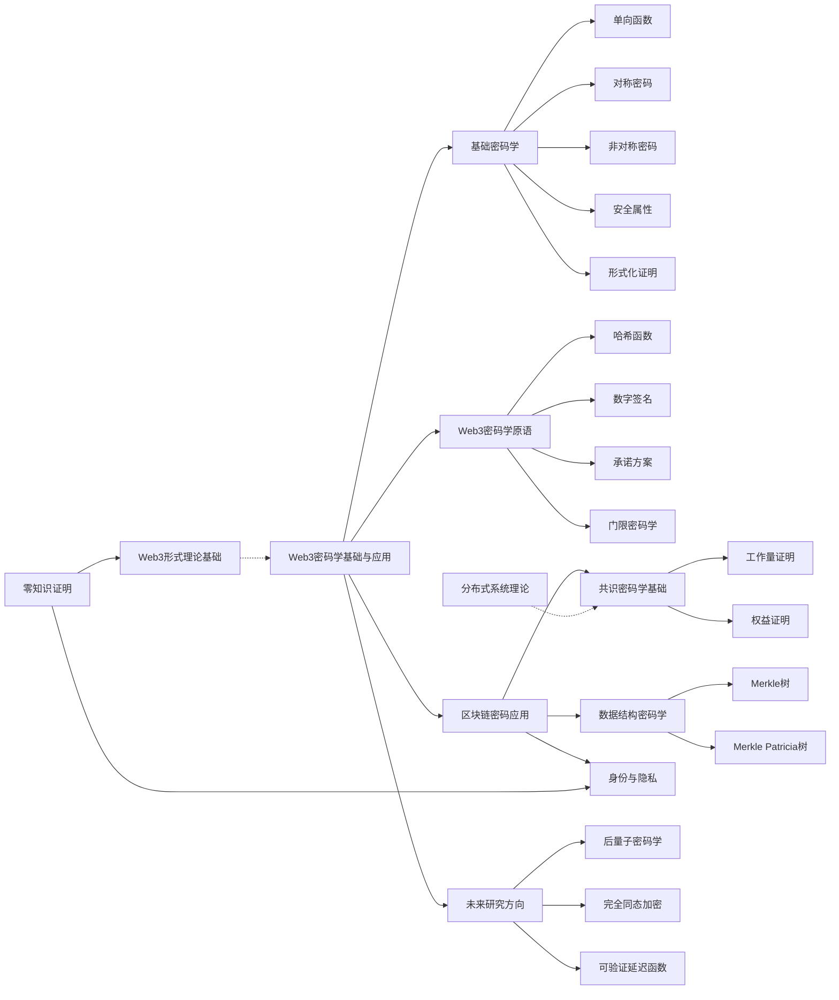
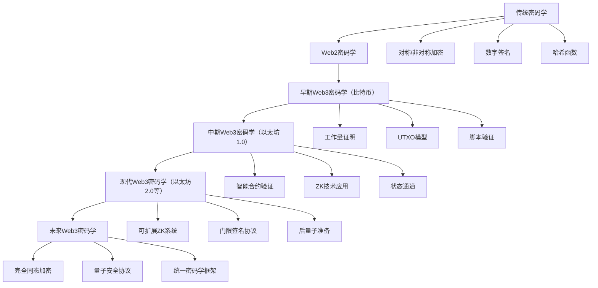
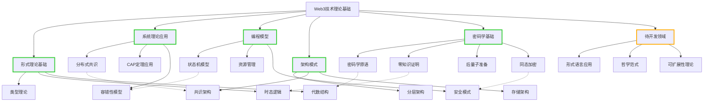

# Web3密码学基础与应用

## 目录

1. [引言](#1-引言)
2. [密码学基础](#2-密码学基础)
3. [Web3中的密码学基元](#3-web3中的密码学基元)
4. [区块链密码学应用](#4-区块链密码学应用)
5. [零知识证明](#5-零知识证明)
6. [密钥管理与安全](#6-密钥管理与安全)
7. [形式化验证与安全证明](#7-形式化验证与安全证明)
8. [未来发展与研究方向](#8-未来发展与研究方向)

## 1. 引言

Web3作为基于区块链的去中心化互联网范式，其安全性和隐私保护能力很大程度上依赖于现代密码学的理论与实践。本文系统分析Web3环境中密码学的核心概念、形式化基础和应用模式，并探讨其在保障去中心化系统安全方面的关键作用。

### 1.1 Web3密码学的独特挑战

Web3环境相比传统网络安全领域面临一系列独特挑战：

1. **完全开放性**：区块链系统代码和数据完全公开，无法依赖"通过隐藏实现安全"
2. **不可篡改性**：已部署的智能合约不可修改，密码学安全漏洞无法通过简单补丁修复
3. **去中心化信任**：缺乏中央权威，需要密码学机制确保分布式共识和验证
4. **巨额资产保护**：直接保护数字资产，安全失效可能导致不可逆的经济损失
5. **跨链交互**：不同区块链系统间的安全交互需要创新的密码学保证

### 1.2 从传统密码学到Web3密码学

**传统密码学关注点**：

- 信息保密性（加密）
- 完整性验证（哈希）
- 身份认证（数字签名）
- 密钥分发与管理

**Web3密码学扩展关注点**：

- 去中心化共识（工作量证明、权益证明）
- 隐私保护计算（零知识证明、同态加密）
- 分布式密钥管理（门限签名、安全多方计算）
- 可验证计算（简洁非交互式知识证明）
- 跨链安全互操作（哈希时间锁定合约、状态验证）

#### 1.2.1 密码学范式转变

传统密码学与Web3密码学的根本差异在于其应用环境和设计目标。传统密码学主要围绕中心化信任模型设计，而Web3密码学必须在无可信第三方的情况下建立安全保证。

**表1: 密码学范式对比**:

| 维度 | 传统密码学 | Web3密码学 |
|------|------------|------------|
| 信任模型 | 依赖可信第三方 | 无需信任（trustless） |
| 验证机制 | 中心化验证 | 分布式验证 |
| 计算透明度 | 封闭计算 | 公开透明计算 |
| 密钥管理 | 中心化KPI | 自主管理 |
| 安全挑战 | 主要防御外部攻击 | 同时防御系统内部攻击 |
| 隐私保护 | 隔离保护 | 交互中保护（在公开验证中保持隐私） |

#### 1.2.2 密码学创新与演进路径

Web3环境促进了一系列密码学创新，形成了从传统密码学到Web3密码学的演进路径：

1. **基础密码学原语重构**
   - 传统数字签名 → 可聚合签名（BLS）→ 门限签名
   - 标准哈希函数 → 抗ASIC哈希函数 → 可验证延迟函数(VDF)

2. **隐私保护技术演进**
   - 单纯加密 → 匿名交易 → 可编程隐私
   - 基本混币技术 → 零知识混合网络 → 完全隐私计算网络

3. **共识机制密码学演进**
   - 单一哈希挑战 → 工作量证明 → 可验证随机函数(VRF)
   - 中心化时间戳 → 链式时间证明 → 分布式时间证明

**图1: Web3密码学演进路径**:

#### 1.2.3 形式化区分

从理论上讲，Web3密码学可以通过以下形式化特征与传统密码学区分：

**定义 1.1**：传统密码学协议 $\Pi$ 通常可以表示为涉及参与者集合 $P$ 和可信第三方 $T$ 的交互式协议，其安全性依赖于 $T$ 的可信假设。

**定义 1.2**：Web3密码学协议 $\Pi'$ 可以表示为参与者集合 $P'$ 的交互式协议，其中没有可信的中心化第三方，安全性通过以下机制保障：

- 分布式共识机制 $C$
- 经济激励机制 $I$
- 加密学证明系统 $PS$

形式化表达：$Security(\Pi') = f(C, I, PS)$ 而不依赖于任何中心化可信实体 $T$。

## 2. 密码学基础

### 2.1 密码学原语分类

**定义 2.1**：密码学原语是构建密码协议的基本密码学技术和算法组件。

#### 2.1.1 单向函数

**定义 2.2**：函数 $f: X \rightarrow Y$ 是单向的，若对任意 $x \in X$，计算 $f(x)$ 是容易的，但给定 $y \in Y$，找到 $x$ 使得 $f(x) = y$ 在计算上是困难的。

**主要类型**：

- 哈希函数（如SHA-256、Keccak-256）
- 离散对数（在有限域或椭圆曲线上）
- 因子分解（RSA基础）

#### 2.1.2 对称密码

**定义 2.3**：对称密码系统是一个三元组 $(P, C, K)$ 和两个算法 $(E, D)$，其中：

- $P$ 是明文空间
- $C$ 是密文空间
- $K$ 是密钥空间
- $E: P \times K \rightarrow C$ 是加密算法
- $D: C \times K \rightarrow P$ 是解密算法
- 对所有 $p \in P$ 和 $k \in K$，有 $D(E(p, k), k) = p$

**主要类型**：

- 分组密码（如AES、ChaCha20）
- 流密码（如Salsa20）
- 消息认证码（如HMAC）

#### 2.1.3 非对称密码

**定义 2.4**：公钥密码系统是一个包含以下组件的系统：

- 密钥生成算法 $\text{KeyGen}$，生成密钥对 $(pk, sk)$
- 加密算法 $E: P \times PK \rightarrow C$
- 解密算法 $D: C \times SK \rightarrow P$
- 对所有明文 $p$ 和密钥对 $(pk, sk)$，有 $D(E(p, pk), sk) = p$

**主要类型**：

- 基于整数因子分解（RSA）
- 基于离散对数（ElGamal）
- 基于椭圆曲线（ECDSA、EdDSA）
- 基于格密码（后量子安全）

### 2.2 密码学安全属性

#### 2.2.1 安全定义

**定义 2.5**：密码学方案的安全性通常通过以下形式化模型定义：

- **计算安全性**：对手在多项式时间内无法破解系统
- **信息论安全性**：无论对手计算能力如何，系统都无法被破解
- **不可区分性**：密文与随机字符串在计算上无法区分
- **语义安全性**：密文不泄露明文的任何部分信息

#### 2.2.2 攻击模型

**定义 2.6**：密码学攻击模型描述了对手能力和目标的形式化框架：

- **被动攻击**：仅观察通信（窃听）
- **主动攻击**：修改、插入、删除消息
- **自适应攻击**：基于先前攻击结果调整策略
- **选择明文攻击**：可以获得任意明文的密文
- **选择密文攻击**：可以解密（除目标外的）任意密文

### 2.3 形式化证明方法

**定义 2.7**：密码学安全证明是一种形式化论证，证明密码方案在特定安全模型下满足声称的安全属性。

**主要方法**：

- **归约证明**：将方案安全性归约到已知困难问题
- **模拟证明**：证明真实系统与理想系统不可区分
- **博弈转换**：通过一系列安全游戏的转换证明安全性
- **通用可组合性**：在任意环境中保持安全性

## 3. Web3中的密码学基元

### 3.1 哈希函数

**定义 3.1**：哈希函数 $H: \{0,1\}^* \rightarrow \{0,1\}^n$ 在Web3中应满足：

- **抗碰撞性**：找到 $x \neq y$ 使得 $H(x) = H(y)$ 在计算上不可行
- **抗原像性**：给定 $h$，找到 $x$ 使得 $H(x) = h$ 在计算上不可行
- **抗第二原像性**：给定 $x$，找到 $y \neq x$ 使得 $H(y) = H(x)$ 在计算上不可行

**Web3应用**：

- 区块链中的区块链接（区块头包含前一区块的哈希）
- Merkle树构建（交易和状态验证）
- 地址生成（从公钥导出地址）
- 挖矿难题构造（工作量证明）
- 数据完整性验证

### 3.2 数字签名

**定义 3.2**：数字签名方案是一个三元组算法 $(KeyGen, Sign, Verify)$：

- $KeyGen()$ 生成密钥对 $(pk, sk)$
- $Sign(sk, m)$ 对消息 $m$ 使用私钥 $sk$ 生成签名 $\sigma$
- $Verify(pk, m, \sigma)$ 使用公钥 $pk$ 验证消息 $m$ 上的签名 $\sigma$

**安全需求**：

- **正确性**：合法签名总能通过验证
- **不可伪造性**：无私钥无法生成有效签名
- **不可否认性**：签名者无法否认其签名

**Web3应用**：

- 交易验证与授权
- 智能合约调用授权
- 链下消息验证（预言机、侧链）
- 分布式身份验证

### 3.3 承诺方案

**定义 3.3**：承诺方案是一对算法 $(Commit, Open)$：

- $Commit(m, r) = c$ 生成对消息 $m$ 的承诺 $c$，使用随机数 $r$
- $Open(c, m, r) = \{0,1\}$ 验证承诺 $c$ 是否对应消息 $m$ 和随机数 $r$

**安全属性**：

- **隐藏性**：承诺不泄露被承诺值
- **绑定性**：无法更改已承诺的值

**Web3应用**：

- 链上随机性生成
- 拍卖和投票机制
- 零知识证明的组件
- 状态通道协议
- 延迟揭示机制

### 3.4 门限密码学

**定义 3.4**：$(t,n)$门限方案将密码学操作（如签名）分割为 $n$ 份，其中任意 $t$ 份可完成操作，少于 $t$ 份则无法完成。

**形式化表示**：

- 密钥生成：$(sk_1,\ldots,sk_n,pk) \leftarrow KeyGen(1^{\lambda},t,n)$
- 部分计算：$\sigma_i \leftarrow PartialSign(sk_i, m)$ 对于 $i \in \{1,\ldots,n\}$
- 合并计算：$\sigma \leftarrow Combine(\{\sigma_{i_1},\ldots,\sigma_{i_t}\})$ 其中 $\{i_1,\ldots,i_t\} \subseteq \{1,\ldots,n\}$ 且 $|\{i_1,\ldots,i_t\}| \geq t$

**Web3应用**：

- 多签钱包实现
- 验证者集合共识
- 安全去中心化预言机
- 链上随机数生成
- DAO治理机制

## 4. 区块链密码学应用

### 4.1 共识机制的密码学基础

#### 4.1.1 工作量证明(PoW)

**定义 4.1**：工作量证明是找到一个值 $nonce$，使得对于给定数据 $data$ 和难度目标 $target$，满足：
$H(data || nonce) < target$

**安全性分析**：

- **计算困难性**：找到有效nonce需要平均 $2^{d}$ 次哈希计算，其中 $d$ 是难度位数
- **验证易用性**：验证仅需一次哈希操作
- **无法优化性**：除穷举外无已知算法可高效求解
- **可调整性**：通过修改target调整难度

#### 4.1.2 权益证明(PoS)

**定义 4.2**：权益证明系统中，验证者被选择创建区块的概率与其质押代币成正比：
$P(i \text{ 被选择}) = \frac{stake_i}{\sum_{j} stake_j}$

**密码学机制**：

- **可验证随机函数(VRF)**：确保验证者选择的公平性
- **时间戳证明**：防止长程攻击
- **罚没机制**：对恶意行为的密码学证明和惩罚

### 4.2 区块链数据结构的密码学保证

#### 4.2.1 Merkle树

**定义 4.3**：Merkle树是一种树形数据结构，其中：

- 叶节点是数据块的哈希值
- 非叶节点是其子节点哈希值的哈希
- 根节点提供整个数据集的密码学摘要

**形式化表示**：对于数据块 $D = \{d_1, d_2, \ldots, d_n\}$：

- 叶节点：$L_i = H(d_i)$ 对于 $i \in \{1,\ldots,n\}$
- 内部节点：$N_{i,j} = H(N_{i,m} || N_{m+1,j})$ 其中 $m = \lfloor (i+j)/2 \rfloor$
- Merkle根：$Root = N_{1,n}$

**Web3应用**：

- 轻客户端验证
- 状态证明
- 包含证明（SPV）
- 数据可用性检查

#### 4.2.2 Merkle Patricia树

**定义 4.4**：Merkle Patricia树结合了Patricia前缀树和Merkle树的特性：

- 节点包含前缀键
- 支持高效的键值查找
- 提供密码学完整性验证

**以太坊应用**：

- 状态树：存储账户状态
- 存储树：每个合约的存储数据
- 交易树：区块中的交易
- 收据树：交易执行结果

### 4.3 公钥基础设施与身份

#### 4.3.1 地址生成

**定义 4.5**：区块链地址通常通过以下密码学变换生成：
$Address = f(H(PublicKey))$

**具体实现**：

- 比特币：$Address = Base58Check(RIPEMD160(SHA256(PubKey)))$
- 以太坊：$Address = last20Bytes(Keccak256(PubKey))$

#### 4.3.2 去中心化身份(DID)

**定义 4.6**：去中心化身份标识符是自主控制的密码学身份，独立于中央颁发机构。

**形式化表示**：
$did:method:methodSpecificId$

**密码学保证**：

- 自主权：通过密钥对控制
- 可验证性：通过数字签名验证
- 可解析性：通过区块链查询元数据

## 5. 零知识证明

### 5.1 基本概念

**定义 5.1**：零知识证明系统是一个交互式协议，允许证明者向验证者证明一个命题的真实性，而不泄露除该命题真实性以外的任何信息。

**形式化表示**：对于语言 $L$ 和关系 $R$，零知识证明系统满足：

- **完备性**：如果 $(x, w) \in R$，诚实证明者总能说服诚实验证者接受
- **可靠性**：如果 $x \notin L$，任何恶意证明者都无法使诚实验证者接受（除了极小概率）
- **零知识性**：验证者除了 $x \in L$ 外获取不到任何额外信息

### 5.2 主要类型与构造

#### 5.2.1 交互式零知识证明

**协议结构**：

1. **承诺阶段**：证明者发送承诺
2. **挑战阶段**：验证者发送随机挑战
3. **响应阶段**：证明者基于承诺和挑战构造响应
4. **验证阶段**：验证者检查响应是否有效

**典型例子**：Schnorr协议、图同构证明

#### 5.2.2 非交互式零知识证明(NIZK)

**定义 5.2**：NIZK是一种不需要交互的零知识证明，通常通过以下转换构造：

- Fiat-Shamir变换：使用哈希函数替代验证者的随机挑战
- 通用参考串模型：使用可信设置生成公共参数

**主要类型**：

- **zk-SNARK**：简洁的非交互式零知识论证
- **zk-STARK**：可扩展、透明的零知识论证
- **Bulletproofs**：无需可信设置的简洁证明

### 5.3 Web3中的应用

#### 5.3.1 隐私保护交易

**定义 5.3**：隐私保护交易使用零知识证明隐藏交易细节，同时保证交易有效性。

**Zcash示例**：

- **屏蔽交易**：隐藏发送方、接收方和金额
- **加密输出**：使用同态加密保护余额
- **零知识证明**：证明交易遵循协议规则

**其他隐私币实现比较**：

| 项目 | 技术基础 | 隐私保证 | 特点 |
|------|---------|---------|------|
| Zcash | zk-SNARKs | 强隐私，选择性透明度 | 需要受信任的初始设置 |
| Monero | 环签名 + RingCT | 强隐私，交易混淆 | 无需可信设置，但证明较大 |
| Grin/MimbleWimble | 保密交易 + CoinJoin | 交易数据极简，强扩展性 | 交互式交易协议 |
| Tornado Cash | zk-SNARKs + 混币池 | 固定面额匿名性 | 以太坊上的隐私增强应用 |

#### 5.3.2 可扩展性解决方案

**定义 5.4**：ZK-Rollup是一种第2层扩展解决方案，使用零知识证明验证批量交易的有效性。

**工作原理**：

1. 多个交易在链下批处理
2. 生成代表这些交易有效性的简洁证明
3. 将证明和状态根发布到主链
4. 主链仅验证证明，而非每笔交易

**ZK-Rollup形式化表示**：

对于一组交易 $T = \{t_1, t_2, ..., t_n\}$，由当前状态 $S$ 开始执行，得到新状态 $S'$：

- 状态转换函数: $S' = F(S, T)$
- 证明生成: $\pi = Prove(F, S, T, S')$
- 链上验证: $Verify(F, S, S', \pi) = 1$ 当且仅当 $S' = F(S, T)$

**主要ZK-Rollup实现对比**：

| 实现 | 证明系统 | 数据可用性 | 性能特点 | EVM兼容性 |
|------|---------|-----------|---------|----------|
| zkSync | PLONK | 链上 | 高效证明生成，快速确定性 | 完全EVM兼容 |
| StarkNet | STARKs | 链上 | 可扩展证明，后量子安全 | Cairo语言，部分兼容 |
| Hermez | Groth16 | 链上 | 高效简洁证明 | 支付交易专注 |
| Polygon Zero | PLONK | 链上 | 递归证明组合 | 完全EVM兼容 |

**与其他扩展方案对比**：

| 扩展方案 | 安全模型 | 数据可用性 | 吞吐量提升 | 确定性时间 |
|---------|---------|-----------|-----------|-----------|
| ZK-Rollup | 继承L1安全性 | 链上 | ~100-500x | 块级（含证明时间） |
| Optimistic Rollup | 挑战期欺诈证明 | 链上 | ~50-100x | 7-14天挑战期 |
| Validium | ZK证明，链下数据 | 链下 | ~1000x | 块级，但有数据可用性风险 |
| 侧链 | 独立验证器 | 链下 | 取决于侧链 | 取决于侧链共识 |

#### 5.3.3 隐私计算

**应用场景**：

- **隐私投票**：证明投票计数正确而不泄露个人投票
- **匿名凭证**：证明资格而不泄露身份
- **隐私身份验证**：证明满足条件而不泄露具体属性
- **保密智能合约**：执行计算而不泄露输入

**隐私身份实现案例**：

iden3协议使用zk-SNARK允许用户证明以下属性而不泄露具体数据：

1. 年龄大于指定阈值
2. 地理位置位于特定区域
3. 信用评分高于特定值
4. 资产持有量满足要求

**形式化表示**：对于用户属性集 $A = \{a_1, a_2, ..., a_n\}$ 和属性谓词 $P(A)$，零知识属性证明允许：

- 用户生成证明 $\pi = Prove(A, P)$
- 验证者验证 $Verify(\pi, P) = 1$ 当且仅当 $P(A) = true$
- 验证过程中不泄露 $A$ 中的任何具体值

#### 5.3.4 跨链互操作与证明

零知识证明能够有效实现区块链互操作性，特别是状态验证：

**应用方式**：

1. **轻客户端验证**：通过简洁证明验证其他链的状态，避免同步整个区块链
2. **跨链状态转移**：通过零知识证明验证资产已在源链锁定或销毁
3. **通用消息传递**：用零知识证明验证消息的有效性和来源

**具体应用案例**：

- **zkBridge**：使用零知识证明实现跨链桥，证明源链上特定状态转换的有效性
- **Succinct Labs**：开发以太坊上的轻客户端验证，使用零知识证明验证其他链的状态根
- **zkPoR**：利用零知识证明实现数据可用性验证，支持跨链通信时的数据完整性

**安全优势**：与传统多签名桥相比，基于零知识证明的跨链方案无需依赖可信第三方验证者，降低了桥合约被黑客攻击的风险。

## 6. 密钥管理与安全

### 6.1 密钥派生

**定义 6.1**：密钥派生函数(KDF)从主密钥或助记词生成多个派生密钥：
$k_i = KDF(master\_key, i, metadata)$

**HD钱包**：

- 使用分层确定性算法BIP32
- 从种子派生主密钥
- 通过路径派生子密钥

### 6.2 多重签名与门限签名

**定义 6.2**：$m-of-n$ 多重签名要求 $n$ 个密钥中的至少 $m$ 个签名来授权交易。

**实现方式**：

- **脚本方式**：使用区块链脚本语言（如Bitcoin Script）
- **智能合约**：通过合约逻辑实现
- **密码学方式**：使用门限签名算法（如Schnorr门限签名）

### 6.3 安全多方计算(MPC)

**定义 6.3**：安全多方计算允许多方共同计算函数而不泄露各自输入。

**形式化表示**：对于函数 $f$ 和输入 $x_1, x_2, ..., x_n$，计算 $y = f(x_1, x_2, ..., x_n)$ 使得：

- 每方只知道自己的输入 $x_i$ 和输出 $y$
- 不泄露其他方的输入信息

**Web3应用**：

- 分布式密钥生成
- 隐私保护预言机
- 跨链验证
- 机密交易处理

## 7. 形式化验证与安全证明

### 7.1 形式化安全模型

#### 7.1.1 通用可组合性框架

**定义 7.1**：通用可组合性(UC)框架定义了协议在任意环境中的安全性：

- 将真实协议与理想功能比较
- 证明二者在任何环境中不可区分
- 保证在与其他协议组合时保持安全

#### 7.1.2 博弈论安全模型

**定义 7.2**：博弈论安全模型通过经济理性分析协议的安全性与稳定性：

- **激励相容**：遵守协议是参与者的最优策略
- **纳什均衡**：没有参与者有动机单方面改变策略
- **防共谋**：群体无法通过合作获得额外收益

### 7.2 密码协议验证

#### 7.2.1 自动化证明工具

**主要方法**：

- **形式验证**：使用定理证明助手（如Coq、Isabelle/HOL）
- **符号模型**：使用ProVerif、Tamarin等协议验证器
- **计算模型**：使用CryptoVerif等工具
- **智能合约验证**：使用专用静态分析工具

#### 7.2.2 重要安全属性

**形式化验证的安全属性**：

- **协议终止性**：参与诚实的各方最终完成协议
- **安全性**：敌手无法破坏系统安全目标
- **正确性**：协议执行产生预期结果
- **隐私性**：协议执行不泄露超出规范的信息

### 7.3 密码学在形式验证中的应用

**实施技术**：

- **符号化密码学**：将密码学原语抽象为符号操作
- **计算型密码学**：基于计算复杂性假设
- **可观察等价性**：基于外部观察者不可区分性

**智能合约验证应用**：

- **状态一致性**：验证状态转换的正确性
- **资产守恒**：验证资产不会无故创建或消失
- **访问控制**：验证权限管理的正确实现
- **不变性**：验证系统关键属性在所有状态下保持

## 8. 未来发展与研究方向

### 8.1 后量子密码学

**定义 8.1**：后量子密码学研究在量子计算存在的情况下保持安全的密码学算法。

**主要方向**：

- **格密码学**：基于格中的难题
- **基于多变量的密码学**：基于多变量方程求解难度
- **基于哈希的签名**：结合默克尔树和一次性签名
- **基于同态加密**：保持隐私的计算

**Web3准备**：

- **抗量子地址**：使用后量子安全的地址生成机制
- **签名转换**：现有签名向后量子签名的平滑过渡
- **智能合约迁移**：更新验证机制兼容后量子算法

**具体实施挑战与解决方案**：

1. **密钥大小和计算开销**
   - **挑战**：后量子密钥通常比传统密钥大，计算开销也更大
   - **解决方案**：开发针对区块链环境的优化算法，例如Falcon和SPHINCS+的优化变体

2. **迁移策略**
   - **混合签名方案**：结合传统和后量子签名，如ECDSA+XMSS组合
   - **双重地址**：在现有地址系统旁并行引入抗量子地址系统
   - **状态转换协议**：自动将资产从脆弱地址迁移到抗量子地址

3. **研究前沿**
   - **格基密码参数优化**：为区块链应用设计最小可行安全参数
   - **基于同态加密的量子安全智能合约**：保护隐私的同时抵御量子攻击
   - **量子安全VDF**：开发抗量子计算的可验证延迟函数

**量子安全区块链案例**：

| 项目 | 后量子策略 | 实现状态 | 特点 |
|------|-----------|---------|------|
| QRL | XMSS签名 | 已部署 | 第一个全量子安全区块链 |
| IOTA | WOTS签名 | 部分部署 | 物联网焦点，逐步迁移 |
| Ethereum | 研究阶段 | 规划中 | EIP提案，兼容性研究 |
| Algorand | Falcon | 研究阶段 | 状态证明+后量子签名 |

### 8.2 完全同态加密

**定义 8.2**：完全同态加密(FHE)允许在加密数据上执行任意计算，而无需解密：

- 对于加密数据 $E(a), E(b)$，可计算 $E(a \circ b)$
- 操作 $\circ$ 可以是任意函数

**Web3潜力**：

- **隐私智能合约**：处理加密输入而不泄露数据
- **保密投票**：在加密票上直接计算结果
- **隐私市场**：匹配加密订单而不暴露价格

**FHE在Web3中的应用挑战**：

1. **性能问题**
   - **当前状态**：FHE运算比普通运算慢数千到数百万倍
   - **优化方向**：
     - 批处理同态操作（SIMD风格）
     - 硬件加速（专用ASIC或FPGA）
     - 混合加密方案（部分计算加密，部分明文）

2. **密文膨胀**
   - **问题**：加密数据通常比原始数据大很多
   - **缓解方案**：
     - 压缩技术
     - 部分同态加密
     - 优化参数选择

3. **验证与透明性**
   - **挑战**：如何验证加密计算正确性
   - **解决方案**：将FHE与零知识证明结合

**FHE在区块链上的实现路径**：

1. **第一阶段**：链下FHE计算+链上验证
   - FHE计算在链下执行
   - 使用零知识证明验证计算正确性
   - 结果在链上验证并使用

2. **第二阶段**：限制性链上FHE
   - 实现特定功能的高效FHE原语
   - 例如：加密投票、盲拍卖、隐私令牌转账

3. **第三阶段**：通用FHE智能合约
   - 完全支持FHE操作的虚拟机
   - 同态智能合约编程语言
   - 隐私保护的状态和交易

**案例研究**：

- **Zama.ai**：开发fhEVM，将FHE引入以太坊虚拟机
- **Aztec Network**：构建隐私智能合约平台，利用FHE和ZKP
- **Inco Network**：开发优化的FHE原语，适用于特定区块链场景

### 8.3 可验证延迟函数

**定义 8.3**：可验证延迟函数(VDF)是一个需要一定时间顺序计算的函数，但结果可以快速验证。

**形式化表示**：三元组 $(Setup, Eval, Verify)$：

- $pp \leftarrow Setup(1^\lambda, T)$：生成公共参数
- $y, \pi \leftarrow Eval(pp, x)$：评估函数，生成结果和证明
- $\{0,1\} \leftarrow Verify(pp, x, y, \pi)$：验证结果

**Web3应用**：

- **可公平随机性**：生成无法预测或操纵的随机值
- **防止前置运行攻击**：减轻MEV问题
- **时间锁加密**：创建只能在特定时间后解密的数据

**VDF技术详情与发展路线**：

1. **主要构造**
   - **基于重复平方**：如Wesolowski的VDF
   - **基于递归哈希**：如VeeDo
   - **基于同构组构造**：更高效验证，较新研究方向

2. **硬件实现**
   - **ASIC设计**：为VDF优化的专用硬件
   - **多方评估**：分布式VDF计算，提高安全性
   - **GPU优化**：小规模验证优化

3. **协议集成**
   - **随机信标**：如以太坊2.0中的RANDAO+VDF
   - **时间锁加密协议**：将VDF与加密方案结合
   - **防MEV机制**：交易排序的延迟公开

**VDF在区块链中的应用案例**：

| 项目 | VDF用途 | 实现状态 | 特点 |
|------|--------|---------|------|
| Ethereum 2.0 | 随机性信标 | 研发中 | RANDAO+VDF组合 |
| Chia | 时空证明 | 已部署 | 存储型共识算法 |
| League of Entropy | 公共随机性 | 运行中 | 多方随机信标 |
| Filecoin | 时空证明 | 已部署 | 存储证明组件 |

### 8.4 隐私增强技术整合

**研究方向**：

- **零知识证明优化**：提高证明生成速度和减小证明大小
- **可组合性框架**：安全组合不同的隐私技术
- **隐私系统与监管合规性平衡**：开发有选择性披露机制
- **用户友好的隐私工具**：降低采用门槛

**隐私技术融合路线图**：

1. **第一阶段：单一技术应用**
   - 零知识证明交易（如Zcash）
   - 混币服务（如Tornado Cash）
   - 保密合约（如Secret Network）

2. **第二阶段：多技术协同**
   - ZKP + FHE：隐私数据上的可验证计算
   - ZKP + TEE：可信执行环境+密码学证明
   - MPC + ZKP：多方计算结果的零知识验证

3. **第三阶段：系统性隐私框架**
   - 隐私保护的Web3标准
   - 模块化隐私组件
   - 隐私与合规的平衡机制

**具体研究项目**：

- **递归证明系统**：通过证明压缩提高效率
- **通用电路优化**：减少零知识证明中的复杂度
- **新密码学假设**：探索超椭圆曲线等后量子安全基础
- **区块链特定隐私原语**：针对链上数据结构优化的证明系统

### 8.5 综合发展愿景

未来Web3密码学的发展将融合以上各方向，形成系统化的技术栈：

1. **基础层**：后量子安全的密码学原语
2. **协议层**：高效零知识证明和同态加密系统
3. **应用层**：隐私保护智能合约和去中心化身份
4. **用户层**：简化的密钥管理和隐私控制接口

这一技术栈将支持全新的隐私保护应用范式，同时保持区块链的透明性和不可篡改性的核心价值。密码学创新将继续是Web3生态系统发展的关键驱动力，推动区块链从价值存储和转移工具向全功能的安全计算平台演进。

## 参考文献

1. Antonopoulos, A. M. (2017). Mastering Bitcoin: Programming the Open Blockchain. O'Reilly Media.
2. Buterin, V. (2014). A Next-Generation Smart Contract and Decentralized Application Platform. Ethereum White Paper.
3. Goldreich, O. (2001). Foundations of Cryptography: Basic Tools. Cambridge University Press.
4. Goldwasser, S., & Micali, S. (1984). Probabilistic Encryption. Journal of Computer and System Sciences, 28(2), 270-299.
5. Ben-Sasson, E., et al. (2014). Zerocash: Decentralized Anonymous Payments from Bitcoin. IEEE Symposium on Security and Privacy.
6. Boneh, D., & Shoup, V. (2020). A Graduate Course in Applied Cryptography.
7. Bellare, M., & Rogaway, P. (1993). Random Oracles are Practical: A Paradigm for Designing Efficient Protocols. ACM Conference on Computer and Communications Security.
8. Katz, J., & Lindell, Y. (2014). Introduction to Modern Cryptography. CRC Press.
