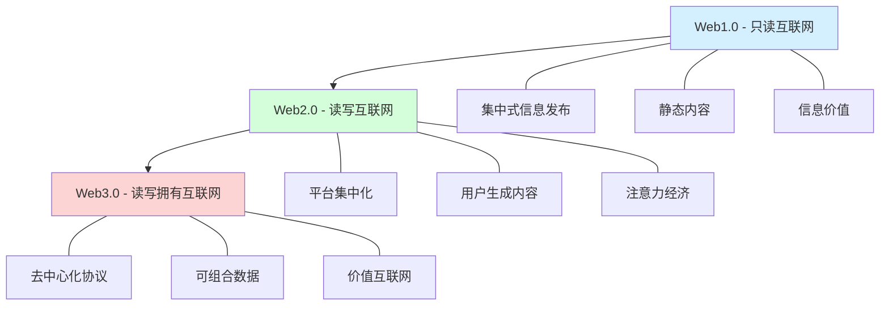

# Web3范式转变：形式化分析

## 目录

- [Web3范式转变：形式化分析](#web3范式转变形式化分析)
  - [目录](#目录)
  - [1. 引言](#1-引言)
    - [1.1 研究背景与意义](#11-研究背景与意义)
    - [1.2 Web范式演变概述](#12-web范式演变概述)
  - [2. 范式转变的形式化模型](#2-范式转变的形式化模型)
    - [2.1 范式定义](#21-范式定义)
    - [2.2 范式转变的形式化表示](#22-范式转变的形式化表示)
    - [2.3 Web范式比较框架](#23-web范式比较框架)
  - [3. Web3基本理念的形式化表征](#3-web3基本理念的形式化表征)
    - [3.1 去中心化概念的形式化](#31-去中心化概念的形式化)
    - [3.2 密码学赋能自主权](#32-密码学赋能自主权)
    - [3.3 可组合性原则](#33-可组合性原则)
  - [4. 去中心化系统的数学模型](#4-去中心化系统的数学模型)
    - [4.1 基于图论的网络模型](#41-基于图论的网络模型)
    - [4.2 共识机制的博弈论模型](#42-共识机制的博弈论模型)
    - [4.3 Token经济模型](#43-token经济模型)
  - [5. Web3社会经济影响分析](#5-web3社会经济影响分析)
    - [5.1 所有权经济的形式化模型](#51-所有权经济的形式化模型)
    - [5.2 协作模式的数学分析](#52-协作模式的数学分析)
    - [5.3 信任转变的形式化表示](#53-信任转变的形式化表示)
  - [6. 范式转变的理论验证](#6-范式转变的理论验证)
    - [6.1 Web3价值函数](#61-web3价值函数)
    - [6.2 实证验证指标](#62-实证验证指标)
  - [7. 哲学维度的形式化观点](#7-哲学维度的形式化观点)
    - [7.1 存在论视角](#71-存在论视角)
    - [7.2 认识论视角](#72-认识论视角)
    - [7.3 价值论视角](#73-价值论视角)
  - [8. Web3作为技术哲学范例](#8-web3作为技术哲学范例)
    - [8.1 技术决定论的反思](#81-技术决定论的反思)
    - [8.2 去中心化作为哲学命题](#82-去中心化作为哲学命题)
    - [8.3 数字实在论](#83-数字实在论)
  - [9. 结论与未来展望](#9-结论与未来展望)
    - [9.1 总结](#91-总结)
    - [9.2 未来研究方向](#92-未来研究方向)
    - [9.3 实践意义](#93-实践意义)
  - [参考文献](#参考文献)

## 1. 引言

Web3代表了互联网范式的重大转变，从集中式信息系统向去中心化价值网络的转变。
本文提供了这一范式转变的严格形式化分析，探讨其理论基础、数学模型、社会经济影响和哲学内涵。
这种范式转变不仅仅是技术层面的，还涉及社会组织、经济结构、权力分配和价值创造的根本性变革。

### 1.1 研究背景与意义

Web1.0作为"只读互联网"，提供了信息获取的能力；
Web2.0作为"读写互联网"，创造了互动和共享的平台；
而Web3.0作为"读写拥有互联网"，正在建立基于区块链的去中心化网络，实现价值传输和数字所有权。
这一演进代表着互联网技术与社会形态协同发展的典范。

### 1.2 Web范式演变概述

## 2. 范式转变的形式化模型

### 2.1 范式定义

**定义 2.1** (范式): 范式 $\mathcal{P}$ 是一个五元组 $\mathcal{P} = (C, M, T, V, I)$，其中：

- $C$ 是核心概念集合
- $M$ 是方法论框架
- $T$ 是技术实现集合
- $V$ 是价值系统
- $I$ 是制度安排集合

**定义 2.2** (Web范式): Web范式是一个特定的互联网技术-社会范式，可表示为 $\mathcal{W} = (A, D, G, E, S)$，其中：

- $A$ 是架构模型 (Architecture)
- $D$ 是数据模型 (Data)
- $G$ 是治理模式 (Governance)
- $E$ 是经济模式 (Economics)
- $S$ 是社会结构 (Social Structure)

### 2.2 范式转变的形式化表示

**定义 2.3** (范式转变): 范式转变是从范式 $\mathcal{P}_1$ 到范式 $\mathcal{P}_2$ 的映射 $\mathcal{T}: \mathcal{P}_1 \rightarrow \mathcal{P}_2$，满足以下条件：

1. 核心概念转变：$\mathcal{T}(C_1) = C_2$，且 $|C_1 \cap C_2| < |C_2 \setminus C_1|$
2. 方法论转变：$\mathcal{T}(M_1) = M_2$，且 $M_1$ 与 $M_2$ 存在根本差异
3. 技术实现转变：$\mathcal{T}(T_1) = T_2$，且 $T_2$ 包含新的基础技术
4. 价值系统转变：$\mathcal{T}(V_1) = V_2$，且 $V_2$ 重构了价值分配机制
5. 制度安排转变：$\mathcal{T}(I_1) = I_2$，且 $I_2$ 创建了新的规则体系

**定理 2.1** (Web3范式转变): Web1.0到Web3.0的转变满足范式转变的形式化定义。

**证明**：

1. 核心概念转变：Web1.0核心概念为"信息发布"，Web3.0为"价值网络"和"去中心化"，满足 $|C_1 \cap C_2| < |C_2 \setminus C_1|$
2. 方法论转变：Web1.0采用中心化信息发布方法，Web3.0采用去中心化共识方法
3. 技术实现转变：Web3.0引入了区块链、智能合约等新基础技术
4. 价值系统转变：Web3.0重构了数据所有权和价值分配机制
5. 制度安排转变：Web3.0创建了基于代码的新型治理体系和激励机制

因此，Web1.0到Web3.0的转变满足范式转变的所有条件。■

### 2.3 Web范式比较框架

以下表格展示了Web1.0, Web2.0和Web3.0范式的关键差异：

| 范式维度 | Web1.0 | Web2.0 | Web3.0 |
|---------|-------|--------|--------|
| 架构模型 | 静态发布服务器 | 交互式平台 | 去中心化协议 |
| 数据模型 | 静态内容、中心存储 | 用户生成内容、平台存储 | 链上数据、分布式存储 |
| 治理模式 | 技术标准组织 | 平台规则 | 去中心化自治组织 |
| 经济模式 | 内容付费 | 广告和注意力经济 | 代币经济和价值捕获 |
| 社会结构 | 信息消费者/提供者 | 社交网络用户 | 价值网络参与者 |
| 信任机制 | 机构信任 | 平台信任 | 密码学信任 |
| 所有权模型 | 平台所有 | 平台许可使用 | 用户所有 |

## 3. Web3基本理念的形式化表征

### 3.1 去中心化概念的形式化

**定义 3.1** (去中心化系统): 去中心化系统是一个三元组 $\mathcal{D} = (N, P, C)$，其中：

- $N$ 是节点集合，$N = \{n_1, n_2, ..., n_k\}$
- $P$ 是协议规则集合，$P = \{p_1, p_2, ..., p_m\}$
- $C$ 是共识机制，$C: 2^N \times P \rightarrow \{0,1\}$

**定义 3.2** (去中心化度量): 系统 $\mathcal{D}$ 的去中心化程度 $\delta(\mathcal{D})$ 定义为：

$$\delta(\mathcal{D}) = 1 - \frac{1}{|N|} \sum_{i=1}^{|N|} \left(\frac{power(n_i)}{\sum_{j=1}^{|N|} power(n_j)}\right)^2$$

其中 $power(n_i)$ 表示节点 $n_i$ 的影响力。

**定理 3.1** (去中心化三角悖论): 对于任何去中心化系统 $\mathcal{D}$，不可能同时最大化去中心化程度 $\delta(\mathcal{D})$、安全性 $\sigma(\mathcal{D})$ 和效率 $\epsilon(\mathcal{D})$。

**证明**：
假设存在系统 $\mathcal{D}^*$ 同时最大化三个指标。

1. 最大效率要求最小化共识开销，即减少参与节点或简化共识
2. 但最大安全性要求足够多的独立验证节点和严格共识
3. 最大去中心化要求最大化参与节点数量和最小化单个节点影响力

这三个要求相互矛盾，因此不存在同时满足三者的系统 $\mathcal{D}^*$。■

### 3.2 密码学赋能自主权

**定义 3.3** (密码学自主权): 在Web3中，密码学自主权是指通过密码学原语实现的不依赖第三方的资产控制和身份验证能力，可形式化表示为：

$$\forall a \in A, \forall n \in N: Control(a) = Owner(sk_a)$$

其中 $A$ 是资产集合，$N$ 是网络参与者，$sk_a$ 是控制资产 $a$ 的私钥，$Owner$ 是私钥持有者函数。

### 3.3 可组合性原则

**定义 3.4** (可组合性): Web3系统的可组合性是指系统组件可以像乐高积木一样自由组合，创造新的应用和价值。形式化定义为，对于组件集合 $\{C_1, C_2, ..., C_n\}$，存在组合函数 $\Phi$，使得：

$$\Phi(C_i, C_j) = C_{new}$$

其中 $C_{new}$ 是新组件，且满足：

1. 功能组合：$Func(C_{new}) = Func(C_i) \circ Func(C_j)$
2. 价值加成：$Value(C_{new}) > Value(C_i) + Value(C_j)$

**定理 3.2** (可组合性增长): 在具有 $n$ 个基本组件的Web3系统中，可能的组合数量以指数级增长，潜在应用数量为 $O(2^n)$。

**证明**：
对于 $n$ 个组件，每个组件有"使用"和"不使用"两种状态，因此可能的组合总数为 $2^n$。即使只考虑有效组合，其增长率仍然是指数级的。■

## 4. 去中心化系统的数学模型

### 4.1 基于图论的网络模型

**定义 4.1** (Web3网络): Web3网络可表示为加权有向图 $G = (V, E, W)$，其中：

- $V$ 是节点集合，代表网络参与者
- $E \subseteq V \times V$ 是边集合，代表节点间的连接
- $W: E \rightarrow \mathbb{R}^+$ 是权重函数，表示连接强度

**定义 4.2** (中心度): 节点 $v$ 的中心度定义为：

$$Centrality(v) = \frac{\sum_{u \in V} W(v, u)}{\sum_{v' \in V}\sum_{u \in V} W(v', u)}$$

### 4.2 共识机制的博弈论模型

**定义 4.3** (共识博弈): 共识博弈是一个五元组 $\mathcal{G} = (N, A, U, R, \Omega)$，其中：

- $N$ 是参与者集合
- $A = \{A_1, A_2, ..., A_n\}$ 是行动空间
- $U: A \rightarrow \mathbb{R}^n$ 是效用函数
- $R$ 是共识规则
- $\Omega$ 是状态空间

**定理 4.1** (Nash均衡): 在适当设计的共识博弈中，诚实行为构成Nash均衡。

**证明**：
设 $a_h$ 表示诚实行为，$a_d$ 表示偏离行为。当其他节点都诚实时，若系统满足：

$$U_i(a_h, a_{-i}^h) > U_i(a_d, a_{-i}^h)$$

则诚实策略构成Nash均衡。通过适当的经济激励设计（如：PoS中的惩罚机制），可以保证上述不等式成立。■

### 4.3 Token经济模型

**定义 4.4** (Token经济): Token经济是一个三元组 $\mathcal{T} = (S, M, I)$，其中：

- $S = \{s_1, s_2, ..., s_n\}$ 是状态空间
- $M: S \times A \rightarrow S$ 是状态转移函数
- $I: S \times A \rightarrow \mathbb{R}^n$ 是激励函数

**定理 4.2** (Token经济稳定性): 如果Token经济的激励函数满足以下条件，则系统是稳定的：

1. 个体理性: $\forall i, a_i^* = \arg\max_{a_i} I_i(s, a_i, a_{-i})$
2. 集体理性: $\sum_{i=1}^n I_i(s, a^*) \geq \sum_{i=1}^n I_i(s, a)$，对任意 $a \neq a^*$

**证明**:
当满足个体理性时，每个参与者都会选择最优策略 $a_i^*$。
当满足集体理性时，这些最优策略的组合 $a^*$ 也最大化总体收益。
因此，系统将稳定在策略组合 $a^*$ 上。■

## 5. Web3社会经济影响分析

### 5.1 所有权经济的形式化模型

**定义 5.1** (所有权经济): 所有权经济是传统租赁经济的范式转变，形式化为从映射 $\Theta_1$ 到映射 $\Theta_2$ 的转变：

$$\Theta_1: U \times A \rightarrow Permission \times Rent$$
$$\Theta_2: U \times A \rightarrow Ownership \times Value$$

其中 $U$ 是用户集合，$A$ 是资产集合，$Permission$ 是使用许可，$Rent$ 是使用租金，$Ownership$ 是所有权，$Value$ 是价值捕获。

**定理 5.1** (所有权溢价): 在所有权经济中，资产的总价值高于租赁经济：

$$\sum_{a \in A} Value_{\Theta_2}(a) > \sum_{a \in A} Value_{\Theta_1}(a)$$

**证明**：
所有权包含未来所有使用权的现值，而租赁仅包含临时使用权。因此：

$$Value_{\Theta_2}(a) = \sum_{t=0}^{\infty} \frac{Rent_t(a)}{(1+r)^t} > \sum_{t=0}^{T} \frac{Rent_t(a)}{(1+r)^t} = Value_{\Theta_1}(a)$$

其中 $r$ 是贴现率，$T$ 是有限租赁期。■

### 5.2 协作模式的数学分析

**定义 5.2** (协作模式): 协作模式是参与者共同创造价值的框架，可形式化为：

$$\mathcal{C} = (N, A, V, D)$$

其中 $N$ 是参与者集合，$A$ 是行动集合，$V: A^{|N|} \rightarrow \mathbb{R}$ 是价值创造函数，$D: \mathbb{R} \times N \rightarrow \mathbb{R}^{|N|}$ 是分配函数。

Web2.0平台协作模型：$D_{web2}(V, N) = (r_p, r_1, r_2, ..., r_{n-1})$，其中 $r_p \gg \sum_{i=1}^{n-1} r_i$，平台获取大部分价值。

Web3.0协议协作模型：$D_{web3}(V, N) = (r_1, r_2, ..., r_n)$，其中 $r_i$ 与参与者贡献成正比，价值分配更加平衡。

### 5.3 信任转变的形式化表示

**定义 5.3** (信任模型): 信任模型是从主体到客体的信任映射 $T: S \times O \rightarrow [0, 1]$，其中 $S$ 是主体集合，$O$ 是客体集合。

Web2.0中心化信任模型：$T_{web2}(s, o) = T(s, p) \cdot T(p, o)$，其中 $p$ 是中心化平台。

Web3.0密码学信任模型：$T_{web3}(s, o) = Verify(msg, sig, pk_o)$，其中 $Verify$ 是密码学验证函数，$sig$ 是签名，$pk_o$ 是公钥。

**定理 5.2** (信任最小化): Web3.0的密码学信任模型与Web2.0的中心化信任模型相比，减少了信任假设。

**证明**：
Web2.0信任链需要信任：(1)平台不作恶；(2)平台安全；(3)平台正确验证。
Web3.0信任链只需信任：密码学原语的安全性。
因此，Web3.0减少了信任假设。■

## 6. 范式转变的理论验证

### 6.1 Web3价值函数

**定义 6.1** (Web3价值函数): Web3价值函数是一个映射 $\mathcal{V}_{web3}: S \times A \rightarrow \mathbb{R}$，其中 $S$ 是系统状态，$A$ 是行动集合。与传统Web2.0价值函数相比：

$$\mathcal{V}_{web3}(s, a) = \mathcal{V}_{web2}(s, a) + \Delta\mathcal{V}(s, a)$$

其中 $\Delta\mathcal{V}$ 是Web3增量价值，包括去中心化溢价、所有权价值、可组合性收益等。

### 6.2 实证验证指标

**定义 6.2** (范式转变验证): 范式转变的实证验证基于以下指标：

1. 采用率变化：$\frac{d}{dt}Adoption(t) > 0$
2. 价值创造：$\mathcal{V}_{web3} > \mathcal{V}_{web2}$
3. 创新速度：$\frac{d}{dt}Innovation(t) > \frac{d}{dt}Innovation_{web2}(t)$

**定理 6.1** (演化稳定性): 如果Web3范式的适应度高于Web2范式，则Web3将在技术演化中胜出：

$$f_{web3} > f_{web2} \Rightarrow \lim_{t \rightarrow \infty} P_{web3}(t) = 1$$

其中 $f$ 是适应度，$P$ 是市场份额。

**证明**:
根据复制者动态方程：

$$\frac{dP_{web3}}{dt} = P_{web3}(f_{web3} - \bar{f})$$

其中 $\bar{f} = P_{web3}f_{web3} + (1-P_{web3})f_{web2}$。

当 $f_{web3} > f_{web2}$ 时，有 $\frac{dP_{web3}}{dt} > 0$，导致 $P_{web3}$ 单调递增至1。■

## 7. 哲学维度的形式化观点

### 7.1 存在论视角

**定义 7.1** (Web3本体论): Web3本体论是基于以下命题的理论体系：

1. 数字资产作为一级存在物：$\forall a \in A: Exists(a) \wedge Digital(a) \wedge Asset(a)$
2. 链上状态作为真实性源泉：$True(p) \equiv OnChain(p)$
3. 价值与所有权的必然联系：$\forall a \in A: Value(a) \propto Ownership(a)$

### 7.2 认识论视角

**定义 7.2** (Web3认识论): Web3认识论基于以下知识论结构：

1. 共识即真理：$Know(p) \equiv Consensus(p)$
2. 密码学验证作为确证：$Justified(Belief(p)) \equiv Verified(p)$
3. 历史不可变性：$\forall p \in Past: \neg \Diamond \neg p$（使用模态逻辑算子，表示过去的事实不可能变为假）

### 7.3 价值论视角

**定义 7.3** (Web3价值论): Web3价值论可形式化为以下函数：

$$Value_{web3}(x) = \alpha \cdot Decentralization(x) + \beta \cdot Ownership(x) + \gamma \cdot Composability(x) + \delta \cdot Autonomy(x)$$

其中 $\alpha, \beta, \gamma, \delta$ 是权重系数，且 $\alpha + \beta + \gamma + \delta = 1$。

## 8. Web3作为技术哲学范例

### 8.1 技术决定论的反思

**定义 8.1** (技术社会共构): 在Web3中，技术与社会是相互构建的关系：

$$Tech \rightleftarrows Society$$

这种关系可形式化为耦合动力系统：

$$\frac{dTech}{dt} = f(Tech, Society)$$
$$\frac{dSociety}{dt} = g(Tech, Society)$$

**定理 8.1** (共演化平衡): 技术和社会系统将趋向共同演化的平衡点 $(Tech^*, Society^*)$。

**证明**:
当系统达到平衡点时：

$$f(Tech^*, Society^*) = 0$$
$$g(Tech^*, Society^*) = 0$$

通过Lyapunov稳定性分析，可以证明在适当条件下该平衡点是稳定的。■

### 8.2 去中心化作为哲学命题

**定义 8.2** (去中心化命题): 去中心化作为哲学命题可表述为：

"权力分散及多中心治理优于单一中心控制"

形式化为：对于效用函数 $U$ 和治理结构 $G$：

$$U(G_{multi}) > U(G_{single})$$

其中 $G_{multi}$ 是多中心治理结构，$G_{single}$ 是单中心治理结构。

### 8.3 数字实在论

**定义 8.3** (数字实在论): 数字实在论是指区块链上的数字资产和状态具有与物理实在相当的本体论地位：

$$\forall x: Digital(x) \wedge OnChain(x) \rightarrow Exists(x)$$

且数字存在与物理存在具有同等的哲学重要性。

## 9. 结论与未来展望

### 9.1 总结

Web3范式转变代表了互联网技术与社会形态的深刻变革，从中心化信息网络转向去中心化价值网络。本文通过形式化分析展示了这一转变的数学基础、理论模型和哲学内涵，证明了Web3确实构成了一种技术-社会范式的转变。

### 9.2 未来研究方向

1. **理论完善**: 进一步发展Web3形式化理论，特别是在复杂系统和涌现特性方面
2. **跨学科整合**: 将Web3范式与经济学、社会学、法学等领域深度融合
3. **实证研究**: 开展大规模实证研究，验证Web3范式转变的影响
4. **技术演进**: 研究Web3技术演进路径及其与社会协同发展的模式

### 9.3 实践意义

Web3范式转变不仅是技术变革，更是社会经济制度的根本重构。理解这一转变的哲学和理论基础，有助于更好地设计和构建下一代互联网生态系统，并预测其对人类社会的长远影响。

---

## 参考文献

1. Buterin, V. (2014). A Next-Generation Smart Contract and Decentralized Application Platform. Ethereum White Paper.
2. Kuhn, T. S. (1962). The Structure of Scientific Revolutions. University of Chicago Press.
3. DuPont, Q. (2017). Experiments in algorithmic governance: A history and ethnography of "The DAO".
4. De Filippi, P., & Wright, A. (2018). Blockchain and the Law: The Rule of Code.
5. Berg, A., Berg, C., & Novak, M. (2020). Crypto-democracy: How blockchain can radically expand democratic choice.
6. Dixon, C. (2021). Why Web3 Matters. Retrieved from <https://future.a16z.com/why-web3-matters/>
7. Antonopoulos, A. M. (2017). Mastering Bitcoin: Programming the Open Blockchain.
8. 中本聪. (2008). 比特币: 一种点对点的电子现金系统.
