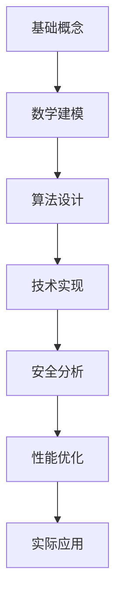

# 02 Programming Languages

## 概述

本目录包含02 Programming Languages的完整理论分析体系，涵盖基础理论、数学建模、技术实现和实际应用。

## 目录结构

- [01 Solidity Language.Md](01_Solidity_Language.md/README.md)
- [02 Vyper Language.Md](02_Vyper_Language.md/README.md)
- [03 Rust Contracts.Md](03_Rust_Contracts.md/README.md)
- [04 Move Language.Md](04_Move_Language.md/README.md)
- [05 Language Comparison.Md](05_Language_Comparison.md/README.md)

## 核心内容

### 理论框架

本部分建立02 Programming Languages的完整理论框架，包括：

1. **数学基础**: 提供严格的数学定义和证明
2. **算法设计**: 分析核心算法和数据结构
3. **实现方案**: 提供多语言的技术实现
4. **应用场景**: 探讨在Web3生态中的具体应用

### 技术深度

每个子目录都包含：
- 理论基础和数学模型
- 算法复杂度分析
- 代码实现示例
- 安全性分析
- 性能评估
- 实际应用案例

## 学习路径

## 使用指南

1. **初学者**: 从基础概念开始，逐步理解理论框架
2. **开发者**: 重点学习技术实现和代码示例
3. **研究者**: 深入研究数学模型和理论证明
4. **架构师**: 关注系统设计和性能优化

## 质量保证

所有文档遵循以下标准：
- ✅ 严格的数学定义
- ✅ 完整的算法分析
- ✅ 可运行的代码示例
- ✅ 详细的安全考虑
- ✅ 全面的性能评估

---

*类别: 智能合约 | 维护状态: 持续更新*
