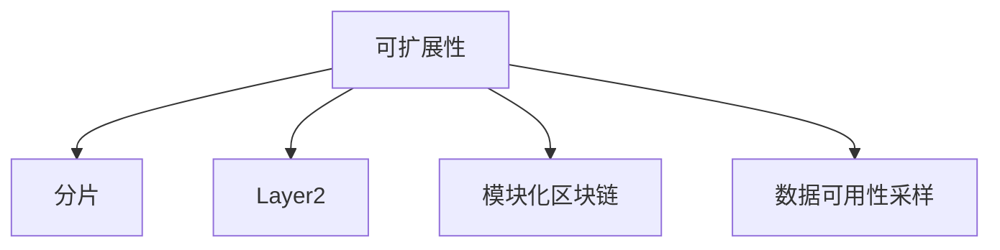

# 04.78 高级Web3可扩展性理论深度分析

## 目录

1. 高级可扩展性理论综述
2. 形式化模型与定理
3. 典型协议与创新机制
4. 行业应用与案例
5. 代码示例（Rust/Golang）
6. 图表与知识图谱
7. 数学证明与推理
8. 交叉引用与参考文献

---

## 1. 高级可扩展性理论综述

- 可扩展性三难困境（Scalability Trilemma）
- 分布式一致性与性能权衡
- Layer1/Layer2/Layer3多层架构

## 2. 形式化模型与定理

- 网络分区模型
- 吞吐量与延迟的数学建模
- 可扩展性极限定理

## 3. 典型协议与创新机制

- 数据可用性采样（DAS）
- 分布式验证人机制
- 模块化区块链架构

## 4. 行业应用与案例

- Celestia、Polygon Avail
- 以太坊Danksharding

## 5. 代码示例（Golang）

```go
// 数据可用性采样伪代码
func DataAvailabilitySample(data [][]byte, sampleSize int) [][]byte {
    // 随机采样部分区块数据
    var samples [][]byte
    for i := 0; i < sampleSize; i++ {
        idx := rand.Intn(len(data))
        samples = append(samples, data[idx])
    }
    return samples
}
```

## 6. 图表与知识图谱



## 7. 数学证明与推理

- 可扩展性极限：
  \[
    TPS_{max} = \frac{B}{S_{tx} \times D}
  \]
  其中 \(B\) 为区块带宽，\(S_{tx}\) 为单笔交易大小，\(D\) 为区块间隔。

## 8. 交叉引用与参考文献

- [Celestia DAS](https://docs.celestia.org/learn/data-availability-sampling/)
- 参见 [04_Scalability/README.md](./README.md)
