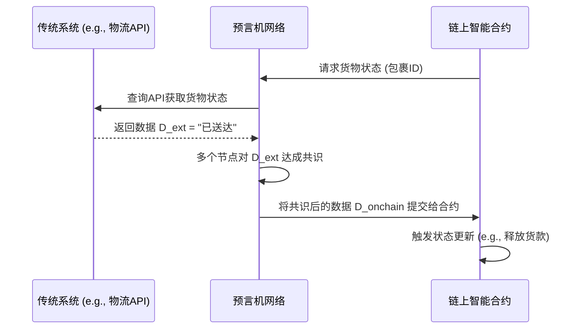

# Web3与传统系统集成的形式化模型

## 摘要

本文为Web3与传统企业系统（TradSys）的集成提供了一个严格的形式化模型，这种集成通常被称为混合架构（Hybrid Architecture）。随着区块链技术在企业中的应用日益增多，如何在保持去中心化核心优势的同时，与现有的中心化系统进行安全、可靠的交互，已成为关键挑战。本文对集成架构中的核心组件，如预言机（Oracles）、数据锚定机制和企业适配器，进行了形式化定义。我们通过对信任边界、安全模型和通信协议的建模，构建了一个用于分析和验证混合系统数据一致性、安全性和可靠性的理论框架。

---

## 1. 形式化预备与核心概念

### 1.1 符号系统

| 符号 | 描述 | LaTeX |
| :--- | :--- | :--- |
| $\mathcal{B}_{W3}$ | Web3公有链/联盟链 | `\mathcal{B}_{W3}` |
| $\mathcal{S}_{Trad}$ | 传统中心化系统 (e.g., ERP, CRM) | `\mathcal{S}_{Trad}` |
| $\mathcal{O}$ | 预言机 (Oracle) | `\mathcal{O}` |
| $D_{ext}$ | 外部世界的真实数据 | `$D_{ext}$` |
| $D_{onchain}$ | 链上数据 | `$D_{onchain}$` |
| $\mathcal{A}_{adapt}$ | 企业适配器 (Enterprise Adapter) | `$\mathcal{A}_{adapt}$` |
| $T_{anchor}$ | 数据锚定交易 | `$T_{anchor}$` |
| $\mathcal{TM}$ | 信任模型 (Trust Model) | `$\mathcal{TM}$` |

### 1.2 集成的核心挑战

Web3和传统系统的核心设计哲学截然不同（去中心化 vs. 中心化；透明 vs. 私密）。集成的核心挑战在于如何在这两个世界之间建立一个**可信的桥梁**，以解决以下问题：

1. **预言机问题**: 区块链无法直接访问外部数据。如何将外部世界的真实数据可信地引入链上？
2. **数据一致性**: 如何确保链上状态与链下传统系统中的状态保持最终一致？
3. **信任边界**: 集成引入了新的信任假设（如信任预言机），如何对这些信任边界进行建模和管理？

---

## 2. 混合架构组件的形式化模型

### 2.1 预言机 (Oracle)

**定义 2.1 (预言机)**: 一个预言机 $\mathcal{O}$ 是一个实体（或一个去中心化网络），其功能是观察外部世界的数据 $D_{ext}$，并将其报告给区块链 $\mathcal{B}_{W3}$。一个预言机协议可以被建模为一个函数：
\[
f_{\mathcal{O}}: D_{ext} \to (D_{onchain}, \pi_{\text{report}})
\]

- $D_{onchain}$ 是提交到链上的数据。
- $\pi_{\text{report}}$ 是一个报告有效性的证明（例如，多个独立预言机节点的签名聚合）。

**信任模型**:

- **中心化预言机**: $\mathcal{TM} = \text{Trust}(\mathcal{O}_{\text{single}})$。信任单个预言机实体。
- **去中心化预言机网络 (DON)**: $\mathcal{TM} = \text{Trust}(\{O_i\}_{i=1}^n, k)$。信任 $n$ 个预言机节点中的至少 $k$ 个是诚实的。

### 2.2 数据锚定 (Data Anchoring)

**定义 2.2 (数据锚定)**: 数据锚定是一种将传统系统 $\mathcal{S}_{Trad}$ 中数据的存在性或状态的证明记录在区块链 $\mathcal{B}_{W3}$ 上的机制。

1. 在 $\mathcal{S}_{Trad}$ 中，对一批数据 $D_{batch}$ 计算其密码学哈希 $h = H(D_{batch})$。
2. 创建一个锚定交易 $T_{anchor} = (\text{timestamp}, h)$。
3. 将 $T_{anchor}$ 广播到 $\mathcal{B}_{W3}$ 并等待其被打包进区块。

**安全属性**:

- **时间戳证明 (Timestamping)**: 一旦 $T_{anchor}$ 被确认，就提供了一个不可篡改的证据，证明数据 $D_{batch}$ 在该时间点之前就已经存在。
- **完整性证明 (Integrity)**: 任何对原始数据 $D_{batch}$ 的修改都会导致其哈希值与链上的 $h$ 不匹配。

### 2.3 企业适配器 (Enterprise Adapter)

**定义 2.3 (适配器)**: 企业适配器 $\mathcal{A}_{adapt}$ 是一个中间件层，负责在 $\mathcal{B}_{W3}$ 和 $\mathcal{S}_{Trad}$ 之间转换数据格式、处理私钥管理和协调业务逻辑。

- **监听链上事件**: 监听 $\mathcal{B}_{W3}$ 上的特定智能合约事件。
- **触发链下逻辑**: 将链上事件转换为对 $\mathcal{S}_{Trad}$ 的API调用。
- **编排链上交易**: 根据 $\mathcal{S}_{Trad}$ 的业务流程，创建、签名并广播交易到 $\mathcal{B}_{W3}$。

## 3. 集成协议的形式化模型与分析

### 3.1 协议：链下数据上链 (Off-Chain Data On-Chain)

此协议描述了如何使用预言机将外部数据引入智能合约。

**状态转换模型**:

- **初始状态**: 合约状态 $S_0 = \{\text{payment_locked}\}$。
- **触发**: 用户调用 `request_delivery_status()`。
- **中间状态**: 合约状态 $S_1 = \{\text{waiting_for_oracle}\}$。
- **预言机回调**: 预言机调用 `update_status(D_{onchain})$`。
- **最终状态**: 合约验证回调的合法性后，状态更新为 $S_2 = \{\text{payment_released}\}$。

### 3.2 协议：链上事件触发链下操作 (On-Chain Event Off-Chain Action)

**场景**: 一个供应链金融智能合约在收到付款后，自动触发传统ERP系统生成发货单。

**形式化流程**:

1. **链上事件**: 智能合约在收到付款后，发出一个事件 `PaymentReceived(orderID, customer_address)`。
2. **适配器监听**: 企业适配器 $\mathcal{A}_{adapt}$ 监听到此事件。
3. **API调用**: $\mathcal{A}_{adapt}$ 调用 $\mathcal{S}_{Trad}$ (ERP系统) 的API：`create_shipping_order(orderID)`。
4. **数据锚定 (可选)**: ERP系统生成发货单后，可以将其哈希锚定回链上，作为发货操作已执行的证明。

## 4. 安全性与一致性模型

### 4.1 信任边界分析

**定义 4.1 (系统信任模型)**: 一个混合系统的总信任模型 $\mathcal{TM}_{total}$ 是其各组件信任模型的并集：
\[
\mathcal{TM}_{total} = \mathcal{TM}(\mathcal{B}_{W3}) \cup \mathcal{TM}(\mathcal{O}) \cup \mathcal{TM}(\mathcal{A}_{adapt})
\]

- $\mathcal{TM}(\mathcal{B}_{W3})$: Web3区块链的共识安全（例如，51%攻击假设）。
- $\mathcal{TM}(\mathcal{O})$: 预言机的诚实性假设（例如，k-of-n诚实节点）。
- $\mathcal{TM}(\mathcal{A}_{adapt})$: 企业适配器软件和硬件的安全性。

**定理 4.1 (最弱环节安全性)**: 混合系统的整体安全性取决于其信任模型中最薄弱的一环。如果任何一个组件的信任假设被打破，整个系统的安全性都可能受到损害。

### 4.2 数据最终一致性

由于链上确认需要时间，且链下系统可能发生故障，混合系统通常只能保证**最终一致性**。

**定义 4.2 (最终一致性)**: 如果在系统停止接收新的外部输入后，经过一段有限的时间，所有副本（链上状态和链下状态）最终会收敛到相同的值，则系统满足最终一致性。

**挑战**:

- **区块链重组 (Reorg)**: 如果适配器响应了一个后来被重组掉的区块中的事件，可能导致链下操作与最终的链上状态不一致。
- **解决方案**: 适配器必须等待足够数量的区块确认（finality）后，才能执行不可逆的链下操作。

## 5. 参考文献

1. Narayanan, A., et al. (2016). "A Pragmatic Approach to Blockchain Interoperability."
2. Chainlink 2.0 Whitepaper. (2021).
3. Hyperledger Cactus Documentation. (<https://hyperledger-cactus.readthedocs.io/>)
