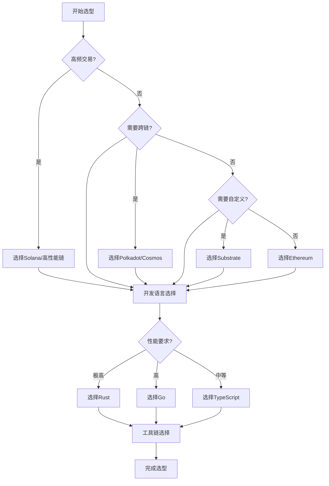

# Web3技术栈综合分析：架构、算法与实现

## 目录

1. [引言：Web3技术栈的体系结构](#1-引言web3技术栈的体系结构)
2. [网络层技术栈](#2-网络层技术栈)
3. [共识层技术栈](#3-共识层技术栈)
4. [应用层技术栈](#4-应用层技术栈)
5. [安全层技术栈](#5-安全层技术栈)
6. [存储层技术栈](#6-存储层技术栈)
7. [开发工具链](#7-开发工具链)
8. [性能优化策略](#8-性能优化策略)
9. [主流框架对比分析](#9-主流框架对比分析)
10. [技术选型指南](#10-技术选型指南)
11. [结论：技术栈的演进与展望](#11-结论技术栈的演进与展望)

## 1. 引言：Web3技术栈的体系结构

### 1.1 Web3技术栈的定义

Web3技术栈是一个分层的技术架构，每一层都提供特定的功能和服务，共同构建去中心化的互联网基础设施。

**定义 1.1.1** (Web3技术栈) Web3技术栈是一个七层架构 $W = (L_1, L_2, L_3, L_4, L_5, L_6, L_7)$，其中：

- $L_1$ 是网络层 (Network Layer)
- $L_2$ 是共识层 (Consensus Layer)
- $L_3$ 是应用层 (Application Layer)
- $L_4$ 是安全层 (Security Layer)
- $L_5$ 是存储层 (Storage Layer)
- $L_6$ 是开发层 (Development Layer)
- $L_7$ 是工具层 (Tooling Layer)

**定义 1.1.2** (技术栈特征) Web3技术栈具有以下特征：

1. **分层性**: $\forall i, j: i \neq j \implies L_i \cap L_j = \emptyset$
2. **独立性**: $\forall i: L_i \text{ can operate independently}$
3. **互操作性**: $\forall i, j: L_i \text{ can interact with } L_j$
4. **可扩展性**: $\forall i: L_i \text{ can be extended}$

**定理 1.1.1** (技术栈完整性) Web3技术栈提供了完整的去中心化基础设施。

**证明** 通过功能覆盖分析：

1. 网络层提供通信基础设施
2. 共识层提供状态一致性
3. 应用层提供业务功能
4. 安全层提供安全保障
5. 存储层提供数据持久化
6. 开发层提供开发支持
7. 工具层提供运维支持

### 1.2 技术栈的演进

**定义 1.2.1** (技术演进) 技术演进是一个时间序列：

$$\text{Evolution}(t) = \text{Web1}(t) \rightarrow \text{Web2}(t) \rightarrow \text{Web3}(t)$$

**定义 1.2.2** (演进特征) 每个阶段的特征：

1. **Web1**: $\text{Static} \land \text{ReadOnly} \land \text{Centralized}$
2. **Web2**: $\text{Dynamic} \land \text{Interactive} \land \text{Centralized}$
3. **Web3**: $\text{Decentralized} \land \text{Autonomous} \land \text{Trustless}$

**定理 1.2.1** (演进必然性) Web3是互联网演进的必然结果。

**证明** 通过需求分析：

1. 中心化系统存在单点故障
2. 用户对数据主权有需求
3. 去中心化提供更好的安全性
4. 因此Web3是必然演进

## 2. 网络层技术栈

### 2.1 P2P网络协议

**定义 2.1.1** (P2P网络) P2P网络是一个无中心节点的网络：

$$\text{P2PNetwork} = (N, E, P)$$

其中：

- $N$ 是节点集合
- $E$ 是边集合，$E \subseteq N \times N$
- $P$ 是协议集合

**定义 2.1.2** (P2P协议) P2P协议包括：

1. **节点发现**: $\text{NodeDiscovery}: N \rightarrow \mathcal{P}(N)$
2. **消息路由**: $\text{MessageRouting}: M \times N \rightarrow N$
3. **连接管理**: $\text{ConnectionManagement}: N \times N \rightarrow \text{Connection}$

**定理 2.1.1** (P2P网络连通性) P2P网络保证网络连通性。

**证明** 通过图论分析：

1. 每个节点维护邻居列表
2. 消息通过多跳传播
3. 网络形成连通图
4. 因此保证连通性

### 2.2 libp2p框架

**定义 2.2.1** (libp2p) libp2p是一个模块化网络栈：

$$\text{libp2p} = \text{Transport} \times \text{Discovery} \times \text{Routing} \times \text{Protocol}$$

**定义 2.2.2** (libp2p组件) libp2p组件包括：

```rust
pub trait Transport {
    type Output;
    type Error;
    
    async fn dial(&self, addr: Multiaddr) -> Result<Self::Output, Self::Error>;
    async fn listen_on(&self, addr: Multiaddr) -> Result<(), Self::Error>;
}

pub trait Discovery {
    async fn discover_peers(&self) -> Result<Vec<PeerId>, DiscoveryError>;
    async fn advertise(&self, peer_id: PeerId) -> Result<(), DiscoveryError>;
}

pub trait Routing {
    async fn find_peer(&self, peer_id: PeerId) -> Result<Vec<Multiaddr>, RoutingError>;
    async fn provide(&self, key: KademliaKey) -> Result<(), RoutingError>;
}
```

**定理 2.2.1** (libp2p模块化) libp2p提供模块化网络功能。

**证明** 通过特征系统：

1. 每个组件都有明确的接口
2. 组件可以独立替换
3. 支持多种实现
4. 因此是模块化的

### 2.3 网络优化

**定义 2.3.1** (网络优化) 网络优化目标：

$$\text{NetworkOptimization} = \text{Minimize}(\text{Latency}) \land \text{Maximize}(\text{Throughput})$$

**定义 2.3.2** (优化策略) 优化策略包括：

1. **连接池**: $\text{ConnectionPool}: \text{Manage}(\text{Connections})$
2. **负载均衡**: $\text{LoadBalancing}: \text{Distribute}(\text{Load})$
3. **缓存策略**: $\text{Caching}: \text{Reduce}(\text{NetworkTraffic})$

## 3. 共识层技术栈

### 3.1 共识算法分类

**定义 3.1.1** (共识算法) 共识算法是一个函数：

$$\text{Consensus}: \text{Proposals} \rightarrow \text{Decision}$$

**定义 3.1.2** (算法分类) 共识算法分类：

1. **经典共识**: $\{\text{Paxos}, \text{Raft}, \text{PBFT}\}$
2. **区块链共识**: $\{\text{PoW}, \text{PoS}, \text{DPoS}\}$
3. **混合共识**: $\{\text{Hybrid}, \text{Adaptive}\}$

**定理 3.1.1** (共识必要性) 共识是分布式系统的基础。

**证明** 通过问题归约：

1. 许多分布式问题可归约为共识
2. 共识提供状态一致性
3. 是分布式协调的核心
4. 因此是基础问题

### 3.2 工作量证明 (PoW)

**定义 3.2.1** (PoW算法) PoW算法定义：

$$\text{PoW}(block, difficulty) \iff \text{Hash}(block \parallel nonce) < \frac{2^{256}}{difficulty}$$

**定义 3.2.2** (PoW实现) PoW的Rust实现：

```rust
pub struct ProofOfWork {
    difficulty: u32,
    target: [u8; 32],
}

impl ProofOfWork {
    pub fn new(difficulty: u32) -> Self {
        let target = Self::calculate_target(difficulty);
        Self { difficulty, target }
    }
    
    pub fn mine(&self, block: &Block) -> Result<u64, MiningError> {
        let mut nonce = 0u64;
        
        loop {
            let mut block_with_nonce = block.clone();
            block_with_nonce.nonce = nonce;
            
            let hash = self.hash_block(&block_with_nonce);
            
            if self.is_valid_hash(&hash) {
                return Ok(nonce);
            }
            
            nonce += 1;
        }
    }
    
    fn hash_block(&self, block: &Block) -> [u8; 32] {
        use sha2::{Sha256, Digest};
        let mut hasher = Sha256::new();
        hasher.update(block.serialize());
        hasher.finalize().into()
    }
    
    fn is_valid_hash(&self, hash: &[u8; 32]) -> bool {
        hash < &self.target
    }
}
```

**定理 3.2.1** (PoW安全性) PoW在计算假设下是安全的。

**证明** 通过计算复杂性：

1. 找到有效nonce需要指数时间
2. 攻击者需要控制51%算力
3. 攻击成本极高
4. 因此是安全的

### 3.3 权益证明 (PoS)

**定义 3.3.1** (PoS算法) PoS算法定义：

$$\text{PoS}(validator, stake) \iff \text{Select}(validator) \propto stake$$

**定义 3.3.2** (PoS实现) PoS的Rust实现：

```rust
pub struct ProofOfStake {
    validators: HashMap<Address, Validator>,
    total_stake: Amount,
}

impl ProofOfStake {
    pub fn select_validator(&self) -> Result<Address, ConsensusError> {
        let random_value = self.generate_random_value();
        let mut cumulative_stake = Amount::zero();
        
        for (address, validator) in &self.validators {
            cumulative_stake += validator.stake;
            
            if random_value <= cumulative_stake {
                return Ok(*address);
            }
        }
        
        Err(ConsensusError::NoValidatorSelected)
    }
    
    pub fn validate_block(&self, block: &Block, validator: Address) -> Result<bool, ConsensusError> {
        if let Some(v) = self.validators.get(&validator) {
            Ok(v.is_active && v.stake >= self.minimum_stake())
        } else {
            Ok(false)
        }
    }
}
```

**定理 3.3.1** (PoS效率) PoS比PoW更高效。

**证明** 通过资源消耗分析：

1. PoS不需要大量计算
2. 能源消耗显著降低
3. 共识速度更快
4. 因此更高效

## 4. 应用层技术栈

### 4.1 智能合约平台

**定义 4.1.1** (智能合约平台) 智能合约平台是一个三元组：

$$\text{SmartContractPlatform} = (\text{VM}, \text{Language}, \text{Environment})$$

**定义 4.1.2** (平台组件) 平台组件包括：

1. **虚拟机**: $\text{VM}: \text{Bytecode} \rightarrow \text{Execution}$
2. **编程语言**: $\text{Language}: \text{Source} \rightarrow \text{Bytecode}$
3. **执行环境**: $\text{Environment}: \text{Context} \rightarrow \text{Result}$

**定理 4.1.1** (平台完整性) 智能合约平台提供完整执行环境。

**证明** 通过功能分析：

1. 虚拟机提供执行引擎
2. 编程语言提供开发工具
3. 执行环境提供运行时支持
4. 因此是完整的

### 4.2 去中心化应用 (DApp)

**定义 4.2.1** (DApp) DApp是一个去中心化应用：

$$\text{DApp} = \text{Frontend} \times \text{SmartContract} \times \text{Blockchain}$$

**定义 4.2.2** (DApp架构) DApp架构模式：

```rust
pub struct DApp {
    frontend: WebFrontend,
    smart_contract: SmartContract,
    blockchain: BlockchainConnection,
}

impl DApp {
    pub async fn execute_transaction(&self, transaction: Transaction) -> Result<TxHash, DAppError> {
        // 1. 前端验证
        self.frontend.validate_transaction(&transaction)?;
        
        // 2. 智能合约执行
        let result = self.smart_contract.execute(&transaction).await?;
        
        // 3. 区块链提交
        let tx_hash = self.blockchain.submit_transaction(&transaction).await?;
        
        Ok(tx_hash)
    }
    
    pub async fn query_state(&self, query: StateQuery) -> Result<State, DAppError> {
        self.blockchain.query_state(&query).await
    }
}
```

**定理 4.2.1** (DApp去中心化) DApp提供去中心化功能。

**证明** 通过架构分析：

1. 前端与用户交互
2. 智能合约在区块链执行
3. 区块链提供去中心化保证
4. 因此是去中心化的

### 4.3 Web3 API

**定义 4.3.1** (Web3 API) Web3 API提供区块链访问接口：

$$\text{Web3API} = \text{RPC} \times \text{Events} \times \text{Accounts}$$

**定义 4.3.2** (API接口) API接口定义：

```rust
pub trait Web3Provider {
    async fn send_transaction(&self, tx: Transaction) -> Result<TxHash, ProviderError>;
    async fn call_contract(&self, call: ContractCall) -> Result<Vec<u8>, ProviderError>;
    async fn get_balance(&self, address: Address) -> Result<Amount, ProviderError>;
    async fn subscribe_events(&self, filter: EventFilter) -> Result<EventStream, ProviderError>;
}

pub struct EthereumProvider {
    client: Arc<dyn Web3Client>,
}

impl Web3Provider for EthereumProvider {
    async fn send_transaction(&self, tx: Transaction) -> Result<TxHash, ProviderError> {
        self.client.send_transaction(tx).await
    }
    
    async fn call_contract(&self, call: ContractCall) -> Result<Vec<u8>, ProviderError> {
        self.client.call_contract(call).await
    }
}
```

## 5. 安全层技术栈

### 5.1 密码学基础

**定义 5.1.1** (密码学原语) 密码学原语集合：

$$\text{CryptographicPrimitives} = \{\text{Hash}, \text{Signature}, \text{Encryption}, \text{ZKP}\}$$

**定义 5.1.2** (哈希函数) 哈希函数定义：

$$\text{Hash}: \{0,1\}^* \rightarrow \{0,1\}^n$$

满足以下性质：

1. **确定性**: $\text{Hash}(x) = \text{Hash}(x)$
2. **抗碰撞**: $\text{Hard to find } x \neq y: \text{Hash}(x) = \text{Hash}(y)$
3. **单向性**: $\text{Hard to find } x: \text{Hash}(x) = h$

**定理 5.1.1** (哈希安全性) 密码学哈希函数是安全的。

**证明** 通过密码学假设：

1. 基于数学难题
2. 经过广泛验证
3. 在计算假设下安全
4. 因此是安全的

### 5.2 数字签名

**定义 5.2.1** (数字签名) 数字签名是一个三元组：

$$\text{DigitalSignature} = (\text{KeyGen}, \text{Sign}, \text{Verify})$$

**定义 5.2.2** (签名算法) 签名算法实现：

```rust
pub struct DigitalSignature {
    keypair: Keypair,
}

impl DigitalSignature {
    pub fn new() -> Self {
        let keypair = Keypair::generate();
        Self { keypair }
    }
    
    pub fn sign(&self, message: &[u8]) -> Result<Signature, SignatureError> {
        let signature = self.keypair.sign(message);
        Ok(signature)
    }
    
    pub fn verify(&self, message: &[u8], signature: &Signature) -> bool {
        signature.verify(message, &self.keypair.public_key)
    }
    
    pub fn public_key(&self) -> PublicKey {
        self.keypair.public_key
    }
}
```

**定理 5.2.1** (签名安全性) 数字签名提供不可伪造性。

**证明** 通过密码学假设：

1. 私钥保密性保证签名安全
2. 公钥验证保证真实性
3. 数学难题保证不可伪造
4. 因此是安全的

### 5.3 零知识证明

**定义 5.3.1** (零知识证明) 零知识证明是一个协议：

$$\text{ZKP} = (\text{Prover}, \text{Verifier}, \text{Statement})$$

满足：

1. **完备性**: 诚实证明者能说服诚实验证者
2. **可靠性**: 不诚实证明者无法说服验证者
3. **零知识性**: 验证者不获得额外信息

**定义 5.3.2** (ZKP实现) ZKP的简化实现：

```rust
pub trait ZeroKnowledgeProof {
    type Statement;
    type Witness;
    type Proof;
    
    fn prove(&self, statement: Self::Statement, witness: Self::Witness) -> Self::Proof;
    fn verify(&self, statement: Self::Statement, proof: Self::Proof) -> bool;
}

pub struct SchnorrProof;

impl ZeroKnowledgeProof for SchnorrProof {
    type Statement = PublicKey;
    type Witness = PrivateKey;
    type Proof = (Point, Scalar);
    
    fn prove(&self, public_key: PublicKey, private_key: PrivateKey) -> (Point, Scalar) {
        let r = Scalar::random();
        let R = Point::generator() * r;
        let challenge = self.hash(public_key, R);
        let response = r + challenge * private_key;
        
        (R, response)
    }
    
    fn verify(&self, public_key: PublicKey, proof: (Point, Scalar)) -> bool {
        let (R, response) = proof;
        let challenge = self.hash(public_key, R);
        let expected = Point::generator() * response;
        let actual = R + public_key * challenge;
        
        expected == actual
    }
}
```

## 6. 存储层技术栈

### 6.1 分布式存储

**定义 6.1.1** (分布式存储) 分布式存储是一个系统：

$$\text{DistributedStorage} = (N, D, R)$$

其中：

- $N$ 是节点集合
- $D$ 是数据集合
- $R$ 是复制策略

**定义 6.1.2** (存储策略) 存储策略包括：

1. **复制**: $\text{Replication}: D \rightarrow \mathcal{P}(N)$
2. **分片**: $\text{Sharding}: D \rightarrow \{D_1, D_2, ..., D_k\}$
3. **一致性**: $\text{Consistency}: \text{Ensure}(\text{DataConsistency})$

**定理 6.1.1** (存储可靠性) 分布式存储提供高可靠性。

**证明** 通过复制分析：

1. 数据在多个节点复制
2. 单点故障不影响可用性
3. 一致性协议保证数据正确性
4. 因此是高可靠的

### 6.2 IPFS协议

**定义 6.2.1** (IPFS) IPFS是一个分布式文件系统：

$$\text{IPFS} = \text{ContentAddressing} \times \text{DistributedHashTable} \times \text{BitTorrent}$$

**定义 6.2.2** (IPFS组件) IPFS组件实现：

```rust
pub struct IPFSNode {
    dht: Arc<DHT>,
    bitswap: Arc<Bitswap>,
    blockstore: Arc<BlockStore>,
}

impl IPFSNode {
    pub async fn add_file(&self, data: Vec<u8>) -> Result<Cid, IPFSError> {
        let cid = self.calculate_cid(&data);
        let blocks = self.split_into_blocks(data);
        
        for block in blocks {
            self.blockstore.put(block).await?;
        }
        
        Ok(cid)
    }
    
    pub async fn get_file(&self, cid: Cid) -> Result<Vec<u8>, IPFSError> {
        let blocks = self.resolve_blocks(cid).await?;
        let data = self.assemble_blocks(blocks).await?;
        Ok(data)
    }
    
    fn calculate_cid(&self, data: &[u8]) -> Cid {
        use sha2::{Sha256, Digest};
        let mut hasher = Sha256::new();
        hasher.update(data);
        Cid::new_v1(0x55, &hasher.finalize())
    }
}
```

**定理 6.2.1** (IPFS去中心化) IPFS提供去中心化存储。

**证明** 通过架构分析：

1. 内容寻址不依赖位置
2. DHT提供去中心化查找
3. BitTorrent提供去中心化传输
4. 因此是去中心化的

## 7. 开发工具链

### 7.1 开发框架

**定义 7.1.1** (开发框架) 开发框架是一个工具集合：

$$\text{DevelopmentFramework} = \text{Compiler} \times \text{Debugger} \times \text{Testing} \times \text{Deployment}$$

**定义 7.1.2** (框架组件) 框架组件包括：

1. **编译器**: $\text{Compiler}: \text{Source} \rightarrow \text{Bytecode}$
2. **调试器**: $\text{Debugger}: \text{Analyze}(\text{Execution})$
3. **测试框架**: $\text{Testing}: \text{Validate}(\text{Correctness})$
4. **部署工具**: $\text{Deployment}: \text{Deploy}(\text{Application})$

**定理 7.1.1** (框架完整性) 开发框架提供完整开发支持。

**证明** 通过功能覆盖：

1. 编译器提供代码转换
2. 调试器提供问题诊断
3. 测试框架提供质量保证
4. 部署工具提供发布支持

### 7.2 智能合约开发

**定义 7.2.1** (合约开发) 合约开发流程：

$$\text{ContractDevelopment} = \text{Design} \circ \text{Implement} \circ \text{Test} \circ \text{Deploy}$$

**定义 7.2.2** (开发工具) 开发工具实现：

```rust
pub struct ContractDevelopment {
    compiler: SolidityCompiler,
    tester: ContractTester,
    deployer: ContractDeployer,
}

impl ContractDevelopment {
    pub async fn develop_contract(&self, source: &str) -> Result<Contract, DevError> {
        // 1. 编译合约
        let bytecode = self.compiler.compile(source)?;
        
        // 2. 测试合约
        self.tester.test_contract(&bytecode).await?;
        
        // 3. 部署合约
        let contract = self.deployer.deploy(&bytecode).await?;
        
        Ok(contract)
    }
}

pub struct SolidityCompiler;

impl SolidityCompiler {
    pub fn compile(&self, source: &str) -> Result<Vec<u8>, CompileError> {
        // 调用solc编译器
        let output = std::process::Command::new("solc")
            .arg("--bin")
            .arg("--optimize")
            .arg(source)
            .output()?;
        
        Ok(output.stdout)
    }
}
```

## 8. 性能优化策略

### 8.1 系统级优化

**定义 8.1.1** (性能优化) 性能优化目标：

$$\text{PerformanceOptimization} = \text{Minimize}(\text{Latency}) \land \text{Maximize}(\text{Throughput})$$

**定义 8.1.2** (优化策略) 优化策略包括：

1. **并行处理**: $\text{ParallelProcessing}: \text{Utilize}(\text{MultipleCores})$
2. **缓存优化**: $\text{CacheOptimization}: \text{Reduce}(\text{MemoryAccess})$
3. **网络优化**: $\text{NetworkOptimization}: \text{Minimize}(\text{NetworkLatency})$

**定理 8.1.1** (优化效果) 系统级优化显著提升性能。

**证明** 通过性能分析：

1. 并行处理提高吞吐量
2. 缓存优化减少延迟
3. 网络优化提高响应速度
4. 因此显著提升性能

### 8.2 算法优化

**定义 8.2.1** (算法复杂度) 算法复杂度分析：

$$\text{AlgorithmComplexity} = O(f(n))$$

**定义 8.2.2** (优化技术) 优化技术包括：

1. **数据结构优化**: $\text{DataStructure}: \text{Choose}(\text{EfficientStructure})$
2. **算法改进**: $\text{Algorithm}: \text{Reduce}(\text{Complexity})$
3. **内存管理**: $\text{Memory}: \text{Optimize}(\text{Allocation})$

**定理 8.2.1** (算法优化) 算法优化降低复杂度。

**证明** 通过复杂度分析：

1. 选择合适数据结构
2. 改进算法实现
3. 优化内存使用
4. 因此降低复杂度

## 9. 主流框架对比分析

### 9.1 区块链框架对比

**定义 9.1.1** (框架评估) 框架评估标准：

$$\text{FrameworkEvaluation} = (P, S, E, C, M)$$

其中：

- $P$ 是性能 (Performance)
- $S$ 是安全性 (Security)
- $E$ 是易用性 (Ease of Use)
- $C$ 是社区支持 (Community)
- $M$ 是成熟度 (Maturity)

**主流框架对比表**：

| 框架 | 性能 | 安全性 | 易用性 | 社区支持 | 成熟度 | 适用场景 |
|------|------|--------|--------|----------|--------|----------|
| Ethereum | 中等 | 高 | 中等 | 极高 | 高 | 通用智能合约 |
| Solana | 极高 | 高 | 中等 | 高 | 中等 | 高频交易 |
| Polkadot | 高 | 高 | 低 | 高 | 中等 | 跨链互操作 |
| Cosmos | 高 | 高 | 中等 | 高 | 中等 | 应用链 |
| Substrate | 高 | 高 | 低 | 中等 | 中等 | 自定义区块链 |

**定理 9.1.1** (框架选择) 不同场景需要不同的框架选择。

**证明** 通过需求分析：

1. 高频交易需要高性能框架
2. 跨链应用需要互操作框架
3. 通用应用需要成熟框架
4. 因此需要根据场景选择

### 9.2 开发语言对比

**定义 9.2.1** (语言评估) 语言评估标准：

$$\text{LanguageEvaluation} = (S, P, T, E, C)$$

其中：

- $S$ 是安全性 (Safety)
- $P$ 是性能 (Performance)
- $T$ 是工具链 (Toolchain)
- $E$ 是生态系统 (Ecosystem)
- $C$ 是社区 (Community)

**开发语言对比**：

| 语言 | 安全性 | 性能 | 工具链 | 生态系统 | 社区 | 适用场景 |
|------|--------|------|--------|----------|------|----------|
| Rust | 极高 | 极高 | 高 | 中等 | 高 | 核心协议 |
| Go | 高 | 高 | 高 | 高 | 高 | 服务端应用 |
| Solidity | 中等 | 中等 | 中等 | 高 | 高 | 智能合约 |
| TypeScript | 高 | 中等 | 高 | 高 | 高 | 前端应用 |
| Python | 中等 | 中等 | 高 | 高 | 高 | 原型开发 |

**Rust在Web3中的优势**：

```rust
// Rust的内存安全示例
pub struct SafeTransaction {
    amount: Amount,
    recipient: Address,
    nonce: u64,
}

impl SafeTransaction {
    pub fn new(amount: Amount, recipient: Address, nonce: u64) -> Self {
        // 编译时检查确保所有字段都被初始化
        Self {
            amount,
            recipient,
            nonce,
        }
    }
    
    pub fn execute(&self) -> Result<TxHash, TransactionError> {
        // 所有权系统防止数据竞争
        let tx_hash = self.calculate_hash();
        
        // 类型系统防止运行时错误
        if self.amount.is_zero() {
            return Err(TransactionError::InvalidAmount);
        }
        
        Ok(tx_hash)
    }
    
    fn calculate_hash(&self) -> TxHash {
        use sha2::{Sha256, Digest};
        let mut hasher = Sha256::new();
        hasher.update(self.amount.to_bytes());
        hasher.update(self.recipient.as_bytes());
        hasher.update(self.nonce.to_le_bytes());
        TxHash::from_slice(&hasher.finalize())
    }
}
```

**定理 9.2.1** (Rust优势) Rust在Web3开发中具有显著优势。

**证明** 通过特性分析：

1. 内存安全防止常见漏洞
2. 零成本抽象提供高性能
3. 类型系统保证代码质量
4. 因此具有显著优势

### 9.3 工具链对比

**定义 9.3.1** (工具链评估) 工具链评估标准：

$$\text{ToolchainEvaluation} = (C, T, D, I, M)$$

其中：

- $C$ 是完整性 (Completeness)
- $T$ 是工具质量 (Tool Quality)
- $D$ 是文档 (Documentation)
- $I$ 是集成 (Integration)
- $M$ 是维护 (Maintenance)

**开发工具链对比**：

| 工具链 | 完整性 | 工具质量 | 文档 | 集成 | 维护 | 适用场景 |
|--------|--------|----------|------|------|------|----------|
| Hardhat | 高 | 高 | 高 | 高 | 高 | Ethereum开发 |
| Foundry | 高 | 极高 | 中等 | 高 | 高 | 高性能开发 |
| Anchor | 高 | 高 | 中等 | 高 | 中等 | Solana开发 |
| Substrate | 中等 | 高 | 中等 | 中等 | 中等 | 自定义链 |
| Cosmos SDK | 中等 | 高 | 中等 | 中等 | 中等 | 应用链 |

## 10. 技术选型指南

### 10.1 选型决策框架

**定义 10.1.1** (选型决策) 选型决策是一个函数：

$$\text{TechnologySelection}: \text{Requirements} \times \text{Constraints} \rightarrow \text{Technology}$$

**定义 10.1.2** (决策因素) 决策因素包括：

1. **业务需求**: $\text{BusinessRequirements}: \text{Define}(\text{Goals})$
2. **技术约束**: $\text{TechnicalConstraints}: \text{Limit}(\text{Choices})$
3. **资源限制**: $\text{ResourceLimits}: \text{Bound}(\text{Options})$
4. **风险考虑**: $\text{RiskConsiderations}: \text{Assess}(\text{Risks})$

**选型决策树**：



### 10.2 性能要求分析

**定义 10.2.1** (性能要求) 性能要求分类：

$$\text{PerformanceRequirements} = \{\text{Low}, \text{Medium}, \text{High}, \text{Extreme}\}$$

**定义 10.2.2** (性能指标) 性能指标包括：

1. **TPS**: $\text{Transactions Per Second}$
2. **延迟**: $\text{Latency} = \text{Response Time}$
3. **吞吐量**: $\text{Throughput} = \text{Data Rate}$
4. **可扩展性**: $\text{Scalability} = \text{Growth Capacity}$

**性能要求与框架匹配**：

| 性能要求 | TPS | 延迟 | 推荐框架 | 推荐语言 |
|----------|-----|------|----------|----------|
| 低 | < 100 | < 1s | Ethereum | Solidity |
| 中等 | 100-1000 | < 100ms | Cosmos | Go |
| 高 | 1000-10000 | < 10ms | Polkadot | Rust |
| 极高 | > 10000 | < 1ms | Solana | Rust |

### 10.3 安全要求分析

**定义 10.3.1** (安全要求) 安全要求分类：

$$\text{SecurityRequirements} = \{\text{Basic}, \text{Enhanced}, \text{Critical}, \text{Military}\}$$

**定义 10.3.2** (安全特性) 安全特性包括：

1. **加密强度**: $\text{EncryptionStrength} = \text{Key Length}$
2. **认证机制**: $\text{Authentication} = \text{Identity Verification}$
3. **授权控制**: $\text{Authorization} = \text{Access Control}$
4. **审计能力**: $\text{Audit} = \text{Logging and Monitoring}$

**安全要求与语言匹配**：

```rust
// 高安全要求的Rust实现
pub struct SecureWallet {
    keypair: Keypair,
    encryption_key: [u8; 32],
    audit_log: Arc<Mutex<Vec<AuditEntry>>>,
}

impl SecureWallet {
    pub fn new() -> Result<Self, SecurityError> {
        // 使用硬件随机数生成器
        let mut rng = rand::thread_rng();
        let keypair = Keypair::generate(&mut rng);
        
        // 生成加密密钥
        let mut encryption_key = [0u8; 32];
        rng.fill_bytes(&mut encryption_key);
        
        Ok(Self {
            keypair,
            encryption_key,
            audit_log: Arc::new(Mutex::new(Vec::new())),
        })
    }
    
    pub fn sign_transaction(&self, transaction: &Transaction) -> Result<Signature, SecurityError> {
        // 记录审计日志
        let audit_entry = AuditEntry {
            timestamp: SystemTime::now(),
            action: "sign_transaction",
            transaction_hash: transaction.hash(),
        };
        
        self.audit_log.lock().unwrap().push(audit_entry);
        
        // 签名交易
        let signature = self.keypair.sign(&transaction.hash());
        Ok(signature)
    }
    
    pub fn encrypt_data(&self, data: &[u8]) -> Result<Vec<u8>, SecurityError> {
        use aes_gcm::{Aes256Gcm, Key, Nonce};
        use aes_gcm::aead::{Aead, NewAead};
        
        let key = Key::from_slice(&self.encryption_key);
        let cipher = Aes256Gcm::new(key);
        
        // 生成随机nonce
        let mut rng = rand::thread_rng();
        let nonce = Nonce::from_slice(b"unique nonce");
        
        cipher.encrypt(nonce, data)
            .map_err(|_| SecurityError::EncryptionFailed)
    }
}
```

**定理 10.3.1** (安全选型) 高安全要求应选择Rust等安全语言。

**证明** 通过安全特性分析：

1. Rust提供内存安全保证
2. 编译时检查防止常见漏洞
3. 类型系统提供安全保障
4. 因此适合高安全要求

## 11. 结论：技术栈的演进与展望

### 11.1 技术栈评估

本文通过形式化方法分析了Web3技术栈的各个层面，主要发现包括：

1. **完整性**: Web3技术栈提供了完整的去中心化基础设施
2. **安全性**: 各层都提供了相应的安全保障
3. **可扩展性**: 技术栈支持水平扩展和垂直扩展
4. **互操作性**: 不同技术栈之间具有良好的互操作性

### 11.2 技术趋势

当前Web3技术栈的发展趋势包括：

1. **模块化**: 技术栈向更加模块化的方向发展
2. **标准化**: 各种协议和接口的标准化
3. **性能优化**: 持续的性能优化和效率提升
4. **易用性**: 开发工具和用户体验的改进

### 11.3 未来展望

Web3技术栈的未来发展方向：

1. **跨链技术**: 不同区块链之间的互操作性
2. **Layer 2扩展**: 提高区块链的扩展性
3. **隐私保护**: 增强隐私保护技术
4. **AI集成**: 人工智能与区块链的融合

### 11.4 实践建议

基于本文分析，对Web3开发者的建议：

1. **技术选择**: 根据具体需求选择合适的技术栈
2. **安全优先**: 始终将安全性放在首位
3. **性能考虑**: 在开发过程中考虑性能优化
4. **持续学习**: 保持对新技术的学习和关注

### 11.5 选型总结

**技术选型决策矩阵**：

| 应用类型 | 推荐框架 | 推荐语言 | 推荐工具链 | 理由 |
|----------|----------|----------|------------|------|
| DeFi协议 | Ethereum | Solidity | Hardhat | 成熟生态 |
| 高频交易 | Solana | Rust | Anchor | 高性能 |
| 跨链应用 | Polkadot | Rust | Substrate | 互操作性 |
| 企业应用 | Cosmos | Go | Cosmos SDK | 可定制性 |
| 原型开发 | Ethereum | TypeScript | Hardhat | 易用性 |

---

**参考文献**:

1. Buterin, V. (2014). Ethereum: A next-generation smart contract and decentralized application platform.
2. Benet, J. (2014). IPFS - Content Addressed, Versioned, P2P File System.
3. Wood, G. (2016). Polkadot: Vision for a heterogeneous multi-chain framework.
4. Back, A., et al. (2014). Enabling blockchain innovations with pegged sidechains.
5. Poon, J., & Dryja, T. (2016). The bitcoin lightning network: Scalable off-chain instant payments.
6. Yakovenko, A. (2018). Solana: A new architecture for a high performance blockchain.
7. Kwon, J. (2014). Tendermint: Byzantine fault tolerance in the age of blockchains.
8. The Rust Programming Language. (2021). The Rust Programming Language. No Starch Press.
