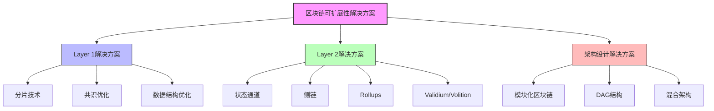

# 区块链可扩展性理论：形式化分析

## 目录

- [区块链可扩展性理论：形式化分析](#区块链可扩展性理论形式化分析)
  - [目录](#目录)
  - [1. 引言](#1-引言)
    - [1.1 区块链可扩展性问题](#11-区块链可扩展性问题)
    - [1.2 可扩展性的形式化定义](#12-可扩展性的形式化定义)
    - [1.3 可扩展性解决方案概览](#13-可扩展性解决方案概览)
  - [2. 分片技术形式化基础](#2-分片技术形式化基础)
    - [2.1 分片基本定义](#21-分片基本定义)
    - [2.2 分片安全性理论](#22-分片安全性理论)
    - [2.3 分片吞吐量分析](#23-分片吞吐量分析)
  - [3. 扩展性三角悖论](#3-扩展性三角悖论)
    - [3.1 三角悖论的形式化定义](#31-三角悖论的形式化定义)
    - [3.2 扩展方案在三角悖论中的定位](#32-扩展方案在三角悖论中的定位)
  - [4. Layer2解决方案的形式化模型](#4-layer2解决方案的形式化模型)
    - [4.1 Layer2系统的通用形式化定义](#41-layer2系统的通用形式化定义)
    - [4.2 Rollup模型形式化](#42-rollup模型形式化)
    - [4.3 状态通道形式化模型](#43-状态通道形式化模型)
    - [4.4 Layer2扩展性分析](#44-layer2扩展性分析)
  - [5. 可扩展性权衡理论](#5-可扩展性权衡理论)
    - [5.1 基础权衡关系的形式化](#51-基础权衡关系的形式化)
    - [5.2 数据可用性理论](#52-数据可用性理论)
    - [5.3 验证复杂性与可扩展性](#53-验证复杂性与可扩展性)
  - [6. 扩展方案形式化比较框架](#6-扩展方案形式化比较框架)
    - [6.1 评估维度的形式化定义](#61-评估维度的形式化定义)
    - [6.2 比较分析框架](#62-比较分析框架)
    - [6.3 Rust代码实现：扩展方案比较工具](#63-rust代码实现扩展方案比较工具)
  - [7. 跨分片通信的形式化模型](#7-跨分片通信的形式化模型)
    - [7.1 跨分片通信基本概念](#71-跨分片通信基本概念)
    - [7.2 跨分片一致性模型](#72-跨分片一致性模型)
    - [7.3 跨分片通信效率分析](#73-跨分片通信效率分析)
    - [7.4 跨分片通信优化策略](#74-跨分片通信优化策略)
  - [8. 可扩展性验证与评估](#8-可扩展性验证与评估)
    - [8.1 可扩展性指标形式化](#81-可扩展性指标形式化)
    - [8.2 评估方法论](#82-评估方法论)
    - [8.3 测试套件设计](#83-测试套件设计)
  - [9. 结论与未来研究方向](#9-结论与未来研究方向)
    - [9.1 主要结论](#91-主要结论)
    - [9.2 未来研究方向](#92-未来研究方向)
    - [9.3 开放问题](#93-开放问题)
  - [参考文献](#参考文献)

## 1. 引言

区块链可扩展性问题是Web3发展中的关键挑战，它直接影响了区块链技术能否支持大规模商业应用。本文提供了区块链可扩展性解决方案的严格形式化分析，深入探讨分片技术、Layer2扩展方案的数学基础、安全性证明以及性能与安全性的权衡理论。

### 1.1 区块链可扩展性问题

区块链可扩展性问题指的是区块链网络随着用户和交易量增长而维持性能的能力。传统区块链面临的主要瓶颈包括：

1. **交易吞吐量限制**：基础层区块链每秒可处理的交易数量有限
2. **存储扩展问题**：所有节点存储全部状态导致的存储爆炸
3. **网络带宽限制**：节点间数据传输速度的物理限制
4. **验证计算限制**：单节点验证计算能力的限制
5. **最终确认时间**：交易达到最终确认的时间周期

### 1.2 可扩展性的形式化定义

**定义 1.1** (可扩展性): 系统的可扩展性 $S$ 是系统性能 $P$ 随着系统规模 $N$ 增长的变化率：

$$S = \frac{dP}{dN}$$

区块链系统是可扩展的，当且仅当 $S \geq 0$，即系统性能不随规模增长而下降。

理想的线性可扩展性满足 $P \propto N$，即性能与系统规模成正比。

**定义 1.2** (区块链可扩展性指标): 区块链的可扩展性通过以下指标量化：

1. **吞吐量** (TPS): 每秒处理的交易数
2. **延迟** (L): 交易提交到确认的时间
3. **存储效率** (SE): 处理单位交易所需的存储空间
4. **验证效率** (VE): 验证单位交易所需的计算资源

### 1.3 可扩展性解决方案概览



## 2. 分片技术形式化基础

### 2.1 分片基本定义

**定义 2.1** (分片系统): 区块链分片系统是一个五元组 $\mathcal{S} = (N, C, \Sigma, \mathcal{P}, \mathcal{T})$，其中：

- $N$ 是节点集合，$N = \{n_1, n_2, ..., n_m\}$
- $C$ 是共识协议
- $\Sigma = \{\sigma_1, \sigma_2, ..., \sigma_k\}$ 是分片集合
- $\mathcal{P}: N \rightarrow 2^{\Sigma}$ 是节点到分片的分配函数
- $\mathcal{T}: 2^{\Sigma} \times 2^{\Sigma} \rightarrow \mathcal{M}$ 是分片间通信函数，$\mathcal{M}$ 是消息空间

**定义 2.2** (分片映射): 节点与分片之间的映射 $\mathcal{P}$ 满足：

1. **覆盖性**: $\bigcup_{n \in N} \mathcal{P}(n) = \Sigma$（每个分片至少有一个节点）
2. **负载平衡**: $\forall \sigma_i \in \Sigma: |\{n \in N | \sigma_i \in \mathcal{P}(n)\}| \approx \frac{|N| \cdot f}{|\Sigma|}$（每个分片有大致相同数量的节点），其中 $f$ 是复制因子

**定义 2.3** (分片安全阈值): 对于分片 $\sigma_i$，其安全阈值 $\tau_i$ 定义为使分片维持安全所需的诚实节点比例的最小值。

### 2.2 分片安全性理论

**定理 2.1** (分片安全性): 在随机分片分配模型下，如果全局网络中诚实节点比例为 $h > \frac{1}{2}$，且每个分片有 $m$ 个节点，则单一分片被攻击者控制的概率至多为：

$$P(\text{分片被攻击}) \leq e^{-m \cdot D(1/2 || 1-h)}$$

其中 $D(p || q) = p\ln\frac{p}{q} + (1-p)\ln\frac{1-p}{1-q}$ 是KL散度。

**证明**:
设随机变量 $X$ 表示分片中的恶意节点数，$X$ 服从二项分布 $B(m, 1-h)$。
分片被攻击当且仅当 $X > \frac{m}{2}$。
根据Chernoff界，有：

$$P(X > \frac{m}{2}) \leq e^{-m \cdot D(1/2 || 1-h)}$$

当 $h > \frac{1}{2}$ 时，$D(1/2 || 1-h) > 0$，因此随着 $m$ 增大，该概率指数下降。■

**推论 2.1**: 为了使单一分片被攻击概率小于 $\epsilon$，每个分片的节点数 $m$ 需满足：

$$m \geq \frac{\ln(1/\epsilon)}{D(1/2 || 1-h)}$$

**定理 2.2** (分片委员会安全性): 如果使用安全的随机数生成协议，并且网络中诚实节点比例为 $h > \frac{2}{3}$，则可以保证每个分片委员会中的诚实节点比例至少为 $\frac{2}{3}$ 的概率至少为 $1 - e^{-\Omega(m)}$，其中 $m$ 是委员会大小。

**证明**:
采用类似定理2.1的证明方法，应用Chernoff界和概率集中性不等式，可得结论。■

### 2.3 分片吞吐量分析

**定义 2.4** (理论吞吐量增益): 理论吞吐量增益 $G_T$ 定义为分片系统的总吞吐量与单链系统吞吐量之比：

$$G_T = \frac{T_S}{T_B} = \alpha \cdot |\Sigma|$$

其中 $T_S$ 是分片系统吞吐量，$T_B$ 是基础链吞吐量，$\alpha$ 是效率系数（$0 < \alpha \leq 1$），$|\Sigma|$ 是分片数量。

**定理 2.3** (分片扩展上限): 在保持安全性不变的情况下，分片系统的最大可扩展增益受以下因素限制：

$$G_{max} = \min(\frac{|N|}{m_{min}}, \frac{B_{global}}{B_{shard}})$$

其中 $|N|$ 是总节点数，$m_{min}$ 是维持安全所需的每个分片的最小节点数，$B_{global}$ 是全网带宽，$B_{shard}$ 是分片间通信所需的最小带宽。

**证明**:

1. 节点限制：最多可以创建 $\frac{|N|}{m_{min}}$ 个安全分片
2. 带宽限制：最多可以支持 $\frac{B_{global}}{B_{shard}}$ 个分片的通信
3. 取两者的最小值即为最大可扩展增益

因此，$G_{max} = \min(\frac{|N|}{m_{min}}, \frac{B_{global}}{B_{shard}})$。■

## 3. 扩展性三角悖论

### 3.1 三角悖论的形式化定义

**定义 3.1** (区块链三角悖论): 区块链三角悖论指出，区块链系统不可能同时最大化以下三个属性：

1. **去中心化** (D): 系统在地理和政治上的分散程度
2. **安全性** (S): 系统抵抗攻击的能力
3. **可扩展性** (E): 系统处理交易的能力

形式化表示为：对于任意区块链系统 $\mathcal{B}$，不存在参数配置使得函数 $D(\mathcal{B})$, $S(\mathcal{B})$ 和 $E(\mathcal{B})$ 同时达到最大值。

**定理 3.1** (三角悖论证明): 在理想情况下，区块链系统的三个核心属性之间存在此消彼长的关系，可以形式化为：

$$D(\mathcal{B}) \times S(\mathcal{B}) \times E(\mathcal{B}) \leq C$$

其中 $C$ 是由当前技术能力决定的常数上限。

**证明**:

1. 节点数量增加（去中心化提高）会导致共识延迟增加（可扩展性下降）
2. 提高安全性需要增加冗余验证，减少了有效吞吐量
3. 提高可扩展性通常需要减少验证节点或简化验证（降低去中心化或安全性）

这三者的乘积受物理和技术约束，不可能突破上限 $C$。■

### 3.2 扩展方案在三角悖论中的定位

各种扩展解决方案在三角悖论中的定位可以通过下表表示：

| 扩展解决方案 | 去中心化 (D) | 安全性 (S) | 可扩展性 (E) |
|-------------|-------------|-----------|------------|
| 分片技术     | 中          | 中        | 高         |
| Rollup (ZK) | 低-中        | 高        | 高         |
| Rollup (Optimistic) | 中    | 中-高     | 高         |
| 状态通道     | 高          | 高 (参与方) | 极高       |
| 侧链        | 低-中        | 低-中      | 高         |
| 验证器减少   | 低          | 中        | 高         |
| 区块大小增加 | 中-高       | 低-中      | 中-高      |

**定理 3.2** (解决方案优化定理): 给定技术约束 $C$，最优的扩展解决方案是在三角悖论的边界上，且满足应用特定需求的解决方案。

**证明**:
设应用对三个属性的重要性权重为 $w_D$, $w_S$, $w_E$，则最优解满足：

$$\max_{D,S,E} w_D \cdot D + w_S \cdot S + w_E \cdot E$$
$$s.t. D \times S \times E \leq C$$

应用拉格朗日乘数法可得，最优解必在约束边界上。■

## 4. Layer2解决方案的形式化模型

### 4.1 Layer2系统的通用形式化定义

**定义 4.1** (Layer2系统): Layer2系统是一个六元组 $\mathcal{L} = (L_1, L_2, \Phi_u, \Phi_d, V, \mathcal{D})$，其中：

- $L_1$ 是Layer1系统（基础层）
- $L_2$ 是Layer2系统（扩展层）
- $\Phi_u: L_2 \rightarrow L_1$ 是上行映射函数，将L2状态/交易映射到L1
- $\Phi_d: L_1 \rightarrow L_2$ 是下行映射函数，将L1状态/交易映射到L2
- $V: L_2 \times L_1 \rightarrow \{0,1\}$ 是验证函数，验证L2状态转换的正确性
- $\mathcal{D}$ 是争议解决机制，解决L2状态转换的争议

**定义 4.2** (Layer2系统类型): 根据状态验证和数据可用性，Layer2系统可分为以下类型：

1. **侧链**: $V$ 仅在L2网络内执行，与L1独立
2. **Plasma**: $L_1$ 存储承诺，$L_2$ 存储数据，$V$ 允许用户在发现欺诈时退出
3. **Rollup**: $L_1$ 存储交易数据和状态根，$V$ 由L1验证
   - **Optimistic Rollup**: 假设状态转换默认有效，使用欺诈证明挑战
   - **ZK Rollup**: 使用零知识证明证明状态转换的正确性
4. **Validium**: 与ZK Rollup类似，但数据存储在链下
5. **状态通道**: 参与者之间的点对点状态更新，仅在需要时使用L1解决争议

### 4.2 Rollup模型形式化

**定义 4.3** (Rollup): Rollup系统是一个特殊的Layer2系统，其中：

1. **交易数据可用性**: 所有L2交易数据都发布在L1上
2. **状态验证**: L2状态转换的有效性可以在L1上验证

形式化表示为 $\mathcal{R} = (L_1, L_2, \Phi_u, \Phi_d, V, \mathcal{D}, \mathcal{B})$，其中 $\mathcal{B}$ 是批处理函数，将多个L2交易批量处理为一个L1交易。

**定义 4.4** (Optimistic Rollup): Optimistic Rollup是具有欺诈证明机制的Rollup：

$$
V_{OR}(s, \delta, \pi) = \begin{cases}
1 & \text{如果} \delta \text{是有效的状态转换或没有欺诈证明} \pi \\
0 & \text{如果存在欺诈证明} \pi \text{反驳} \delta
\end{cases}
$$

其中 $s$ 是当前状态，$\delta$ 是声称的状态转换，$\pi$ 是欺诈证明。

**定义 4.5** (ZK Rollup): ZK Rollup是具有零知识证明的Rollup：

$$
V_{ZKR}(s, s', \pi) = \begin{cases}
1 & \text{如果} \pi \text{是从} s \text{到} s' \text{转换的有效零知识证明} \\
0 & \text{否则}
\end{cases}
$$

其中 $s$ 是原始状态，$s'$ 是新状态，$\pi$ 是零知识证明。

### 4.3 状态通道形式化模型

**定义 4.6** (状态通道): 状态通道是一个七元组 $\mathcal{C} = (P, S, L_1, \Delta, Sig, \Phi, \Psi)$，其中：

- $P = \{p_1, p_2, ..., p_n\}$ 是参与者集合
- $S = \{s_0, s_1, ..., s_m\}$ 是状态空间
- $L_1$ 是Layer1系统（基础层）
- $\Delta$ 是状态转换函数，$\Delta: S \times A \rightarrow S$
- $Sig$ 是签名验证函数，$Sig: P \times S \times Signature \rightarrow \{0,1\}$
- $\Phi$ 是通道打开函数，$\Phi: P \times S_0 \times Deposit \rightarrow L_1$
- $\Psi$ 是通道关闭函数，$\Psi: S \times \prod_{p \in P} Signature_p \rightarrow L_1$

**定理 4.1** (状态通道安全性): 如果所有参与者的签名都是安全的，且Layer1是安全的，则状态通道保证最终状态的正确性。

**证明**:
安全性基于两个关键属性：

1. 只有持有正确密钥的参与者才能生成有效签名
2. 在争议情况下，可以将最新有效状态（具有所有签名）提交到L1

因此，参与者无法强制执行未经其他人签名同意的状态转换，Layer1争议解决确保了最新有效状态的执行。■

### 4.4 Layer2扩展性分析

**定理 4.2** (Layer2吞吐量增益): Layer2系统的理论最大吞吐量增益 $G_{L2}$ 为：

$$G_{L2} = \frac{|T_{L2}|}{|T_{L1}|} = \frac{|T_{L2}|}{|\Phi_u(T_{L2})|}$$

其中 $|T_{L2}|$ 是Layer2交易数量，$|T_{L1}|$ 是对应的Layer1交易数量，$\Phi_u$ 是上行映射函数。

**证明**:
Layer2吞吐量增益直接取决于批处理比率，即多少L2交易可以批量处理为一个L1交易。此比率受以下因素影响：

1. 交易数据压缩率
2. 批处理函数 $\mathcal{B}$ 的效率
3. L1区块空间限制

在理想情况下，若L1交易可容纳的数据量为 $d_{L1}$，每个L2交易平均数据量为 $d_{L2}$，则理论最大吞吐量增益为 $\frac{d_{L1}}{d_{L2}}$。■

**定理 4.3** (Layer2安全性): Layer2系统的安全性不会超过其依赖的Layer1系统的安全性：

$$S(L_2) \leq S(L_1)$$

**证明**:
如果攻击者可以破坏Layer1系统，那么也可以破坏任何建立在其上的Layer2系统。例如，通过审查Layer2系统的状态提交交易或争议解决交易，攻击者可以使Layer2系统无法正常运行。因此，Layer2的安全性上限是Layer1的安全性。■

## 5. 可扩展性权衡理论

### 5.1 基础权衡关系的形式化

**定义 5.1** (基本权衡空间): 区块链可扩展性解决方案的权衡空间是一个多维空间，其中每个维度代表一个关键系统属性。核心维度包括：

1. 吞吐量 (T): 每秒处理的交易数
2. 延迟 (L): 交易确认时间
3. 数据可用性 (DA): 交易数据的可获取性
4. 确定性 (F): 交易最终确认的确定性
5. 验证复杂性 (V): 验证交易所需的计算资源
6. 去中心化程度 (D): 系统的分散性
7. 安全性 (S): 系统抵抗攻击的能力

**定理 5.1** (基本权衡定理): 在区块链系统中，以下基本权衡关系恒成立：

1. **吞吐量-延迟权衡**: $T \times L \geq K_1$
2. **吞吐量-安全性权衡**: $T \times S \leq K_2 \times N$
3. **去中心化-验证复杂性权衡**: $D \times V \leq K_3$
4. **数据可用性-可扩展性权衡**: 完全数据可用性下，$E \leq K_4 \times |L_1|$

其中 $K_1, K_2, K_3, K_4$ 是系统常数，$N$ 是网络节点数，$|L_1|$ 是Layer1容量。

**证明**:

1. 吞吐量-延迟权衡：基于网络传播速度限制，处理更多交易需要更长时间传播和验证
2. 吞吐量-安全性权衡：安全性要求足够的验证资源投入，在固定网络资源下，二者成反比
3. 去中心化-验证复杂性权衡：更高的去中心化需要更多节点验证，因此每个节点计算复杂性必须有上限
4. 数据可用性-可扩展性权衡：在Layer1存储所有数据的情况下，可扩展性受Layer1容量限制

这些基本物理和系统限制构成了权衡的理论基础。■

### 5.2 数据可用性理论

**定义 5.2** (数据可用性): 数据可用性是指区块链系统中交易数据对验证者的可获取性。形式化为函数 $DA: T \times N \rightarrow [0, 1]$，表示交易集合 $T$ 对节点集合 $N$ 的可用性。

**定义 5.3** (数据可用性区分): 根据数据存储位置，可扩展性方案可分为：

1. **链上数据**: 所有交易数据存储在L1，$DA(T, N) \approx 1$
2. **链下数据**: 交易数据存储在L2或外部系统，$DA(T, N) < 1$

**定理 5.2** (数据可用性三难困境): 区块链扩展方案不能同时满足高吞吐量、完全数据可用性和最小信任假设三个属性。

**证明**:
假设同时满足三个属性：

1. 高吞吐量要求处理大量交易
2. 完全数据可用性要求所有交易数据在链上存储
3. 最小信任假设要求数据可被所有节点独立验证

当吞吐量增加时，链上存储所有数据会导致区块大小增加，进而导致节点硬件需求增加，违反最小信任假设。因此三者不能同时满足。■

### 5.3 验证复杂性与可扩展性

**定义 5.4** (验证复杂性): 验证复杂性 $V(T)$ 是验证交易集合 $T$ 所需的计算资源。

**定理 5.3** (验证复杂性下界): 在无可信第三方的区块链系统中，验证复杂性至少与交易数量成线性关系：

$$V(T) \geq \Omega(|T|)$$

**证明**:
要验证交易集合 $T$ 的有效性，至少需要检查每个交易一次，因此验证复杂性下界是 $\Omega(|T|)$。任何宣称低于此界的方法都必须引入信任假设。■

**定理 5.4** (验证复杂性权衡): 在固定计算资源下，减少验证复杂性必然导致以下三种权衡之一：

1. 引入可信方（降低去中心化）
2. 降低安全保证（概率验证而非确定性验证）
3. 减少吞吐量

**证明**:
设验证者的计算资源上限为 $C$，则：

1. 如果 $V(T) > C$，验证者无法独立验证所有交易
2. 为了处理更多交易，必须选择以下方案之一：
   a. 依赖外部可信方（如汇总者）
   b. 降低验证标准（如随机采样验证）
   c. 减少处理的交易量

因此，在给定资源约束下，三种权衡至少需要选择一种。■

## 6. 扩展方案形式化比较框架

### 6.1 评估维度的形式化定义

为全面比较不同的扩展解决方案，我们定义以下形式化评估维度：

**定义 6.1** (吞吐量增益): 吞吐量增益 $G_T = \frac{T_{solution}}{T_{base}}$，其中 $T_{solution}$ 是解决方案的吞吐量，$T_{base}$ 是基础链的吞吐量。

**定义 6.2** (最终确认时间): 最终确认时间 $F = E[time_{submit} \rightarrow time_{final}]$，表示交易从提交到最终确认的期望时间。

**定义 6.3** (信任假设复杂度): 信任假设复杂度 $TA = |\{p | system \text{ 依赖 } p \text{ 的诚实行为}\}|$，表示系统依赖的可信方数量。

**定义 6.4** (可组合性): 可组合性 $C = \frac{|\{protocols | \text{可直接交互}\}|}{|\{protocols\}|}$，表示协议可直接交互的比例。

**定义 6.5** (资本效率): 资本效率 $CE = \frac{Value_{secured}}{Capital_{locked}}$，表示系统安全价值与锁定资本的比率。

### 6.2 比较分析框架

使用上述维度，我们构建了一个形式化比较框架，用于评估不同扩展方案：

| 扩展方案 | 吞吐量增益 $G_T$ | 数据可用性 $DA$ | 最终确认时间 $F$ | 信任假设 $TA$ | 可组合性 $C$ | 资本效率 $CE$ |
|---------|---------------|--------------|----------------|------------|------------|------------|
| 分片     | $O(n)$        | 高            | 中              | 低         | 中-高       | 中         |
| ZK Rollup | $O(10^2)$   | 高            | 低-中           | 低         | 中         | 高         |
| Optimistic Rollup | $O(10^2)$ | 高      | 高             | 中         | 中         | 中-高      |
| 状态通道   | $O(10^3)$     | 低            | 极低            | 高（参与方）  | 低         | 极高       |
| Validium | $O(10^3)$     | 低            | 低-中           | 中-高       | 中         | 高         |
| 侧链     | $O(10^2)$      | 中            | 中-高           | 高         | 低         | 低         |

**定理 6.1** (方案选择原则): 给定应用需求权重向量 $W = (w_T, w_{DA}, w_F, w_{TA}, w_C, w_{CE})$，最优扩展方案 $S^*$ 是使得加权评分最大的方案：

$$S^* = \arg\max_S (w_T \cdot G_T(S) + w_{DA} \cdot DA(S) + w_F \cdot F^{-1}(S) + w_{TA} \cdot TA^{-1}(S) + w_C \cdot C(S) + w_{CE} \cdot CE(S))$$

**证明**:
最优方案是在给定权重下，各评估维度加权和最高的方案。注意 $F$ 和 $TA$ 取倒数是因为这些指标越小越好。■

### 6.3 Rust代码实现：扩展方案比较工具

```rust
/// 区块链可扩展性解决方案的形式化评估框架
# [derive(Debug, Clone)]
pub struct ScalabilitySolution {
    pub name: String,
    pub throughput_gain: f64,        // 吞吐量增益
    pub data_availability: f64,      // 数据可用性 (0-1)
    pub finality_time: f64,          // 最终确认时间 (秒)
    pub trust_assumptions: f64,      // 信任假设 (越低越好)
    pub composability: f64,          // 可组合性 (0-1)
    pub capital_efficiency: f64,     // 资本效率
}

/// 评估解决方案的适用性分数
pub fn evaluate_solution(
    solution: &ScalabilitySolution,
    weights: &(f64, f64, f64, f64, f64, f64),
) -> f64 {
    let (w_t, w_da, w_f, w_ta, w_c, w_ce) = weights;

    // 归一化处理
    let norm_finality = 1.0 / solution.finality_time;
    let norm_trust = 1.0 / solution.trust_assumptions;

    // 加权计算
    w_t * solution.throughput_gain +
    w_da * solution.data_availability +
    w_f * norm_finality +
    w_ta * norm_trust +
    w_c * solution.composability +
    w_ce * solution.capital_efficiency
}

/// 根据应用需求选择最佳扩展方案
pub fn select_optimal_solution(
    solutions: &[ScalabilitySolution],
    requirements: &(f64, f64, f64, f64, f64, f64),
) -> &ScalabilitySolution {
    solutions
        .iter()
        .max_by(|a, b| {
            let score_a = evaluate_solution(a, requirements);
            let score_b = evaluate_solution(b, requirements);
            score_a.partial_cmp(&score_b).unwrap()
        })
        .unwrap()
}

/// 示例用法
fn example() {
    // 定义不同的扩展解决方案
    let solutions = vec![
        ScalabilitySolution {
            name: "分片".to_string(),
            throughput_gain: 100.0,
            data_availability: 0.9,
            finality_time: 30.0,
            trust_assumptions: 1.2,
            composability: 0.7,
            capital_efficiency: 0.6,
        },
        ScalabilitySolution {
            name: "ZK Rollup".to_string(),
            throughput_gain: 200.0,
            data_availability: 0.9,
            finality_time: 15.0,
            trust_assumptions: 1.5,
            composability: 0.5,
            capital_efficiency: 0.8,
        },
        // 更多解决方案...
    ];

    // DeFi应用权重示例：高度重视可组合性和低信任假设
    let defi_weights = (0.15, 0.2, 0.15, 0.2, 0.2, 0.1);

    // 游戏应用权重示例：高度重视吞吐量和低延迟
    let gaming_weights = (0.3, 0.1, 0.25, 0.1, 0.15, 0.1);

    // 为不同应用选择最佳方案
    let best_for_defi = select_optimal_solution(&solutions, &defi_weights);
    let best_for_gaming = select_optimal_solution(&solutions, &gaming_weights);

    println!("DeFi最佳扩展方案: {}", best_for_defi.name);
    println!("游戏最佳扩展方案: {}", best_for_gaming.name);
}
```

## 7. 跨分片通信的形式化模型

### 7.1 跨分片通信基本概念

**定义 7.1** (跨分片交易): 跨分片交易是需要多个分片参与的交易，形式化为：

$$T_{cross} = (src, dst, data, cond)$$

其中 $src$ 是源分片，$dst$ 是目标分片，$data$ 是交易数据，$cond$ 是交易条件。

**定义 7.2** (跨分片通信协议): 跨分片通信协议是一个四元组 $\Pi_{cross} = (S, R, V, C)$，其中：

- $S$ 是发送协议，由源分片执行
- $R$ 是接收协议，由目标分片执行
- $V$ 是验证函数，验证跨分片消息的有效性
- $C$ 是协调协议，处理故障和不一致情况

### 7.2 跨分片一致性模型

**定义 7.3** (跨分片一致性): 跨分片一致性是指在跨分片交易执行后，所有相关分片达到一致状态的保证。形式化为：

$$\forall t \in T_{cross}, \forall \sigma_i, \sigma_j \in affected(\Pi_{cross}(t)): View_{\sigma_i}(t) \equiv View_{\sigma_j}(t)$$

其中 $affected(\Pi_{cross}(t))$ 是受交易 $t$ 影响的分片集合，$View_{\sigma}(t)$ 是分片 $\sigma$ 对交易 $t$ 的视图。

**定理 7.1** (跨分片原子性): 如果跨分片通信协议 $\Pi_{cross}$ 满足以下条件，则它保证跨分片交易的原子性：

1. 两阶段提交：源分片锁定资源，目标分片确认或拒绝
2. 超时处理：如果目标分片在超时期限内未响应，则回滚交易
3. 冲突检测：在执行前检测和解决跨分片交易之间的冲突

**证明**:
设交易 $t$ 影响分片 $\sigma_1$ 和 $\sigma_2$：

1. 如果 $\sigma_1$ 和 $\sigma_2$ 都确认交易，则两者状态一致
2. 如果任一分片拒绝或超时，两阶段提交确保另一分片回滚
3. 冲突检测确保不会出现违反一致性的交易序列

因此，协议保证了跨分片交易的原子性。■

### 7.3 跨分片通信效率分析

**定理 7.2** (跨分片通信延迟): 在分片系统中，如果单个分片内交易确认时间为 $T_{intra}$，分片间消息传递时间为 $T_{msg}$，则跨分片交易的最小确认时间为：

$$T_{cross} \geq 2 \times T_{intra} + T_{msg}$$

**证明**:
跨分片交易至少需要以下步骤：

1. 源分片确认：$T_{intra}$
2. 跨分片消息传递：$T_{msg}$
3. 目标分片确认：$T_{intra}$

因此 $T_{cross} \geq 2 \times T_{intra} + T_{msg}$。■

**定理 7.3** (跨分片通信开销): 在具有 $n$ 个分片的系统中，如果跨分片交易占总交易的比例为 $p_{cross}$，则系统的有效吞吐量增益为：

$$G_{effective} = \frac{n}{1 + p_{cross} \times (n-1)}$$

**证明**:
设单分片吞吐量为 $T$，则：

1. 分片内交易吞吐量：$(1-p_{cross}) \times n \times T$
2. 跨分片交易吞吐量：$\frac{p_{cross} \times n \times T}{n-1}$（假设均匀分布在所有分片对之间）

总有效吞吐量为 $(1-p_{cross}) \times n \times T + \frac{p_{cross} \times n \times T}{n-1}$
因此吞吐量增益为 $G_{effective} = \frac{n}{1 + p_{cross} \times (n-1)}$。■

### 7.4 跨分片通信优化策略

跨分片通信优化策略可以形式化为以下几种：

1. **局部性优化**: 最小化跨分片交易比例 $p_{cross}$，通过智能分片策略：
   $$\min p_{cross} = \frac{|T_{cross}|}{|T|}$$

2. **异步处理**: 减少跨分片交易的阻塞时间，通过引入异步确认机制：
   $$T_{effective} = T_{intra} + \alpha \times T_{cross}$$，其中 $\alpha < 1$

3. **分片亲和性调度**: 根据交易关系动态调整分片分配：
   $$\mathcal{P}_{new} = \arg\min_{\mathcal{P}} \sum_{t \in T} Cost(t, \mathcal{P})$$

## 8. 可扩展性验证与评估

### 8.1 可扩展性指标形式化

**定义 8.1** (可扩展性指标集): 区块链可扩展性解决方案的全面评估指标集包括：

1. **吞吐量函数**: $T(n, p) = $ 系统在 $n$ 个节点和 $p$ 的并行度下的交易处理速率
2. **延迟函数**: $L(n, p) = $ 交易在 $n$ 个节点和 $p$ 的并行度下的确认时间
3. **存储效率**: $SE(n) = $ 存储 $n$ 个交易所需的空间
4. **验证复杂性**: $VC(n) = $ 验证 $n$ 个交易的计算复杂度
5. **节点需求**: $NR(t) = $ 处理吞吐量 $t$ 所需的最小节点性能
6. **通信复杂性**: $CC(n) = $ $n$ 个节点间达成共识的消息复杂度

### 8.2 评估方法论

**定义 8.2** (可扩展性评估方法): 区块链可扩展性解决方案的评估方法包括：

1. **理论分析**: 基于协议规范的渐近复杂性分析
2. **模拟测试**: 在模拟环境中的性能测试
3. **测试网验证**: 在测试网络中的实际部署测试
4. **生产网络数据**: 从生产环境采集的真实数据分析

**定理 8.1** (可扩展性评估完备性): 完整的可扩展性评估需要覆盖以下所有维度：

1. **单机性能**: 单节点吞吐量上限
2. **网络扩展**: 随节点数增加的性能变化
3. **状态增长**: 随状态大小增加的性能变化
4. **负载适应性**: 在不同负载下的性能变化
5. **故障弹性**: 在部分节点故障情况下的性能

**证明**:
如果任一维度缺失，则评估不能完整反映解决方案在真实环境中的表现。例如，仅测试单机性能无法预测网络规模扩大时的性能下降；忽略状态增长可能导致长期存储问题被忽视。完整评估需要覆盖所有关键维度。■

### 8.3 测试套件设计

理想的可扩展性测试套件应包含以下测试场景：

1. **基准测试**: 固定配置下的基本性能指标
2. **扩展测试**: 随着系统规模增加的性能变化
3. **负载测试**: 不同交易负载下的系统表现
4. **长期测试**: 长时间运行下的系统稳定性
5. **混沌测试**: 在网络分区、节点故障等异常情况下的表现

## 9. 结论与未来研究方向

### 9.1 主要结论

区块链可扩展性理论的形式化分析得出以下主要结论：

1. **扩展性三角悖论是基本约束**: 去中心化、安全性和可扩展性三者不可能同时最大化，任何扩展解决方案都必然在这三者之间做出权衡。

2. **分片技术提供线性扩展**: 分片是Layer1扩展的主要方案，在理想条件下可提供与分片数量成正比的吞吐量增益，但面临跨分片通信和安全性挑战。

3. **Layer2解决方案提供垂直扩展**: Layer2技术（如Rollups、状态通道）在特定应用场景下可提供数量级的吞吐量提升，但引入了不同程度的信任假设。

4. **不同应用场景需要不同扩展策略**: 没有一种扩展解决方案适合所有应用场景，应根据特定需求选择合适的扩展方案组合。

5. **可组合性与跨域通信是关键挑战**: 随着生态系统分散到多个Layer2和分片，保持可组合性和高效的跨域通信成为新的挑战。

### 9.2 未来研究方向

未来区块链可扩展性研究的关键方向包括：

1. **递归零知识证明系统**: 开发更高效的递归证明系统，降低ZK Rollup的证明生成成本。

2. **跨域可组合性协议**: 研究允许不同Layer2和分片之间无信任、低延迟交互的协议。

3. **动态分片技术**: 开发能根据网络负载自动调整分片结构的动态分片系统。

4. **数据可用性解决方案**: 改进数据可用性抽样和数据可用性委员会等技术，降低数据存储成本。

5. **模块化区块链研究**: 进一步发展执行、共识、数据可用性和结算分离的模块化区块链架构。

6. **形式化验证方法**: 开发更完善的形式化方法，验证复杂扩展解决方案的安全性和正确性。

### 9.3 开放问题

以下是区块链可扩展性领域仍待解决的关键开放问题：

1. **安全多分片原子性**: 如何在不引入全局锁定的情况下实现跨分片原子交易？

2. **Layer2互操作标准**: 如何设计标准化的Layer2互操作协议，实现不同Layer2解决方案之间的无缝通信？

3. **抗量子扩展性**: 如何设计既能抵抗量子计算威胁又保持高扩展性的区块链架构？

4. **状态爆炸解决方案**: 如何解决区块链状态持续增长导致的节点运行成本问题？

5. **去中心化证明系统**: 如何设计既高效又不依赖可信设置的零知识证明系统？

---

## 参考文献

1. Buterin, V., & Poon, J. (2017). Plasma: Scalable Autonomous Smart Contracts.
2. Zamani, M., Movahedi, M., & Raykova, M. (2018). RapidChain: Scaling Blockchain via Full Sharding.
3. Al-Bassam, M., Sonnino, A., & Buterin, V. (2018). Fraud Proofs: Maximising Light Client Security and Scaling Blockchains with Dishonest Majorities.
4. Kalodner, H., Goldfeder, S., Chen, X., Weinberg, S. M., & Felten, E. W. (2018). Arbitrum: Scalable, private smart contracts.
5. Gorbunov, S., Reyzin, L., Wee, H., & Zhang, Z. (2020). Pointproofs: Aggregating Proofs for Multiple Vector Commitments.
6. Teutsch, J., & Reitwießner, C. (2019). TrueBit: A scalable verification solution for blockchains.
7. Luu, L., Narayanan, V., Zheng, C., Baweja, K., Gilbert, S., & Saxena, P. (2016). A Secure Sharding Protocol For Open Blockchains.
8. Fanti, G., Kogan, L., Oh, S., Ruan, K., Viswanath, P., & Wang, G. (2019). Compounding of Wealth in Proof-of-Stake Cryptocurrencies.
