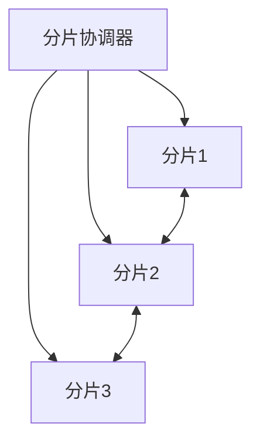

# 04.01 Web3 分片技术

## 目录
1. 分片技术定义与背景
2. 分片理论基础与模型
3. 分片协议与算法
4. 分片在Web3中的应用
5. 代码示例（Rust/Golang）
6. 图表与流程图
7. 数学证明与形式化分析
8. 交叉引用与参考文献

---

## 1. 分片技术定义与背景
分片（Sharding）是一种将区块链网络划分为多个子网络（分片）的扩展性技术，每个分片可独立处理交易和智能合约，提高整体吞吐量。

## 2. 分片理论基础与模型
- 分布式系统分片理论
- 数据一致性与分片安全性
- 分片与去中心化权衡

## 3. 分片协议与算法
- 静态分片与动态分片
- 典型分片协议（如Ethereum 2.0 Sharding）
- 分片间通信机制

## 4. 分片在Web3中的应用
- 以太坊2.0分片架构
- 其他区块链分片实践

## 5. 代码示例（Rust）
```rust
// 分片节点结构体示例
struct ShardNode {
    id: u32,
    data: Vec<u8>,
}

impl ShardNode {
    fn process_transaction(&mut self, tx: &[u8]) {
        // 处理分片内交易
        self.data.extend_from_slice(tx);
    }
}
```

## 6. 图表与流程图


## 7. 数学证明与形式化分析
- 分片安全性证明：
  \[
    P_{secure} = 1 - (1 - p)^n
  \]
  其中 \(p\) 为单节点安全概率，\(n\) 为分片节点数。

## 8. 交叉引用与参考文献
- [以太坊2.0分片设计](https://vitalik.ca/general/2021/04/07/sharding.html)
- 参见 [04_Scalability/README.md](./README.md)
