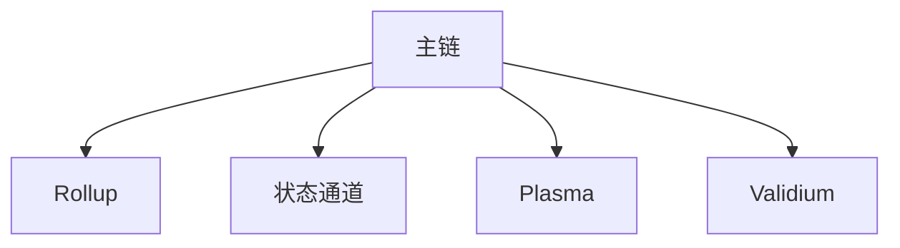

# 04.02.05 Layer2 方案对比与应用

## 目录

1. Layer2 方案定义与分类
2. 主要Layer2技术原理
3. 方案对比分析
4. 典型应用场景
5. 代码示例（Rust/Golang）
6. 图表与流程图
7. 数学分析与形式化证明
8. 交叉引用与参考文献

---

## 1. Layer2 方案定义与分类

Layer2 是指在主链（Layer1）之上构建的扩展性解决方案，常见类型包括状态通道、Rollup（Optimistic/ZK）、Plasma、Validium等。

## 2. 主要Layer2技术原理

- 状态通道：链下多方交互，链上结算。
- Rollup：链下执行，链上数据可用性与证明。
- Plasma：子链结构，定期提交主链。
- Validium：链下数据存储，链上有效性证明。

## 3. 方案对比分析

| 方案      | 吞吐量 | 安全性 | 数据可用性 | 适用场景 |
|-----------|--------|--------|------------|----------|
| 状态通道  | 高     | 依赖参与方 | 链下      | 高频微支付 |
| Optimistic Rollup | 高 | 继承主链 | 链上      | 通用扩展 |
| ZK Rollup | 高     | 继承主链 | 链上      | DeFi、NFT |
| Plasma    | 中     | 继承主链 | 链下      | 游戏、支付 |
| Validium  | 高     | 继承主链 | 链下      | 大规模数据 |

## 4. 典型应用场景

- 状态通道：闪电网络、Raiden
- Rollup：Arbitrum、Optimism、zkSync、StarkNet
- Plasma：OMG Network
- Validium：StarkEx

## 5. 代码示例（Rust）

```rust
// Rollup交易批量提交伪代码
struct RollupBatch {
    txs: Vec<Transaction>,
}

impl RollupBatch {
    fn submit_to_chain(&self) {
        // 提交批次到主链
    }
}
```

## 6. 图表与流程图



## 7. 数学分析与形式化证明

- Rollup安全性：
  \[
    S_{rollup} = S_{L1} \times P_{proof}
  \]
  其中 \(S_{L1}\) 为主链安全性，\(P_{proof}\) 为有效性证明概率。

## 8. 交叉引用与参考文献

- [Layer2 Scaling](https://ethereum.org/en/developers/docs/scaling/layer-2-rollups/)
- 参见 [04_Scalability/README.md](../README.md)
