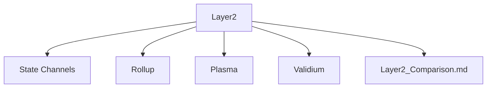

# 04.02 Layer2 扩展方案分层导航

## 目录结构
- 状态通道
- Rollup（Optimistic/ZK）
- Plasma
- Validium
- 方案对比与应用
- 归档（见 99_Recycle_Bin 或 00-备份）

## 主题导航
- 返回 [可扩展性主题](../README.md)
- 交叉引用：[知识图谱](../../00_Knowledge_Graph.md)

## Mermaid知识图谱锚点
