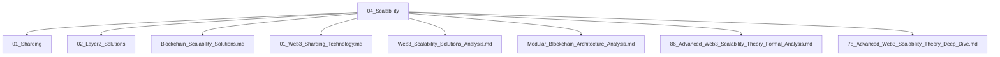

# 04_Scalability 可扩展性主题分层导航

## 目录结构
- 分片技术
- Layer2扩展方案
- 可扩展性理论与模型
- 模块化区块链
- 方案分析与对比
- 高级/深度分析
- 归档（见 99_Recycle_Bin 或 00-备份）

## 主题导航
- 返回 [全局索引](../00_Index_and_Classification.md)
- 交叉引用：[知识图谱](../00_Knowledge_Graph.md)

## Mermaid知识图谱锚点
