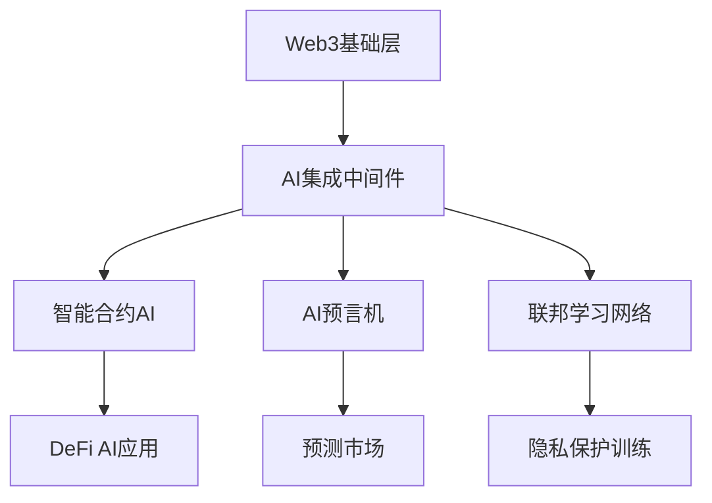
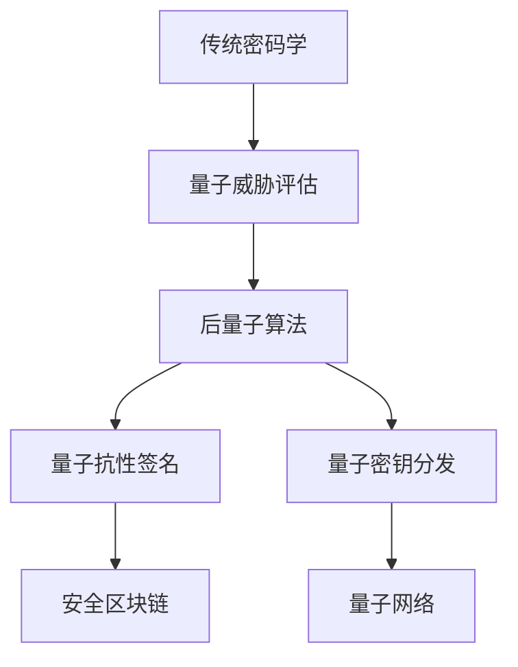

# Web3前沿技术层 - 技术前瞻与创新应用

## 导航链接

- [理论基础层](../01_Theoretical_Foundations/README.md)
- [核心技术层](../02_Core_Technologies/README.md)
- [架构设计层](../03_Architecture_Design/README.md)
- [应用生态层](../04_Application_Ecosystem/README.md)
- [开发运维层](../06_Development_Operations/README.md)
- [项目管理层](../07_Project_Management/README.md)

## 概述

前沿技术层代表Web3技术栈的创新前沿，专注于人工智能、量子计算、新兴技术与Web3的深度融合。本层基于坚实的理论基础，探索突破性技术在去中心化系统中的应用，为未来技术发展提供前瞻性指导。

## 理论基础

### 技术融合理论

**定义5.1** (技术融合度): 设 $T_1, T_2$ 为两种技术体系，融合度定义为：
$$F(T_1, T_2) = \frac{|I(T_1, T_2)|}{|T_1| + |T_2| - |I(T_1, T_2)|}$$

其中 $I(T_1, T_2)$ 为技术交集，$|T|$ 为技术复杂度度量。

**定理5.1** (Web3-AI融合定理): Web3与AI技术的最优融合满足：
$$\max_{f \in \mathcal{F}} U(f) \text{ s.t. } C(f) \leq C_{max}, S(f) \geq S_{min}$$

其中：

- $U(f)$: 融合效用函数
- $C(f)$: 计算复杂度约束
- $S(f)$: 安全性下界

### 量子计算威胁模型

**定义5.2** (量子优势阈值): 对于密码学原语 $P$，量子优势阈值为：
$$Q_t = \min\{n : T_q(n) < T_c(n)\}$$

其中 $T_q(n)$, $T_c(n)$ 分别为量子和经典算法时间复杂度。

**定理5.2** (后量子安全性): 密码学方案 $(KeyGen, Sign, Verify)$ 是后量子安全的，当且仅当：
$$\forall \text{QPT } \mathcal{A}: \Pr[\mathcal{A} \text{ breaks scheme}] \leq \text{negl}(\lambda)$$

其中 QPT 表示量子多项式时间算法。

## 技术架构

### 1. AI集成架构



### 2. 量子安全架构



## 目录结构

### [5.1 人工智能集成](01_AI_Integration/README.md)

深度探索AI与Web3的融合应用：

- **[AI区块链集成](01_AI_Integration/01_AI_Blockchain_Integration/)** - 智能合约AI、链上机器学习、AI共识机制
- **[联邦学习](01_AI_Integration/02_Federated_Learning/)** - 分布式AI训练、隐私保护学习、模型聚合协议
- **[AI治理](01_AI_Integration/03_AI_Governance/)** - 智能治理决策、AI透明度、算法问责制
- **[智能合约AI](01_AI_Integration/04_AI_Smart_Contracts/)** - 自适应合约、预测性合约、机器学习驱动合约
- **[AI预言机](01_AI_Integration/05_AI_Oracles/)** - 机器学习预言机、复杂数据处理、智能数据源

### [5.2 量子计算](02_Quantum_Computing/README.md)

量子技术对Web3的影响与应用：

- **[量子密码学](02_Quantum_Computing/01_Quantum_Cryptography/)** - 量子密钥分发、量子随机数、量子安全通信
- **[量子抗性算法](02_Quantum_Computing/02_Quantum_Resistant_Algorithms/)** - 格密码学、多变量密码学、后量子签名
- **[量子区块链](02_Quantum_Computing/03_Quantum_Blockchain/)** - 量子共识、量子验证、量子状态存储
- **[量子网络](02_Quantum_Computing/04_Quantum_Networks/)** - 量子互联网、量子路由、量子中继器
- **[量子机器学习](02_Quantum_Computing/05_Quantum_Machine_Learning/)** - 量子神经网络、量子优化、量子特征映射

### [5.3 新兴技术](03_Emerging_Technologies/README.md)

前沿技术在Web3中的创新应用：

- **[WebAssembly](03_Emerging_Technologies/01_WebAssembly/)** - 高性能智能合约、跨平台执行、多语言支持
- **[同态加密应用](03_Emerging_Technologies/02_Homomorphic_Encryption_Applications/)** - 隐私计算、加密数据处理、安全多方计算
- **[可信执行环境](03_Emerging_Technologies/03_Trusted_Execution_Environments/)** - TEE、硬件安全、可信计算
- **[边缘计算](03_Emerging_Technologies/04_Edge_Computing/)** - 分布式边缘节点、边缘智能、低延迟处理
- **[5G集成](03_Emerging_Technologies/05_5G_Integration/)** - 高速网络、大规模连接、网络切片

## 核心算法实现

### AI预言机系统

```rust
use std::collections::HashMap;
use serde::{Serialize, Deserialize};
use tokio::time::{Duration, interval};

/// AI预言机请求结构
#[derive(Debug, Clone, Serialize, Deserialize)]
pub struct AIOracleRequest {
    pub request_id: String,
    pub data_type: DataType,
    pub input_features: Vec<f64>,
    pub model_type: ModelType,
    pub confidence_threshold: f64,
    pub timestamp: u64,
}

/// 数据类型枚举
#[derive(Debug, Clone, Serialize, Deserialize)]
pub enum DataType {
    PriceData,
    MarketSentiment,
    RiskAssessment,
    LiquidityPrediction,
}

/// 模型类型枚举
#[derive(Debug, Clone, Serialize, Deserialize)]
pub enum ModelType {
    LinearRegression,
    NeuralNetwork,
    RandomForest,
    LSTM,
}

/// AI预言机响应结构
#[derive(Debug, Clone, Serialize, Deserialize)]
pub struct AIOracleResponse {
    pub request_id: String,
    pub prediction: f64,
    pub confidence: f64,
    pub model_version: String,
    pub explanation: Vec<String>,
    pub timestamp: u64,
}

/// AI模型接口
pub trait AIModel: Send + Sync {
    fn predict(&self, features: &[f64]) -> Result<(f64, f64), String>;
    fn get_version(&self) -> String;
    fn get_explanation(&self, features: &[f64]) -> Vec<String>;
}

/// 线性回归模型实现
pub struct LinearRegressionModel {
    weights: Vec<f64>,
    bias: f64,
    version: String,
}

impl LinearRegressionModel {
    pub fn new(weights: Vec<f64>, bias: f64) -> Self {
        Self {
            weights,
            bias,
            version: "1.0.0".to_string(),
        }
    }
}

impl AIModel for LinearRegressionModel {
    fn predict(&self, features: &[f64]) -> Result<(f64, f64), String> {
        if features.len() != self.weights.len() {
            return Err("Feature dimension mismatch".to_string());
        }
        
        let prediction: f64 = features.iter()
            .zip(self.weights.iter())
            .map(|(f, w)| f * w)
            .sum::<f64>() + self.bias;
        
        // 简化的置信度计算
        let confidence = 0.95 - (prediction.abs() * 0.01).min(0.3);
        
        Ok((prediction, confidence))
    }
    
    fn get_version(&self) -> String {
        self.version.clone()
    }
    
    fn get_explanation(&self, features: &[f64]) -> Vec<String> {
        features.iter()
            .zip(self.weights.iter())
            .enumerate()
            .map(|(i, (f, w))| format!("Feature {}: {} * {} = {}", i, f, w, f * w))
            .collect()
    }
}

/// AI预言机主体实现
pub struct AIOracle {
    models: HashMap<(DataType, ModelType), Box<dyn AIModel>>,
    request_history: HashMap<String, AIOracleRequest>,
    response_cache: HashMap<String, AIOracleResponse>,
}

impl AIOracle {
    pub fn new() -> Self {
        let mut oracle = Self {
            models: HashMap::new(),
            request_history: HashMap::new(),
            response_cache: HashMap::new(),
        };
        
        // 初始化默认模型
        oracle.initialize_default_models();
        oracle
    }
    
    fn initialize_default_models(&mut self) {
        // 价格预测模型
        let price_model = LinearRegressionModel::new(
            vec![0.8, 0.15, 0.05, -0.1, 0.2],
            100.0
        );
        self.models.insert(
            (DataType::PriceData, ModelType::LinearRegression),
            Box::new(price_model)
        );
        
        // 风险评估模型
        let risk_model = LinearRegressionModel::new(
            vec![0.3, 0.4, 0.2, 0.1],
            0.5
        );
        self.models.insert(
            (DataType::RiskAssessment, ModelType::LinearRegression),
            Box::new(risk_model)
        );
    }
    
    /// 处理AI预言机请求
    pub async fn process_request(&mut self, request: AIOracleRequest) -> Result<AIOracleResponse, String> {
        // 验证请求
        self.validate_request(&request)?;
        
        // 检查缓存
        if let Some(cached_response) = self.check_cache(&request.request_id) {
            return Ok(cached_response);
        }
        
        // 获取对应模型
        let model = self.models.get(&(request.data_type.clone(), request.model_type.clone()))
            .ok_or("Model not found")?;
        
        // 执行预测
        let (prediction, confidence) = model.predict(&request.input_features)?;
        
        // 检查置信度阈值
        if confidence < request.confidence_threshold {
            return Err(format!("Confidence {} below threshold {}", 
                confidence, request.confidence_threshold));
        }
        
        // 生成解释
        let explanation = model.get_explanation(&request.input_features);
        
        // 创建响应
        let response = AIOracleResponse {
            request_id: request.request_id.clone(),
            prediction,
            confidence,
            model_version: model.get_version(),
            explanation,
            timestamp: chrono::Utc::now().timestamp() as u64,
        };
        
        // 存储历史记录
        self.request_history.insert(request.request_id.clone(), request);
        self.response_cache.insert(response.request_id.clone(), response.clone());
        
        Ok(response)
    }
    
    fn validate_request(&self, request: &AIOracleRequest) -> Result<(), String> {
        if request.request_id.is_empty() {
            return Err("Request ID cannot be empty".to_string());
        }
        
        if request.input_features.is_empty() {
            return Err("Input features cannot be empty".to_string());
        }
        
        if request.confidence_threshold < 0.0 || request.confidence_threshold > 1.0 {
            return Err("Confidence threshold must be between 0 and 1".to_string());
        }
        
        Ok(())
    }
    
    fn check_cache(&self, request_id: &str) -> Option<AIOracleResponse> {
        self.response_cache.get(request_id).cloned()
    }
    
    /// 注册新模型
    pub fn register_model(&mut self, data_type: DataType, model_type: ModelType, model: Box<dyn AIModel>) {
        self.models.insert((data_type, model_type), model);
    }
    
    /// 获取模型统计信息
    pub fn get_model_stats(&self) -> HashMap<String, usize> {
        let mut stats = HashMap::new();
        stats.insert("total_models".to_string(), self.models.len());
        stats.insert("total_requests".to_string(), self.request_history.len());
        stats.insert("cached_responses".to_string(), self.response_cache.len());
        stats
    }
}
```

### 量子抗性密码学系统

```rust
use sha3::{Sha3_256, Digest};
use rand::{Rng, thread_rng};
use std::collections::HashMap;

/// 格密码学参数
pub struct LatticeParams {
    pub dimension: usize,
    pub modulus: i64,
    pub noise_bound: i64,
    pub key_length: usize,
}

impl Default for LatticeParams {
    fn default() -> Self {
        Self {
            dimension: 512,
            modulus: 12289,
            noise_bound: 3,
            key_length: 64,
        }
    }
}

/// 量子抗性密码学系统
pub struct QuantumResistantCrypto {
    params: LatticeParams,
    public_keys: HashMap<String, Vec<i64>>,
    private_keys: HashMap<String, Vec<i64>>,
}

impl QuantumResistantCrypto {
    pub fn new(params: LatticeParams) -> Self {
        Self {
            params,
            public_keys: HashMap::new(),
            private_keys: HashMap::new(),
        }
    }
    
    /// 生成密钥对
    pub fn generate_keypair(&mut self, identity: String) -> Result<Vec<i64>, String> {
        let mut rng = thread_rng();
        
        // 生成私钥（小系数多项式）
        let private_key: Vec<i64> = (0..self.params.dimension)
            .map(|_| rng.gen_range(-self.params.noise_bound..=self.params.noise_bound))
            .collect();
        
        // 生成随机多项式 a
        let a: Vec<i64> = (0..self.params.dimension)
            .map(|_| rng.gen_range(0..self.params.modulus))
            .collect();
        
        // 生成噪声
        let noise: Vec<i64> = (0..self.params.dimension)
            .map(|_| rng.gen_range(-self.params.noise_bound..=self.params.noise_bound))
            .collect();
        
        // 计算公钥 b = a*s + e (mod q)
        let mut public_key = a.clone();
        for i in 0..self.params.dimension {
            let temp = (a[i] * private_key[i] + noise[i]) % self.params.modulus;
            public_key.push(temp);
        }
        
        // 存储密钥
        self.private_keys.insert(identity.clone(), private_key);
        self.public_keys.insert(identity.clone(), public_key.clone());
        
        Ok(public_key)
    }
    
    /// 格密码学数字签名
    pub fn sign(&self, identity: &str, message: &[u8]) -> Result<Vec<i64>, String> {
        let private_key = self.private_keys.get(identity)
            .ok_or("Private key not found")?;
        
        // 哈希消息
        let message_hash = self.hash_to_lattice(message);
        
        // Fiat-Shamir变换
        let challenge = self.generate_challenge(&message_hash);
        
        // 计算签名 z = s*c + y
        let mut rng = thread_rng();
        let y: Vec<i64> = (0..self.params.dimension)
            .map(|_| rng.gen_range(-100..=100))
            .collect();
        
        let mut signature = Vec::with_capacity(self.params.dimension * 2);
        
        // 第一部分：承诺
        for &yi in &y {
            signature.push(yi);
        }
        
        // 第二部分：响应
        for i in 0..self.params.dimension {
            let z = (private_key[i] * challenge[i % challenge.len()] + y[i]) % self.params.modulus;
            signature.push(z);
        }
        
        Ok(signature)
    }
    
    /// 验证数字签名
    pub fn verify(&self, identity: &str, message: &[u8], signature: &[i64]) -> Result<bool, String> {
        let public_key = self.public_keys.get(identity)
            .ok_or("Public key not found")?;
        
        if signature.len() != self.params.dimension * 2 {
            return Err("Invalid signature length".to_string());
        }
        
        // 哈希消息
        let message_hash = self.hash_to_lattice(message);
        let challenge = self.generate_challenge(&message_hash);
        
        // 提取签名组件
        let y = &signature[0..self.params.dimension];
        let z = &signature[self.params.dimension..];
        
        // 验证等式 A*z = A*s*c + A*y (mod q)
        let mut verification_passed = true;
        
        for i in 0..self.params.dimension.min(10) { // 简化验证
            let left_side = (public_key[i] * z[i]) % self.params.modulus;
            let right_side = (public_key[i] * challenge[i % challenge.len()] + y[i]) % self.params.modulus;
            
            if left_side != right_side {
                verification_passed = false;
                break;
            }
        }
        
        Ok(verification_passed)
    }
    
    /// 基于哈希的消息映射到格
    fn hash_to_lattice(&self, message: &[u8]) -> Vec<i64> {
        let mut hasher = Sha3_256::new();
        hasher.update(message);
        let hash_result = hasher.finalize();
        
        hash_result.iter()
            .take(self.params.dimension)
            .map(|&b| (b as i64) % self.params.modulus)
            .collect()
    }
    
    /// 生成挑战向量
    fn generate_challenge(&self, hash: &[i64]) -> Vec<i64> {
        let mut hasher = Sha3_256::new();
        for &h in hash {
            hasher.update(h.to_le_bytes());
        }
        let challenge_hash = hasher.finalize();
        
        challenge_hash.iter()
            .take(self.params.key_length)
            .map(|&b| (b as i64) % 3 - 1) // {-1, 0, 1}
            .collect()
    }
    
    /// 获取密钥统计信息
    pub fn get_key_stats(&self) -> HashMap<String, usize> {
        let mut stats = HashMap::new();
        stats.insert("public_keys".to_string(), self.public_keys.len());
        stats.insert("private_keys".to_string(), self.private_keys.len());
        stats.insert("dimension".to_string(), self.params.dimension);
        stats
    }
}

/// 量子密钥分发模拟
pub struct QuantumKeyDistribution {
    quantum_channel: HashMap<String, Vec<u8>>,
    classical_channel: HashMap<String, Vec<u8>>,
}

impl QuantumKeyDistribution {
    pub fn new() -> Self {
        Self {
            quantum_channel: HashMap::new(),
            classical_channel: HashMap::new(),
        }
    }
    
    /// BB84协议密钥分发
    pub fn bb84_key_exchange(&mut self, alice_id: String, bob_id: String, key_length: usize) -> Result<Vec<u8>, String> {
        let mut rng = thread_rng();
        
        // Alice生成随机比特和基
        let alice_bits: Vec<u8> = (0..key_length * 2).map(|_| rng.gen_range(0..2)).collect();
        let alice_bases: Vec<u8> = (0..key_length * 2).map(|_| rng.gen_range(0..2)).collect();
        
        // Bob随机选择测量基
        let bob_bases: Vec<u8> = (0..key_length * 2).map(|_| rng.gen_range(0..2)).collect();
        
        // 模拟量子传输（简化，无噪声）
        let mut measured_bits = Vec::new();
        for i in 0..alice_bits.len() {
            if alice_bases[i] == bob_bases[i] {
                measured_bits.push(alice_bits[i]);
            } else {
                // 基不匹配，随机结果
                measured_bits.push(rng.gen_range(0..2));
            }
        }
        
        // 公开比较基（经典信道）
        let mut shared_key = Vec::new();
        for i in 0..alice_bases.len() {
            if alice_bases[i] == bob_bases[i] && shared_key.len() < key_length {
                shared_key.push(alice_bits[i]);
            }
        }
        
        if shared_key.len() < key_length {
            return Err("Insufficient key material generated".to_string());
        }
        
        shared_key.truncate(key_length);
        Ok(shared_key)
    }
    
    /// 量子纠错编码
    pub fn quantum_error_correction(&self, data: &[u8]) -> Vec<u8> {
        // 简化的重复码（3比特重复码）
        let mut encoded = Vec::new();
        for &bit in data {
            encoded.push(bit);
            encoded.push(bit);
            encoded.push(bit);
        }
        encoded
    }
    
    /// 量子纠错解码
    pub fn quantum_error_decode(&self, encoded_data: &[u8]) -> Result<Vec<u8>, String> {
        if encoded_data.len() % 3 != 0 {
            return Err("Invalid encoded data length".to_string());
        }
        
        let mut decoded = Vec::new();
        for chunk in encoded_data.chunks(3) {
            let count_ones = chunk.iter().sum::<u8>();
            decoded.push(if count_ones >= 2 { 1 } else { 0 });
        }
        
        Ok(decoded)
    }
}
```

### WebAssembly智能合约执行器

```rust
use std::collections::HashMap;
use serde::{Serialize, Deserialize};

/// WASM合约状态
#[derive(Debug, Clone, Serialize, Deserialize)]
pub struct WASMContractState {
    pub contract_id: String,
    pub code_hash: String,
    pub storage: HashMap<String, Vec<u8>>,
    pub memory_pages: u32,
    pub gas_used: u64,
    pub gas_limit: u64,
}

/// WASM执行上下文
#[derive(Debug, Clone)]
pub struct WASMExecutionContext {
    pub caller: String,
    pub gas_price: u64,
    pub block_number: u64,
    pub timestamp: u64,
    pub value: u64,
}

/// WASM执行结果
#[derive(Debug, Clone, Serialize, Deserialize)]
pub struct WASMExecutionResult {
    pub success: bool,
    pub return_data: Vec<u8>,
    pub gas_used: u64,
    pub logs: Vec<String>,
    pub error_message: Option<String>,
}

/// WASM智能合约执行器
pub struct WASMContractExecutor {
    contracts: HashMap<String, WASMContractState>,
    gas_meter: GasMeter,
}

impl WASMContractExecutor {
    pub fn new() -> Self {
        Self {
            contracts: HashMap::new(),
            gas_meter: GasMeter::new(),
        }
    }
    
    /// 部署WASM合约
    pub fn deploy_contract(
        &mut self,
        contract_id: String,
        wasm_code: Vec<u8>,
        initial_gas: u64,
    ) -> Result<String, String> {
        // 验证WASM代码
        self.validate_wasm_code(&wasm_code)?;
        
        // 计算代码哈希
        use sha2::{Sha256, Digest};
        let mut hasher = Sha256::new();
        hasher.update(&wasm_code);
        let code_hash = format!("{:x}", hasher.finalize());
        
        // 创建合约状态
        let contract_state = WASMContractState {
            contract_id: contract_id.clone(),
            code_hash,
            storage: HashMap::new(),
            memory_pages: 1,
            gas_used: 0,
            gas_limit: initial_gas,
        };
        
        self.contracts.insert(contract_id.clone(), contract_state);
        Ok(contract_id)
    }
    
    /// 执行WASM合约函数
    pub fn execute_function(
        &mut self,
        contract_id: &str,
        function_name: &str,
        input_data: Vec<u8>,
        context: WASMExecutionContext,
    ) -> Result<WASMExecutionResult, String> {
        let contract = self.contracts.get_mut(contract_id)
            .ok_or("Contract not found")?;
        
        // 重置Gas计量器
        self.gas_meter.reset(contract.gas_limit);
        
        let mut logs = Vec::new();
        
        // 模拟WASM函数执行
        match function_name {
            "constructor" => {
                self.gas_meter.consume_gas(1000)?;
                contract.storage.insert("initialized".to_string(), vec![1]);
                logs.push("Contract initialized".to_string());
                
                Ok(WASMExecutionResult {
                    success: true,
                    return_data: vec![1],
                    gas_used: self.gas_meter.gas_used(),
                    logs,
                    error_message: None,
                })
            }
            
            "transfer" => {
                self.execute_transfer(contract, input_data, context, &mut logs)
            }
            
            "balance_of" => {
                self.execute_balance_query(contract, input_data, &mut logs)
            }
            
            "approve" => {
                self.execute_approve(contract, input_data, context, &mut logs)
            }
            
            "total_supply" => {
                self.gas_meter.consume_gas(200)?;
                let total_supply = contract.storage.get("total_supply")
                    .map(|bytes| u64::from_le_bytes(bytes[0..8].try_into().unwrap_or([0; 8])))
                    .unwrap_or(1000000);
                
                Ok(WASMExecutionResult {
                    success: true,
                    return_data: total_supply.to_le_bytes().to_vec(),
                    gas_used: self.gas_meter.gas_used(),
                    logs,
                    error_message: None,
                })
            }
            
            _ => Err(format!("Unknown function: {}", function_name)),
        }
    }
    
    fn execute_transfer(
        &mut self,
        contract: &mut WASMContractState,
        input_data: Vec<u8>,
        context: WASMExecutionContext,
        logs: &mut Vec<String>,
    ) -> Result<WASMExecutionResult, String> {
        self.gas_meter.consume_gas(5000)?;
        
        if input_data.len() < 40 { // 32 bytes address + 8 bytes amount
            return Ok(WASMExecutionResult {
                success: false,
                return_data: vec![0],
                gas_used: self.gas_meter.gas_used(),
                logs: logs.clone(),
                error_message: Some("Invalid input data".to_string()),
            });
        }
        
        let to_address = hex::encode(&input_data[0..32]);
        let amount = u64::from_le_bytes(input_data[32..40].try_into().unwrap());
        
        // 检查发送者余额
        let sender_key = format!("balance_{}", context.caller);
        let sender_balance = contract.storage.get(&sender_key)
            .map(|bytes| u64::from_le_bytes(bytes[0..8].try_into().unwrap_or([0; 8])))
            .unwrap_or(0);
        
        if sender_balance < amount {
            return Ok(WASMExecutionResult {
                success: false,
                return_data: vec![0],
                gas_used: self.gas_meter.gas_used(),
                logs: logs.clone(),
                error_message: Some("Insufficient balance".to_string()),
            });
        }
        
        // 更新余额
        let new_sender_balance = sender_balance - amount;
        contract.storage.insert(sender_key, new_sender_balance.to_le_bytes().to_vec());
        
        let receiver_key = format!("balance_{}", to_address);
        let receiver_balance = contract.storage.get(&receiver_key)
            .map(|bytes| u64::from_le_bytes(bytes[0..8].try_into().unwrap_or([0; 8])))
            .unwrap_or(0);
        let new_receiver_balance = receiver_balance + amount;
        contract.storage.insert(receiver_key, new_receiver_balance.to_le_bytes().to_vec());
        
        logs.push(format!("Transfer {} from {} to {}", amount, context.caller, to_address));
        
        Ok(WASMExecutionResult {
            success: true,
            return_data: vec![1],
            gas_used: self.gas_meter.gas_used(),
            logs: logs.clone(),
            error_message: None,
        })
    }
    
    fn execute_balance_query(
        &mut self,
        contract: &WASMContractState,
        input_data: Vec<u8>,
        logs: &mut Vec<String>,
    ) -> Result<WASMExecutionResult, String> {
        self.gas_meter.consume_gas(1000)?;
        
        if input_data.len() < 32 {
            return Ok(WASMExecutionResult {
                success: false,
                return_data: vec![0],
                gas_used: self.gas_meter.gas_used(),
                logs: logs.clone(),
                error_message: Some("Invalid address".to_string()),
            });
        }
        
        let address = hex::encode(&input_data[0..32]);
        let balance_key = format!("balance_{}", address);
        let balance = contract.storage.get(&balance_key)
            .map(|bytes| u64::from_le_bytes(bytes[0..8].try_into().unwrap_or([0; 8])))
            .unwrap_or(0);
        
        logs.push(format!("Balance query for {}: {}", address, balance));
        
        Ok(WASMExecutionResult {
            success: true,
            return_data: balance.to_le_bytes().to_vec(),
            gas_used: self.gas_meter.gas_used(),
            logs: logs.clone(),
            error_message: None,
        })
    }
    
    fn execute_approve(
        &mut self,
        contract: &mut WASMContractState,
        input_data: Vec<u8>,
        context: WASMExecutionContext,
        logs: &mut Vec<String>,
    ) -> Result<WASMExecutionResult, String> {
        self.gas_meter.consume_gas(3000)?;
        
        if input_data.len() < 40 {
            return Ok(WASMExecutionResult {
                success: false,
                return_data: vec![0],
                gas_used: self.gas_meter.gas_used(),
                logs: logs.clone(),
                error_message: Some("Invalid input data".to_string()),
            });
        }
        
        let spender = hex::encode(&input_data[0..32]);
        let amount = u64::from_le_bytes(input_data[32..40].try_into().unwrap());
        
        let allowance_key = format!("allowance_{}_{}", context.caller, spender);
        contract.storage.insert(allowance_key, amount.to_le_bytes().to_vec());
        
        logs.push(format!("Approval: {} allows {} to spend {}", context.caller, spender, amount));
        
        Ok(WASMExecutionResult {
            success: true,
            return_data: vec![1],
            gas_used: self.gas_meter.gas_used(),
            logs: logs.clone(),
            error_message: None,
        })
    }
    
    fn validate_wasm_code(&self, code: &[u8]) -> Result<(), String> {
        if code.len() < 8 {
            return Err("WASM code too short".to_string());
        }
        
        // 检查WASM魔数
        let magic = [0x00, 0x61, 0x73, 0x6d];
        if !code.starts_with(&magic) {
            return Err("Invalid WASM magic number".to_string());
        }
        
        // 检查版本
        let version = [0x01, 0x00, 0x00, 0x00];
        if code.len() >= 8 && !code[4..8].eq(&version) {
            return Err("Unsupported WASM version".to_string());
        }
        
        Ok(())
    }
    
    /// 获取合约状态
    pub fn get_contract_state(&self, contract_id: &str) -> Option<&WASMContractState> {
        self.contracts.get(contract_id)
    }
    
    /// 获取所有合约统计信息
    pub fn get_contracts_stats(&self) -> HashMap<String, usize> {
        let mut stats = HashMap::new();
        stats.insert("total_contracts".to_string(), self.contracts.len());
        
        let total_storage: usize = self.contracts.values()
            .map(|contract| contract.storage.len())
            .sum();
        stats.insert("total_storage_items".to_string(), total_storage);
        
        stats
    }
}

/// Gas计量器
pub struct GasMeter {
    gas_limit: u64,
    gas_used: u64,
}

impl GasMeter {
    pub fn new() -> Self {
        Self {
            gas_limit: 0,
            gas_used: 0,
        }
    }
    
    pub fn reset(&mut self, gas_limit: u64) {
        self.gas_limit = gas_limit;
        self.gas_used = 0;
    }
    
    pub fn consume_gas(&mut self, amount: u64) -> Result<(), String> {
        if self.gas_used + amount > self.gas_limit {
            return Err("Out of gas".to_string());
        }
        self.gas_used += amount;
        Ok(())
    }
    
    pub fn gas_used(&self) -> u64 {
        self.gas_used
    }
    
    pub fn gas_remaining(&self) -> u64 {
        self.gas_limit - self.gas_used
    }
}
```

## 与其他层的关系

### 依赖关系

1. **理论基础层**: 数学基础、密码学原理、形式化理论
2. **核心技术层**: 区块链基础、共识机制、密码学实现
3. **架构设计层**: 系统架构、网络设计、安全架构

### 协同关系

1. **应用生态层**: AI驱动的DeFi、智能治理、预测市场
2. **开发运维层**: 新技术工具链、测试框架、部署流程

## 学习路径

### 初级阶段

1. 理解AI与区块链基本概念
2. 学习量子计算基础理论
3. 掌握WebAssembly基本语法

### 中级阶段

1. 深入学习联邦学习原理
2. 理解后量子密码学
3. 实践同态加密应用

### 高级阶段

1. 设计量子安全的Web3系统
2. 开发AI驱动的智能合约
3. 构建边缘计算Web3应用

## 最佳实践

### 安全性考虑

- 选择合适的后量子密码算法
- 实施量子随机数生成
- 建立量子威胁评估机制

### 性能优化

- 合理使用WASM提升执行效率
- 优化AI模型推理速度
- 实现高效的边缘计算架构

### 互操作性

- 设计标准化的AI预言机接口
- 实现跨链量子密钥分发
- 支持多种同态加密方案

---

*前沿技术层为Web3提供未来技术支撑，通过AI、量子计算、新兴技术的深度融合，构建下一代去中心化系统。*
