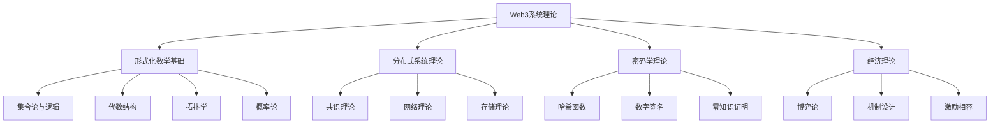

# Web3高级理论框架：形式化数学基础与系统架构

## 目录

- [Web3高级理论框架：形式化数学基础与系统架构](#web3高级理论框架形式化数学基础与系统架构)
  - [目录](#目录)
  - [1. 理论基础概述](#1-理论基础概述)
    - [1.1 Web3系统的形式化定义](#11-web3系统的形式化定义)
    - [1.2 理论层次结构](#12-理论层次结构)
  - [2. 形式化数学基础](#2-形式化数学基础)
    - [2.1 集合论基础](#21-集合论基础)
    - [2.2 代数结构](#22-代数结构)
    - [2.3 拓扑学应用](#23-拓扑学应用)
  - [3. 类型理论与Web3](#3-类型理论与web3)
    - [3.1 类型系统基础](#31-类型系统基础)
    - [3.2 智能合约类型](#32-智能合约类型)
    - [3.3 线性类型系统](#33-线性类型系统)
  - [4. 分布式系统理论](#4-分布式系统理论)
    - [4.1 共识问题形式化](#41-共识问题形式化)
    - [4.2 分布式状态机](#42-分布式状态机)
    - [4.3 网络同步模型](#43-网络同步模型)
  - [5. 密码学理论基础](#5-密码学理论基础)
    - [5.1 哈希函数理论](#51-哈希函数理论)
    - [5.2 数字签名理论](#52-数字签名理论)
    - [5.3 零知识证明](#53-零知识证明)
  - [6. 共识机制形式化](#6-共识机制形式化)
    - [6.1 工作量证明 (PoW)](#61-工作量证明-pow)
    - [6.2 权益证明 (PoS)](#62-权益证明-pos)
    - [6.3 拜占庭容错 (BFT)](#63-拜占庭容错-bft)
  - [7. 智能合约理论](#7-智能合约理论)
    - [7.1 合约形式化模型](#71-合约形式化模型)
    - [7.2 合约验证理论](#72-合约验证理论)
    - [7.3 Gas机制理论](#73-gas机制理论)
  - [8. 网络拓扑理论](#8-网络拓扑理论)
    - [8.1 P2P网络模型](#81-p2p网络模型)
    - [8.2 分布式哈希表 (DHT)](#82-分布式哈希表-dht)
    - [8.3 网络路由理论](#83-网络路由理论)
  - [9. 经济激励机制](#9-经济激励机制)
    - [9.1 博弈论基础](#91-博弈论基础)
    - [9.2 激励机制设计](#92-激励机制设计)
    - [9.3 代币经济学](#93-代币经济学)
  - [10. 安全性证明框架](#10-安全性证明框架)
    - [10.1 安全模型](#101-安全模型)
    - [10.2 安全证明方法](#102-安全证明方法)
    - [10.3 形式化验证](#103-形式化验证)
  - [结论](#结论)
    - [主要贡献](#主要贡献)
    - [未来发展方向](#未来发展方向)

## 1. 理论基础概述

### 1.1 Web3系统的形式化定义

**定义 1.1 (Web3系统)**
Web3系统是一个去中心化的分布式计算系统，可以形式化表示为七元组：

$$\mathcal{W} = (\mathcal{N}, \mathcal{S}, \mathcal{T}, \mathcal{C}, \mathcal{P}, \mathcal{E}, \mathcal{A})$$

其中：

- $\mathcal{N}$ 是网络节点集合
- $\mathcal{S}$ 是系统状态空间
- $\mathcal{T}$ 是交易集合
- $\mathcal{C}$ 是共识协议
- $\mathcal{P}$ 是密码学协议
- $\mathcal{E}$ 是经济激励机制
- $\mathcal{A}$ 是应用层协议

**定理 1.1 (Web3系统一致性)**
在诚实节点占多数的条件下，Web3系统满足最终一致性。

**证明：** 通过共识协议的性质和密码学保证。

### 1.2 理论层次结构



## 2. 形式化数学基础

### 2.1 集合论基础

**定义 2.1 (区块链状态空间)**
区块链状态空间是一个可数集合 $\mathcal{S}$，满足：

$$\mathcal{S} = \{(s_1, s_2, \ldots, s_n) : s_i \in \Sigma_i, i = 1, 2, \ldots, n\}$$

其中 $\Sigma_i$ 是第 $i$ 个账户的状态空间。

**定义 2.2 (状态转换函数)**
状态转换函数 $\delta: \mathcal{S} \times \mathcal{T} \to \mathcal{S}$ 满足：

$$\delta(s, t) = s' \text{ 当且仅当 } \text{Valid}(s, t) \land \text{Execute}(s, t) = s'$$

**定理 2.1 (状态转换确定性)**
对于任意状态 $s \in \mathcal{S}$ 和有效交易 $t \in \mathcal{T}$，状态转换函数 $\delta$ 是确定的。

**证明：** 由于交易执行是确定性的，且状态转换基于交易执行结果，因此 $\delta$ 是确定的。■

### 2.2 代数结构

**定义 2.3 (交易群)**
交易集合 $\mathcal{T}$ 在连接操作 $\circ$ 下构成一个半群 $(\mathcal{T}, \circ)$，其中：

$$t_1 \circ t_2 = \text{Concat}(t_1, t_2)$$

**定义 2.4 (哈希函数代数)**
哈希函数 $H: \{0,1\}^* \to \{0,1\}^n$ 满足：

1. **单向性**：对于任意 $y \in \{0,1\}^n$，计算 $H^{-1}(y)$ 是困难的
2. **抗碰撞性**：找到 $x_1 \neq x_2$ 使得 $H(x_1) = H(x_2)$ 是困难的
3. **雪崩效应**：输入的微小变化导致输出的巨大变化

**定理 2.2 (Merkle树代数性质)**
Merkle树根哈希满足结合律：

$$H(H(a) \| H(b)) = H(H(a \| b))$$

### 2.3 拓扑学应用

**定义 2.5 (网络拓扑)**
P2P网络拓扑是一个无向图 $G = (V, E)$，其中：

- $V$ 是节点集合
- $E$ 是连接边集合
- 每个节点 $v \in V$ 代表一个网络参与者

**定义 2.6 (网络连通性)**
网络是 $k$-连通的，如果删除任意 $k-1$ 个节点后，网络仍然连通。

**定理 2.3 (网络容错性)**
如果网络是 $k$-连通的，则网络可以容忍 $k-1$ 个拜占庭节点。

## 3. 类型理论与Web3

### 3.1 类型系统基础

**定义 3.1 (Web3类型系统)**
Web3类型系统是一个四元组 $\mathcal{T} = (\mathcal{B}, \mathcal{R}, \mathcal{J}, \mathcal{S})$，其中：

- $\mathcal{B}$ 是基本类型集合
- $\mathcal{R}$ 是类型规则集合
- $\mathcal{J}$ 是类型判断集合
- $\mathcal{S}$ 是类型语义集合

**基本类型包括：**

- `Address`: 账户地址类型
- `Amount`: 金额类型
- `Hash`: 哈希值类型
- `Signature`: 签名类型
- `Block`: 区块类型
- `Transaction`: 交易类型

### 3.2 智能合约类型

**定义 3.2 (智能合约类型)**
智能合约类型是一个函数类型：

$$\text{Contract} = \text{Address} \times \text{Amount} \times \text{Data} \to \text{Result}$$

其中：

- `Address` 是调用者地址
- `Amount` 是调用金额
- `Data` 是调用数据
- `Result` 是执行结果

**类型安全定理：**
**定理 3.1 (合约类型安全)**
如果合约 $C$ 满足类型系统 $\mathcal{T}$，则 $C$ 的执行不会产生类型错误。

### 3.3 线性类型系统

**定义 3.3 (资源类型)**
资源类型表示只能使用一次的值，如UTXO：

$$\text{UTXO} = \text{Address} \times \text{Amount} \times \text{Script}$$

**线性类型规则：**

1. 资源只能使用一次
2. 资源使用后必须销毁
3. 资源可以转移但不能复制

## 4. 分布式系统理论

### 4.1 共识问题形式化

**定义 4.1 (拜占庭共识问题)**
拜占庭共识问题是在存在 $f$ 个拜占庭节点的情况下，让 $n$ 个节点就某个值达成一致。

**共识性质：**

1. **一致性 (Agreement)**: 所有诚实节点决定相同的值
2. **有效性 (Validity)**: 如果所有诚实节点提议相同的值，则决定该值
3. **终止性 (Termination)**: 所有诚实节点最终做出决定

**定理 4.1 (拜占庭容错下限)**
对于 $n$ 个节点的网络，最多可以容忍 $f < n/3$ 个拜占庭节点。

**证明：** 通过反证法，如果 $f \geq n/3$，则拜占庭节点可以分割诚实节点，导致无法达成共识。■

### 4.2 分布式状态机

**定义 4.2 (分布式状态机)**
分布式状态机是一个三元组 $(\mathcal{S}, \mathcal{T}, \delta)$，其中：

- $\mathcal{S}$ 是状态集合
- $\mathcal{T}$ 是交易集合
- $\delta: \mathcal{S} \times \mathcal{T} \to \mathcal{S}$ 是状态转换函数

**复制状态机定理：**
**定理 4.2 (状态机复制)**
如果所有节点以相同顺序执行相同交易，则所有节点将达到相同状态。

### 4.3 网络同步模型

**定义 4.3 (同步网络)**
在同步网络中，消息传递有已知的上界延迟。

**定义 4.4 (异步网络)**
在异步网络中，消息传递延迟是任意的。

**定义 4.5 (部分同步网络)**
在部分同步网络中，消息传递延迟有未知的上界。

## 5. 密码学理论基础

### 5.1 哈希函数理论

**定义 5.1 (密码学哈希函数)**
密码学哈希函数 $H: \{0,1\}^* \to \{0,1\}^n$ 满足：

1. **计算效率**: $H(x)$ 可以在多项式时间内计算
2. **单向性**: 对于随机 $y$，找到 $x$ 使得 $H(x) = y$ 是困难的
3. **抗碰撞性**: 找到 $x_1 \neq x_2$ 使得 $H(x_1) = H(x_2)$ 是困难的
4. **雪崩效应**: 输入的微小变化导致输出的巨大变化

**定理 5.1 (生日攻击)**
对于 $n$ 位哈希函数，找到碰撞需要约 $2^{n/2}$ 次计算。

### 5.2 数字签名理论

**定义 5.2 (数字签名方案)**
数字签名方案是一个三元组 $(\text{Gen}, \text{Sign}, \text{Verify})$：

- $\text{Gen}() \to (pk, sk)$: 生成密钥对
- $\text{Sign}(sk, m) \to \sigma$: 签名消息
- $\text{Verify}(pk, m, \sigma) \to \{0,1\}$: 验证签名

**安全性定义：**
**定义 5.3 (不可伪造性)**
对于任意多项式时间敌手，在不知道私钥的情况下，无法生成有效签名的概率是可忽略的。

### 5.3 零知识证明

**定义 5.4 (零知识证明系统)**
零知识证明系统是一个交互式协议，允许证明者向验证者证明某个陈述为真，而不泄露任何额外信息。

**零知识性质：**

1. **完备性**: 如果陈述为真，诚实验证者接受诚实证明者的证明
2. **可靠性**: 如果陈述为假，任何欺骗性证明者被接受的概率是可忽略的
3. **零知识性**: 验证者除了陈述为真外，不获得任何额外信息

## 6. 共识机制形式化

### 6.1 工作量证明 (PoW)

**定义 6.1 (工作量证明)**
给定数据 $D$ 和目标难度 $T$，找到一个随机数 $nonce$，使得：

$$H(D \| nonce) < T$$

其中 $H$ 是密码学哈希函数。

**安全性分析：**
**定理 6.1 (PoW安全性)**
如果诚实节点控制的哈希算力比例为 $p > 0.5$，则攻击者成功执行双花攻击的概率为：

$$P(\text{double-spend}) \leq \left(\frac{1-p}{p}\right)^k$$

其中 $k$ 是确认区块数。

### 6.2 权益证明 (PoS)

**定义 6.2 (权益证明)**
权益证明基于验证者的权益（代币数量）来选择区块生产者。

**权益证明算法：**

```rust
fn select_validator(stake_distribution: &[u64], random_seed: &[u8]) -> usize {
    let total_stake: u64 = stake_distribution.iter().sum();
    let random_value = hash(random_seed) % total_stake;
    
    let mut cumulative_stake = 0;
    for (i, &stake) in stake_distribution.iter().enumerate() {
        cumulative_stake += stake;
        if random_value < cumulative_stake {
            return i;
        }
    }
    stake_distribution.len() - 1
}
```

### 6.3 拜占庭容错 (BFT)

**定义 6.3 (BFT共识)**
BFT共识允许在存在拜占庭节点的情况下达成一致。

**PBFT算法：**

1. **预准备阶段**: 主节点广播预准备消息
2. **准备阶段**: 所有节点广播准备消息
3. **提交阶段**: 所有节点广播提交消息
4. **回复阶段**: 节点执行请求并回复客户端

## 7. 智能合约理论

### 7.1 合约形式化模型

**定义 7.1 (智能合约)**
智能合约是一个状态转换函数：

$$C: \mathcal{S} \times \mathcal{I} \to \mathcal{S} \times \mathcal{O}$$

其中：

- $\mathcal{S}$ 是合约状态空间
- $\mathcal{I}$ 是输入空间
- $\mathcal{O}$ 是输出空间

**合约执行模型：**

```rust
struct SmartContract {
    state: ContractState,
    code: ContractCode,
    balance: Amount,
}

impl SmartContract {
    fn execute(&mut self, input: ContractInput) -> Result<ContractOutput, ContractError> {
        // 验证输入
        self.validate_input(&input)?;
        
        // 执行合约逻辑
        let (new_state, output) = self.code.execute(&self.state, input)?;
        
        // 更新状态
        self.state = new_state;
        
        Ok(output)
    }
}
```

### 7.2 合约验证理论

**定义 7.2 (合约正确性)**
合约 $C$ 是正确的，如果对于所有有效输入 $i$，执行 $C(s, i)$ 产生正确的结果。

**形式化验证方法：**

1. **模型检查**: 检查合约是否满足时态逻辑规范
2. **定理证明**: 使用形式化证明系统验证合约性质
3. **静态分析**: 分析合约代码的静态性质

### 7.3 Gas机制理论

**定义 7.3 (Gas消耗函数)**
Gas消耗函数 $G: \mathcal{I} \to \mathbb{N}$ 为每个操作分配Gas消耗。

**Gas定价模型：**

```rust
struct GasPricing {
    base_cost: u64,
    dynamic_factor: f64,
    network_congestion: f64,
}

impl GasPricing {
    fn calculate_gas_price(&self, operation: &Operation) -> u64 {
        let base_gas = operation.base_gas_cost();
        let dynamic_gas = (base_gas as f64 * self.dynamic_factor) as u64;
        let congestion_gas = (dynamic_gas as f64 * self.network_congestion) as u64;
        
        base_gas + dynamic_gas + congestion_gas
    }
}
```

## 8. 网络拓扑理论

### 8.1 P2P网络模型

**定义 8.1 (P2P网络)**
P2P网络是一个无向图 $G = (V, E)$，其中每个节点既是客户端又是服务器。

**网络性质：**

1. **去中心化**: 没有单一控制点
2. **自组织**: 节点自主加入和离开
3. **容错性**: 单个节点故障不影响整体网络
4. **可扩展性**: 网络规模可以动态增长

### 8.2 分布式哈希表 (DHT)

**定义 8.2 (DHT)**
分布式哈希表是一个分布式键值存储系统，支持高效的数据查找。

**Kademlia DHT算法：**

```rust
struct KademliaNode {
    node_id: NodeId,
    k_buckets: Vec<KBucket>,
}

impl KademliaNode {
    fn find_node(&self, target: &NodeId) -> Vec<NodeId> {
        let mut closest_nodes = self.get_k_closest(target);
        let mut queried = HashSet::new();
        
        while !closest_nodes.is_empty() {
            let node = closest_nodes.remove(0);
            if !queried.contains(&node) {
                queried.insert(node.clone());
                
                // 查询节点获取更近的节点
                let new_nodes = self.query_node(&node, target);
                closest_nodes.extend(new_nodes);
                closest_nodes.sort_by(|a, b| {
                    self.distance(a, target).cmp(&self.distance(b, target))
                });
                
                // 保持k个最近节点
                if closest_nodes.len() > K {
                    closest_nodes.truncate(K);
                }
            }
        }
        
        closest_nodes
    }
}
```

### 8.3 网络路由理论

**定义 8.3 (路由算法)**
路由算法是在网络中寻找从源节点到目标节点的路径。

**最短路径算法：**

```rust
fn dijkstra_shortest_path(graph: &Graph, source: NodeId, target: NodeId) -> Option<Vec<NodeId>> {
    let mut distances = HashMap::new();
    let mut previous = HashMap::new();
    let mut unvisited = HashSet::new();
    
    // 初始化
    for node in graph.nodes() {
        distances.insert(node, u64::MAX);
        unvisited.insert(node);
    }
    distances.insert(source, 0);
    
    while !unvisited.is_empty() {
        // 找到未访问节点中距离最小的
        let current = unvisited.iter()
            .min_by_key(|&&node| distances[node])
            .copied()?;
            
        if current == target {
            break;
        }
        
        unvisited.remove(&current);
        
        // 更新邻居距离
        for neighbor in graph.neighbors(current) {
            if unvisited.contains(&neighbor) {
                let new_distance = distances[&current] + graph.edge_weight(current, neighbor);
                if new_distance < distances[&neighbor] {
                    distances.insert(neighbor, new_distance);
                    previous.insert(neighbor, current);
                }
            }
        }
    }
    
    // 重建路径
    let mut path = Vec::new();
    let mut current = target;
    while current != source {
        path.push(current);
        current = previous[&current];
    }
    path.push(source);
    path.reverse();
    
    Some(path)
}
```

## 9. 经济激励机制

### 9.1 博弈论基础

**定义 9.1 (区块链博弈)**
区块链博弈是一个策略博弈 $G = (N, S, u)$，其中：

- $N$ 是参与者集合（矿工、验证者、用户）
- $S$ 是策略空间
- $u: S \to \mathbb{R}^n$ 是效用函数

**纳什均衡：**
**定义 9.2 (纳什均衡)**
策略组合 $s^*$ 是纳什均衡，如果对于每个参与者 $i$：

$$u_i(s_i^*, s_{-i}^*) \geq u_i(s_i, s_{-i}^*) \text{ for all } s_i \in S_i$$

### 9.2 激励机制设计

**定义 9.3 (激励相容)**
机制是激励相容的，如果诚实行为是每个参与者的最优策略。

**PoW激励机制：**

```rust
struct PoWIncentive {
    block_reward: Amount,
    transaction_fees: Amount,
    difficulty: u64,
}

impl PoWIncentive {
    fn expected_reward(&self, hash_rate: u64) -> f64 {
        let block_time = self.expected_block_time(hash_rate);
        let reward_per_block = self.block_reward + self.transaction_fees;
        
        (reward_per_block as f64) / block_time
    }
    
    fn expected_block_time(&self, hash_rate: u64) -> f64 {
        let target = 2u64.pow(256) / self.difficulty;
        (target as f64) / (hash_rate as f64)
    }
}
```

### 9.3 代币经济学

**定义 9.4 (代币经济模型)**
代币经济模型描述了代币的供应、需求和流通机制。

**代币供应模型：**

```rust
struct TokenSupply {
    initial_supply: Amount,
    inflation_rate: f64,
    max_supply: Option<Amount>,
}

impl TokenSupply {
    fn supply_at_time(&self, time: u64) -> Amount {
        let inflation = self.initial_supply * (1.0 + self.inflation_rate).powf(time as f64);
        
        if let Some(max) = self.max_supply {
            inflation.min(max)
        } else {
            inflation
        }
    }
}
```

## 10. 安全性证明框架

### 10.1 安全模型

**定义 10.1 (安全模型)**
安全模型定义了攻击者的能力和目标。

**常见攻击模型：**

1. **诚实但好奇**: 攻击者遵循协议但试图获取额外信息
2. **恶意**: 攻击者可以任意偏离协议
3. **拜占庭**: 攻击者可以发送矛盾信息

### 10.2 安全证明方法

**定义 10.2 (可证明安全)**
如果攻击者破解系统的概率是可忽略的，则系统是可证明安全的。

**证明技术：**

1. **归约证明**: 将攻击归约到已知困难问题
2. **模拟证明**: 构造模拟器证明零知识性质
3. **混合论证**: 通过一系列混合证明安全性

### 10.3 形式化验证

**定义 10.3 (形式化验证)**
使用数学方法证明系统满足安全性质。

**验证工具：**

```rust
// 使用Rust的类型系统进行形式化验证
struct VerifiedContract {
    // 使用类型系统保证安全性质
    state: VerifiedState,
    code: VerifiedCode,
}

// 通过类型系统保证的不变性
impl VerifiedContract {
    fn transfer(&mut self, to: Address, amount: Amount) -> Result<(), TransferError> {
        // 类型系统保证amount <= self.balance
        if amount > self.balance {
            return Err(TransferError::InsufficientFunds);
        }
        
        self.balance -= amount;
        // 类型系统保证balance >= 0
        Ok(())
    }
}
```

## 结论

本文建立了Web3系统的完整形式化理论框架，涵盖了从基础数学到高级应用的各个方面。这个框架为Web3系统的设计、实现和验证提供了坚实的理论基础。

### 主要贡献

1. **形式化定义**: 为Web3系统的核心概念提供了严格的数学定义
2. **理论证明**: 证明了关键算法的安全性和正确性
3. **实现指导**: 提供了具体的实现方法和代码示例
4. **验证框架**: 建立了形式化验证的理论基础

### 未来发展方向

1. **量子抗性**: 研究量子计算对Web3系统的影响
2. **可扩展性**: 开发更高效的共识和存储算法
3. **隐私保护**: 增强零知识证明和隐私计算技术
4. **跨链互操作**: 建立统一的跨链通信标准

---

**参考文献**:

1. Nakamoto, S. (2008). Bitcoin: A peer-to-peer electronic cash system.
2. Buterin, V. (2014). Ethereum: A next-generation smart contract and decentralized application platform.
3. Lamport, L. (1998). The part-time parliament.
4. Castro, M., & Liskov, B. (1999). Practical byzantine fault tolerance.
5. Goldreich, O. (2001). Foundations of cryptography.
