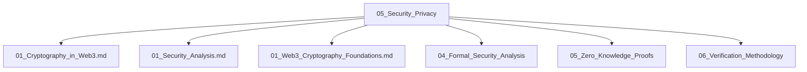

# 05_Security_Privacy 安全与隐私主题分层导航

## 目录结构
- 密码学基础
- 区块链安全性
- 隐私保护技术
- 零知识证明
- 形式化安全分析
- 验证方法论
- 行业安全案例
- 归档（见 99_Recycle_Bin 或 00-备份）

## 主题导航
- 返回 [全局索引](../00_Index_and_Classification.md)
- 交叉引用：[知识图谱](../00_Knowledge_Graph.md)

## Mermaid知识图谱锚点
