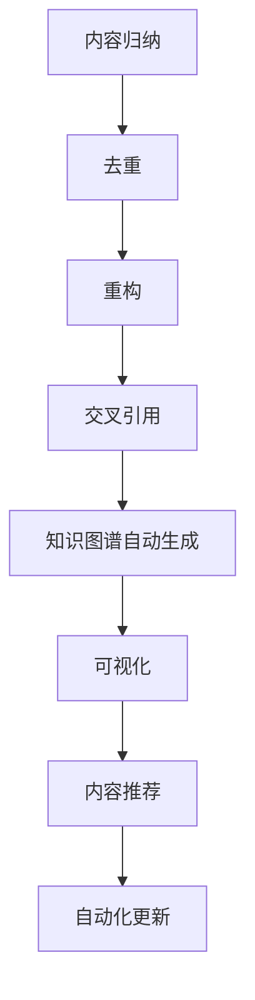

# 6. Web3自动化工具与实践

## 6.1 内容归纳与去重自动化

- 自动化内容归纳、去重、重构、交叉引用脚本设计
- Python/Rust/Golang自动化脚本示例

## 6.2 知识图谱自动生成与可视化

- Mermaid/Graphviz知识图谱自动生成工具与脚本
- Obsidian/Typora等知识管理工具集成

## 6.3 交互式问答与内容推荐

- 智能搜索、内容推荐、交互式问答系统架构
- LLM+知识库集成实践

## 6.4 持续集成与自动化更新

- 内容自动化更新、CI/CD集成、自动化校验与发布
- GitHub Actions、GitLab CI等开源工具链

## 6.5 行业案例与最佳实践

- Obsidian自动化插件、知识图谱可视化、内容推荐系统
- 行业最佳实践与标准化建议

## 6.6 Mermaid自动化脚本示例

## 6.7 参考文献与外部链接

- [Mermaid](https://mermaid-js.github.io/)
- [Obsidian插件市场](https://obsidian.md/plugins)
- [GitHub Actions](https://github.com/features/actions)
- [Graphviz](https://graphviz.gitlab.io/)
