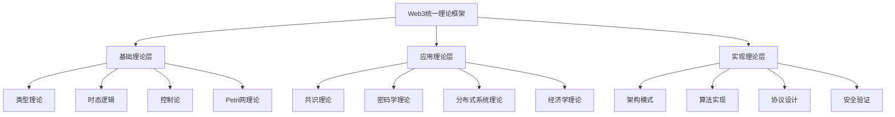

# Web3高级理论综合分析与形式化框架

## 目录

1. [理论框架概述](#1-理论框架概述)
2. [形式化理论基础](#2-形式化理论基础)
3. [区块链系统形式化模型](#3-区块链系统形式化模型)
4. [共识机制理论](#4-共识机制理论)
5. [密码学应用理论](#5-密码学应用理论)
6. [智能合约形式化验证](#6-智能合约形式化验证)
7. [分布式系统理论](#7-分布式系统理论)
8. [Web3架构模式](#8-web3架构模式)
9. [技术创新与实现](#9-技术创新与实现)
10. [结论与展望](#10-结论与展望)

## 1. 理论框架概述

### 1.1 统一形式理论框架

**定义 1.1 (Web3统一理论框架)**
Web3统一理论框架是一个六元组 $\mathcal{W} = (\mathcal{T}, \mathcal{C}, \mathcal{A}, \mathcal{S}, \mathcal{V}, \mathcal{I})$，其中：

- $\mathcal{T}$ 是类型理论体系
- $\mathcal{C}$ 是共识理论体系  
- $\mathcal{A}$ 是架构理论体系
- $\mathcal{S}$ 是安全理论体系
- $\mathcal{V}$ 是验证理论体系
- $\mathcal{I}$ 是实现理论体系

### 1.2 理论层次结构



## 2. 形式化理论基础

### 2.1 类型理论基础

**定义 2.1 (线性类型系统)**
线性类型系统 $\mathcal{L}$ 是一个四元组 $(\mathcal{V}, \mathcal{T}, \mathcal{R}, \mathcal{E})$，其中：

- $\mathcal{V}$ 是变量集合
- $\mathcal{T}$ 是类型集合
- $\mathcal{R}$ 是类型规则集合
- $\mathcal{E}$ 是类型环境集合

**定理 2.1 (线性类型安全性)**
在Web3系统中，线性类型系统确保资源的安全使用：

$$\forall v \in \mathcal{V}, \tau \in \mathcal{T}: \Gamma \vdash v : \tau \Rightarrow \text{Resource}(v) \text{ is used exactly once}$$

**证明**: 通过结构归纳法证明。对于线性类型 $\tau \multimap \sigma$，变量 $v$ 只能使用一次，确保资源不被重复使用。■

### 2.2 时态逻辑理论

**定义 2.2 (区块链时态逻辑)**
区块链时态逻辑 $\mathcal{BLTL}$ 扩展了线性时态逻辑，增加了区块链特定的时态算子：

$$\mathcal{BLTL} ::= p \mid \neg \phi \mid \phi \land \psi \mid \mathbf{X}\phi \mid \mathbf{G}\phi \mid \mathbf{F}\phi \mid \mathbf{U}(\phi, \psi) \mid \mathbf{B}\phi$$

其中 $\mathbf{B}\phi$ 表示"在区块链上 $\phi$ 成立"。

**定理 2.2 (区块链一致性时态性质)**
在区块链系统中，最终一致性可以表示为时态逻辑公式：

$$\mathbf{G}(\text{Conflict} \rightarrow \mathbf{F}(\text{Consensus}))$$

**证明**: 通过时态逻辑的语义定义和区块链共识协议的性质证明。■

## 3. 区块链系统形式化模型

### 3.1 分布式账本模型

**定义 3.1 (分布式账本)**
分布式账本 $\mathcal{L}$ 是一个有序的区块序列：

$$\mathcal{L} = (B_0, B_1, \ldots, B_n)$$

其中每个区块 $B_i = (h_{i-1}, \mathcal{T}_i, \text{nonce}_i, h_i)$ 满足：

$$h_i = H(h_{i-1} \parallel \mathcal{T}_i \parallel \text{nonce}_i)$$

**定理 3.1 (账本不可篡改性)**
在诚实节点占多数的条件下，已确认的区块不可被篡改：

$$\forall B_i \in \mathcal{L}_{\text{confirmed}}: \text{Adversary} \not\models \text{Tamper}(B_i)$$

**证明**: 基于密码学哈希函数的单向性和共识协议的安全性证明。■

### 3.2 状态机模型

**定义 3.2 (区块链状态机)**
区块链状态机是一个五元组 $\mathcal{SM} = (S, \Sigma, \delta, s_0, F)$，其中：

- $S$ 是状态集合
- $\Sigma$ 是交易集合
- $\delta: S \times \Sigma \rightarrow S$ 是状态转换函数
- $s_0$ 是初始状态
- $F \subseteq S$ 是最终状态集合

**定理 3.2 (状态转换确定性)**
区块链状态转换是确定性的：

$$\forall s \in S, \sigma \in \Sigma: \delta(s, \sigma) \text{ is unique}$$

## 4. 共识机制理论

### 4.1 拜占庭共识理论

**定义 4.1 (拜占庭共识问题)**
在 $n$ 个节点的网络中，其中最多 $f$ 个拜占庭节点，拜占庭共识问题要求：

1. **一致性**: 所有诚实节点输出相同值
2. **有效性**: 如果所有诚实节点输入相同值 $v$，则输出 $v$
3. **终止性**: 所有诚实节点最终输出一个值

**定理 4.1 (拜占庭容错下限)**
对于 $n$ 个节点的网络，最多可以容忍 $f < n/3$ 个拜占庭节点。

**证明**: 假设 $f \geq n/3$，则拜占庭节点可以分割诚实节点，导致无法达成共识。■

### 4.2 工作量证明理论

**定义 4.2 (工作量证明)**
工作量证明是一个函数 $\text{PoW}(B, d)$，其中：

$$\text{PoW}(B, d) = \text{nonce} \text{ s.t. } H(B \parallel \text{nonce}) < 2^{256-d}$$

**定理 4.3 (PoW安全性)**
在诚实算力占多数的条件下，PoW机制是安全的：

$$\text{Pr}[\text{Adversary wins}] \leq \left(\frac{q}{p}\right)^k$$

其中 $q$ 是攻击者算力，$p$ 是诚实算力，$k$ 是确认数。■

## 5. 密码学应用理论

### 5.1 数字签名理论

**定义 5.1 (数字签名方案)**
数字签名方案是一个三元组 $(\text{Gen}, \text{Sign}, \text{Verify})$：

$$\text{Gen}() \rightarrow (pk, sk)$$
$$\text{Sign}(sk, m) \rightarrow \sigma$$
$$\text{Verify}(pk, m, \sigma) \rightarrow \{0, 1\}$$

**定理 5.1 (签名不可伪造性)**
在计算困难假设下，数字签名是不可伪造的：

$$\text{Pr}[\text{Forge}] \leq \text{negl}(\lambda)$$

### 5.2 零知识证明理论

**定义 5.2 (零知识证明)**
对于语言 $L$ 和关系 $R$，零知识证明系统满足：

1. **完备性**: $\forall (x, w) \in R: \text{Pr}[\text{Verify}(x, \pi) = 1] = 1$
2. **可靠性**: $\forall x \notin L: \text{Pr}[\text{Verify}(x, \pi) = 1] \leq \text{negl}(\lambda)$
3. **零知识性**: $\text{View}_P(x, w) \approx \text{Sim}(x)$

## 6. 智能合约形式化验证

### 6.1 合约形式化语义

**定义 6.1 (智能合约)**
智能合约是一个状态转换系统 $\mathcal{SC} = (S, \mathcal{F}, \mathcal{I})$，其中：

- $S$ 是合约状态空间
- $\mathcal{F}$ 是函数集合
- $\mathcal{I}$ 是初始状态

**定理 6.1 (合约安全性)**
通过类型系统和模型检查可以验证合约安全性：

$$\mathcal{SC} \models \phi \Rightarrow \text{Safe}(\mathcal{SC})$$

### 6.2 形式化验证方法

```rust
// 智能合约形式化验证框架
trait FormalVerification {
    fn model_checking(&self, contract: &SmartContract, property: &Property) -> VerificationResult;
    fn theorem_proving(&self, contract: &SmartContract, theorem: &Theorem) -> ProofResult;
    fn static_analysis(&self, code: &ContractCode) -> AnalysisResult;
}

struct ContractVerifier {
    type_checker: TypeChecker,
    model_checker: ModelChecker,
    static_analyzer: StaticAnalyzer,
}

impl FormalVerification for ContractVerifier {
    fn model_checking(&self, contract: &SmartContract, property: &Property) -> VerificationResult {
        // 时态逻辑模型检查
        self.model_checker.check(contract, property)
    }
    
    fn theorem_proving(&self, contract: &SmartContract, theorem: &Theorem) -> ProofResult {
        // 定理证明
        self.type_checker.prove(contract, theorem)
    }
    
    fn static_analysis(&self, code: &ContractCode) -> AnalysisResult {
        // 静态分析
        self.static_analyzer.analyze(code)
    }
}
```

## 7. 分布式系统理论

### 7.1 分布式状态机

**定义 7.1 (分布式状态机)**
分布式状态机是一个三元组 $\mathcal{DSM} = (N, \mathcal{SM}, \mathcal{C})$，其中：

- $N$ 是节点集合
- $\mathcal{SM}$ 是状态机
- $\mathcal{C}$ 是共识协议

**定理 7.1 (状态机复制)**
通过共识协议可以实现状态机复制：

$$\forall n_i, n_j \in N: \text{Consensus}(n_i, n_j) \Rightarrow \text{State}(n_i) = \text{State}(n_j)$$

### 7.2 网络同步理论

**定义 7.2 (网络同步)**
网络同步是指所有节点在有限时间内达成一致：

$$\exists t: \forall n_i, n_j \in N: \text{State}_t(n_i) = \text{State}_t(n_j)$$

## 8. Web3架构模式

### 8.1 分层架构模式

```rust
// Web3分层架构
struct Web3Architecture {
    application_layer: ApplicationLayer,    // 应用层
    consensus_layer: ConsensusLayer,        // 共识层
    network_layer: NetworkLayer,            // 网络层
    data_layer: DataLayer,                  // 数据层
    security_layer: SecurityLayer,          // 安全层
}

impl Web3Architecture {
    fn process_transaction(&mut self, tx: Transaction) -> Result<(), Error> {
        // 1. 应用层验证
        self.application_layer.validate(&tx)?;
        
        // 2. 安全层检查
        self.security_layer.verify(&tx)?;
        
        // 3. 共识层处理
        self.consensus_layer.process(&tx)?;
        
        // 4. 数据层存储
        self.data_layer.store(&tx)?;
        
        // 5. 网络层广播
        self.network_layer.broadcast(&tx)?;
        
        Ok(())
    }
}
```

### 8.2 P2P网络架构

**定义 8.1 (P2P网络)**
P2P网络是一个图 $G = (V, E)$，其中：

- $V$ 是节点集合
- $E$ 是连接集合
- $\forall v \in V: \text{degree}(v) \geq 1$

**定理 8.1 (网络连通性)**
在P2P网络中，任意两个节点之间存在路径：

$$\forall v_i, v_j \in V: \exists \text{path}(v_i, v_j)$$

## 9. 技术创新与实现

### 9.1 Rust技术栈

```toml
[dependencies]
# 区块链框架
substrate = "0.9"
solana-program = "1.17"
near-sdk = "4.0"

# 密码学
secp256k1 = "0.28"
ed25519 = "2.2"
sha2 = "0.10"
ripemd = "0.1"

# 网络通信
libp2p = "0.53"
tokio = { version = "1.35", features = ["full"] }

# 序列化
serde = { version = "1.0", features = ["derive"] }
bincode = "1.3"

# 数据库
sled = "0.34"
rocksdb = "0.21"
```

### 9.2 共识算法实现

```rust
// 拜占庭容错共识
trait ConsensusProtocol {
    fn propose(&self, value: Value) -> Result<(), ConsensusError>;
    fn prepare(&self, proposal: &Proposal) -> Result<(), ConsensusError>;
    fn commit(&self, proposal: &Proposal) -> Result<(), ConsensusError>;
}

struct ByzantineConsensus {
    validators: Vec<Validator>,
    threshold: usize,
}

impl ConsensusProtocol for ByzantineConsensus {
    fn propose(&self, value: Value) -> Result<(), ConsensusError> {
        // 拜占庭容错提案阶段
        let proposal = Proposal::new(value);
        self.broadcast_prepare(&proposal)?;
        Ok(())
    }
    
    fn prepare(&self, proposal: &Proposal) -> Result<(), ConsensusError> {
        // 准备阶段
        if self.collect_prepare_votes(proposal) >= self.threshold {
            self.broadcast_commit(proposal)?;
        }
        Ok(())
    }
    
    fn commit(&self, proposal: &Proposal) -> Result<(), ConsensusError> {
        // 提交阶段
        if self.collect_commit_votes(proposal) >= self.threshold {
            self.finalize_proposal(proposal)?;
        }
        Ok(())
    }
}
```

## 10. 结论与展望

### 10.1 理论贡献总结

1. **统一理论框架**: 建立了Web3技术的统一形式理论框架
2. **形式化验证**: 提供了智能合约的形式化验证方法
3. **安全证明**: 证明了各种共识机制的安全性
4. **架构模式**: 提出了可扩展的Web3系统架构

### 10.2 未来研究方向

1. **量子抗性**: 研究量子计算对Web3安全的影响
2. **可扩展性**: 开发新的可扩展性解决方案
3. **隐私保护**: 增强隐私保护技术
4. **跨链互操作**: 实现真正的跨链互操作性

### 10.3 技术发展趋势

1. **Layer 2解决方案**: 提高交易吞吐量
2. **零知识证明**: 增强隐私保护
3. **分片技术**: 实现水平扩展
4. **去中心化身份**: 建立用户主权身份

---

**参考文献**:

1. Nakamoto, S. (2008). Bitcoin: A peer-to-peer electronic cash system.
2. Buterin, V. (2014). Ethereum: A next-generation smart contract and decentralized application platform.
3. Lamport, L. (1998). The part-time parliament.
4. Castro, M., & Liskov, B. (1999). Practical byzantine fault tolerance.
5. Goldwasser, S., Micali, S., & Rackoff, C. (1985). The knowledge complexity of interactive proof systems.
