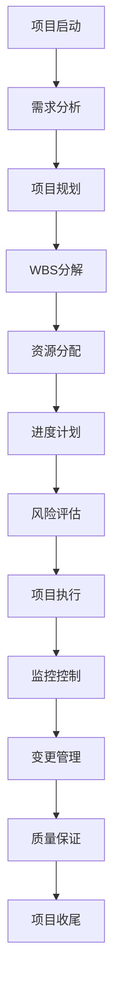
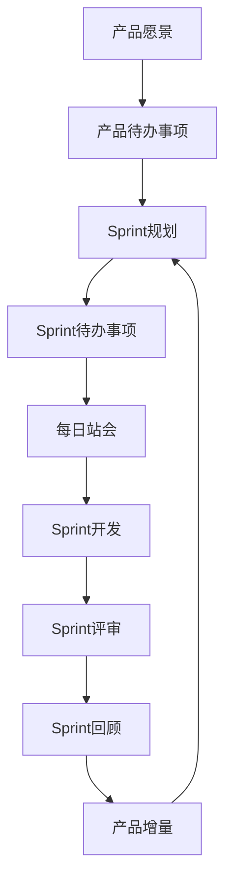
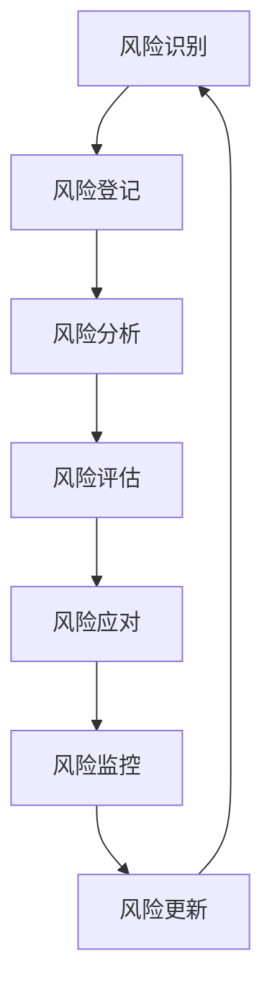

# Web3项目管理层 - 全生命周期项目管理与协作体系

[](../../README.md)
[](../01_Theoretical_Foundations/README.md)
[](../02_Core_Technologies/README.md)
[](../03_Architecture_Design/README.md)
[](../04_Application_Ecosystem/README.md)
[](../05_Advanced_Technologies/README.md)
[](../06_Development_Operations/README.md)
[](README.md)

## 概述

项目管理层是Web3技术栈的第七层，也是最高管理层级，专注于Web3项目的全生命周期管理、团队协作、风险控制和质量保证。本层通过现代项目管理理念、敏捷开发方法论和智能化管理工具，为Web3项目的规划、执行、监控和收尾提供完整的管理框架和最佳实践指导。

### 层级定位与价值

在Web3技术栈7层架构中，项目管理层承担着**统筹协调和组织保障**的最高职责：

- **向下统筹**: 协调和管理下面六个技术层级的工作成果
- **对外交付**: 确保项目按时、按质、按预算完成交付
- **核心价值**: 通过科学的管理方法论保证Web3项目的成功实施

## 数学理论基础

### 项目管理理论

**定义7.1** (项目成功度量模型): 设Web3项目成功度为：
\[
S_{project} = \frac{Q_{quality} \cdot T_{timeline} \cdot B_{budget} \cdot R_{requirements}}{R_{risk} \cdot C_{complexity}}
\]

其中：
- \( Q_{quality} \): 质量达成度，\( Q_{quality} \in [0, 1] \)
- \( T_{timeline} \): 时间达成度，\( T_{timeline} \in [0, 1] \)
- \( B_{budget} \): 预算控制度，\( B_{budget} \in [0, 1] \)
- \( R_{requirements} \): 需求完成度，\( R_{requirements} \in [0, 1] \)
- \( R_{risk} \): 风险影响系数，\( R_{risk} \geq 1 \)
- \( C_{complexity} \): 复杂度系数，\( C_{complexity} \geq 1 \)

**定理7.1** (项目优化定理): 在约束条件下，最优项目配置满足：
\[
\max_{config} S_{project} \quad \text{s.t.} \quad \sum_{i=1}^n c_i \leq C_{budget}, \quad t_i \leq T_{deadline}
\]

其中 \( c_i \) 为第 \( i \) 项活动成本，\( t_i \) 为活动完成时间。

### 敏捷开发理论

**定义7.2** (Sprint速度模型): 设Sprint \( k \) 的团队速度为：
\[
V_k = \frac{\sum_{i=1}^{n_k} SP_i}{T_{sprint}}
\]

其中 \( SP_i \) 为第 \( i \) 个用户故事的故事点数，\( T_{sprint} \) 为Sprint时长。

**定理7.2** (速度收敛定理): 在稳定团队条件下，Sprint速度序列 \( \{V_k\} \) 收敛：
\[
\lim_{k \to \infty} V_k = V^* = \frac{C_{team} \cdot E_{efficiency}}{T_{sprint}}
\]

其中 \( C_{team} \) 为团队容量，\( E_{efficiency} \) 为团队效率系数。

### 风险管理理论

**定义7.3** (风险暴露度): 设风险 \( r_i \) 的暴露度为：
\[
E_{risk}(r_i) = P(r_i) \cdot I(r_i) \cdot \prod_{j=1}^{m} (1 - M_j(r_i))
\]

其中：
- \( P(r_i) \): 风险发生概率
- \( I(r_i) \): 风险影响程度  
- \( M_j(r_i) \): 第 \( j \) 个缓解措施的有效性

**定理7.3** (风险优化配置): 在有限资源下，最优风险缓解策略满足：
\[
\min_{M} \sum_{i=1}^n E_{risk}(r_i) \quad \text{s.t.} \quad \sum_{i=1}^n \sum_{j=1}^{m} c_{ij} \leq C_{mitigation}
\]

其中 \( c_{ij} \) 为风险 \( r_i \) 的第 \( j \) 个缓解措施成本。

## 技术架构

### 1. 项目管理架构



### 2. 敏捷开发架构



### 3. 风险管理架构



## 目录结构

### [7.1 项目管理方法论](01_Project_Management_Methodology/README.md)

现代项目管理方法体系：

- **[敏捷开发](01_Project_Management_Methodology/01_Agile_Development/)** - Scrum、Kanban、XP、敏捷实践
- **[传统项目管理](01_Project_Management_Methodology/02_Traditional_Project_Management/)** - 瀑布模型、PRINCE2、PMP
- **[混合方法](01_Project_Management_Methodology/03_Hybrid_Methods/)** - 敏捷-瀑布混合、Scrumban
- **[精益管理](01_Project_Management_Methodology/04_Lean_Management/)** - 精益原则、价值流映射
- **[DevOps管理](01_Project_Management_Methodology/05_DevOps_Management/)** - DevOps文化、自动化管理

### 7.2 进度跟踪 (Progress Tracking)

- [**项目计划**](02_Progress_Tracking/01_Project_Planning/) - 工作分解结构、甘特图、关键路径、资源分配
- [**里程碑管理**](02_Progress_Tracking/02_Milestone_Management/) - 里程碑定义、进度监控、里程碑报告、偏差分析
- [**任务管理**](02_Progress_Tracking/03_Task_Management/) - 任务分解、任务分配、任务跟踪、任务依赖
- [**时间管理**](02_Progress_Tracking/04_Time_Management/) - 时间估算、进度控制、时间优化、时间报告
- [**资源管理**](02_Progress_Tracking/05_Resource_Management/) - 人力资源、技术资源、财务资源、资源优化

### 7.3 风险管理 (Risk Management)

- [**风险识别**](03_Risk_Management/01_Risk_Identification/) - 风险清单、风险分类、风险来源、风险触发因素
- [**风险评估**](03_Risk_Management/02_Risk_Assessment/) - 风险概率、风险影响、风险矩阵、风险优先级
- [**风险应对**](03_Risk_Management/03_Risk_Response/) - 风险规避、风险转移、风险缓解、风险接受
- [**风险监控**](03_Risk_Management/04_Risk_Monitoring/) - 风险跟踪、风险报告、风险预警、风险更新
- [**应急管理**](03_Risk_Management/05_Emergency_Management/) - 应急预案、应急响应、危机管理、恢复计划

### 7.4 团队协作 (Team Collaboration)

- [**团队建设**](04_Team_Collaboration/01_Team_Building/) - 团队组建、角色定义、团队文化、团队发展
- [**沟通管理**](04_Team_Collaboration/02_Communication_Management/) - 沟通计划、沟通渠道、沟通工具、沟通效果
- [**冲突管理**](04_Team_Collaboration/03_Conflict_Management/) - 冲突识别、冲突分析、冲突解决、冲突预防
- [**知识管理**](04_Team_Collaboration/04_Knowledge_Management/) - 知识共享、知识库、最佳实践、经验教训
- [**远程协作**](04_Team_Collaboration/05_Remote_Collaboration/) - 远程团队、虚拟协作、在线工具、远程管理

### 7.5 质量管理 (Quality Management)

- [**质量规划**](05_Quality_Management/01_Quality_Planning/) - 质量目标、质量标准、质量指标、质量计划
- [**质量保证**](05_Quality_Management/02_Quality_Assurance/) - 质量审计、质量检查、质量评估、质量改进
- [**质量控制**](05_Quality_Management/03_Quality_Control/) - 质量监控、质量测试、质量验证、质量报告
- [**持续改进**](05_Quality_Management/04_Continuous_Improvement/) - 改进循环、改进方法、改进工具、改进文化
- [**质量文化**](05_Quality_Management/05_Quality_Culture/) - 质量意识、质量责任、质量激励、质量培训

## 核心概念

### 项目管理方法论

Web3项目需要灵活的管理方法：

**敏捷开发**：

- 适应快速变化的需求
- 支持迭代开发和持续交付
- 强调团队协作和客户反馈
- 适合创新性项目

**传统项目管理**：

- 适用于需求明确的项目
- 强调计划和控制
- 适合大型复杂项目
- 提供结构化的管理框架

### 进度跟踪

有效的进度跟踪是项目成功的关键：

**项目计划**：

- 工作分解结构(WBS)
- 甘特图和网络图
- 关键路径分析
- 资源分配和优化

**里程碑管理**：

- 关键里程碑定义
- 进度监控和报告
- 偏差分析和纠正
- 里程碑验收

### 风险管理

Web3项目面临特殊风险：

**技术风险**：

- 智能合约安全风险
- 密码学实现风险
- 网络攻击风险
- 技术更新风险

**业务风险**：

- 监管风险
- 市场风险
- 竞争风险
- 用户采用风险

## 在Web3中的应用

### 1. 智能合约项目

- **开发阶段**：需求分析、设计、开发、测试
- **部署阶段**：审计、部署、监控、维护
- **升级阶段**：升级计划、迁移、验证、回滚

### 2. 区块链网络项目

- **网络设计**：架构设计、共识机制、网络拓扑
- **节点部署**：节点配置、网络连接、性能优化
- **网络运营**：监控、维护、升级、扩展

### 3. DeFi协议项目

- **协议设计**：经济模型、激励机制、风险控制
- **协议开发**：智能合约、前端界面、后端服务
- **协议运营**：流动性管理、风险监控、社区治理

## 学习资源

### 推荐教材

1. **项目管理**：《A Guide to the Project Management Body of Knowledge》- PMI
2. **敏捷开发**：《Agile Project Management》- Jim Highsmith
3. **风险管理**：《Project Risk Management》- Chris Chapman
4. **团队协作**：《The Five Dysfunctions of a Team》- Patrick Lencioni

### 在线资源

- [项目管理协会](https://www.pmi.org/)
- [敏捷联盟](https://www.agilealliance.org/)
- [Scrum指南](https://scrumguides.org/)

## Rust实现示例

### 项目管理系统

```rust
use std::collections::HashMap;
use serde::{Serialize, Deserialize};
use chrono::{DateTime, Utc};

#[derive(Debug, Clone, Serialize, Deserialize)]
pub struct Project {
    pub id: String,
    pub name: String,
    pub description: String,
    pub status: ProjectStatus,
    pub start_date: DateTime<Utc>,
    pub end_date: Option<DateTime<Utc>>,
    pub budget: f64,
    pub team_members: Vec<String>,
    pub tasks: HashMap<String, Task>,
    pub risks: Vec<Risk>,
    pub milestones: Vec<Milestone>,
}

#[derive(Debug, Clone, Serialize, Deserialize)]
pub enum ProjectStatus {
    Planning,
    InProgress,
    OnHold,
    Completed,
    Cancelled,
}

#[derive(Debug, Clone, Serialize, Deserialize)]
pub struct Task {
    pub id: String,
    pub name: String,
    pub description: String,
    pub status: TaskStatus,
    pub assignee: Option<String>,
    pub priority: Priority,
    pub estimated_hours: f64,
    pub actual_hours: f64,
    pub start_date: Option<DateTime<Utc>>,
    pub due_date: Option<DateTime<Utc>>,
    pub dependencies: Vec<String>,
}

#[derive(Debug, Clone, Serialize, Deserialize)]
pub enum TaskStatus {
    NotStarted,
    InProgress,
    Review,
    Completed,
    Blocked,
}

#[derive(Debug, Clone, Serialize, Deserialize)]
pub enum Priority {
    Low,
    Medium,
    High,
    Critical,
}

#[derive(Debug, Clone, Serialize, Deserialize)]
pub struct Risk {
    pub id: String,
    pub name: String,
    pub description: String,
    pub probability: f64,
    pub impact: f64,
    pub severity: RiskSeverity,
    pub mitigation_plan: String,
    pub status: RiskStatus,
}

#[derive(Debug, Clone, Serialize, Deserialize)]
pub enum RiskSeverity {
    Low,
    Medium,
    High,
    Critical,
}

#[derive(Debug, Clone, Serialize, Deserialize)]
pub enum RiskStatus {
    Identified,
    Assessed,
    Mitigated,
    Closed,
}

#[derive(Debug, Clone, Serialize, Deserialize)]
pub struct Milestone {
    pub id: String,
    pub name: String,
    pub description: String,
    pub due_date: DateTime<Utc>,
    pub status: MilestoneStatus,
    pub deliverables: Vec<String>,
}

#[derive(Debug, Clone, Serialize, Deserialize)]
pub enum MilestoneStatus {
    NotStarted,
    InProgress,
    Completed,
    Delayed,
}

pub struct ProjectManager {
    projects: HashMap<String, Project>,
}

impl ProjectManager {
    pub fn new() -> Self {
        ProjectManager {
            projects: HashMap::new(),
        }
    }
    
    pub fn create_project(&mut self, project: Project) -> Result<(), String> {
        if self.projects.contains_key(&project.id) {
            return Err("Project ID already exists".to_string());
        }
        
        self.projects.insert(project.id.clone(), project);
        Ok(())
    }
    
    pub fn get_project(&self, project_id: &str) -> Option<&Project> {
        self.projects.get(project_id)
    }
    
    pub fn update_project_status(&mut self, project_id: &str, status: ProjectStatus) -> Result<(), String> {
        let project = self.projects.get_mut(project_id)
            .ok_or("Project not found")?;
        
        project.status = status;
        Ok(())
    }
    
    pub fn add_task(&mut self, project_id: &str, task: Task) -> Result<(), String> {
        let project = self.projects.get_mut(project_id)
            .ok_or("Project not found")?;
        
        project.tasks.insert(task.id.clone(), task);
        Ok(())
    }
    
    pub fn update_task_status(&mut self, project_id: &str, task_id: &str, status: TaskStatus) -> Result<(), String> {
        let project = self.projects.get_mut(project_id)
            .ok_or("Project not found")?;
        
        let task = project.tasks.get_mut(task_id)
            .ok_or("Task not found")?;
        
        task.status = status;
        Ok(())
    }
    
    pub fn add_risk(&mut self, project_id: &str, risk: Risk) -> Result<(), String> {
        let project = self.projects.get_mut(project_id)
            .ok_or("Project not found")?;
        
        project.risks.push(risk);
        Ok(())
    }
    
    pub fn add_milestone(&mut self, project_id: &str, milestone: Milestone) -> Result<(), String> {
        let project = self.projects.get_mut(project_id)
            .ok_or("Project not found")?;
        
        project.milestones.push(milestone);
        Ok(())
    }
    
    pub fn get_project_progress(&self, project_id: &str) -> Result<ProjectProgress, String> {
        let project = self.projects.get(project_id)
            .ok_or("Project not found")?;
        
        let total_tasks = project.tasks.len();
        let completed_tasks = project.tasks.values()
            .filter(|task| matches!(task.status, TaskStatus::Completed))
            .count();
        
        let progress_percentage = if total_tasks > 0 {
            (completed_tasks as f64 / total_tasks as f64) * 100.0
        } else {
            0.0
        };
        
        let total_estimated_hours: f64 = project.tasks.values()
            .map(|task| task.estimated_hours)
            .sum();
        
        let total_actual_hours: f64 = project.tasks.values()
            .map(|task| task.actual_hours)
            .sum();
        
        let critical_risks = project.risks.iter()
            .filter(|risk| matches!(risk.severity, RiskSeverity::Critical))
            .count();
        
        let overdue_milestones = project.milestones.iter()
            .filter(|milestone| {
                matches!(milestone.status, MilestoneStatus::NotStarted | MilestoneStatus::InProgress) &&
                milestone.due_date < Utc::now()
            })
            .count();
        
        Ok(ProjectProgress {
            project_id: project_id.to_string(),
            progress_percentage,
            total_tasks,
            completed_tasks,
            total_estimated_hours,
            total_actual_hours,
            critical_risks,
            overdue_milestones,
        })
    }
    
    pub fn get_risk_report(&self, project_id: &str) -> Result<RiskReport, String> {
        let project = self.projects.get(project_id)
            .ok_or("Project not found")?;
        
        let total_risks = project.risks.len();
        let high_risks = project.risks.iter()
            .filter(|risk| matches!(risk.severity, RiskSeverity::High | RiskSeverity::Critical))
            .count();
        
        let mitigated_risks = project.risks.iter()
            .filter(|risk| matches!(risk.status, RiskStatus::Mitigated | RiskStatus::Closed))
            .count();
        
        let risk_exposure: f64 = project.risks.iter()
            .map(|risk| risk.probability * risk.impact)
            .sum();
        
        Ok(RiskReport {
            project_id: project_id.to_string(),
            total_risks,
            high_risks,
            mitigated_risks,
            risk_exposure,
            risks: project.risks.clone(),
        })
    }
    
    pub fn list_projects(&self) -> Vec<&Project> {
        self.projects.values().collect()
    }
    
    pub fn get_projects_by_status(&self, status: ProjectStatus) -> Vec<&Project> {
        self.projects.values()
            .filter(|project| std::mem::discriminant(&project.status) == std::mem::discriminant(&status))
            .collect()
    }
}

#[derive(Debug, Clone, Serialize, Deserialize)]
pub struct ProjectProgress {
    pub project_id: String,
    pub progress_percentage: f64,
    pub total_tasks: usize,
    pub completed_tasks: usize,
    pub total_estimated_hours: f64,
    pub total_actual_hours: f64,
    pub critical_risks: usize,
    pub overdue_milestones: usize,
}

#[derive(Debug, Clone, Serialize, Deserialize)]
pub struct RiskReport {
    pub project_id: String,
    pub total_risks: usize,
    pub high_risks: usize,
    pub mitigated_risks: usize,
    pub risk_exposure: f64,
    pub risks: Vec<Risk>,
}
```

### 敏捷开发管理

```rust
use std::collections::HashMap;
use serde::{Serialize, Deserialize};
use chrono::{DateTime, Utc};

#[derive(Debug, Clone, Serialize, Deserialize)]
pub struct Sprint {
    pub id: String,
    pub name: String,
    pub start_date: DateTime<Utc>,
    pub end_date: DateTime<Utc>,
    pub goal: String,
    pub status: SprintStatus,
    pub user_stories: Vec<UserStory>,
    pub velocity: f64,
}

#[derive(Debug, Clone, Serialize, Deserialize)]
pub enum SprintStatus {
    Planning,
    Active,
    Review,
    Retrospective,
    Completed,
}

#[derive(Debug, Clone, Serialize, Deserialize)]
pub struct UserStory {
    pub id: String,
    pub title: String,
    pub description: String,
    pub acceptance_criteria: Vec<String>,
    pub story_points: u8,
    pub priority: Priority,
    pub status: UserStoryStatus,
    pub assignee: Option<String>,
    pub tasks: Vec<Task>,
}

#[derive(Debug, Clone, Serialize, Deserialize)]
pub enum UserStoryStatus {
    Backlog,
    SprintBacklog,
    InProgress,
    Review,
    Done,
}

#[derive(Debug, Clone, Serialize, Deserialize)]
pub struct ProductBacklog {
    pub id: String,
    pub name: String,
    pub user_stories: Vec<UserStory>,
    pub priority_order: Vec<String>,
}

pub struct AgileManager {
    product_backlog: ProductBacklog,
    sprints: HashMap<String, Sprint>,
    team_members: Vec<TeamMember>,
}

#[derive(Debug, Clone, Serialize, Deserialize)]
pub struct TeamMember {
    pub id: String,
    pub name: String,
    pub role: TeamRole,
    pub capacity: f64, // 小时/天
    pub skills: Vec<String>,
}

#[derive(Debug, Clone, Serialize, Deserialize)]
pub enum TeamRole {
    ProductOwner,
    ScrumMaster,
    Developer,
    Tester,
    DevOps,
}

impl AgileManager {
    pub fn new() -> Self {
        AgileManager {
            product_backlog: ProductBacklog {
                id: "backlog-1".to_string(),
                name: "Main Product Backlog".to_string(),
                user_stories: Vec::new(),
                priority_order: Vec::new(),
            },
            sprints: HashMap::new(),
            team_members: Vec::new(),
        }
    }
    
    pub fn add_user_story(&mut self, story: UserStory) {
        self.product_backlog.user_stories.push(story.clone());
        self.product_backlog.priority_order.push(story.id.clone());
    }
    
    pub fn create_sprint(&mut self, sprint: Sprint) -> Result<(), String> {
        if self.sprints.contains_key(&sprint.id) {
            return Err("Sprint ID already exists".to_string());
        }
        
        self.sprints.insert(sprint.id.clone(), sprint);
        Ok(())
    }
    
    pub fn add_story_to_sprint(&mut self, sprint_id: &str, story_id: &str) -> Result<(), String> {
        let sprint = self.sprints.get_mut(sprint_id)
            .ok_or("Sprint not found")?;
        
        let story = self.product_backlog.user_stories.iter()
            .find(|s| s.id == story_id)
            .ok_or("User story not found")?;
        
        sprint.user_stories.push(story.clone());
        Ok(())
    }
    
    pub fn update_story_status(&mut self, story_id: &str, status: UserStoryStatus) -> Result<(), String> {
        // 更新产品待办事项中的故事状态
        for story in &mut self.product_backlog.user_stories {
            if story.id == story_id {
                story.status = status.clone();
                break;
            }
        }
        
        // 更新冲刺中的故事状态
        for sprint in self.sprints.values_mut() {
            for story in &mut sprint.user_stories {
                if story.id == story_id {
                    story.status = status.clone();
                    break;
                }
            }
        }
        
        Ok(())
    }
    
    pub fn calculate_sprint_velocity(&mut self, sprint_id: &str) -> Result<f64, String> {
        let sprint = self.sprints.get_mut(sprint_id)
            .ok_or("Sprint not found")?;
        
        let completed_stories = sprint.user_stories.iter()
            .filter(|story| matches!(story.status, UserStoryStatus::Done))
            .collect::<Vec<_>>();
        
        let total_points: u8 = completed_stories.iter()
            .map(|story| story.story_points)
            .sum();
        
        let sprint_duration = sprint.end_date.signed_duration_since(sprint.start_date).num_days() as f64;
        let velocity = total_points as f64 / sprint_duration;
        
        sprint.velocity = velocity;
        Ok(velocity)
    }
    
    pub fn get_sprint_burndown(&self, sprint_id: &str) -> Result<Vec<BurndownPoint>, String> {
        let sprint = self.sprints.get(sprint_id)
            .ok_or("Sprint not found")?;
        
        let total_points: u8 = sprint.user_stories.iter()
            .map(|story| story.story_points)
            .sum();
        
        let mut burndown = Vec::new();
        let mut remaining_points = total_points as f64;
        
        let sprint_duration = sprint.end_date.signed_duration_since(sprint.start_date).num_days() as i64;
        
        for day in 0..=sprint_duration {
            let current_date = sprint.start_date + chrono::Duration::days(day);
            
            // 计算到当前日期完成的故事点数
            let completed_points: u8 = sprint.user_stories.iter()
                .filter(|story| {
                    // 简化的完成时间计算
                    story.status == UserStoryStatus::Done
                })
                .map(|story| story.story_points)
                .sum();
            
            remaining_points = total_points as f64 - completed_points as f64;
            
            burndown.push(BurndownPoint {
                date: current_date,
                remaining_points,
                ideal_points: total_points as f64 * (1.0 - day as f64 / sprint_duration as f64),
            });
        }
        
        Ok(burndown)
    }
    
    pub fn add_team_member(&mut self, member: TeamMember) {
        self.team_members.push(member);
    }
    
    pub fn get_team_capacity(&self, sprint_id: &str) -> Result<f64, String> {
        let sprint = self.sprints.get(sprint_id)
            .ok_or("Sprint not found")?;
        
        let sprint_duration = sprint.end_date.signed_duration_since(sprint.start_date).num_days() as f64;
        
        let total_capacity: f64 = self.team_members.iter()
            .map(|member| member.capacity * sprint_duration)
            .sum();
        
        Ok(total_capacity)
    }
    
    pub fn get_product_backlog(&self) -> &ProductBacklog {
        &self.product_backlog
    }
    
    pub fn get_sprint(&self, sprint_id: &str) -> Option<&Sprint> {
        self.sprints.get(sprint_id)
    }
    
    pub fn list_sprints(&self) -> Vec<&Sprint> {
        self.sprints.values().collect()
    }
}

#[derive(Debug, Clone, Serialize, Deserialize)]
pub struct BurndownPoint {
    pub date: DateTime<Utc>,
    pub remaining_points: f64,
    pub ideal_points: f64,
}
```

### 风险管理系统

```rust
use std::collections::HashMap;
use serde::{Serialize, Deserialize};
use chrono::{DateTime, Utc};

#[derive(Debug, Clone, Serialize, Deserialize)]
pub struct Risk {
    pub id: String,
    pub name: String,
    pub description: String,
    pub category: RiskCategory,
    pub probability: f64, // 0.0 - 1.0
    pub impact: f64, // 0.0 - 1.0
    pub severity: RiskSeverity,
    pub status: RiskStatus,
    pub owner: Option<String>,
    pub mitigation_plan: String,
    pub contingency_plan: String,
    pub created_date: DateTime<Utc>,
    pub updated_date: DateTime<Utc>,
    pub due_date: Option<DateTime<Utc>>,
}

#[derive(Debug, Clone, Serialize, Deserialize)]
pub enum RiskCategory {
    Technical,
    Business,
    Operational,
    Financial,
    Legal,
    Security,
    Environmental,
}

#[derive(Debug, Clone, Serialize, Deserialize)]
pub enum RiskSeverity {
    Low,
    Medium,
    High,
    Critical,
}

#[derive(Debug, Clone, Serialize, Deserialize)]
pub enum RiskStatus {
    Identified,
    Assessed,
    Mitigated,
    Monitored,
    Closed,
}

#[derive(Debug, Clone, Serialize, Deserialize)]
pub struct RiskMitigation {
    pub risk_id: String,
    pub action: String,
    pub responsible: String,
    pub due_date: DateTime<Utc>,
    pub status: MitigationStatus,
    pub cost: f64,
    pub effectiveness: f64, // 0.0 - 1.0
}

#[derive(Debug, Clone, Serialize, Deserialize)]
pub enum MitigationStatus {
    Planned,
    InProgress,
    Completed,
    Cancelled,
}

pub struct RiskManager {
    risks: HashMap<String, Risk>,
    mitigations: HashMap<String, Vec<RiskMitigation>>,
    risk_owners: HashMap<String, String>,
}

impl RiskManager {
    pub fn new() -> Self {
        RiskManager {
            risks: HashMap::new(),
            mitigations: HashMap::new(),
            risk_owners: HashMap::new(),
        }
    }
    
    pub fn add_risk(&mut self, risk: Risk) -> Result<(), String> {
        if self.risks.contains_key(&risk.id) {
            return Err("Risk ID already exists".to_string());
        }
        
        self.risks.insert(risk.id.clone(), risk);
        Ok(())
    }
    
    pub fn update_risk(&mut self, risk_id: &str, risk: Risk) -> Result<(), String> {
        if !self.risks.contains_key(risk_id) {
            return Err("Risk not found".to_string());
        }
        
        self.risks.insert(risk_id.to_string(), risk);
        Ok(())
    }
    
    pub fn add_mitigation(&mut self, mitigation: RiskMitigation) -> Result<(), String> {
        if !self.risks.contains_key(&mitigation.risk_id) {
            return Err("Risk not found".to_string());
        }
        
        self.mitigations.entry(mitigation.risk_id.clone())
            .or_insert_with(Vec::new)
            .push(mitigation);
        
        Ok(())
    }
    
    pub fn calculate_risk_exposure(&self, risk_id: &str) -> Result<f64, String> {
        let risk = self.risks.get(risk_id)
            .ok_or("Risk not found")?;
        
        let base_exposure = risk.probability * risk.impact;
        
        // 考虑缓解措施的效果
        let mitigation_effectiveness = if let Some(mitigations) = self.mitigations.get(risk_id) {
            let total_effectiveness: f64 = mitigations.iter()
                .filter(|m| matches!(m.status, MitigationStatus::Completed))
                .map(|m| m.effectiveness)
                .sum();
            total_effectiveness.min(1.0)
        } else {
            0.0
        };
        
        let adjusted_exposure = base_exposure * (1.0 - mitigation_effectiveness);
        Ok(adjusted_exposure)
    }
    
    pub fn get_risk_matrix(&self) -> RiskMatrix {
        let mut matrix = RiskMatrix {
            low: 0,
            medium: 0,
            high: 0,
            critical: 0,
        };
        
        for risk in self.risks.values() {
            match risk.severity {
                RiskSeverity::Low => matrix.low += 1,
                RiskSeverity::Medium => matrix.medium += 1,
                RiskSeverity::High => matrix.high += 1,
                RiskSeverity::Critical => matrix.critical += 1,
            }
        }
        
        matrix
    }
    
    pub fn get_high_priority_risks(&self) -> Vec<&Risk> {
        self.risks.values()
            .filter(|risk| {
                matches!(risk.severity, RiskSeverity::High | RiskSeverity::Critical) &&
                matches!(risk.status, RiskStatus::Identified | RiskStatus::Assessed)
            })
            .collect()
    }
    
    pub fn get_overdue_risks(&self) -> Vec<&Risk> {
        let now = Utc::now();
        
        self.risks.values()
            .filter(|risk| {
                if let Some(due_date) = risk.due_date {
                    due_date < now && matches!(risk.status, RiskStatus::Identified | RiskStatus::Assessed)
                } else {
                    false
                }
            })
            .collect()
    }
    
    pub fn get_risk_report(&self) -> RiskReport {
        let total_risks = self.risks.len();
        let active_risks = self.risks.values()
            .filter(|risk| matches!(risk.status, RiskStatus::Identified | RiskStatus::Assessed | RiskStatus::Mitigated))
            .count();
        
        let total_exposure: f64 = self.risks.keys()
            .filter_map(|risk_id| self.calculate_risk_exposure(risk_id).ok())
            .sum();
        
        let matrix = self.get_risk_matrix();
        
        RiskReport {
            total_risks,
            active_risks,
            total_exposure,
            risk_matrix: matrix,
            high_priority_risks: self.get_high_priority_risks().len(),
            overdue_risks: self.get_overdue_risks().len(),
        }
    }
    
    pub fn get_risk(&self, risk_id: &str) -> Option<&Risk> {
        self.risks.get(risk_id)
    }
    
    pub fn get_mitigations(&self, risk_id: &str) -> Option<&Vec<RiskMitigation>> {
        self.mitigations.get(risk_id)
    }
    
    pub fn list_risks(&self) -> Vec<&Risk> {
        self.risks.values().collect()
    }
}

#[derive(Debug, Clone, Serialize, Deserialize)]
pub struct RiskMatrix {
    pub low: usize,
    pub medium: usize,
    pub high: usize,
    pub critical: usize,
}

#[derive(Debug, Clone, Serialize, Deserialize)]
pub struct RiskReport {
    pub total_risks: usize,
    pub active_risks: usize,
    pub total_exposure: f64,
    pub risk_matrix: RiskMatrix,
    pub high_priority_risks: usize,
    pub overdue_risks: usize,
}
```

## 贡献指南

欢迎对项目管理层内容进行贡献。请确保：

1. 所有管理方法和流程都有详细的说明和示例
2. 包含最佳实践和常见问题解决方案
3. 提供Rust代码实现示例
4. 说明在Web3中的具体应用场景
5. 关注最新的管理方法和最佳实践
