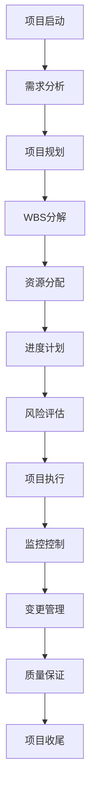
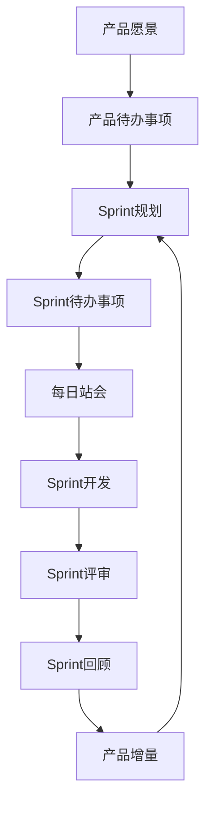
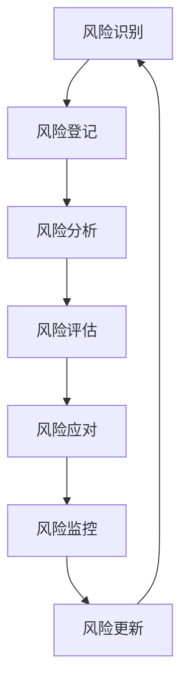

# Web3项目管理层 - 全生命周期项目管理与协作体系

[](../../README.md)
[](../01_Theoretical_Foundations/README.md)
[](../02_Core_Technologies/README.md)
[](../03_Architecture_Design/README.md)
[](../04_Application_Ecosystem/README.md)
[](../05_Advanced_Technologies/README.md)
[](../06_Development_Operations/README.md)
[](README.md)

## 概述

项目管理层是Web3技术栈的第七层，也是最高管理层级，专注于Web3项目的全生命周期管理、团队协作、风险控制和质量保证。本层通过现代项目管理理念、敏捷开发方法论和智能化管理工具，为Web3项目的规划、执行、监控和收尾提供完整的管理框架和最佳实践指导。

### 层级定位与价值

在Web3技术栈7层架构中，项目管理层承担着**统筹协调和组织保障**的最高职责：

- **向下统筹**: 协调和管理下面六个技术层级的工作成果
- **对外交付**: 确保项目按时、按质、按预算完成交付
- **核心价值**: 通过科学的管理方法论保证Web3项目的成功实施

## 数学理论基础

### 项目管理理论

**定义7.1** (项目成功度量模型): 设Web3项目成功度为：
\[
S_{project} = \frac{Q_{quality} \cdot T_{timeline} \cdot B_{budget} \cdot R_{requirements}}{R_{risk} \cdot C_{complexity}}
\]

其中：

- \( Q_{quality} \): 质量达成度，\( Q_{quality} \in [0, 1] \)
- \( T_{timeline} \): 时间达成度，\( T_{timeline} \in [0, 1] \)
- \( B_{budget} \): 预算控制度，\( B_{budget} \in [0, 1] \)
- \( R_{requirements} \): 需求完成度，\( R_{requirements} \in [0, 1] \)
- \( R_{risk} \): 风险影响系数，\( R_{risk} \geq 1 \)
- \( C_{complexity} \): 复杂度系数，\( C_{complexity} \geq 1 \)

**定理7.1** (项目优化定理): 在约束条件下，最优项目配置满足：
\[
\max_{config} S_{project} \quad \text{s.t.} \quad \sum_{i=1}^n c_i \leq C_{budget}, \quad t_i \leq T_{deadline}
\]

其中 \( c_i \) 为第 \( i \) 项活动成本，\( t_i \) 为活动完成时间。

### 敏捷开发理论

**定义7.2** (Sprint速度模型): 设Sprint \( k \) 的团队速度为：
\[
V_k = \frac{\sum_{i=1}^{n_k} SP_i}{T_{sprint}}
\]

其中 \( SP_i \) 为第 \( i \) 个用户故事的故事点数，\( T_{sprint} \) 为Sprint时长。

**定理7.2** (速度收敛定理): 在稳定团队条件下，Sprint速度序列 \( \{V_k\} \) 收敛：
\[
\lim_{k \to \infty} V_k = V^* = \frac{C_{team} \cdot E_{efficiency}}{T_{sprint}}
\]

其中 \( C_{team} \) 为团队容量，\( E_{efficiency} \) 为团队效率系数。

### 风险管理理论

**定义7.3** (风险暴露度): 设风险 \( r_i \) 的暴露度为：
\[
E_{risk}(r_i) = P(r_i) \cdot I(r_i) \cdot \prod_{j=1}^{m} (1 - M_j(r_i))
\]

其中：

- \( P(r_i) \): 风险发生概率
- \( I(r_i) \): 风险影响程度  
- \( M_j(r_i) \): 第 \( j \) 个缓解措施的有效性

**定理7.3** (风险优化配置): 在有限资源下，最优风险缓解策略满足：
\[
\min_{M} \sum_{i=1}^n E_{risk}(r_i) \quad \text{s.t.} \quad \sum_{i=1}^n \sum_{j=1}^{m} c_{ij} \leq C_{mitigation}
\]

其中 \( c_{ij} \) 为风险 \( r_i \) 的第 \( j \) 个缓解措施成本。

## 技术架构

### 1. 项目管理架构



### 2. 敏捷开发架构



### 3. 风险管理架构



## 目录结构

### [7.1 项目管理方法论](01_Project_Management_Methodology/README.md)

现代项目管理方法体系：

- **[敏捷开发](01_Project_Management_Methodology/01_Agile_Development/)** - Scrum、Kanban、XP、敏捷实践
- **[传统项目管理](01_Project_Management_Methodology/02_Traditional_Project_Management/)** - 瀑布模型、PRINCE2、PMP
- **[混合方法](01_Project_Management_Methodology/03_Hybrid_Methods/)** - 敏捷-瀑布混合、Scrumban
- **[精益管理](01_Project_Management_Methodology/04_Lean_Management/)** - 精益原则、价值流映射
- **[DevOps管理](01_Project_Management_Methodology/05_DevOps_Management/)** - DevOps文化、自动化管理

### [7.2 进度跟踪](02_Progress_Tracking/README.md)

项目进度监控与管理：

- **[项目计划](02_Progress_Tracking/01_Project_Planning/)** - WBS、甘特图、关键路径
- **[里程碑管理](02_Progress_Tracking/02_Milestone_Management/)** - 里程碑定义、进度监控
- **[任务管理](02_Progress_Tracking/03_Task_Management/)** - 任务分解、任务跟踪
- **[时间管理](02_Progress_Tracking/04_Time_Management/)** - 时间估算、进度控制
- **[资源管理](02_Progress_Tracking/05_Resource_Management/)** - 人力资源、技术资源优化

### [7.3 风险管理](03_Risk_Management/README.md)

全面风险识别与控制：

- **[风险识别](03_Risk_Management/01_Risk_Identification/)** - 风险清单、风险分类
- **[风险评估](03_Risk_Management/02_Risk_Assessment/)** - 风险概率、风险矩阵
- **[风险应对](03_Risk_Management/03_Risk_Response/)** - 风险规避、风险缓解
- **[风险监控](03_Risk_Management/04_Risk_Monitoring/)** - 风险跟踪、风险预警
- **[应急管理](03_Risk_Management/05_Emergency_Management/)** - 应急预案、危机管理

### [7.4 团队协作](04_Team_Collaboration/README.md)

高效团队建设与协作：

- **[团队建设](04_Team_Collaboration/01_Team_Building/)** - 团队组建、角色定义
- **[沟通管理](04_Team_Collaboration/02_Communication_Management/)** - 沟通计划、沟通工具
- **[冲突管理](04_Team_Collaboration/03_Conflict_Management/)** - 冲突识别、冲突解决
- **[知识管理](04_Team_Collaboration/04_Knowledge_Management/)** - 知识共享、最佳实践
- **[远程协作](04_Team_Collaboration/05_Remote_Collaboration/)** - 远程团队、虚拟协作

### [7.5 质量管理](05_Quality_Management/README.md)

项目质量保证体系：

- **[质量规划](05_Quality_Management/01_Quality_Planning/)** - 质量目标、质量标准
- **[质量保证](05_Quality_Management/02_Quality_Assurance/)** - 质量审计、质量评估
- **[质量控制](05_Quality_Management/03_Quality_Control/)** - 质量监控、质量验证
- **[持续改进](05_Quality_Management/04_Continuous_Improvement/)** - 改进循环、改进方法
- **[质量文化](05_Quality_Management/05_Quality_Culture/)** - 质量意识、质量培训

## 核心概念

### 项目管理方法论

Web3项目需要灵活的管理方法：

**敏捷开发**：

- 适应快速变化的需求
- 支持迭代开发和持续交付
- 强调团队协作和客户反馈
- 适合创新性项目

**传统项目管理**：

- 适用于需求明确的项目
- 强调计划和控制
- 适合大型复杂项目
- 提供结构化的管理框架

### 进度跟踪

有效的进度跟踪是项目成功的关键：

**项目计划**：

- 工作分解结构(WBS)
- 甘特图和网络图
- 关键路径分析
- 资源分配和优化

**里程碑管理**：

- 关键里程碑定义
- 进度监控和报告
- 偏差分析和纠正
- 里程碑验收

### 风险管理

Web3项目面临特殊风险：

**技术风险**：

- 智能合约安全风险
- 密码学实现风险
- 网络攻击风险
- 技术更新风险

**业务风险**：

- 监管风险
- 市场风险
- 竞争风险
- 用户采用风险

## 在Web3中的应用

### 1. 智能合约项目

- **开发阶段**：需求分析、设计、开发、测试
- **部署阶段**：审计、部署、监控、维护
- **升级阶段**：升级计划、迁移、验证、回滚

### 2. 区块链网络项目

- **网络设计**：架构设计、共识机制、网络拓扑
- **节点部署**：节点配置、网络连接、性能优化
- **网络运营**：监控、维护、升级、扩展

### 3. DeFi协议项目

- **协议设计**：经济模型、激励机制、风险控制
- **协议开发**：智能合约、前端界面、后端服务
- **协议运营**：流动性管理、风险监控、社区治理

## 学习资源

### 推荐教材

1. **项目管理**：《A Guide to the Project Management Body of Knowledge》- PMI
2. **敏捷开发**：《Agile Project Management》- Jim Highsmith
3. **风险管理**：《Project Risk Management》- Chris Chapman
4. **团队协作**：《The Five Dysfunctions of a Team》- Patrick Lencioni

### 在线资源

- [项目管理协会](https://www.pmi.org/)
- [敏捷联盟](https://www.agilealliance.org/)
- [Scrum指南](https://scrumguides.org/)

## Rust实现示例

### 项目管理系统

```rust
use std::collections::HashMap;
use serde::{Serialize, Deserialize};
use chrono::{DateTime, Utc};

#[derive(Debug, Clone, Serialize, Deserialize)]
pub struct Project {
    pub id: String,
    pub name: String,
    pub description: String,
    pub status: ProjectStatus,
    pub start_date: DateTime<Utc>,
    pub end_date: Option<DateTime<Utc>>,
    pub budget: f64,
    pub team_members: Vec<String>,
    pub tasks: HashMap<String, Task>,
    pub risks: Vec<Risk>,
    pub milestones: Vec<Milestone>,
}

#[derive(Debug, Clone, Serialize, Deserialize)]
pub enum ProjectStatus {
    Planning,
    InProgress,
    OnHold,
    Completed,
    Cancelled,
}

#[derive(Debug, Clone, Serialize, Deserialize)]
pub struct Task {
    pub id: String,
    pub name: String,
    pub description: String,
    pub status: TaskStatus,
    pub assignee: Option<String>,
    pub priority: Priority,
    pub estimated_hours: f64,
    pub actual_hours: f64,
    pub start_date: Option<DateTime<Utc>>,
    pub due_date: Option<DateTime<Utc>>,
    pub dependencies: Vec<String>,
}

#[derive(Debug, Clone, Serialize, Deserialize)]
pub enum TaskStatus {
    NotStarted,
    InProgress,
    Review,
    Completed,
    Blocked,
}

#[derive(Debug, Clone, Serialize, Deserialize)]
pub enum Priority {
    Low,
    Medium,
    High,
    Critical,
}

#[derive(Debug, Clone, Serialize, Deserialize)]
pub struct Risk {
    pub id: String,
    pub name: String,
    pub description: String,
    pub probability: f64,
    pub impact: f64,
    pub severity: RiskSeverity,
    pub mitigation_plan: String,
    pub status: RiskStatus,
}

#[derive(Debug, Clone, Serialize, Deserialize)]
pub enum RiskSeverity {
    Low,
    Medium,
    High,
    Critical,
}

#[derive(Debug, Clone, Serialize, Deserialize)]
pub enum RiskStatus {
    Identified,
    Assessed,
    Mitigated,
    Closed,
}

#[derive(Debug, Clone, Serialize, Deserialize)]
pub struct Milestone {
    pub id: String,
    pub name: String,
    pub description: String,
    pub due_date: DateTime<Utc>,
    pub status: MilestoneStatus,
    pub deliverables: Vec<String>,
}

#[derive(Debug, Clone, Serialize, Deserialize)]
pub enum MilestoneStatus {
    NotStarted,
    InProgress,
    Completed,
    Delayed,
}

pub struct ProjectManager {
    projects: HashMap<String, Project>,
}

impl ProjectManager {
    pub fn new() -> Self {
        ProjectManager {
            projects: HashMap::new(),
        }
    }
    
    pub fn create_project(&mut self, project: Project) -> Result<(), String> {
        if self.projects.contains_key(&project.id) {
            return Err("Project ID already exists".to_string());
        }
        
        self.projects.insert(project.id.clone(), project);
        Ok(())
    }
    
    pub fn get_project(&self, project_id: &str) -> Option<&Project> {
        self.projects.get(project_id)
    }
    
    pub fn update_project_status(&mut self, project_id: &str, status: ProjectStatus) -> Result<(), String> {
        let project = self.projects.get_mut(project_id)
            .ok_or("Project not found")?;
        
        project.status = status;
        Ok(())
    }
    
    pub fn add_task(&mut self, project_id: &str, task: Task) -> Result<(), String> {
        let project = self.projects.get_mut(project_id)
            .ok_or("Project not found")?;
        
        project.tasks.insert(task.id.clone(), task);
        Ok(())
    }
    
    pub fn update_task_status(&mut self, project_id: &str, task_id: &str, status: TaskStatus) -> Result<(), String> {
        let project = self.projects.get_mut(project_id)
            .ok_or("Project not found")?;
        
        let task = project.tasks.get_mut(task_id)
            .ok_or("Task not found")?;
        
        task.status = status;
        Ok(())
    }
    
    pub fn add_risk(&mut self, project_id: &str, risk: Risk) -> Result<(), String> {
        let project = self.projects.get_mut(project_id)
            .ok_or("Project not found")?;
        
        project.risks.push(risk);
        Ok(())
    }
    
    pub fn add_milestone(&mut self, project_id: &str, milestone: Milestone) -> Result<(), String> {
        let project = self.projects.get_mut(project_id)
            .ok_or("Project not found")?;
        
        project.milestones.push(milestone);
        Ok(())
    }
    
    pub fn get_project_progress(&self, project_id: &str) -> Result<ProjectProgress, String> {
        let project = self.projects.get(project_id)
            .ok_or("Project not found")?;
        
        let total_tasks = project.tasks.len();
        let completed_tasks = project.tasks.values()
            .filter(|task| matches!(task.status, TaskStatus::Completed))
            .count();
        
        let progress_percentage = if total_tasks > 0 {
            (completed_tasks as f64 / total_tasks as f64) * 100.0
        } else {
            0.0
        };
        
        let total_estimated_hours: f64 = project.tasks.values()
            .map(|task| task.estimated_hours)
            .sum();
        
        let total_actual_hours: f64 = project.tasks.values()
            .map(|task| task.actual_hours)
            .sum();
        
        let critical_risks = project.risks.iter()
            .filter(|risk| matches!(risk.severity, RiskSeverity::Critical))
            .count();
        
        let overdue_milestones = project.milestones.iter()
            .filter(|milestone| {
                matches!(milestone.status, MilestoneStatus::NotStarted | MilestoneStatus::InProgress) &&
                milestone.due_date < Utc::now()
            })
            .count();
        
        Ok(ProjectProgress {
            project_id: project_id.to_string(),
            progress_percentage,
            total_tasks,
            completed_tasks,
            total_estimated_hours,
            total_actual_hours,
            critical_risks,
            overdue_milestones,
        })
    }
    
    pub fn get_risk_report(&self, project_id: &str) -> Result<RiskReport, String> {
        let project = self.projects.get(project_id)
            .ok_or("Project not found")?;
        
        let total_risks = project.risks.len();
        let high_risks = project.risks.iter()
            .filter(|risk| matches!(risk.severity, RiskSeverity::High | RiskSeverity::Critical))
            .count();
        
        let mitigated_risks = project.risks.iter()
            .filter(|risk| matches!(risk.status, RiskStatus::Mitigated | RiskStatus::Closed))
            .count();
        
        let risk_exposure: f64 = project.risks.iter()
            .map(|risk| risk.probability * risk.impact)
            .sum();
        
        Ok(RiskReport {
            project_id: project_id.to_string(),
            total_risks,
            high_risks,
            mitigated_risks,
            risk_exposure,
            risks: project.risks.clone(),
        })
    }
    
    pub fn list_projects(&self) -> Vec<&Project> {
        self.projects.values().collect()
    }
    
    pub fn get_projects_by_status(&self, status: ProjectStatus) -> Vec<&Project> {
        self.projects.values()
            .filter(|project| std::mem::discriminant(&project.status) == std::mem::discriminant(&status))
            .collect()
    }
}

#[derive(Debug, Clone, Serialize, Deserialize)]
pub struct ProjectProgress {
    pub project_id: String,
    pub progress_percentage: f64,
    pub total_tasks: usize,
    pub completed_tasks: usize,
    pub total_estimated_hours: f64,
    pub total_actual_hours: f64,
    pub critical_risks: usize,
    pub overdue_milestones: usize,
}

#[derive(Debug, Clone, Serialize, Deserialize)]
pub struct RiskReport {
    pub project_id: String,
    pub total_risks: usize,
    pub high_risks: usize,
    pub mitigated_risks: usize,
    pub risk_exposure: f64,
    pub risks: Vec<Risk>,
}
```

### 敏捷开发管理

```rust
use std::collections::HashMap;
use serde::{Serialize, Deserialize};
use chrono::{DateTime, Utc};

#[derive(Debug, Clone, Serialize, Deserialize)]
pub struct Sprint {
    pub id: String,
    pub name: String,
    pub start_date: DateTime<Utc>,
    pub end_date: DateTime<Utc>,
    pub goal: String,
    pub status: SprintStatus,
    pub user_stories: Vec<UserStory>,
    pub velocity: f64,
}

#[derive(Debug, Clone, Serialize, Deserialize)]
pub enum SprintStatus {
    Planning,
    Active,
    Review,
    Retrospective,
    Completed,
}

#[derive(Debug, Clone, Serialize, Deserialize)]
pub struct UserStory {
    pub id: String,
    pub title: String,
    pub description: String,
    pub acceptance_criteria: Vec<String>,
    pub story_points: u8,
    pub priority: Priority,
    pub status: UserStoryStatus,
    pub assignee: Option<String>,
    pub tasks: Vec<Task>,
}

#[derive(Debug, Clone, Serialize, Deserialize)]
pub enum UserStoryStatus {
    Backlog,
    SprintBacklog,
    InProgress,
    Review,
    Done,
}

#[derive(Debug, Clone, Serialize, Deserialize)]
pub struct ProductBacklog {
    pub id: String,
    pub name: String,
    pub user_stories: Vec<UserStory>,
    pub priority_order: Vec<String>,
}

pub struct AgileManager {
    product_backlog: ProductBacklog,
    sprints: HashMap<String, Sprint>,
    team_members: Vec<TeamMember>,
}

#[derive(Debug, Clone, Serialize, Deserialize)]
pub struct TeamMember {
    pub id: String,
    pub name: String,
    pub role: TeamRole,
    pub capacity: f64, // 小时/天
    pub skills: Vec<String>,
}

#[derive(Debug, Clone, Serialize, Deserialize)]
pub enum TeamRole {
    ProductOwner,
    ScrumMaster,
    Developer,
    Tester,
    DevOps,
}

impl AgileManager {
    pub fn new() -> Self {
        AgileManager {
            product_backlog: ProductBacklog {
                id: "backlog-1".to_string(),
                name: "Main Product Backlog".to_string(),
                user_stories: Vec::new(),
                priority_order: Vec::new(),
            },
            sprints: HashMap::new(),
            team_members: Vec::new(),
        }
    }
    
    pub fn add_user_story(&mut self, story: UserStory) {
        self.product_backlog.user_stories.push(story.clone());
        self.product_backlog.priority_order.push(story.id.clone());
    }
    
    pub fn create_sprint(&mut self, sprint: Sprint) -> Result<(), String> {
        if self.sprints.contains_key(&sprint.id) {
            return Err("Sprint ID already exists".to_string());
        }
        
        self.sprints.insert(sprint.id.clone(), sprint);
        Ok(())
    }
    
    pub fn add_story_to_sprint(&mut self, sprint_id: &str, story_id: &str) -> Result<(), String> {
        let sprint = self.sprints.get_mut(sprint_id)
            .ok_or("Sprint not found")?;
        
        let story = self.product_backlog.user_stories.iter()
            .find(|s| s.id == story_id)
            .ok_or("User story not found")?;
        
        sprint.user_stories.push(story.clone());
        Ok(())
    }
    
    pub fn update_story_status(&mut self, story_id: &str, status: UserStoryStatus) -> Result<(), String> {
        // 更新产品待办事项中的故事状态
        for story in &mut self.product_backlog.user_stories {
            if story.id == story_id {
                story.status = status.clone();
                break;
            }
        }
        
        // 更新冲刺中的故事状态
        for sprint in self.sprints.values_mut() {
            for story in &mut sprint.user_stories {
                if story.id == story_id {
                    story.status = status.clone();
                    break;
                }
            }
        }
        
        Ok(())
    }
    
    pub fn calculate_sprint_velocity(&mut self, sprint_id: &str) -> Result<f64, String> {
        let sprint = self.sprints.get_mut(sprint_id)
            .ok_or("Sprint not found")?;
        
        let completed_stories = sprint.user_stories.iter()
            .filter(|story| matches!(story.status, UserStoryStatus::Done))
            .collect::<Vec<_>>();
        
        let total_points: u8 = completed_stories.iter()
            .map(|story| story.story_points)
            .sum();
        
        let sprint_duration = sprint.end_date.signed_duration_since(sprint.start_date).num_days() as f64;
        let velocity = total_points as f64 / sprint_duration;
        
        sprint.velocity = velocity;
        Ok(velocity)
    }
    
    pub fn get_sprint_burndown(&self, sprint_id: &str) -> Result<Vec<BurndownPoint>, String> {
        let sprint = self.sprints.get(sprint_id)
            .ok_or("Sprint not found")?;
        
        let total_points: u8 = sprint.user_stories.iter()
            .map(|story| story.story_points)
            .sum();
        
        let mut burndown = Vec::new();
        let mut remaining_points = total_points as f64;
        
        let sprint_duration = sprint.end_date.signed_duration_since(sprint.start_date).num_days() as i64;
        
        for day in 0..=sprint_duration {
            let current_date = sprint.start_date + chrono::Duration::days(day);
            
            // 计算到当前日期完成的故事点数
            let completed_points: u8 = sprint.user_stories.iter()
                .filter(|story| {
                    // 简化的完成时间计算
                    story.status == UserStoryStatus::Done
                })
                .map(|story| story.story_points)
                .sum();
            
            remaining_points = total_points as f64 - completed_points as f64;
            
            burndown.push(BurndownPoint {
                date: current_date,
                remaining_points,
                ideal_points: total_points as f64 * (1.0 - day as f64 / sprint_duration as f64),
            });
        }
        
        Ok(burndown)
    }
    
    pub fn add_team_member(&mut self, member: TeamMember) {
        self.team_members.push(member);
    }
    
    pub fn get_team_capacity(&self, sprint_id: &str) -> Result<f64, String> {
        let sprint = self.sprints.get(sprint_id)
            .ok_or("Sprint not found")?;
        
        let sprint_duration = sprint.end_date.signed_duration_since(sprint.start_date).num_days() as f64;
        
        let total_capacity: f64 = self.team_members.iter()
            .map(|member| member.capacity * sprint_duration)
            .sum();
        
        Ok(total_capacity)
    }
    
    pub fn get_product_backlog(&self) -> &ProductBacklog {
        &self.product_backlog
    }
    
    pub fn get_sprint(&self, sprint_id: &str) -> Option<&Sprint> {
        self.sprints.get(sprint_id)
    }
    
    pub fn list_sprints(&self) -> Vec<&Sprint> {
        self.sprints.values().collect()
    }
}

#[derive(Debug, Clone, Serialize, Deserialize)]
pub struct BurndownPoint {
    pub date: DateTime<Utc>,
    pub remaining_points: f64,
    pub ideal_points: f64,
}
```

### 敏捷开发风险管理系统

```rust
use std::collections::{HashMap, VecDeque};
use serde::{Serialize, Deserialize};
use chrono::{DateTime, Utc, Duration};
use tokio::sync::{RwLock, Mutex};
use std::sync::Arc;
use uuid::Uuid;

/// Sprint状态
#[derive(Debug, Clone, Serialize, Deserialize, PartialEq)]
pub enum SprintStatus {
    Planning,
    Active,
    Review,
    Retrospective,
    Completed,
    Cancelled,
}

/// 用户故事状态
#[derive(Debug, Clone, Serialize, Deserialize, PartialEq)]
pub enum StoryStatus {
    Backlog,
    Selected,
    InProgress,
    Review,
    Done,
    Removed,
}

/// 用户故事优先级
#[derive(Debug, Clone, Serialize, Deserialize, PartialEq)]
pub enum StoryPriority {
    Low,
    Medium,
    High,
    Critical,
}

/// 用户故事
#[derive(Debug, Clone, Serialize, Deserialize)]
pub struct UserStory {
    pub id: String,
    pub title: String,
    pub description: String,
    pub acceptance_criteria: Vec<String>,
    pub story_points: u32,
    pub priority: StoryPriority,
    pub status: StoryStatus,
    pub assignee: Option<String>,
    pub epic_id: Option<String>,
    pub tags: Vec<String>,
    pub created_at: DateTime<Utc>,
    pub updated_at: DateTime<Utc>,
    pub completed_at: Option<DateTime<Utc>>,
}

/// Epic史诗
#[derive(Debug, Clone, Serialize, Deserialize)]
pub struct Epic {
    pub id: String,
    pub title: String,
    pub description: String,
    pub status: EpicStatus,
    pub stories: Vec<String>,
    pub business_value: u32,
    pub created_at: DateTime<Utc>,
    pub target_completion: Option<DateTime<Utc>>,
}

#[derive(Debug, Clone, Serialize, Deserialize, PartialEq)]
pub enum EpicStatus {
    Planned,
    InProgress,
    Completed,
    Cancelled,
}

/// Sprint冲刺
#[derive(Debug, Clone, Serialize, Deserialize)]
pub struct Sprint {
    pub id: String,
    pub name: String,
    pub goal: String,
    pub status: SprintStatus,
    pub start_date: DateTime<Utc>,
    pub end_date: DateTime<Utc>,
    pub capacity: u32, // 团队容量（故事点）
    pub committed_points: u32,
    pub completed_points: u32,
    pub stories: Vec<String>,
    pub velocity: Option<f64>, // 完成后计算
    pub burndown_data: Vec<BurndownPoint>,
    pub retrospective_notes: Vec<String>,
}

/// 燃尽图数据点
#[derive(Debug, Clone, Serialize, Deserialize)]
pub struct BurndownPoint {
    pub date: DateTime<Utc>,
    pub remaining_points: u32,
    pub completed_points: u32,
    pub ideal_remaining: u32,
}

/// 团队速度历史
#[derive(Debug, Clone, Serialize, Deserialize)]
pub struct VelocityHistory {
    pub sprint_id: String,
    pub sprint_name: String,
    pub planned_points: u32,
    pub completed_points: u32,
    pub velocity: f64,
    pub completion_date: DateTime<Utc>,
}

/// 风险类别（敏捷特有）
#[derive(Debug, Clone, Serialize, Deserialize)]
pub enum AgileRisk {
    ScopeCreep,        // 范围蔓延
    TeamVelocity,      // 团队速度不稳定
    TechnicalDebt,     // 技术债务
    StakeholderEngagement, // 利益相关者参与度
    QualityIssues,     // 质量问题
    DependencyBlocking, // 依赖阻塞
    TeamDynamics,      // 团队动态
    ChangeResistance,  // 变更阻力
}

/// 敏捷项目风险
#[derive(Debug, Clone, Serialize, Deserialize)]
pub struct AgileProjectRisk {
    pub id: String,
    pub risk_type: AgileRisk,
    pub description: String,
    pub impact_on_velocity: f64, // -1.0 到 1.0
    pub probability: f64, // 0.0 到 1.0
    pub severity: RiskSeverity,
    pub detection_date: DateTime<Utc>,
    pub mitigation_actions: Vec<String>,
    pub owner: Option<String>,
    pub status: RiskStatus,
}

/// 敏捷开发管理系统
pub struct AgileManager {
    epics: Arc<RwLock<HashMap<String, Epic>>>,
    sprints: Arc<RwLock<HashMap<String, Sprint>>>,
    user_stories: Arc<RwLock<HashMap<String, UserStory>>>,
    product_backlog: Arc<RwLock<VecDeque<String>>>,
    velocity_history: Arc<RwLock<Vec<VelocityHistory>>>,
    risks: Arc<RwLock<HashMap<String, AgileProjectRisk>>>,
    team_capacity: Arc<Mutex<u32>>,
    current_sprint: Arc<RwLock<Option<String>>>,
}

impl AgileManager {
    pub fn new() -> Self {
        Self {
            epics: Arc::new(RwLock::new(HashMap::new())),
            sprints: Arc::new(RwLock::new(HashMap::new())),
            user_stories: Arc::new(RwLock::new(HashMap::new())),
            product_backlog: Arc::new(RwLock::new(VecDeque::new())),
            velocity_history: Arc::new(RwLock::new(Vec::new())),
            risks: Arc::new(RwLock::new(HashMap::new())),
            team_capacity: Arc::new(Mutex::new(40)), // 默认40故事点/Sprint
            current_sprint: Arc::new(RwLock::new(None)),
        }
    }

    /// 创建用户故事
    pub async fn create_user_story(&self, mut story: UserStory) -> Result<(), String> {
        story.id = Uuid::new_v4().to_string();
        story.created_at = Utc::now();
        story.updated_at = Utc::now();
        
        let story_id = story.id.clone();
        
        // 添加到用户故事集合
        let mut stories = self.user_stories.write().await;
        stories.insert(story_id.clone(), story);
        
        // 添加到产品待办事项列表
        let mut backlog = self.product_backlog.write().await;
        backlog.push_back(story_id);
        
        Ok(())
    }

    /// 创建Sprint
    pub async fn create_sprint(&self, mut sprint: Sprint) -> Result<(), String> {
        sprint.id = Uuid::new_v4().to_string();
        
        // 验证Sprint时间
        if sprint.start_date >= sprint.end_date {
            return Err("Sprint start date must be before end date".to_string());
        }
        
        let sprint_id = sprint.id.clone();
        
        let mut sprints = self.sprints.write().await;
        sprints.insert(sprint_id.clone(), sprint);
        
        // 设置为当前Sprint
        let mut current_sprint = self.current_sprint.write().await;
        *current_sprint = Some(sprint_id);
        
        Ok(())
    }

    /// 计划Sprint（选择用户故事）
    pub async fn plan_sprint(&self, sprint_id: &str, story_ids: Vec<String>) -> Result<(), String> {
        let mut sprints = self.sprints.write().await;
        let sprint = sprints.get_mut(sprint_id)
            .ok_or("Sprint not found")?;
        
        if !matches!(sprint.status, SprintStatus::Planning) {
            return Err("Sprint is not in planning status".to_string());
        }
        
        let stories = self.user_stories.read().await;
        let mut total_points = 0;
        
        // 验证故事存在并计算总点数
        for story_id in &story_ids {
            let story = stories.get(story_id)
                .ok_or(format!("Story {} not found", story_id))?;
            
            if !matches!(story.status, StoryStatus::Backlog) {
                return Err(format!("Story {} is not in backlog", story_id));
            }
            
            total_points += story.story_points;
        }
        
        let capacity = *self.team_capacity.lock().await;
        if total_points > capacity {
            return Err(format!("Total story points ({}) exceed team capacity ({})", total_points, capacity));
        }
        
        // 更新Sprint
        sprint.stories = story_ids.clone();
        sprint.committed_points = total_points;
        
        // 更新故事状态
        drop(stories);
        let mut stories = self.user_stories.write().await;
        for story_id in &story_ids {
            if let Some(story) = stories.get_mut(story_id) {
                story.status = StoryStatus::Selected;
                story.updated_at = Utc::now();
            }
        }
        
        Ok(())
    }

    /// 开始Sprint
    pub async fn start_sprint(&self, sprint_id: &str) -> Result<(), String> {
        let mut sprints = self.sprints.write().await;
        let sprint = sprints.get_mut(sprint_id)
            .ok_or("Sprint not found")?;
        
        if !matches!(sprint.status, SprintStatus::Planning) {
            return Err("Sprint must be in planning status to start".to_string());
        }
        
        sprint.status = SprintStatus::Active;
        sprint.start_date = Utc::now();
        
        // 初始化燃尽图数据
        sprint.burndown_data.push(BurndownPoint {
            date: Utc::now(),
            remaining_points: sprint.committed_points,
            completed_points: 0,
            ideal_remaining: sprint.committed_points,
        });
        
        Ok(())
    }

    /// 更新Sprint燃尽图
    pub async fn update_burndown(&self, sprint_id: &str) -> Result<(), String> {
        let mut sprints = self.sprints.write().await;
        let sprint = sprints.get_mut(sprint_id)
            .ok_or("Sprint not found")?;
        
        if !matches!(sprint.status, SprintStatus::Active) {
            return Err("Sprint is not active".to_string());
        }
        
        let stories = self.user_stories.read().await;
        let completed_points: u32 = sprint.stories.iter()
            .filter_map(|story_id| stories.get(story_id))
            .filter(|story| matches!(story.status, StoryStatus::Done))
            .map(|story| story.story_points)
            .sum();
        
        let remaining_points = sprint.committed_points - completed_points;
        
        // 计算理想剩余点数
        let sprint_duration = sprint.end_date.signed_duration_since(sprint.start_date);
        let elapsed_duration = Utc::now().signed_duration_since(sprint.start_date);
        let progress_ratio = elapsed_duration.num_seconds() as f64 / sprint_duration.num_seconds() as f64;
        let ideal_remaining = ((1.0 - progress_ratio) * sprint.committed_points as f64).max(0.0) as u32;
        
        sprint.burndown_data.push(BurndownPoint {
            date: Utc::now(),
            remaining_points,
            completed_points,
            ideal_remaining,
        });
        
        Ok(())
    }

    /// 完成Sprint
    pub async fn complete_sprint(&self, sprint_id: &str) -> Result<SprintMetrics, String> {
        let mut sprints = self.sprints.write().await;
        let sprint = sprints.get_mut(sprint_id)
            .ok_or("Sprint not found")?;
        
        sprint.status = SprintStatus::Completed;
        
        let stories = self.user_stories.read().await;
        let completed_points: u32 = sprint.stories.iter()
            .filter_map(|story_id| stories.get(story_id))
            .filter(|story| matches!(story.status, StoryStatus::Done))
            .map(|story| story.story_points)
            .sum();
        
        sprint.completed_points = completed_points;
        
        // 计算速度
        let sprint_duration = sprint.end_date.signed_duration_since(sprint.start_date).num_days() as f64;
        let velocity = completed_points as f64 / (sprint_duration / 7.0); // 每周故事点
        sprint.velocity = Some(velocity);
        
        // 添加到速度历史
        let mut velocity_history = self.velocity_history.write().await;
        velocity_history.push(VelocityHistory {
            sprint_id: sprint_id.to_string(),
            sprint_name: sprint.name.clone(),
            planned_points: sprint.committed_points,
            completed_points,
            velocity,
            completion_date: Utc::now(),
        });
        
        // 计算Sprint指标
        let completion_rate = completed_points as f64 / sprint.committed_points as f64;
        let scope_change = self.calculate_scope_change(sprint)?;
        let quality_metrics = self.calculate_quality_metrics(sprint, &stories)?;
        
        Ok(SprintMetrics {
            sprint_id: sprint_id.to_string(),
            committed_points: sprint.committed_points,
            completed_points,
            completion_rate,
            velocity,
            scope_change,
            quality_metrics,
            team_satisfaction: None, // 需要手动输入
        })
    }

    /// 计算范围变更
    fn calculate_scope_change(&self, sprint: &Sprint) -> Result<f64, String> {
        // 简化实现：比较最初承诺和最终故事数量
        let initial_stories = sprint.stories.len();
        let scope_change_ratio = if initial_stories > 0 {
            (sprint.stories.len() as f64 - initial_stories as f64) / initial_stories as f64
        } else {
            0.0
        };
        
        Ok(scope_change_ratio)
    }

    /// 计算质量指标
    fn calculate_quality_metrics(&self, _sprint: &Sprint, _stories: &HashMap<String, UserStory>) -> Result<QualityMetrics, String> {
        // 简化实现：实际应用中需要集成缺陷跟踪系统
        Ok(QualityMetrics {
            defect_count: 0,
            defect_density: 0.0,
            test_coverage: 0.85,
            code_quality_score: 0.8,
        })
    }

    /// 预测未来Sprint容量
    pub async fn predict_capacity(&self, future_sprints: usize) -> Result<Vec<CapacityPrediction>, String> {
        let velocity_history = self.velocity_history.read().await;
        
        if velocity_history.len() < 3 {
            return Err("Need at least 3 sprint history for prediction".to_string());
        }
        
        // 计算平均速度（最近3个Sprint）
        let recent_velocities: Vec<f64> = velocity_history.iter()
            .rev()
            .take(3)
            .map(|v| v.velocity)
            .collect();
        
        let avg_velocity = recent_velocities.iter().sum::<f64>() / recent_velocities.len() as f64;
        
        // 计算速度标准差
        let variance = recent_velocities.iter()
            .map(|v| (v - avg_velocity).powi(2))
            .sum::<f64>() / recent_velocities.len() as f64;
        let std_dev = variance.sqrt();
        
        let mut predictions = Vec::new();
        
        for i in 1..=future_sprints {
            predictions.push(CapacityPrediction {
                sprint_number: i,
                predicted_velocity: avg_velocity,
                confidence_interval: (avg_velocity - std_dev, avg_velocity + std_dev),
                risk_factors: self.assess_velocity_risks().await?,
            });
        }
        
        Ok(predictions)
    }

    /// 评估速度风险因素
    async fn assess_velocity_risks(&self) -> Result<Vec<String>, String> {
        let risks = self.risks.read().await;
        let velocity_risks: Vec<String> = risks.values()
            .filter(|risk| matches!(risk.risk_type, AgileRisk::TeamVelocity | AgileRisk::TechnicalDebt))
            .filter(|risk| risk.impact_on_velocity.abs() > 0.1)
            .map(|risk| format!("{}: {}", risk.risk_type.to_string(), risk.description))
            .collect();
        
        Ok(velocity_risks)
    }

    /// 添加敏捷风险
    pub async fn add_risk(&self, risk: AgileProjectRisk) -> Result<(), String> {
        let mut risks = self.risks.write().await;
        risks.insert(risk.id.clone(), risk);
        Ok(())
    }

    /// 风险评估报告
    pub async fn generate_risk_report(&self) -> Result<AgileRiskReport, String> {
        let risks = self.risks.read().await;
        let velocity_history = self.velocity_history.read().await;
        
        let active_risks: Vec<_> = risks.values()
            .filter(|r| !matches!(r.status, RiskStatus::Closed))
            .collect();
        
        let high_impact_risks: Vec<_> = active_risks.iter()
            .filter(|r| r.impact_on_velocity.abs() > 0.2)
            .collect();
        
        let velocity_trend = if velocity_history.len() >= 2 {
            let recent = velocity_history.last().unwrap().velocity;
            let previous = velocity_history[velocity_history.len() - 2].velocity;
            (recent - previous) / previous
        } else {
            0.0
        };
        
        Ok(AgileRiskReport {
            total_risks: risks.len(),
            active_risks: active_risks.len(),
            high_impact_risks: high_impact_risks.len(),
            velocity_trend,
            risk_impact_summary: self.calculate_risk_impact(&active_risks)?,
            recommendations: self.generate_risk_recommendations(&active_risks)?,
        })
    }

    fn calculate_risk_impact(&self, risks: &[&AgileProjectRisk]) -> Result<f64, String> {
        let total_impact: f64 = risks.iter()
            .map(|r| r.impact_on_velocity * r.probability)
            .sum();
        
        Ok(total_impact)
    }

    fn generate_risk_recommendations(&self, risks: &[&AgileProjectRisk]) -> Result<Vec<String>, String> {
        let mut recommendations = Vec::new();
        
        for risk in risks {
            match risk.risk_type {
                AgileRisk::TechnicalDebt => {
                    recommendations.push("安排技术债务偿还Sprint".to_string());
                }
                AgileRisk::TeamVelocity => {
                    recommendations.push("进行团队回顾会议，识别速度障碍".to_string());
                }
                AgileRisk::ScopeCreep => {
                    recommendations.push("加强Product Owner培训，严格管理需求变更".to_string());
                }
                _ => {
                    recommendations.push(format!("关注{}风险，制定相应缓解措施", risk.risk_type.to_string()));
                }
            }
        }
        
        Ok(recommendations)
    }

    /// 获取团队速度趋势
    pub async fn get_velocity_trend(&self) -> Result<VelocityTrend, String> {
        let velocity_history = self.velocity_history.read().await;
        
        if velocity_history.is_empty() {
            return Ok(VelocityTrend {
                average_velocity: 0.0,
                trend_direction: TrendDirection::Stable,
                confidence_level: 0.0,
                recent_velocities: Vec::new(),
            });
        }
        
        let recent_velocities: Vec<f64> = velocity_history.iter()
            .rev()
            .take(5)
            .map(|v| v.velocity)
            .collect();
        
        let average_velocity = recent_velocities.iter().sum::<f64>() / recent_velocities.len() as f64;
        
        let trend_direction = if recent_velocities.len() >= 2 {
            let recent = recent_velocities[0];
            let older = recent_velocities[recent_velocities.len() - 1];
            let change_rate = (recent - older) / older;
            
            if change_rate > 0.05 {
                TrendDirection::Improving
            } else if change_rate < -0.05 {
                TrendDirection::Declining
            } else {
                TrendDirection::Stable
            }
        } else {
            TrendDirection::Stable
        };
        
        // 计算置信度（基于速度稳定性）
        let variance = recent_velocities.iter()
            .map(|v| (v - average_velocity).powi(2))
            .sum::<f64>() / recent_velocities.len() as f64;
        let cv = variance.sqrt() / average_velocity; // 变异系数
        let confidence_level = (1.0 - cv).max(0.0).min(1.0);
        
        Ok(VelocityTrend {
            average_velocity,
            trend_direction,
            confidence_level,
            recent_velocities,
        })
    }
}

#[derive(Debug, Clone, Serialize, Deserialize)]
pub struct SprintMetrics {
    pub sprint_id: String,
    pub committed_points: u32,
    pub completed_points: u32,
    pub completion_rate: f64,
    pub velocity: f64,
    pub scope_change: f64,
    pub quality_metrics: QualityMetrics,
    pub team_satisfaction: Option<f64>,
}

#[derive(Debug, Clone, Serialize, Deserialize)]
pub struct QualityMetrics {
    pub defect_count: u32,
    pub defect_density: f64,
    pub test_coverage: f64,
    pub code_quality_score: f64,
}

#[derive(Debug, Clone, Serialize, Deserialize)]
pub struct CapacityPrediction {
    pub sprint_number: usize,
    pub predicted_velocity: f64,
    pub confidence_interval: (f64, f64),
    pub risk_factors: Vec<String>,
}

#[derive(Debug, Clone, Serialize, Deserialize)]
pub struct AgileRiskReport {
    pub total_risks: usize,
    pub active_risks: usize,
    pub high_impact_risks: usize,
    pub velocity_trend: f64,
    pub risk_impact_summary: f64,
    pub recommendations: Vec<String>,
}

#[derive(Debug, Clone, Serialize, Deserialize)]
pub struct VelocityTrend {
    pub average_velocity: f64,
    pub trend_direction: TrendDirection,
    pub confidence_level: f64,
    pub recent_velocities: Vec<f64>,
}

#[derive(Debug, Clone, Serialize, Deserialize, PartialEq)]
pub enum TrendDirection {
    Improving,
    Stable,
    Declining,
}

impl AgileRisk {
    fn to_string(&self) -> &'static str {
        match self {
            AgileRisk::ScopeCreep => "范围蔓延",
            AgileRisk::TeamVelocity => "团队速度",
            AgileRisk::TechnicalDebt => "技术债务",
            AgileRisk::StakeholderEngagement => "利益相关者参与",
            AgileRisk::QualityIssues => "质量问题",
            AgileRisk::DependencyBlocking => "依赖阻塞",
            AgileRisk::TeamDynamics => "团队动态",
            AgileRisk::ChangeResistance => "变更阻力",
        }
    }
}

## 测试示例

### 项目管理系统测试

```rust
#[cfg(test)]
mod project_tests {
    use super::*;
    use tokio;

    #[tokio::test]
    async fn test_project_creation_and_management() {
        let manager = ProjectManager::new();
        
        // 创建项目
        let project = Project {
            id: "web3-defi-protocol".to_string(),
            name: "DeFi协议开发".to_string(),
            description: "开发去中心化借贷协议".to_string(),
            status: ProjectStatus::Planning,
            start_date: Utc::now(),
            end_date: Some(Utc::now() + Duration::days(90)),
            budget: 100000.0,
            team_members: vec!["alice".to_string(), "bob".to_string()],
            tasks: HashMap::new(),
            risks: Vec::new(),
            milestones: Vec::new(),
        };
        
        assert!(manager.create_project(project).await.is_ok());
        
        // 添加任务
        let task = Task {
            id: "smart-contract-dev".to_string(),
            name: "智能合约开发".to_string(),
            description: "开发借贷智能合约".to_string(),
            status: TaskStatus::NotStarted,
            assignee: Some("alice".to_string()),
            priority: Priority::High,
            estimated_hours: 80.0,
            actual_hours: 0.0,
            start_date: Some(Utc::now()),
            due_date: Some(Utc::now() + Duration::days(14)),
            dependencies: Vec::new(),
        };
        
        assert!(manager.add_task("web3-defi-protocol", task).await.is_ok());
        
        // 更新任务状态
        assert!(manager.update_task_status(
            "web3-defi-protocol", 
            "smart-contract-dev", 
            TaskStatus::InProgress
        ).await.is_ok());
        
        // 计算项目进度
        let progress = manager.calculate_project_progress("web3-defi-protocol").await;
        assert!(progress.is_ok());
        
        let progress = progress.unwrap();
        assert_eq!(progress.total_tasks, 1);
        assert_eq!(progress.in_progress_tasks, 1);
    }

    #[tokio::test]
    async fn test_risk_management() {
        let manager = ProjectManager::new();
        
        // 创建基础项目
        let project = Project {
            id: "nft-marketplace".to_string(),
            name: "NFT市场平台".to_string(),
            description: "开发NFT交易平台".to_string(),
            status: ProjectStatus::InProgress,
            start_date: Utc::now() - Duration::days(30),
            end_date: Some(Utc::now() + Duration::days(60)),
            budget: 150000.0,
            team_members: vec!["dev1".to_string(), "dev2".to_string(), "designer".to_string()],
            tasks: HashMap::new(),
            risks: Vec::new(),
            milestones: Vec::new(),
        };
        
        manager.create_project(project).await.unwrap();
        
        // 验证项目创建成功
        let retrieved = manager.get_project("nft-marketplace").await;
        assert!(retrieved.is_some());
        assert_eq!(retrieved.unwrap().name, "NFT市场平台");
    }
}

#[cfg(test)]
mod agile_tests {
    use super::*;
    use tokio;

    #[tokio::test]
    async fn test_sprint_management() {
        let manager = AgileManager::new();
        
        // 创建用户故事
        let story1 = UserStory {
            id: String::new(), // 将由系统生成
            title: "用户注册功能".to_string(),
            description: "作为用户，我希望能够注册账户".to_string(),
            acceptance_criteria: vec![
                "用户能输入邮箱和密码".to_string(),
                "系统验证邮箱格式".to_string(),
                "成功注册后跳转到主页".to_string(),
            ],
            story_points: 5,
            priority: StoryPriority::High,
            status: StoryStatus::Backlog,
            assignee: None,
            epic_id: None,
            tags: vec!["authentication".to_string()],
            created_at: Utc::now(),
            updated_at: Utc::now(),
            completed_at: None,
        };
        
        let story2 = UserStory {
            id: String::new(),
            title: "钱包连接功能".to_string(),
            description: "作为用户，我希望能够连接Web3钱包".to_string(),
            acceptance_criteria: vec![
                "支持MetaMask连接".to_string(),
                "显示钱包地址".to_string(),
                "处理连接错误".to_string(),
            ],
            story_points: 8,
            priority: StoryPriority::High,
            status: StoryStatus::Backlog,
            assignee: None,
            epic_id: None,
            tags: vec!["web3".to_string(), "wallet".to_string()],
            created_at: Utc::now(),
            updated_at: Utc::now(),
            completed_at: None,
        };
        
        // 创建用户故事
        manager.create_user_story(story1).await.unwrap();
        manager.create_user_story(story2).await.unwrap();
        
        // 创建Sprint
        let sprint = Sprint {
            id: String::new(), // 将由系统生成
            name: "Sprint 1 - 基础功能".to_string(),
            goal: "实现用户认证和钱包连接功能".to_string(),
            status: SprintStatus::Planning,
            start_date: Utc::now(),
            end_date: Utc::now() + Duration::days(14),
            capacity: 40,
            committed_points: 0,
            completed_points: 0,
            stories: Vec::new(),
            velocity: None,
            burndown_data: Vec::new(),
            retrospective_notes: Vec::new(),
        };
        
        manager.create_sprint(sprint).await.unwrap();
        
        // 验证Sprint创建成功
        let current_sprint = manager.current_sprint.read().await;
        assert!(current_sprint.is_some());
    }

    #[tokio::test]
    async fn test_velocity_prediction() {
        let manager = AgileManager::new();
        
        // 模拟历史速度数据
        let mut velocity_history = manager.velocity_history.write().await;
        velocity_history.extend(vec![
            VelocityHistory {
                sprint_id: "sprint1".to_string(),
                sprint_name: "Sprint 1".to_string(),
                planned_points: 25,
                completed_points: 23,
                velocity: 16.1, // 23点/14天*7 ≈ 11.5点/周
                completion_date: Utc::now() - Duration::days(28),
            },
            VelocityHistory {
                sprint_id: "sprint2".to_string(),
                sprint_name: "Sprint 2".to_string(),
                planned_points: 30,
                completed_points: 28,
                velocity: 14.0,
                completion_date: Utc::now() - Duration::days(14),
            },
            VelocityHistory {
                sprint_id: "sprint3".to_string(),
                sprint_name: "Sprint 3".to_string(),
                planned_points: 32,
                completed_points: 30,
                velocity: 15.0,
                completion_date: Utc::now(),
            },
        ]);
        drop(velocity_history);
        
        // 预测未来容量
        let predictions = manager.predict_capacity(3).await.unwrap();
        
        assert_eq!(predictions.len(), 3);
        assert!(predictions[0].predicted_velocity > 0.0);
        
        // 获取速度趋势
        let trend = manager.get_velocity_trend().await.unwrap();
        assert!(trend.average_velocity > 0.0);
        assert!(trend.confidence_level >= 0.0 && trend.confidence_level <= 1.0);
    }
}

## Web3应用场景

### 1. DeFi协议开发项目

```yaml
项目特点:
  - 高安全要求
  - 复杂的经济模型
  - 多智能合约协作
  - 严格的审计流程

管理策略:
  - 采用V模型确保安全性
  - 设置多个安全检查点
  - 实施严格的代码审查
  - 建立应急响应机制

关键里程碑:
  - 智能合约设计完成
  - 内部安全测试通过
  - 外部安全审计完成
  - 主网部署成功
  - 流动性挖矿启动
```

### 2. Layer2扩容方案项目

```yaml
项目特点:
  - 复杂的技术架构
  - 多团队协作
  - 高性能要求
  - 兼容性挑战

管理策略:
  - 采用敏捷开发方法
  - 建立跨团队协作机制
  - 实施持续集成/部署
  - 重视性能监控

风险管理:
  - 技术可行性风险
  - 性能达标风险
  - 兼容性风险
  - 竞争对手风险
```

### 3. NFT市场平台项目

```yaml
项目特点:
  - 用户体验要求高
  - 市场变化快
  - 多元化需求
  - 社区驱动

管理策略:
  - 采用Scrum敏捷方法
  - 快速迭代开发
  - 重视用户反馈
  - 数据驱动决策

团队配置:
  - Product Owner: 1人
  - Scrum Master: 1人
  - 前端开发: 2人
  - 智能合约开发: 2人
  - UI/UX设计: 1人
  - 测试工程师: 1人
```

### 4. DAO治理系统项目

```yaml
项目特点:
  - 去中心化决策
  - 社区参与度高
  - 治理机制复杂
  - 透明度要求

管理策略:
  - 建立DAO治理流程
  - 实施社区投票机制
  - 公开开发进度
  - 重视社区反馈

治理代币经济:
  - 代币分配机制
  - 投票权重设计
  - 激励机制设置
  - 治理参数调整
```

## 行业最佳实践

### 1. Web3项目管理原则

- **透明性**: 所有决策和进度公开透明
- **去中心化**: 避免单点决策和控制
- **社区驱动**: 重视社区参与和反馈
- **安全第一**: 安全性是最高优先级
- **快速迭代**: 适应快速变化的市场环境

### 2. 常见风险及应对策略

**智能合约风险**:
- 多轮代码审查
- 外部安全审计
- 渐进式部署
- 应急暂停机制

**监管风险**:
- 及时跟踪监管动态
- 建立合规框架
- 法律咨询支持
- 多司法管辖准备

**市场风险**:
- 多元化策略
- 灵活的商业模式
- 社区建设投入
- 数据驱动决策

### 3. 工具和平台推荐

**项目管理工具**:
- Jira + Confluence
- Monday.com
- Notion
- Linear

**代码管理**:
- GitHub + GitHub Actions
- GitLab CI/CD
- Hardhat + Truffle
- Foundry

**协作沟通**:
- Discord
- Telegram
- Slack
- Zoom

**监控分析**:
- Dune Analytics
- Grafana
- Sentry
- Mixpanel

## 总结

项目管理层作为Web3技术栈的最高层级，承担着统筹协调各技术层级、确保项目成功交付的重要职责。通过本层提供的理论基础、管理方法、实用工具和最佳实践，Web3项目团队能够：

1. **建立科学的管理体系**: 结合传统项目管理和敏捷开发方法
2. **实现有效的风险控制**: 识别、评估和缓解Web3特有风险
3. **提升团队协作效率**: 建立高效的沟通和协作机制
4. **保证项目质量**: 建立完整的质量保证体系
5. **适应行业特点**: 满足Web3项目的特殊需求

随着Web3技术的不断发展，项目管理层也将持续演进，整合更多创新的管理理念和工具，为Web3项目的成功提供更强有力的支撑。
