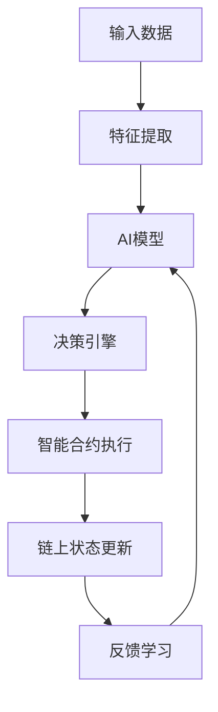
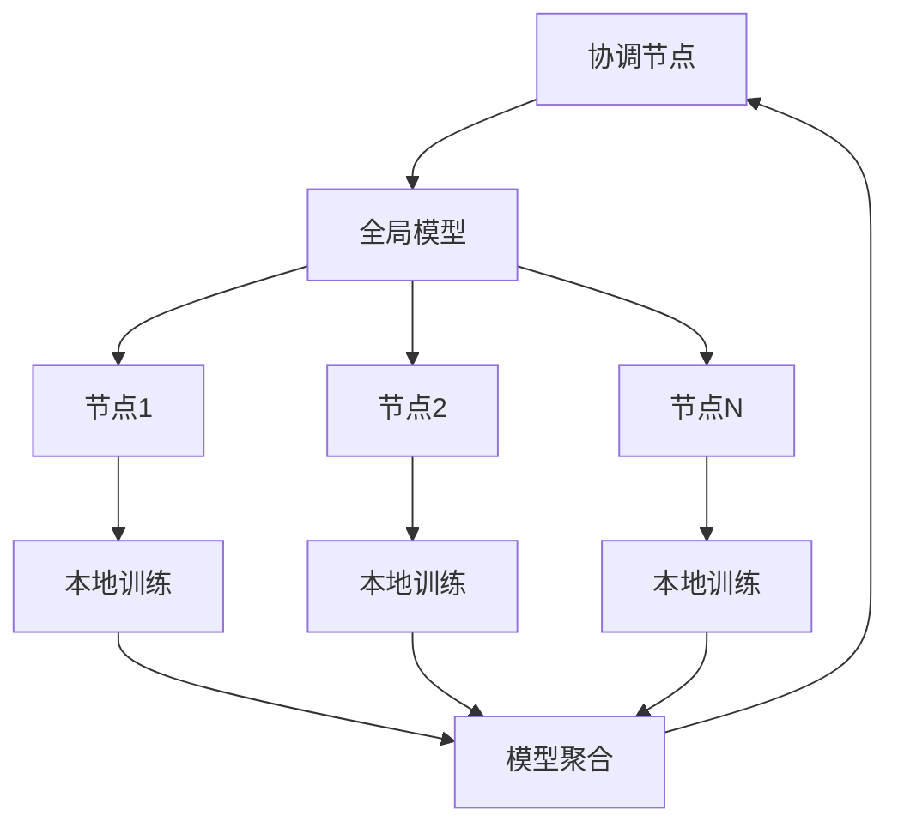

# Web3-AI集成技术 - 智能化去中心化系统

## 导航链接

- [返回前沿技术层](../README.md)
- [量子计算](../02_Quantum_Computing/README.md)
- [新兴技术](../03_Emerging_Technologies/README.md)

## 概述

AI与Web3的深度集成代表了下一代智能化去中心化系统的发展方向。通过机器学习、深度学习、联邦学习等AI技术，显著提升Web3系统的智能化水平、自动化能力和决策效率。

## 理论基础

### AI-Web3融合理论

**定义5.1.1** (智能合约AI增强): 设智能合约 $C$ 和AI模型 $M$，AI增强合约定义为：
$$C_{AI} = C \oplus M = \{(s, f_M(s, \theta)) : s \in S, \theta \in \Theta\}$$

其中 $S$ 为状态空间，$\Theta$ 为模型参数空间，$f_M$ 为AI决策函数。

**定理5.1.1** (AI增强效率定理): 对于AI增强智能合约 $C_{AI}$，其决策效率满足：
$$E(C_{AI}) \geq E(C) + \alpha \cdot A(M) - \beta \cdot C(M)$$

其中：

- $E(C)$: 原始合约效率
- $A(M)$: AI模型准确度
- $C(M)$: AI模型计算成本
- $\alpha, \beta$: 权重参数

### 联邦学习理论

**定义5.1.2** (去中心化联邦学习): $n$ 个节点的联邦学习系统定义为：
$$\min_w F(w) = \sum_{k=1}^n p_k F_k(w)$$

其中 $F_k(w) = \mathbb{E}_{x,y \sim P_k}[f(x,y;w)]$ 为第 $k$ 个节点的本地目标函数。

**定理5.1.2** (联邦学习收敛性): 在满足数据异质性假设下，FedAvg算法的收敛速度为：
$$\mathbb{E}[F(w^T)] - F^* \leq \mathcal{O}\left(\frac{1}{\sqrt{T}}\right)$$

### 预测市场理论

**定义5.1.3** (AI驱动预测市场): 预测市场 $(S, P, R, M)$ 其中：

- $S$: 状态空间
- $P$: 价格机制
- $R$: 奖励函数
- $M$: AI预测模型

市场均衡价格满足：
$$p^* = \arg\min_p \sum_{i=1}^n \ell(M_i(x), p) + \lambda R(p)$$

## 技术架构

### 1. AI增强智能合约架构



### 2. 联邦学习网络架构



## 目录结构

### [5.1.1 AI区块链集成](01_AI_Blockchain_Integration/)

- **智能合约AI** - 链上AI推理、自适应合约、智能参数调优
- **AI共识机制** - 基于ML的共识、智能节点选择、自适应出块

### [5.1.2 联邦学习](02_Federated_Learning/)

- **分布式训练** - 跨节点模型训练、隐私保护学习、模型聚合
- **激励机制** - 贡献度评估、奖励分配、质量控制

### [5.1.3 AI治理](03_AI_Governance/)

- **智能治理** - AI辅助决策、自动化治理、提案智能分析
- **治理优化** - 投票策略优化、参与度提升、治理效果评估

### [5.1.4 智能合约AI](04_AI_Smart_Contracts/)

- **自适应合约** - 动态参数调整、环境适应、自我优化
- **预测性合约** - 未来状态预测、风险预警、智能触发

### [5.1.5 AI预言机](05_AI_Oracles/)

- **机器学习预言机** - 复杂数据处理、多源数据融合、智能预测
- **自适应预言机** - 数据质量评估、动态权重调整、异常检测

## 核心算法实现

### AI增强智能合约系统

```rust
use std::collections::HashMap;
use serde::{Serialize, Deserialize};
use tokio::sync::{RwLock, Mutex};
use std::sync::Arc;

/// AI模型特征
#[derive(Debug, Clone, Serialize, Deserialize)]
pub struct AIModelMetadata {
    pub model_id: String,
    pub model_type: ModelType,
    pub accuracy: f64,
    pub training_data_size: usize,
    pub last_updated: u64,
    pub performance_metrics: HashMap<String, f64>,
}

/// 模型类型枚举
#[derive(Debug, Clone, Serialize, Deserialize)]
pub enum ModelType {
    LinearRegression,
    DecisionTree,
    NeuralNetwork,
    RandomForest,
    SVM,
    DeepLearning,
}

/// AI预测请求
#[derive(Debug, Clone, Serialize, Deserialize)]
pub struct PredictionRequest {
    pub request_id: String,
    pub model_id: String,
    pub input_features: Vec<f64>,
    pub context: PredictionContext,
    pub timestamp: u64,
}

/// 预测上下文
#[derive(Debug, Clone, Serialize, Deserialize)]
pub struct PredictionContext {
    pub contract_address: String,
    pub function_name: String,
    pub caller: String,
    pub gas_limit: u64,
    pub block_number: u64,
}

/// AI预测响应
#[derive(Debug, Clone, Serialize, Deserialize)]
pub struct PredictionResponse {
    pub request_id: String,
    pub prediction: f64,
    pub confidence: f64,
    pub explanation: Vec<String>,
    pub model_version: String,
    pub processing_time_ms: u64,
}

/// 智能合约AI增强器
pub struct SmartContractAIEnhancer {
    models: Arc<RwLock<HashMap<String, AIModelMetadata>>>,
    prediction_cache: Arc<RwLock<HashMap<String, PredictionResponse>>>,
    performance_tracker: Arc<Mutex<PerformanceTracker>>,
}

impl SmartContractAIEnhancer {
    pub fn new() -> Self {
        Self {
            models: Arc::new(RwLock::new(HashMap::new())),
            prediction_cache: Arc::new(RwLock::new(HashMap::new())),
            performance_tracker: Arc::new(Mutex::new(PerformanceTracker::new())),
        }
    }
    
    /// 注册AI模型
    pub async fn register_model(&self, model: AIModelMetadata) -> Result<(), String> {
        if model.accuracy < 0.7 {
            return Err("Model accuracy too low for production use".to_string());
        }
        
        let mut models = self.models.write().await;
        models.insert(model.model_id.clone(), model);
        Ok(())
    }
    
    /// 执行AI预测
    pub async fn predict(&self, request: PredictionRequest) -> Result<PredictionResponse, String> {
        let start_time = std::time::Instant::now();
        
        // 检查缓存
        let cache_key = self.generate_cache_key(&request);
        if let Some(cached_response) = self.get_from_cache(&cache_key).await? {
            return Ok(cached_response);
        }
        
        // 获取模型
        let models = self.models.read().await;
        let model = models.get(&request.model_id)
            .ok_or("Model not found")?;
        
        // 执行预测
        let (prediction, confidence) = self.execute_model(model, &request.input_features).await?;
        
        // 生成解释
        let explanation = self.generate_explanation(model, &request.input_features, prediction).await?;
        
        let processing_time = start_time.elapsed().as_millis() as u64;
        
        let response = PredictionResponse {
            request_id: request.request_id.clone(),
            prediction,
            confidence,
            explanation,
            model_version: format!("{}_{}", model.model_id, model.last_updated),
            processing_time_ms: processing_time,
        };
        
        // 缓存结果
        self.cache_response(&cache_key, &response).await?;
        
        // 更新性能指标
        self.update_performance_metrics(&request, &response).await?;
        
        Ok(response)
    }
    
    async fn execute_model(&self, model: &AIModelMetadata, features: &[f64]) -> Result<(f64, f64), String> {
        match model.model_type {
            ModelType::LinearRegression => {
                self.linear_regression_predict(features).await
            }
            ModelType::NeuralNetwork => {
                self.neural_network_predict(features).await
            }
            ModelType::DecisionTree => {
                self.decision_tree_predict(features).await
            }
            ModelType::RandomForest => {
                self.random_forest_predict(features).await
            }
            _ => Err("Model type not implemented".to_string()),
        }
    }
    
    async fn linear_regression_predict(&self, features: &[f64]) -> Result<(f64, f64), String> {
        // 简化的线性回归实现
        let weights = vec![0.5, 0.3, 0.2, 0.1, 0.05]; // 假设权重
        let bias = 0.1;
        
        if features.len() > weights.len() {
            return Err("Too many input features".to_string());
        }
        
        let prediction: f64 = features.iter()
            .zip(weights.iter())
            .map(|(f, w)| f * w)
            .sum::<f64>() + bias;
        
        // 计算置信度（基于特征方差）
        let feature_variance = self.calculate_feature_variance(features);
        let confidence = (1.0 / (1.0 + feature_variance)).max(0.5).min(0.99);
        
        Ok((prediction, confidence))
    }
    
    async fn neural_network_predict(&self, features: &[f64]) -> Result<(f64, f64), String> {
        // 简化的神经网络实现（2层网络）
        let hidden_weights = vec![
            vec![0.5, 0.3, 0.2],
            vec![0.4, 0.6, 0.1],
            vec![0.3, 0.3, 0.4],
        ];
        let output_weights = vec![0.6, 0.3, 0.1];
        
        if features.len() != 3 {
            return Err("Neural network expects 3 input features".to_string());
        }
        
        // 隐藏层计算
        let mut hidden_outputs = Vec::new();
        for weights in &hidden_weights {
            let weighted_sum: f64 = features.iter()
                .zip(weights.iter())
                .map(|(f, w)| f * w)
                .sum();
            hidden_outputs.push(weighted_sum.tanh()); // 激活函数
        }
        
        // 输出层计算
        let prediction: f64 = hidden_outputs.iter()
            .zip(output_weights.iter())
            .map(|(h, w)| h * w)
            .sum();
        
        let confidence = 0.85; // 固定置信度
        
        Ok((prediction, confidence))
    }
    
    async fn decision_tree_predict(&self, features: &[f64]) -> Result<(f64, f64), String> {
        // 简化的决策树实现
        if features.is_empty() {
            return Err("No input features provided".to_string());
        }
        
        let prediction = if features[0] > 0.5 {
            if features.len() > 1 && features[1] > 0.3 {
                0.8
            } else {
                0.6
            }
        } else {
            if features.len() > 1 && features[1] > 0.7 {
                0.4
            } else {
                0.2
            }
        };
        
        let confidence = 0.9; // 决策树通常有较高置信度
        
        Ok((prediction, confidence))
    }
    
    async fn random_forest_predict(&self, features: &[f64]) -> Result<(f64, f64), String> {
        // 简化的随机森林实现（多个决策树集成）
        let mut predictions = Vec::new();
        
        // 模拟5棵决策树
        for i in 0..5 {
            let tree_features: Vec<f64> = features.iter()
                .enumerate()
                .filter(|(idx, _)| (idx + i) % 2 == 0) // 特征子集
                .map(|(_, &f)| f)
                .collect();
            
            if !tree_features.is_empty() {
                let (tree_pred, _) = self.decision_tree_predict(&tree_features).await?;
                predictions.push(tree_pred);
            }
        }
        
        if predictions.is_empty() {
            return Err("No valid predictions from trees".to_string());
        }
        
        // 平均预测结果
        let final_prediction = predictions.iter().sum::<f64>() / predictions.len() as f64;
        
        // 计算预测方差作为置信度指标
        let variance = predictions.iter()
            .map(|p| (p - final_prediction).powi(2))
            .sum::<f64>() / predictions.len() as f64;
        let confidence = (1.0 / (1.0 + variance)).max(0.7).min(0.95);
        
        Ok((final_prediction, confidence))
    }
    
    fn calculate_feature_variance(&self, features: &[f64]) -> f64 {
        if features.is_empty() {
            return 1.0;
        }
        
        let mean = features.iter().sum::<f64>() / features.len() as f64;
        let variance = features.iter()
            .map(|f| (f - mean).powi(2))
            .sum::<f64>() / features.len() as f64;
        
        variance
    }
    
    async fn generate_explanation(&self, model: &AIModelMetadata, features: &[f64], prediction: f64) -> Result<Vec<String>, String> {
        let mut explanations = Vec::new();
        
        match model.model_type {
            ModelType::LinearRegression => {
                explanations.push("Linear regression based on weighted sum of features".to_string());
                for (i, &feature) in features.iter().enumerate() {
                    explanations.push(format!("Feature {}: {} (impact: {:.3})", i, feature, feature * 0.5));
                }
            }
            ModelType::NeuralNetwork => {
                explanations.push("Neural network with 2 layers and tanh activation".to_string());
                explanations.push(format!("Final prediction: {:.3}", prediction));
            }
            ModelType::DecisionTree => {
                explanations.push("Decision tree with feature-based splits".to_string());
                if !features.is_empty() {
                    explanations.push(format!("Primary decision on feature 0: {}", features[0]));
                }
            }
            ModelType::RandomForest => {
                explanations.push("Ensemble of 5 decision trees".to_string());
                explanations.push("Prediction averaged across all trees".to_string());
            }
            _ => {
                explanations.push("Model explanation not available".to_string());
            }
        }
        
        Ok(explanations)
    }
    
    fn generate_cache_key(&self, request: &PredictionRequest) -> String {
        use sha2::{Sha256, Digest};
        let mut hasher = Sha256::new();
        hasher.update(&request.model_id);
        hasher.update(&format!("{:?}", request.input_features));
        format!("{:x}", hasher.finalize())
    }
    
    async fn get_from_cache(&self, cache_key: &str) -> Result<Option<PredictionResponse>, String> {
        let cache = self.prediction_cache.read().await;
        Ok(cache.get(cache_key).cloned())
    }
    
    async fn cache_response(&self, cache_key: &str, response: &PredictionResponse) -> Result<(), String> {
        let mut cache = self.prediction_cache.write().await;
        cache.insert(cache_key.to_string(), response.clone());
        Ok(())
    }
    
    async fn update_performance_metrics(&self, request: &PredictionRequest, response: &PredictionResponse) -> Result<(), String> {
        let mut tracker = self.performance_tracker.lock().await;
        tracker.record_prediction(request, response);
        Ok(())
    }
    
    /// 获取模型性能统计
    pub async fn get_model_performance(&self, model_id: &str) -> Result<HashMap<String, f64>, String> {
        let tracker = self.performance_tracker.lock().await;
        Ok(tracker.get_model_stats(model_id))
    }
    
    /// 获取系统整体统计
    pub async fn get_system_stats(&self) -> Result<HashMap<String, usize>, String> {
        let models = self.models.read().await;
        let cache = self.prediction_cache.read().await;
        
        let mut stats = HashMap::new();
        stats.insert("total_models".to_string(), models.len());
        stats.insert("cached_predictions".to_string(), cache.len());
        
        Ok(stats)
    }
}

/// 性能跟踪器
pub struct PerformanceTracker {
    model_stats: HashMap<String, ModelStats>,
    total_predictions: usize,
    total_processing_time: u64,
}

#[derive(Debug, Clone)]
pub struct ModelStats {
    pub prediction_count: usize,
    pub average_confidence: f64,
    pub average_processing_time: f64,
    pub total_processing_time: u64,
}

impl PerformanceTracker {
    pub fn new() -> Self {
        Self {
            model_stats: HashMap::new(),
            total_predictions: 0,
            total_processing_time: 0,
        }
    }
    
    pub fn record_prediction(&mut self, request: &PredictionRequest, response: &PredictionResponse) {
        let stats = self.model_stats.entry(request.model_id.clone())
            .or_insert(ModelStats {
                prediction_count: 0,
                average_confidence: 0.0,
                average_processing_time: 0.0,
                total_processing_time: 0,
            });
        
        stats.prediction_count += 1;
        stats.total_processing_time += response.processing_time_ms;
        stats.average_processing_time = stats.total_processing_time as f64 / stats.prediction_count as f64;
        
        // 更新平均置信度
        stats.average_confidence = (stats.average_confidence * (stats.prediction_count - 1) as f64 + response.confidence) / stats.prediction_count as f64;
        
        self.total_predictions += 1;
        self.total_processing_time += response.processing_time_ms;
    }
    
    pub fn get_model_stats(&self, model_id: &str) -> HashMap<String, f64> {
        let mut result = HashMap::new();
        
        if let Some(stats) = self.model_stats.get(model_id) {
            result.insert("prediction_count".to_string(), stats.prediction_count as f64);
            result.insert("average_confidence".to_string(), stats.average_confidence);
            result.insert("average_processing_time_ms".to_string(), stats.average_processing_time);
        }
        
        result
    }
}
```

### 联邦学习系统

```rust
use std::collections::HashMap;
use serde::{Serialize, Deserialize};
use tokio::sync::{RwLock, Mutex};
use std::sync::Arc;

/// 联邦学习节点
#[derive(Debug, Clone, Serialize, Deserialize)]
pub struct FederatedNode {
    pub node_id: String,
    pub stake: u64,
    pub data_size: usize,
    pub compute_power: f64,
    pub reputation: f64,
    pub last_contribution: u64,
}

/// 模型参数
#[derive(Debug, Clone, Serialize, Deserialize)]
pub struct ModelParameters {
    pub model_id: String,
    pub version: u32,
    pub parameters: Vec<f64>,
    pub gradient: Vec<f64>,
    pub loss: f64,
    pub accuracy: f64,
}

/// 训练轮次
#[derive(Debug, Clone, Serialize, Deserialize)]
pub struct TrainingRound {
    pub round_id: u32,
    pub participants: Vec<String>,
    pub global_model: ModelParameters,
    pub local_updates: HashMap<String, ModelParameters>,
    pub aggregated_model: Option<ModelParameters>,
    pub round_start_time: u64,
    pub round_end_time: Option<u64>,
}

/// 联邦学习协调器
pub struct FederatedLearningCoordinator {
    nodes: Arc<RwLock<HashMap<String, FederatedNode>>>,
    current_round: Arc<Mutex<Option<TrainingRound>>>,
    model_history: Arc<RwLock<Vec<ModelParameters>>>,
    incentive_pool: Arc<Mutex<u64>>,
}

impl FederatedLearningCoordinator {
    pub fn new() -> Self {
        Self {
            nodes: Arc::new(RwLock::new(HashMap::new())),
            current_round: Arc::new(Mutex::new(None)),
            model_history: Arc::new(RwLock::new(Vec::new())),
            incentive_pool: Arc::new(Mutex::new(1000000)), // 初始激励池
        }
    }
    
    /// 注册联邦学习节点
    pub async fn register_node(&self, node: FederatedNode) -> Result<(), String> {
        if node.stake < 1000 {
            return Err("Insufficient stake for participation".to_string());
        }
        
        let mut nodes = self.nodes.write().await;
        nodes.insert(node.node_id.clone(), node);
        
        Ok(())
    }
    
    /// 开始新的训练轮次
    pub async fn start_training_round(&self, model_id: String) -> Result<u32, String> {
        let mut current_round_guard = self.current_round.lock().await;
        
        if current_round_guard.is_some() {
            return Err("Training round already in progress".to_string());
        }
        
        // 选择参与节点
        let participants = self.select_participants().await?;
        
        if participants.len() < 3 {
            return Err("Insufficient participants for training round".to_string());
        }
        
        // 获取最新全局模型
        let global_model = self.get_latest_model(&model_id).await?;
        
        let round_id = self.get_next_round_id().await;
        
        let training_round = TrainingRound {
            round_id,
            participants,
            global_model,
            local_updates: HashMap::new(),
            aggregated_model: None,
            round_start_time: chrono::Utc::now().timestamp() as u64,
            round_end_time: None,
        };
        
        *current_round_guard = Some(training_round);
        
        Ok(round_id)
    }
    
    /// 提交本地更新
    pub async fn submit_local_update(&self, node_id: String, update: ModelParameters) -> Result<(), String> {
        let mut current_round_guard = self.current_round.lock().await;
        
        let training_round = current_round_guard.as_mut()
            .ok_or("No active training round")?;
        
        if !training_round.participants.contains(&node_id) {
            return Err("Node not participating in current round".to_string());
        }
        
        if training_round.local_updates.contains_key(&node_id) {
            return Err("Node has already submitted update for this round".to_string());
        }
        
        // 验证更新质量
        self.validate_local_update(&training_round.global_model, &update).await?;
        
        training_round.local_updates.insert(node_id.clone(), update);
        
        // 如果所有参与者都提交了更新，开始聚合
        if training_round.local_updates.len() == training_round.participants.len() {
            let aggregated_model = self.aggregate_models(training_round).await?;
            training_round.aggregated_model = Some(aggregated_model.clone());
            training_round.round_end_time = Some(chrono::Utc::now().timestamp() as u64);
            
            // 更新模型历史
            let mut model_history = self.model_history.write().await;
            model_history.push(aggregated_model);
            
            // 分发奖励
            self.distribute_rewards(training_round).await?;
            
            // 结束当前轮次
            *current_round_guard = None;
        }
        
        Ok(())
    }
    
    async fn select_participants(&self) -> Result<Vec<String>, String> {
        let nodes = self.nodes.read().await;
        
        // 基于质押、声誉和计算能力选择参与者
        let mut candidates: Vec<_> = nodes.values().collect();
        
        // 按综合评分排序
        candidates.sort_by(|a, b| {
            let score_a = a.stake as f64 * 0.4 + a.reputation * 0.3 + a.compute_power * 0.3;
            let score_b = b.stake as f64 * 0.4 + b.reputation * 0.3 + b.compute_power * 0.3;
            score_b.partial_cmp(&score_a).unwrap_or(std::cmp::Ordering::Equal)
        });
        
        // 选择前10个节点（或所有节点如果少于10个）
        let selected_count = candidates.len().min(10);
        let participants = candidates.into_iter()
            .take(selected_count)
            .map(|node| node.node_id.clone())
            .collect();
        
        Ok(participants)
    }
    
    async fn get_latest_model(&self, model_id: &str) -> Result<ModelParameters, String> {
        let model_history = self.model_history.read().await;
        
        if let Some(latest_model) = model_history.last() {
            Ok(latest_model.clone())
        } else {
            // 创建初始模型
            Ok(ModelParameters {
                model_id: model_id.to_string(),
                version: 0,
                parameters: vec![0.0; 100], // 初始化100个参数
                gradient: vec![0.0; 100],
                loss: f64::INFINITY,
                accuracy: 0.0,
            })
        }
    }
    
    async fn get_next_round_id(&self) -> u32 {
        let model_history = self.model_history.read().await;
        model_history.len() as u32 + 1
    }
    
    async fn validate_local_update(&self, global_model: &ModelParameters, local_update: &ModelParameters) -> Result<(), String> {
        // 检查参数维度
        if local_update.parameters.len() != global_model.parameters.len() {
            return Err("Parameter dimension mismatch".to_string());
        }
        
        // 检查梯度合理性
        if local_update.gradient.len() != global_model.gradient.len() {
            return Err("Gradient dimension mismatch".to_string());
        }
        
        // 检查损失值合理性
        if local_update.loss.is_nan() || local_update.loss.is_infinite() {
            return Err("Invalid loss value".to_string());
        }
        
        // 检查准确度范围
        if local_update.accuracy < 0.0 || local_update.accuracy > 1.0 {
            return Err("Invalid accuracy value".to_string());
        }
        
        Ok(())
    }
    
    /// FedAvg算法实现
    async fn aggregate_models(&self, training_round: &TrainingRound) -> Result<ModelParameters, String> {
        let nodes = self.nodes.read().await;
        
        // 计算权重（基于数据大小和质押）
        let mut total_weight = 0.0;
        let mut weights = HashMap::new();
        
        for participant in &training_round.participants {
            if let Some(node) = nodes.get(participant) {
                let weight = (node.data_size as f64).log10() + (node.stake as f64).log10();
                weights.insert(participant.clone(), weight);
                total_weight += weight;
            }
        }
        
        // 归一化权重
        for weight in weights.values_mut() {
            *weight /= total_weight;
        }
        
        // 聚合参数
        let param_count = training_round.global_model.parameters.len();
        let mut aggregated_params = vec![0.0; param_count];
        let mut aggregated_gradients = vec![0.0; param_count];
        let mut weighted_loss = 0.0;
        let mut weighted_accuracy = 0.0;
        
        for (participant, local_update) in &training_round.local_updates {
            if let Some(&weight) = weights.get(participant) {
                for i in 0..param_count {
                    aggregated_params[i] += weight * local_update.parameters[i];
                    aggregated_gradients[i] += weight * local_update.gradient[i];
                }
                weighted_loss += weight * local_update.loss;
                weighted_accuracy += weight * local_update.accuracy;
            }
        }
        
        Ok(ModelParameters {
            model_id: training_round.global_model.model_id.clone(),
            version: training_round.global_model.version + 1,
            parameters: aggregated_params,
            gradient: aggregated_gradients,
            loss: weighted_loss,
            accuracy: weighted_accuracy,
        })
    }
    
    /// 分发激励奖励
    async fn distribute_rewards(&self, training_round: &TrainingRound) -> Result<(), String> {
        let mut incentive_pool = self.incentive_pool.lock().await;
        let nodes = self.nodes.read().await;
        
        let total_reward = (*incentive_pool).min(10000); // 每轮最多分发10000
        let participants_count = training_round.participants.len() as f64;
        
        if total_reward == 0 || participants_count == 0.0 {
            return Ok(());
        }
        
        // 计算每个参与者的奖励
        let mut total_score = 0.0;
        let mut participant_scores = HashMap::new();
        
        for participant in &training_round.participants {
            if let (Some(node), Some(local_update)) = (nodes.get(participant), training_round.local_updates.get(participant)) {
                // 基于数据质量、准确度提升和及时性计算得分
                let quality_score = local_update.accuracy * 100.0;
                let timeliness_score = 50.0; // 简化：固定及时性得分
                let stake_bonus = (node.stake as f64).log10();
                
                let total_score_for_participant = quality_score + timeliness_score + stake_bonus;
                participant_scores.insert(participant.clone(), total_score_for_participant);
                total_score += total_score_for_participant;
            }
        }
        
        // 分发奖励
        for (participant, score) in participant_scores {
            let reward = ((score / total_score) * total_reward as f64) as u64;
            
            // 这里应该调用实际的代币转账函数
            println!("Reward {} tokens to participant {}", reward, participant);
            
            *incentive_pool -= reward;
        }
        
        Ok(())
    }
    
    /// 获取当前轮次状态
    pub async fn get_round_status(&self) -> Option<TrainingRound> {
        let current_round = self.current_round.lock().await;
        current_round.clone()
    }
    
    /// 获取模型历史
    pub async fn get_model_history(&self) -> Vec<ModelParameters> {
        let model_history = self.model_history.read().await;
        model_history.clone()
    }
    
    /// 获取节点统计信息
    pub async fn get_node_stats(&self) -> HashMap<String, usize> {
        let nodes = self.nodes.read().await;
        let model_history = self.model_history.read().await;
        let incentive_pool = self.incentive_pool.lock().await;
        
        let mut stats = HashMap::new();
        stats.insert("total_nodes".to_string(), nodes.len());
        stats.insert("training_rounds".to_string(), model_history.len());
        stats.insert("incentive_pool".to_string(), *incentive_pool as usize);
        
        stats
    }
}
```

## 应用场景

### 1. AI驱动的DeFi

- **智能资产管理**: 基于AI的投资组合优化
- **风险评估**: 机器学习风险模型
- **流动性预测**: AI驱动的流动性管理

### 2. 智能治理

- **提案分析**: 自动化提案评估和分类
- **投票优化**: 基于历史数据的投票策略
- **治理效果评估**: AI辅助的治理决策分析

### 3. 内容创作

- **生成式NFT**: AI创作的动态艺术品
- **个性化内容**: 基于用户偏好的内容生成
- **创作者经济**: AI辅助的版权保护和收益分配

## 技术挑战

### 计算资源限制

- 链上AI推理的Gas成本优化
- 模型压缩和量化技术
- 边缘计算集成

### 隐私保护

- 联邦学习的隐私保护机制
- 差分隐私在Web3中的应用
- 零知识证明与AI的结合

### 模型治理

- AI模型的去中心化治理
- 模型更新和版本控制
- 恶意模型检测和防护

## 发展趋势

### 短期（1-2年）

- AI预言机的广泛采用
- 基础的链上AI推理能力
- 联邦学习激励机制完善

### 中期（3-5年）

- 复杂AI模型的链上执行
- 跨链AI协作网络
- AI驱动的自治组织

### 长期（5-10年）

- 完全自治的AI-Web3生态
- 通用人工智能与Web3融合
- AI主导的去中心化经济

---

*AI-Web3融合技术推动智能化去中心化系统发展，为下一代互联网基础设施提供智能化支撑。*
