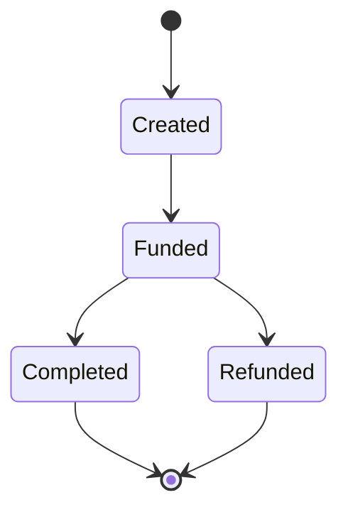

# 跨链互操作性理论

## 目录

1. [跨链互操作性形式化定义](#1-跨链互操作性形式化定义)
2. [原子交换协议](#2-原子交换协议)
3. [中继链模型](#3-中继链模型)
4. [哈希时间锁合约(HTLC)](#4-哈希时间锁合约htlc)
5. [跨链消息传递](#5-跨链消息传递)
6. [跨链安全性分析](#6-跨链安全性分析)
7. [跨链性能优化](#7-跨链性能优化)
8. [跨链治理机制](#8-跨链治理机制)

## 1. 跨链互操作性形式化定义

### 1.1 跨链系统基本概念

**定义 1.1**（跨链系统）：跨链系统是一个形式化表示为七元组 $CC = (C, P, M, T, S, V, G)$ 的互操作框架，其中：

- $C$ 是区块链集合
- $P$ 是协议集合
- $M$ 是消息传递机制
- $T$ 是交易验证机制
- $S$ 是状态同步机制
- $V$ 是验证者集合
- $G$ 是治理机制

跨链互操作性的核心特性包括：

1. **原子性**：跨链操作要么全部成功，要么全部失败
2. **一致性**：不同链上的状态保持一致性
3. **安全性**：防止跨链攻击和欺诈
4. **可扩展性**：支持多链互操作
5. **去中心化**：不依赖单一可信第三方

### 1.2 跨链操作分类

**定义 1.2**（跨链操作分类）：跨链操作可以分为以下几类：

1. **资产转移**：将资产从一条链转移到另一条链
2. **消息传递**：在链间传递任意消息
3. **状态同步**：同步不同链上的状态信息
4. **合约调用**：跨链调用智能合约
5. **数据验证**：验证跨链数据的真实性

### 1.3 跨链信任模型

**定义 1.3**（跨链信任模型）：跨链信任模型定义了不同链之间的信任关系。

信任模型包括：

1. **无信任模型**：链间不建立信任关系
2. **轻信任模型**：通过密码学证明建立有限信任
3. **多签名模型**：通过多方签名建立信任
4. **联邦模型**：通过预选验证者建立信任

**定理 1.1**（跨链信任下限）：任何跨链协议的安全性不超过参与链中安全性最低的链。

**证明**：如果攻击者能够攻破安全性最低的链，就可以通过该链影响整个跨链系统的安全性。■

## 2. 原子交换协议

### 2.1 原子交换基本概念

**定义 2.1**（原子交换）：原子交换是一种无需可信第三方的跨链资产交换协议。

原子交换满足以下性质：

1. **原子性**：交换要么完全成功，要么完全失败
2. **公平性**：任何一方都无法欺骗另一方
3. **去中心化**：不依赖中心化机构
4. **隐私性**：交换过程保持隐私

### 2.2 哈希时间锁合约(HTLC)

**定义 2.2**（HTLC）：哈希时间锁合约是一个三元组 $HTLC = (H, T, V)$，其中：

- $H$ 是哈希锁
- $T$ 是时间锁
- $V$ 是验证函数

HTLC工作原理：

1. **创建阶段**：Alice创建包含哈希锁的HTLC
2. **交换阶段**：Bob创建对应的HTLC
3. **解锁阶段**：使用原像解锁HTLC
4. **超时阶段**：时间到期后可以退款

**定理 2.1**（HTLC安全性）：HTLC协议在诚实参与者假设下是安全的。

**证明**：HTLC通过哈希锁和时间锁机制确保交换的原子性和公平性。哈希锁防止提前解锁，时间锁防止无限期锁定。■

### 2.3 原子交换协议实现

```rust
// 原子交换协议实现
struct AtomicSwap {
    initiator: Address,
    responder: Address,
    initiator_amount: u128,
    responder_amount: u128,
    hash_lock: [u8; 32],
    timeout: u64,
    secret: Option<[u8; 32]>,
    state: SwapState,
}

enum SwapState {
    Initiated,
    Accepted,
    Completed,
    Refunded,
    Expired,
}

impl AtomicSwap {
    // 创建交换
    fn create_swap(
        &mut self,
        responder: Address,
        amount: u128,
        hash_lock: [u8; 32],
        timeout: u64,
    ) -> Result<(), SwapError> {
        require(self.state == SwapState::Initiated, "Invalid state");
        require(amount > 0, "Amount must be positive");
        require(timeout > block_timestamp(), "Invalid timeout");
        
        self.responder = responder;
        self.initiator_amount = amount;
        self.hash_lock = hash_lock;
        self.timeout = timeout;
        self.state = SwapState::Initiated;
        
        Ok(())
    }
    
    // 接受交换
    fn accept_swap(&mut self, amount: u128) -> Result<(), SwapError> {
        require(self.state == SwapState::Initiated, "Invalid state");
        require(amount > 0, "Amount must be positive");
        
        self.responder_amount = amount;
        self.state = SwapState::Accepted;
        
        Ok(())
    }
    
    // 完成交换
    fn complete_swap(&mut self, secret: [u8; 32]) -> Result<(), SwapError> {
        require(self.state == SwapState::Accepted, "Invalid state");
        require(self.verify_hash(secret), "Invalid secret");
        require(block_timestamp() < self.timeout, "Swap expired");
        
        self.secret = Some(secret);
        self.state = SwapState::Completed;
        
        Ok(())
    }
    
    // 退款
    fn refund(&mut self) -> Result<(), SwapError> {
        require(self.state == SwapState::Accepted, "Invalid state");
        require(block_timestamp() >= self.timeout, "Swap not expired");
        
        self.state = SwapState::Refunded;
        
        Ok(())
    }
    
    // 验证哈希
    fn verify_hash(&self, secret: [u8; 32]) -> bool {
        let hash = sha256(&secret);
        hash == self.hash_lock
    }
}
```

## 3. 中继链模型

### 3.1 中继链基本概念

**定义 3.1**（中继链）：中继链是一个专门用于连接多个区块链的中间链，形式化表示为五元组 $Relay = (C, V, M, S, P)$，其中：

- $C$ 是连接的区块链集合
- $V$ 是验证者集合
- $M$ 是消息路由机制
- $S$ 是状态管理
- $P$ 是共识协议

中继链的核心功能：

1. **消息路由**：在不同链间路由消息
2. **状态验证**：验证跨链状态的有效性
3. **资产桥接**：实现跨链资产转移
4. **共识协调**：协调不同链的共识

### 3.2 中继链架构模型

**定义 3.2**（中继链架构）：中继链架构包括以下组件：

1. **验证者网络**：负责验证跨链消息
2. **消息队列**：存储待处理的跨链消息
3. **状态存储**：存储跨链状态信息
4. **路由引擎**：决定消息路由路径
5. **安全模块**：提供安全保护机制

### 3.3 中继链共识机制

**定义 3.3**（中继链共识）：中继链共识机制确保跨链消息的一致性和安全性。

共识要求：

1. **最终性**：跨链消息具有最终性
2. **活性**：有效消息最终会被处理
3. **安全性**：无效消息不会被处理
4. **效率**：消息处理具有高效率

**定理 3.1**（中继链效率）：中继链的消息处理复杂度为 $O(n)$，其中 $n$ 是连接的区块链数量。

**证明**：中继链为每个连接的区块链维护一个连接，消息处理只需要在相应的连接上进行，因此复杂度为 $O(n)$。■

```rust
// 中继链实现示例
struct RelayChain {
    connected_chains: HashMap<ChainId, ChainConnection>,
    validators: Vec<Validator>,
    message_queue: VecDeque<CrossChainMessage>,
    state_store: HashMap<String, ChainState>,
}

struct ChainConnection {
    chain_id: ChainId,
    validator_set: Vec<Address>,
    last_block_hash: [u8; 32],
    message_count: u64,
}

struct CrossChainMessage {
    source_chain: ChainId,
    target_chain: ChainId,
    message_type: MessageType,
    payload: Vec<u8>,
    timestamp: u64,
    signature: Vec<u8>,
}

impl RelayChain {
    // 处理跨链消息
    fn process_message(&mut self, message: CrossChainMessage) -> Result<(), RelayError> {
        // 验证消息签名
        self.verify_message(&message)?;
        
        // 检查目标链连接
        let target_connection = self.connected_chains.get(&message.target_chain)
            .ok_or(RelayError::ChainNotConnected)?;
        
        // 添加到消息队列
        self.message_queue.push_back(message);
        
        // 触发消息处理
        self.process_message_queue()?;
        
        Ok(())
    }
    
    // 验证消息
    fn verify_message(&self, message: &CrossChainMessage) -> Result<(), RelayError> {
        let source_connection = self.connected_chains.get(&message.source_chain)
            .ok_or(RelayError::ChainNotConnected)?;
        
        // 验证签名
        let signer = self.recover_signer(&message.signature, &message.payload)?;
        
        if !source_connection.validator_set.contains(&signer) {
            return Err(RelayError::InvalidSignature);
        }
        
        Ok(())
    }
    
    // 处理消息队列
    fn process_message_queue(&mut self) -> Result<(), RelayError> {
        while let Some(message) = self.message_queue.pop_front() {
            // 根据消息类型处理
            match message.message_type {
                MessageType::AssetTransfer => {
                    self.handle_asset_transfer(message)?;
                },
                MessageType::StateUpdate => {
                    self.handle_state_update(message)?;
                },
                MessageType::ContractCall => {
                    self.handle_contract_call(message)?;
                },
            }
        }
        
        Ok(())
    }
}
```

## 4. 哈希时间锁合约(HTLC)

### 4.1 HTLC详细设计

**定义 4.1**（HTLC详细设计）：HTLC包含以下组件：

1. **哈希锁**：使用密码学哈希函数创建的条件锁
2. **时间锁**：基于时间的超时机制
3. **验证逻辑**：验证解锁条件的逻辑
4. **退款机制**：超时后的退款处理

HTLC状态机：



### 4.2 HTLC安全分析

**定理 4.1**（HTLC原子性）：HTLC协议保证交换的原子性。

**证明**：HTLC通过以下机制保证原子性：

1. **哈希锁**：只有拥有正确原像的参与者才能解锁
2. **时间锁**：防止无限期锁定
3. **状态机**：确保状态转换的正确性

因此，交换要么完全成功，要么完全失败。■

### 4.3 HTLC优化技术

**定义 4.2**（HTLC优化）：HTLC优化技术包括：

1. **批量处理**：批量处理多个HTLC
2. **路由优化**：优化HTLC路由路径
3. **费用优化**：最小化HTLC费用
4. **隐私保护**：保护HTLC隐私信息

```rust
// 优化的HTLC实现
struct OptimizedHTLC {
    // 批量HTLC处理
    fn batch_create_htlc(&mut self, htlc_list: Vec<HTLCParams>) -> Vec<HTLCId> {
        let mut htlc_ids = Vec::new();
        
        for params in htlc_list {
            let htlc_id = self.create_htlc(params)?;
            htlc_ids.push(htlc_id);
        }
        
        // 批量提交到区块链
        self.batch_submit(htlc_ids.clone())?;
        
        htlc_ids
    }
    
    // 路由优化
    fn find_optimal_route(&self, source: ChainId, target: ChainId) -> Route {
        let graph = self.build_chain_graph();
        let route = self.dijkstra_shortest_path(&graph, source, target);
        
        // 考虑费用和延迟
        self.optimize_route_for_cost_and_latency(route)
    }
    
    // 隐私保护
    fn create_private_htlc(&mut self, params: HTLCParams) -> PrivateHTLC {
        // 使用零知识证明隐藏敏感信息
        let proof = self.generate_zk_proof(&params);
        
        PrivateHTLC {
            public_params: params.public_info(),
            proof,
            commitment: self.create_commitment(&params),
        }
    }
}
```

## 5. 跨链消息传递

### 5.1 消息传递模型

**定义 5.1**（跨链消息传递）：跨链消息传递是一个四元组 $MP = (S, T, R, V)$，其中：

- $S$ 是消息源集合
- $T$ 是消息目标集合
- $R$ 是路由机制
- $V$ 是验证机制

消息传递流程：

1. **消息创建**：在源链创建消息
2. **消息验证**：验证消息的有效性
3. **消息路由**：将消息路由到目标链
4. **消息执行**：在目标链执行消息

### 5.2 消息格式标准

**定义 5.2**（跨链消息格式）：跨链消息包含以下字段：

```rust
struct CrossChainMessage {
    header: MessageHeader,
    body: MessageBody,
    proof: MessageProof,
    signature: MessageSignature,
}

struct MessageHeader {
    source_chain: ChainId,
    target_chain: ChainId,
    message_id: MessageId,
    timestamp: u64,
    nonce: u64,
}

struct MessageBody {
    message_type: MessageType,
    payload: Vec<u8>,
    gas_limit: u64,
    value: u128,
}
```

### 5.3 消息验证机制

**定义 5.3**（消息验证）：消息验证确保跨链消息的真实性和完整性。

验证步骤：

1. **格式验证**：验证消息格式正确性
2. **签名验证**：验证消息签名有效性
3. **状态验证**：验证源链状态有效性
4. **权限验证**：验证发送者权限

**定理 5.1**（消息安全性）：如果消息验证通过，则消息是安全可靠的。

**证明**：消息验证通过密码学方法确保消息的真实性、完整性和不可否认性。■

## 6. 跨链安全性分析

### 6.1 安全威胁模型

**定义 6.1**（跨链安全威胁）：跨链安全威胁包括：

1. **重放攻击**：重复执行跨链消息
2. **伪造攻击**：伪造跨链消息
3. **双花攻击**：在跨链过程中进行双花
4. **拒绝服务攻击**：阻止跨链操作
5. **状态不一致攻击**：破坏链间状态一致性

### 6.2 安全防护机制

**定义 6.2**（安全防护）：跨链安全防护机制包括：

1. **消息去重**：防止消息重放
2. **签名验证**：防止消息伪造
3. **状态锁定**：防止双花攻击
4. **超时机制**：防止拒绝服务
5. **一致性检查**：确保状态一致性

### 6.3 安全证明

**定理 6.1**（跨链安全）：在诚实多数假设下，跨链协议是安全的。

**证明**：跨链协议通过以下机制保证安全：

1. **密码学保护**：使用密码学方法保护消息
2. **共识机制**：通过共识确保一致性
3. **经济激励**：通过经济激励防止恶意行为
4. **时间锁定**：通过时间锁定防止攻击

因此，在诚实多数假设下，跨链协议是安全的。■

## 7. 跨链性能优化

### 7.1 性能瓶颈分析

**定义 7.1**（性能瓶颈）：跨链性能瓶颈包括：

1. **网络延迟**：链间网络通信延迟
2. **共识延迟**：共识机制导致的延迟
3. **验证开销**：消息验证的计算开销
4. **存储开销**：跨链数据的存储开销

### 7.2 性能优化技术

**定义 7.2**（性能优化）：跨链性能优化技术包括：

1. **并行处理**：并行处理多个跨链操作
2. **缓存机制**：缓存常用的跨链数据
3. **压缩技术**：压缩跨链消息和数据
4. **预计算**：预计算常用的验证结果

### 7.3 性能度量

**定义 7.3**（性能度量）：跨链性能度量指标包括：

1. **吞吐量**：单位时间内处理的跨链操作数
2. **延迟**：跨链操作的平均延迟
3. **成功率**：跨链操作的成功率
4. **成本**：跨链操作的平均成本

**定理 7.1**（性能优化效果）：通过并行处理和缓存机制，可以将跨链性能提升 $O(n)$ 倍。

**证明**：并行处理可以同时处理 $n$ 个跨链操作，缓存机制可以减少重复计算，因此性能提升为 $O(n)$ 倍。■

## 8. 跨链治理机制

### 8.1 治理模型

**定义 8.1**（跨链治理）：跨链治理是管理跨链协议运行和发展的机制。

治理模型包括：

1. **链上治理**：通过链上投票进行治理
2. **链下治理**：通过链下讨论和投票进行治理
3. **混合治理**：结合链上和链下治理
4. **多链治理**：多个链共同参与治理

### 8.2 治理流程

**定义 8.2**（治理流程）：跨链治理流程包括：

1. **提案阶段**：提出治理提案
2. **讨论阶段**：社区讨论提案
3. **投票阶段**：对提案进行投票
4. **执行阶段**：执行通过的提案

### 8.3 治理激励

**定义 8.3**（治理激励）：治理激励是鼓励参与治理的机制。

激励方式包括：

1. **代币奖励**：为治理参与者提供代币奖励
2. **声誉机制**：建立治理参与者声誉
3. **权力分配**：根据参与度分配治理权力
4. **费用分享**：分享协议费用给治理参与者

```rust
// 跨链治理实现
struct CrossChainGovernance {
    proposals: HashMap<ProposalId, Proposal>,
    votes: HashMap<ProposalId, HashMap<Address, Vote>>,
    governance_token: Address,
    quorum: u64,
    voting_period: u64,
}

impl CrossChainGovernance {
    // 创建提案
    fn create_proposal(&mut self, description: String, actions: Vec<GovernanceAction>) -> ProposalId {
        let proposal_id = self.generate_proposal_id();
        
        let proposal = Proposal {
            id: proposal_id,
            creator: msg.sender,
            description,
            actions,
            created_at: block_timestamp(),
            voting_start: block_timestamp(),
            voting_end: block_timestamp() + self.voting_period,
            executed: false,
        };
        
        self.proposals.insert(proposal_id, proposal);
        proposal_id
    }
    
    // 投票
    fn vote(&mut self, proposal_id: ProposalId, vote: Vote) -> Result<(), GovernanceError> {
        let proposal = self.proposals.get(&proposal_id)
            .ok_or(GovernanceError::ProposalNotFound)?;
        
        require(block_timestamp() >= proposal.voting_start, "Voting not started");
        require(block_timestamp() < proposal.voting_end, "Voting ended");
        
        let token_balance = self.get_governance_token_balance(msg.sender);
        require(token_balance > 0, "Insufficient governance tokens");
        
        self.votes.entry(proposal_id)
            .or_insert_with(HashMap::new)
            .insert(msg.sender, vote);
        
        Ok(())
    }
    
    // 执行提案
    fn execute_proposal(&mut self, proposal_id: ProposalId) -> Result<(), GovernanceError> {
        let proposal = self.proposals.get_mut(&proposal_id)
            .ok_or(GovernanceError::ProposalNotFound)?;
        
        require(!proposal.executed, "Proposal already executed");
        require(block_timestamp() >= proposal.voting_end, "Voting not ended");
        
        let vote_counts = self.count_votes(proposal_id)?;
        let total_votes = vote_counts.for_votes + vote_counts.against_votes;
        
        require(total_votes >= self.quorum, "Quorum not reached");
        require(vote_counts.for_votes > vote_counts.against_votes, "Proposal not passed");
        
        // 执行提案动作
        for action in &proposal.actions {
            self.execute_action(action)?;
        }
        
        proposal.executed = true;
        
        Ok(())
    }
}
```

## 总结

跨链互操作性理论为区块链生态系统提供了重要的理论基础。通过形式化定义、安全分析、性能优化和治理机制，我们可以构建安全、高效、可扩展的跨链系统。这些理论不仅指导了跨链协议的设计和实现，也为区块链技术的进一步发展提供了重要支撑。

## 参考文献

1. Nakamoto, S. (2008). Bitcoin: A peer-to-peer electronic cash system.
2. Poon, J., & Dryja, T. (2016). The bitcoin lightning network: Scalable off-chain instant payments.
3. Wood, G. (2014). Ethereum: A secure decentralised generalised transaction ledger.
4. Back, A., et al. (2014). Enabling blockchain innovations with pegged sidechains.
5. Kwon, J., & Buchman, E. (2019). Cosmos: A network of distributed ledgers. 