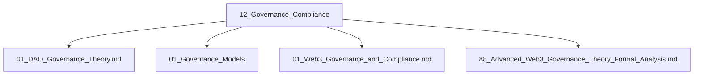

# 12_Governance_Compliance 治理与合规主题分层导航

## 目录结构
- DAO治理理论
- 治理模型与标准
- 合规性分析
- 高级/深度分析
- 归档（见 99_Recycle_Bin 或 00-备份）

## 主题导航
- 返回 [全局索引](../00_Index_and_Classification.md)
- 交叉引用：[知识图谱](../00_Knowledge_Graph.md)

## Mermaid知识图谱锚点
