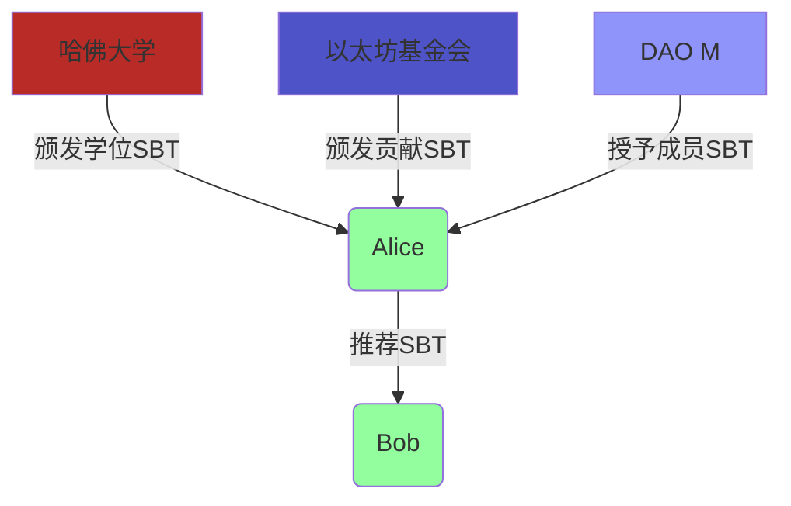

# 去中心化社会结构 (DeSoc) 的形式化模型

## 摘要

本文为去中心化社会结构（Decentralized Society, DeSoc）的核心概念，特别是"灵魂绑定通证"（Soulbound Tokens, SBTs）和去中心化社交图谱，提供了一个严格的形式化模型。我们利用图论、集合论和密码学原语，对身份、声誉、信任和社交关系进行数学建模。本文旨在构建一个理论框架，用于分析DeSoc系统的属性，如隐私性、抗共谋性、可验证性和可组合性，并为设计下一代去中心化身份和社交应用提供坚实的基础。

---

## 1. 形式化预备与核心定义

### 1.1 符号系统

| 符号 | 描述 | LaTeX |
| :--- | :--- | :--- |
| $\mathcal{S}$ | 一个灵魂 (Soul)，即一个账户/钱包 | `\mathcal{S}` |
| $G_S = (V, E)$ | 去中心化社交图谱 | `$G_S = (V, E)$` |
| $sbt_{i,j}$ | 灵魂 $i$ 向灵魂 $j$ 发行的SBT | `$sbt_{i,j}$` |
| $\mathcal{R}(\mathcal{S}_j)$ | 灵魂 $\mathcal{S}_j$ 的声誉分数 | `$\mathcal{R}(\mathcal{S}_j)$` |
| $\mathcal{C}_{i \to j}$ | 灵魂 $i$ 授予 $j$ 的凭证 | `$\mathcal{C}_{i \to j}$` |
| $ZKP(\cdot)$ | 零知识证明 | `$ZKP(\cdot)$` |

### 1.2 DeSoc的核心理念

DeSoc旨在通过非转移性的"灵魂绑定通证"（SBTs）来表示身份、关系和成就，从而在Web3中建立更丰富的社交身份层。SBTs代表了"我是谁"，而不是"我拥有什么"。

---

## 2. DeSoc 基础组件的形式化模型

### 2.1 灵魂 (Soul)

**定义 2.1 (灵魂)**: 一个灵魂 $\mathcal{S}$ 是一个能够发行和接收SBTs的密码学账户（例如，一个以太坊地址）。灵魂集合构成社交图谱的顶点。

### 2.2 灵魂绑定通证 (SBT)

与ERC-721等可转移的NFT不同，SBT在被发行后就"绑定"到接收者的灵魂上，不可交易。

**定义 2.2 (SBT)**: 一个SBT $sbt_{i,j}$ 是一个由灵魂 $\mathcal{S}_i$ （发行者）向灵魂 $\mathcal{S}_j$ （接收者）发行的、不可转移的数字通证。它可以被形式化地表示为一个元组：
\[
sbt_{i,j} = (\text{issuer}, \text{owner}, \text{type}, \text{content}, \sigma_i)
\]
-   $\text{issuer} = \mathcal{S}_i$
-   $\text{owner} = \mathcal{S}_j$
-   $\text{type}$: SBT的类型（如"教育证书"、"POAP"、"会员资格"）。
-   $\text{content}$: 具体内容（如课程名称、活动详情）。
-   $\sigma_i$: 发行者 $\mathcal{S}_i$ 对该SBT内容的数字签名，以确保其真实性。

### 2.3 去中心化社交图谱 (Decentralized Social Graph)

**定义 2.3 (社交图谱)**: 一个去中心化社交图谱是一个有向图 $G_S = (V, E)$，其中：
-   $V$ 是灵魂（账户）的集合，即 $V = \{\mathcal{S}_1, \mathcal{S}_2, \ldots\}$。
-   $E$ 是SBT发行关系的集合。一条从 $\mathcal{S}_i$ 到 $\mathcal{S}_j$ 的有向边 $e_{i,j} \in E$ 存在，当且仅当 $\mathcal{S}_i$ 至少向 $\mathcal{S}_j$ 发行了一个SBT。

此图谱是公开可验证的，因为它构建在区块链之上。

## 3. 声誉与信任的形式化模型

### 3.1 可计算的声誉

声誉可以被建模为社交图谱上的一个函数，它将一个灵魂映射到一个数值或向量。

**定义 3.1 (声誉函数)**: 一个声誉函数 $\mathcal{R}: V \to \mathbb{R}^k$ 是一个映射，它根据一个灵魂所拥有的SBTs来计算其声誉得分。

一个简单的声誉计算模型可以是加权求和：
\[
\mathcal{R}(\mathcal{S}_j) = \sum_{sbt_{i,j} \in \text{SBTs of } \mathcal{S}_j} w_i \cdot v(sbt_{i,j})
\]
-   $w_i$: 发行者 $\mathcal{S}_i$ 的声誉权重（这可以递归地依赖于 $\mathcal{R}(\mathcal{S}_i)$，类似于PageRank）。
-   $v(sbt_{i,j})$: 该SBT本身的价值。

### 3.2 Sybil攻击与抗共谋

**问题**: 一组恶意灵魂（Sybil攻击者）可以相互发行SBTs来人为地抬高彼此的声誉。

**定义 3.2 (社区检测)**: 为了抵抗Sybil攻击，我们可以利用图论中的社区检测算法（如Girvan-Newman算法）来识别社交图谱中连接紧密但与其他部分稀疏连接的子图。这些子图很可能是共谋的Sybil集群。

**形式化方法**:
1.  计算图中每条边的"介数中心性"（betweenness centrality）。
2.  移除中心性最高的边。
3.  重复此过程，直到图分裂成多个独立的社区。
4.  对来自可疑社区的SBTs在声誉计算中给予较低的权重。

## 4. 隐私保护的形式化方法

公开的社交图谱带来了隐私问题。零知识证明（ZKPs）是关键的解决方案。

**定义 4.1 (选择性披露)**: 一个灵魂 $\mathcal{S}_j$ 可以生成一个零知识证明 $\pi_{zkp}$，来证明它拥有某种类型的SBT，而无需透露具体的SBT内容或发行者。

**形式化博弈 (ZKP for SBT Possession)**:
-   **目标**: 灵魂 $\mathcal{S}_j$ 希望向验证者 $\mathcal{V}$ 证明它拥有一个由"顶级大学"发行的学位SBT。
-   **公开信息**: 顶级大学的灵魂地址集合 $\{\mathcal{S}_{U_1}, \mathcal{S}_{U_2}, \ldots\}$。
-   **证明生成**: $\mathcal{S}_j$ 生成证明 $\pi$:
    \[
    \pi = ZKP\{ (sbt_{i,j}) : \text{owner}(sbt_{i,j}) = \mathcal{S}_j \land \text{issuer}(sbt_{i,j}) \in \{\mathcal{S}_{U_1}, \dots\} \}
    \]
-   **验证**: 验证者 $\mathcal{V}$ 检查证明 $\pi$ 的有效性。如果有效，$\mathcal{V}$ 相信了该论断，但不知道具体是哪所大学颁发的学位，也不知道学位的任何细节。

## 5. DeSoc应用模型：基于社区恢复的贷款

DeSoc可以实现传统金融无法做到的事情，例如无抵押贷款。

**模型**:
1.  **社区**: Alice 属于多个紧密的社区（例如，她的大学校友会、她参与的DAO、她的运动俱乐部），这些关系由SBTs代表。
2.  **贷款申请**: Alice 希望申请一笔无抵押贷款。
3.  **社区担保**: Alice可以请求其社区成员（担保人）为她作保。担保人通过发行一个"担保SBT"来锁定一小笔资金。
4.  **风险评估**: 贷款协议根据Alice的SBTs（教育、工作经历）和她获得的社区担保SBTs数量来评估其信用风险。
5.  **社区恢复**: 如果Alice违约，她将失去所有相关的信誉SBTs。她的担保人会损失锁定的资金，但更重要的是，整个社区的信誉会受损。这创造了一种强大的社会压力来鼓励还款。如果她无法还款，社区成员可以帮助她，这是一种社会性的恢复机制。

## 6. 参考文献
1.  Buterin, V., Weyl, G., & Ohlhaver, P. (2022). "Decentralized Society: Finding Web3's Soul."
2.  Girvan, M., & Newman, M. E. (2002). "Community structure in social and biological networks."
3.  Goldwasser, S., Micali, S., & Rackoff, C. (1989). "The knowledge complexity of interactive proof systems." 