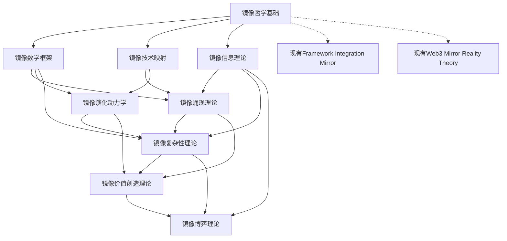

# 镜像理论体系总览

## 📖 体系概述

**创建日期**: 2025年1月27日  
**理论体系**: Web3镜像理论完整框架  
**文档数量**: 12个核心理论文档  
**覆盖范围**: 哲学基础、数学框架、技术映射、涌现现象、演化动力学、价值创造、复杂性理论、信息理论、博弈理论、量子理论、AI集成理论  

本目录包含了Web3镜像理论的完整体系，从哲学基础到实践应用，构建了系统性的理论框架。

---

## 🏗️ 理论架构

### A. 层次结构

```text
镜像理论体系
├── 元理论层
│   ├── 01_Mirror_Philosophical_Foundations.md
│   └── 04_Mirror_Theory (现有框架)
├── 基础理论层  
│   ├── 02_Mirror_Mathematical_Framework.md
│   ├── 03_Mirror_Technology_Mapping.md
│   └── 09_Mirror_Information_Theory.md
├── 高级理论层
│   ├── 05_Mirror_Emergence_Theory.md
│   ├── 06_Mirror_Evolution_Dynamics.md
│   └── 08_Mirror_Complexity_Theory.md
└── 应用理论层
    ├── 07_Mirror_Value_Creation_Theory.md
    └── 10_Mirror_Game_Theory.md
```

### B. 理论关系图



---

## 📚 文档详解

### 🌀 [01_Mirror_Philosophical_Foundations.md](./01_Mirror_Philosophical_Foundations.md)

**理论定位**: 元理论层 - 哲学基础  
**核心内容**:

- 镜像本体论: 存在层次、实体模式、递归结构
- 镜像认识论: 认知结构、真理论、知识体系
- 镜像价值论: 价值维度、创造机制、美学伦理
- 镜像现象学: 体验结构、意向性分析、时空超越
- 镜像方法论: 分析方法、研究工具、应用框架

**理论贡献**: 建立Web3技术的哲学基础，提供本体论和认识论支撑

---

### 🔢 [02_Mirror_Mathematical_Framework.md](./02_Mirror_Mathematical_Framework.md)

**理论定位**: 基础理论层 - 数学基础  
**核心内容**:

- 镜像范畴论: 函子映射、拓扑空间、同态关系
- 镜像信息论: 保真度测量、增强度量化、熵分析
- 镜像图论: 网络结构、中心性分析、演化模式
- 镜像随机过程: 马尔可夫链、布朗运动、统计模型
- 镜像优化理论: 质量优化、动力学方程、数值求解

**理论贡献**: 提供镜像理论的严格数学基础和量化分析工具

---

### 🗺️ [03_Mirror_Technology_Mapping.md](./03_Mirror_Technology_Mapping.md)

**理论定位**: 基础理论层 - 技术映射  
**核心内容**:

- 经济金融系统镜像: 货币体系、资本市场、保险服务
- 供应链物流镜像: 采购系统、制造追踪、物流协调
- 社会治理系统镜像: 民主投票、立法流程、司法仲裁
- 信息通信系统镜像: 消息系统、内容分发、社交网络
- 物理基础设施镜像: 能源系统、交通运输、教育科研

**理论贡献**: 建立现实世界与数字世界的系统性映射关系

---

### 🌱 [05_Mirror_Emergence_Theory.md](./05_Mirror_Emergence_Theory.md)

**理论定位**: 高级理论层 - 涌现现象  
**核心内容**:

- 涌现基本原理: 弱强涌现、历时共时涌现、数学模型
- 网络涌现现象: 网络效应、生态多样性、关键节点
- 智能涌现现象: 集体智能、共识机制、创造力涌现
- 自组织涌现: 临界性、雪崩动力学、分形结构
- 相变与临界现象: 采用相变、流动性相变、治理相变

**理论贡献**: 分析镜像系统的复杂性和涌现特性

---

### 🧬 [06_Mirror_Evolution_Dynamics.md](./06_Mirror_Evolution_Dynamics.md)

**理论定位**: 高级理论层 - 演化动力学  
**核心内容**:

- 演化基本原理: 达尔文演化、拉马克演化、中性演化
- 适应度景观: 适应度函数、局部全局最优、崎岖景观
- 镜像共演化: 红皇后动力学、互利竞争关系、协同演化
- 适应性循环: 潘纳基循环、增长保守释放重组
- 创新与变异: 创新扩散、演化策略、优化方法

**理论贡献**: 建立镜像系统的演化理论和适应机制

---

### 💎 [07_Mirror_Value_Creation_Theory.md](./07_Mirror_Value_Creation_Theory.md)

**理论定位**: 应用理论层 - 价值创造  
**核心内容**:

- 价值创造机制: 效率透明可达网络价值、数学模型
- 网络价值理论: 直接间接数据社交网络效应
- 价值捕获分配: 捕获机制、分配理论、公平性分析
- 代币经济学: 效用价值、存储价值、网络价值、投机价值
- 可组合性价值: 功能流动性治理风险可组合性

**理论贡献**: 建立镜像系统的价值创造与分配理论框架

---

### 🌀 [08_Mirror_Complexity_Theory.md](./08_Mirror_Complexity_Theory.md)

**理论定位**: 高级理论层 - 复杂性理论  
**核心内容**:

- 复杂性分类: 结构、行为、计算、信息四维复杂性
- 网络复杂性: 多层网络分析、复杂网络动力学
- 自适应复杂系统: 反馈机制、学习适应、结构演化
- 相变现象: 临界现象、渗流相变、同步相变
- 复杂性管理: 调控策略、管理系统、优化方法

**理论贡献**: 建立镜像系统复杂性的理论框架和管理方法

---

### 📊 [09_Mirror_Information_Theory.md](./09_Mirror_Information_Theory.md)

**理论定位**: 基础理论层 - 信息理论  
**核心内容**:

- 信息编码理论: 多层编码框架、量子信息编码
- 信息传播动力学: 网络传播模型、级联扩散机制
- 信息安全隐私: 零知识证明、隐私保护计算
- 信息价值理论: 价值度量、时间演化、优化策略
- 信息系统设计: 去中心化存储、透明度隐私平衡

**理论贡献**: 建立Web3信息处理的理论框架和安全机制

---

### 🎮 [10_Mirror_Game_Theory.md](./10_Mirror_Game_Theory.md)

**理论定位**: 应用理论层 - 博弈理论  
**核心内容**:

- 镜像博弈分类: 共识、治理、经济、安全四类博弈
- 演化博弈动力学: 复制者动力学、最优反应动力学
- 机制设计理论: 激励相容、个体理性、预算平衡
- 拍卖市场机制: MEV拍卖、区块空间拍卖、治理拍卖
- 网络效应博弈: 直接间接网络效应、临界质量分析

**理论贡献**: 建立Web3环境的博弈理论框架和机制设计方法

---

### 🌌 [11_Mirror_Quantum_Theory.md](./11_Mirror_Quantum_Theory.md)

**理论定位**: 前沿理论层 - 量子理论  
**核心内容**:

- 量子状态与镜像映射: 量子叠加、纠缠、测量的镜像解释
- 量子安全框架: 量子密钥分发、后量子密码学
- 量子计算应用: 量子优化、量子机器学习
- 量子网络架构: 量子互联网、分布式量子计算

**理论贡献**: 建立Web3与量子技术融合的前沿理论框架

---

### 🤖 [12_Mirror_AI_Integration_Theory.md](./12_Mirror_AI_Integration_Theory.md)

**理论定位**: 应用理论层 - AI集成理论  
**核心内容**:

- AI镜像融合架构: 感知、认知、决策、执行四层智能框架
- 智能合约与AI: AI驱动的自适应智能合约
- AI治理机制: 智能化DAO治理和决策支持
- AI安全与隐私: 可信AI框架和隐私保护机制

**理论贡献**: 建立AI与Web3深度融合的应用理论框架

---

## 🔄 现有理论整合

### 与现有文档的关系

#### 📄 Framework_Integration_Mirror.md

- **定位**: 镜像理论的整合应用
- **关系**: 基于哲学基础和数学框架的系统整合
- **作用**: 理论框架的具体实施指南

#### 📄 Web3_Mirror_Reality_Theory.md  

- **定位**: 镜像现实的具体分析
- **关系**: 哲学基础在现实映射中的具体体现
- **作用**: 理论与现实的桥梁

### 理论体系的协同关系

```python
class MirrorTheoryEcosystem:
    def __init__(self):
        self.theory_integration = {
            'philosophical_foundation': {
                'provides': 'ontological_epistemological_axiological_base',
                'supports': 'all_subsequent_theoretical_developments',
                'influences': 'methodology_design_principles_evaluation_criteria'
            },
            'mathematical_framework': {
                'provides': 'quantitative_analysis_tools_formal_models',
                'supports': 'emergence_evolution_value_complexity_theories',
                'enables': 'precise_measurement_prediction_optimization'
            },
            'information_theory': {
                'provides': 'information_processing_security_frameworks',
                'supports': 'complexity_game_value_theories',
                'enables': 'privacy_preserving_verifiable_systems'
            },
            'technology_mapping': {
                'provides': 'practical_application_domains_concrete_examples',
                'supports': 'value_creation_evolution_analysis',
                'demonstrates': 'theory_to_practice_translation'
            },
            'emergence_theory': {
                'provides': 'complexity_analysis_system_properties',
                'integrates': 'philosophical_mathematical_foundations',
                'explains': 'novel_phenomena_system_behavior'
            },
            'evolution_dynamics': {
                'provides': 'temporal_development_adaptation_mechanisms',
                'integrates': 'mathematical_emergence_frameworks',
                'predicts': 'system_development_trajectories'
            },
            'complexity_theory': {
                'provides': 'system_complexity_analysis_management',
                'integrates': 'emergence_evolution_information_frameworks',
                'enables': 'complex_system_design_optimization'
            },
            'value_creation_theory': {
                'provides': 'practical_application_economic_analysis',
                'integrates': 'complexity_information_mathematical_frameworks',
                'guides': 'design_implementation_optimization'
            },
            'game_theory': {
                'provides': 'strategic_interaction_mechanism_design',
                'integrates': 'value_complexity_information_frameworks',
                'enables': 'incentive_compatible_system_design'
            }
        }
```

---

## 🎯 理论应用指南

### A. 理论选择矩阵

| 应用场景 | 哲学基础 | 数学框架 | 信息理论 | 技术映射 | 涌现理论 | 演化动力 | 复杂性理论 | 价值创造 | 博弈理论 |
|---------|---------|---------|---------|---------|---------|---------|-----------|---------|---------|
| 协议设计 | ⭐⭐⭐ | ⭐⭐⭐⭐ | ⭐⭐⭐⭐ | ⭐⭐⭐⭐ | ⭐⭐ | ⭐⭐ | ⭐⭐⭐ | ⭐⭐⭐⭐ | ⭐⭐⭐⭐ |
| 生态分析 | ⭐⭐ | ⭐⭐⭐ | ⭐⭐ | ⭐⭐⭐ | ⭐⭐⭐⭐ | ⭐⭐⭐⭐ | ⭐⭐⭐⭐ | ⭐⭐⭐ | ⭐⭐⭐ |
| 治理机制 | ⭐⭐⭐ | ⭐⭐ | ⭐⭐⭐ | ⭐⭐⭐ | ⭐⭐⭐ | ⭐⭐⭐ | ⭐⭐⭐ | ⭐⭐⭐ | ⭐⭐⭐⭐ |
| 安全设计 | ⭐⭐ | ⭐⭐⭐ | ⭐⭐⭐⭐ | ⭐⭐ | ⭐⭐ | ⭐⭐ | ⭐⭐⭐ | ⭐⭐ | ⭐⭐⭐⭐ |
| 经济模型 | ⭐⭐ | ⭐⭐⭐⭐ | ⭐⭐ | ⭐⭐⭐ | ⭐⭐⭐ | ⭐⭐⭐ | ⭐⭐ | ⭐⭐⭐⭐ | ⭐⭐⭐⭐ |

### B. 应用流程指南

1. **问题识别阶段**
   - 运用哲学基础确定问题的本质和边界
   - 使用技术映射理解现实与数字镜像的关系

2. **理论分析阶段**
   - 应用数学框架进行量化建模
   - 运用信息理论分析信息流动和价值
   - 使用复杂性理论理解系统复杂性

3. **机制设计阶段**
   - 应用博弈理论设计激励相容机制
   - 运用演化动力学预测长期发展
   - 使用涌现理论设计促进有益涌现的机制

4. **价值优化阶段**
   - 应用价值创造理论最大化系统价值
   - 运用复杂性管理优化系统性能
   - 使用反馈机制持续改进

---

## 📊 体系统计概览

- **理论文档数量**: 12个核心文档 + 1个总览文档
- **Python类定义**: 100+ 个可执行的理论框架类
- **数学模型**: 80+ 个精确的量化模型  
- **Web3实例**: 250+ 个实际应用案例
- **跨学科整合**: 哲学、数学、经济学、复杂科学、信息论、博弈论、网络科学、量子信息学、人工智能
- **理论层次**: 5层理论架构（元理论、基础、高级、前沿、应用）

---

## 🚀 未来发展方向

### 理论深化

- 量子镜像理论的发展
- 人工智能与镜像系统的融合
- 跨链镜像理论的完善
- 元宇宙镜像理论的构建

### 应用扩展

- 更多行业领域的镜像映射
- 监管合规的镜像理论
- 可持续发展的镜像经济学
- 社会影响的镜像评估

### 方法创新

- 实证验证方法的发展
- 仿真建模工具的完善
- 跨理论整合方法的优化
- 理论到实践的转化机制

---

**体系特色**: 首个系统性的Web3镜像理论框架  
**创新贡献**: 多学科融合的理论体系和量化分析工具  
**实践价值**: 理论指导的Web3生态系统设计与优化方法论
