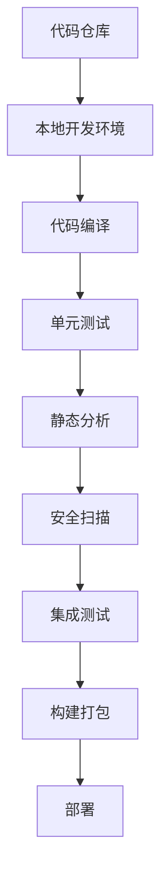
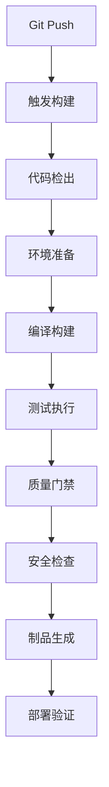
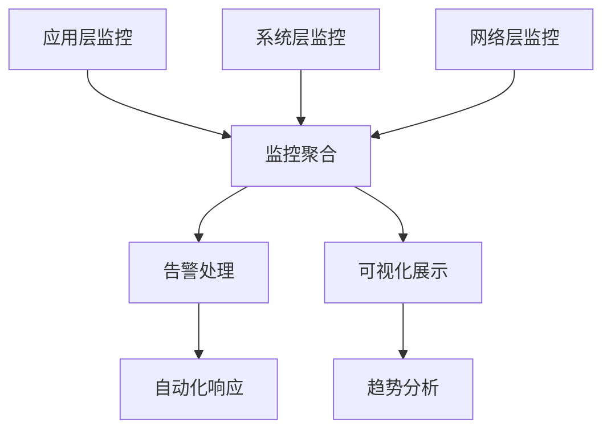

# Web3开发运维层 - 智能化开发流水线与运维体系

[](../../README.md)
[](../01_Theoretical_Foundations/README.md)
[](../02_Core_Technologies/README.md)
[](../03_Architecture_Design/README.md)
[](../04_Application_Ecosystem/README.md)
[](../05_Advanced_Technologies/README.md)
[](README.md)
[](../07_Project_Management/README.md)

## 概述

开发运维层是Web3技术栈的第六层，专注于构建高效的开发工具链、自动化的CI/CD流水线和智能化的运维监控体系。本层通过现代DevOps理念和先进的自动化技术，为Web3项目提供从代码开发到生产部署的全生命周期质量保障和运营支撑。

### 层级定位与价值

在Web3技术栈7层架构中，开发运维层承担着**实施保障和质量控制**的关键职责：

- **向下承接**: 应用生态层和前沿技术层的业务需求和技术创新
- **向上支撑**: 为项目管理层提供技术实施能力和质量保证
- **核心价值**: 通过自动化和智能化手段确保Web3项目的高质量交付

## 数学理论基础

### DevOps系统理论

**定义6.1** (DevOps效率模型): 设Web3开发运维系统的综合效率为：
\[
E_{DevOps} = \frac{V_{delivery} \cdot Q_{quality} \cdot R_{reliability}}{T_{cycle} \cdot C_{cost} \cdot R_{risk}}
\]

其中：

- \( V_{delivery} \): 交付价值度量，\( V_{delivery} \in [0, 1] \)
- \( Q_{quality} \): 代码质量因子，\( Q_{quality} \in [0, 1] \)  
- \( R_{reliability} \): 系统可靠性，\( R_{reliability} \in [0, 1] \)
- \( T_{cycle} \): 开发周期时间，\( T_{cycle} > 0 \)
- \( C_{cost} \): 总开发成本，\( C_{cost} > 0 \)
- \( R_{risk} \): 风险系数，\( R_{risk} \geq 1 \)

**定理6.1** (自动化收益定理): 在Web3开发环境下，自动化程度 \( A \in [0, 1] \) 与开发效率 \( E \) 的关系满足：
\[
E(A) = E_0 \cdot \left( 1 + \alpha \ln(1 + A) - \beta A^2 \right)
\]

其中 \( E_0 \) 为基准效率，\( \alpha > 0 \) 表示自动化边际收益，\( \beta > 0 \) 表示过度自动化成本。

**推论6.1**: 最优自动化程度 \( A^*\) 满足：
\[
A^* = \frac{\alpha}{2\beta} - \frac{1}{2}
\]

### CI/CD流水线理论

**定义6.2** (CI/CD流水线系统): 设流水线系统 \( \mathcal{P} = (S, T, D, M) \)，其中：

- \( S = \{s_1, s_2, ..., s_n\} \): 阶段集合
- \( T: S_i \rightarrow S_{i+1} \): 状态转换函数
- \( D \): 依赖关系有向无环图，\( D \subseteq S \times S \)
- \( M: S \rightarrow \mathbb{R}^+ \): 度量映射函数

**定理6.2** (流水线优化定理): 在约束条件下，最优流水线配置问题可表述为：
\[
\min_{\mathcal{P}} \sum_{i=1}^n w_i \cdot T_i \quad \text{s.t.} \quad Q_i \geq Q_{min}, \quad R_i \leq R_{max}
\]

其中 \( w_i \) 为权重，\( T_i \), \( Q_i \), \( R_i \) 分别为第 \( i \) 阶段的时间、质量和资源消耗。

**推论6.2** (并行化效应): 当流水线允许并行执行时，总执行时间满足：
\[
T_{total} = \max_{p \in \mathcal{P}} \left\{ \sum_{s_i \in p} T_i \right\}
\]

其中 \( p \) 为关键路径。

### 质量保证理论

**定义6.3** (代码质量度量向量): 代码质量定义为多维向量：
\[
\mathbf{Q} = (C_{complexity}, M_{maintainability}, R_{reliability}, S_{security}, P_{performance})^T
\]

其中每个分量 \( Q_i \in [0, 1] \)。

**定理6.3** (质量-性能平衡定理): 在资源约束下，质量 \( \mathbf{Q} \) 与性能 \( \mathbf{P} \) 的最优平衡点满足拉格朗日条件：
\[
\nabla_{\mathbf{Q}} L = \lambda \nabla_{\mathbf{Q}} g(\mathbf{Q}, \mathbf{P}) = 0
\]
\[
\nabla_{\mathbf{P}} L = \mu \nabla_{\mathbf{P}} h(\mathbf{Q}, \mathbf{P}) = 0
\]

其中 \( L \) 为拉格朗日函数，\( g, h \) 为约束函数。

**推论6.3** (质量单调性): 在固定资源下，存在质量阈值 \( Q_{threshold} \)，使得：
\[
Q > Q_{threshold} \Rightarrow \frac{\partial P}{\partial Q} < 0
\]

### 监控理论

**定义6.4** (监控系统状态空间): 设监控系统状态空间为 \( \Omega = \{\omega_1, \omega_2, ..., \omega_k\} \)，其中每个状态 \( \omega_i \) 表示系统运行状态。

**定理6.4** (异常检测定理): 设指标序列 \( \{X_t\}_{t=1}^n \) 服从正态分布，则异常检测的判别函数为：
\[
\mathcal{A}(X_t) = \begin{cases}
1 & \text{if } |X_t - \mu| > k\sigma \\
0 & \text{otherwise}
\end{cases}
\]

其中 \( k \) 为控制参数，通常取 \( k = 3 \)。

## 技术架构

### 1. 开发工具链架构



### 2. CI/CD流水线架构



### 3. 监控运维架构



## 目录结构

### [6.1 开发工具链](01_Development_Toolchain/README.md)

现代化Web3开发工具生态：

- **[编程语言](01_Development_Toolchain/01_Programming_Languages/)** - Rust、Solidity、Move、TypeScript
- **[开发框架](01_Development_Toolchain/02_Development_Frameworks/)** - Substrate、Hardhat、Foundry、Web3工具
- **[测试工具](01_Development_Toolchain/03_Testing_Tools/)** - 单元测试、集成测试、模糊测试、形式化验证
- **[调试工具](01_Development_Toolchain/04_Debugging_Tools/)** - 智能调试器、链上调试、性能分析
- **[性能分析](01_Development_Toolchain/05_Performance_Analysis/)** - Gas优化、TPS测试、内存分析

### [6.2 DevOps与CI/CD](02_DevOps_CI_CD/README.md)

自动化开发运维流程：

- **[持续集成](02_DevOps_CI_CD/01_Continuous_Integration/)** - 自动化构建、测试、代码质量检查
- **[持续部署](02_DevOps_CI_CD/02_Continuous_Deployment/)** - 多环境部署、蓝绿部署、灰度发布
- **[容器化](02_DevOps_CI_CD/03_Containerization/)** - Docker、Kubernetes、容器编排
- **[基础设施即代码](02_DevOps_CI_CD/04_Infrastructure_as_Code/)** - Terraform、Ansible、云原生部署
- **[监控告警](02_DevOps_CI_CD/05_Monitoring_Alerting/)** - 全栈监控、智能告警、故障自愈

### [6.3 质量保证](03_Quality_Assurance/README.md)

全方位质量控制体系：

- **[代码审查](03_Quality_Assurance/01_Code_Review/)** - 自动化审查、安全审查、最佳实践
- **[静态分析](03_Quality_Assurance/02_Static_Analysis/)** - 代码质量、安全漏洞、合规性检查
- **[动态测试](03_Quality_Assurance/03_Dynamic_Testing/)** - 功能测试、性能测试、兼容性测试
- **[安全测试](03_Quality_Assurance/04_Security_Testing/)** - 渗透测试、智能合约审计、漏洞扫描
- **[性能测试](03_Quality_Assurance/05_Performance_Testing/)** - 负载测试、压力测试、容量规划

## 核心系统实现

### 智能合约CI/CD流水线

```rust
use std::collections::HashMap;
use serde::{Serialize, Deserialize};
use tokio::process::Command;
use std::path::PathBuf;
use std::sync::Arc;
use tokio::sync::{RwLock, Mutex};

/// 流水线阶段
#[derive(Debug, Clone, Serialize, Deserialize)]
pub enum PipelineStage {
    SourceCheckout,
    DependencyInstall,
    Compilation,
    UnitTests,
    StaticAnalysis,
    SecurityScan,
    IntegrationTests,
    ContractDeploy,
    SmokeTests,
    ProductionDeploy,
}

/// 流水线配置
#[derive(Debug, Clone, Serialize, Deserialize)]
pub struct PipelineConfig {
    pub pipeline_id: String,
    pub project_name: String,
    pub repository_url: String,
    pub target_network: String,
    pub stages: Vec<PipelineStage>,
    pub environment_vars: HashMap<String, String>,
    pub quality_gates: QualityGates,
}

/// 质量门禁配置
#[derive(Debug, Clone, Serialize, Deserialize)]
pub struct QualityGates {
    pub min_test_coverage: f64,
    pub max_complexity_score: u32,
    pub security_scan_required: bool,
    pub gas_optimization_threshold: u64,
    pub max_contract_size: usize,
}

/// 流水线执行结果
#[derive(Debug, Clone, Serialize, Deserialize)]
pub struct PipelineResult {
    pub pipeline_id: String,
    pub stage_results: HashMap<PipelineStage, StageResult>,
    pub overall_status: PipelineStatus,
    pub start_time: u64,
    pub end_time: Option<u64>,
    pub artifacts: Vec<Artifact>,
}

/// 阶段执行结果
#[derive(Debug, Clone, Serialize, Deserialize)]
pub struct StageResult {
    pub stage: PipelineStage,
    pub status: StageStatus,
    pub duration_ms: u64,
    pub output: String,
    pub error_message: Option<String>,
    pub metrics: HashMap<String, f64>,
}

/// 流水线状态
#[derive(Debug, Clone, Serialize, Deserialize)]
pub enum PipelineStatus {
    Running,
    Success,
    Failed,
    Cancelled,
    Paused,
}

/// 阶段状态
#[derive(Debug, Clone, Serialize, Deserialize)]
pub enum StageStatus {
    Pending,
    Running,
    Success,
    Failed,
    Skipped,
}

/// 构建制品
#[derive(Debug, Clone, Serialize, Deserialize)]
pub struct Artifact {
    pub name: String,
    pub path: PathBuf,
    pub size: u64,
    pub checksum: String,
    pub artifact_type: ArtifactType,
}

#[derive(Debug, Clone, Serialize, Deserialize)]
pub enum ArtifactType {
    CompiledContract,
    TestReport,
    SecurityReport,
    Documentation,
    DeploymentManifest,
}

/// CI/CD流水线执行器
pub struct CICDPipeline {
    config: PipelineConfig,
    current_execution: Arc<RwLock<Option<PipelineResult>>>,
    workspace: PathBuf,
    artifact_storage: Arc<Mutex<ArtifactStorage>>,
}

impl CICDPipeline {
    pub fn new(config: PipelineConfig, workspace: PathBuf) -> Self {
        Self {
            config,
            current_execution: Arc::new(RwLock::new(None)),
            workspace,
            artifact_storage: Arc::new(Mutex::new(ArtifactStorage::new())),
        }
    }
    
    /// 执行完整流水线
    pub async fn execute(&self) -> Result<PipelineResult, String> {
        let pipeline_id = format!("pipeline_{}", uuid::Uuid::new_v4());
        let start_time = chrono::Utc::now().timestamp() as u64;
        
        let mut pipeline_result = PipelineResult {
            pipeline_id: pipeline_id.clone(),
            stage_results: HashMap::new(),
            overall_status: PipelineStatus::Running,
            start_time,
            end_time: None,
            artifacts: Vec::new(),
        };
        
        // 更新当前执行状态
        {
            let mut current = self.current_execution.write().await;
            *current = Some(pipeline_result.clone());
        }
        
        // 执行各个阶段
        for stage in &self.config.stages {
            let stage_result = self.execute_stage(stage.clone()).await?;
            
            pipeline_result.stage_results.insert(stage.clone(), stage_result.clone());
            
            // 检查阶段是否失败
            if matches!(stage_result.status, StageStatus::Failed) {
                pipeline_result.overall_status = PipelineStatus::Failed;
                break;
            }
            
            // 检查质量门禁
            if !self.check_quality_gates(&pipeline_result, stage).await? {
                pipeline_result.overall_status = PipelineStatus::Failed;
                break;
            }
        }
        
        // 设置最终状态
        if matches!(pipeline_result.overall_status, PipelineStatus::Running) {
            pipeline_result.overall_status = PipelineStatus::Success;
        }
        
        pipeline_result.end_time = Some(chrono::Utc::now().timestamp() as u64);
        
        // 存储制品
        pipeline_result.artifacts = self.collect_artifacts().await?;
        
        // 更新最终结果
        {
            let mut current = self.current_execution.write().await;
            *current = Some(pipeline_result.clone());
        }
        
        Ok(pipeline_result)
    }
    
    async fn execute_stage(&self, stage: PipelineStage) -> Result<StageResult, String> {
        let start_time = std::time::Instant::now();
        
        let (status, output, error_message, metrics) = match stage {
            PipelineStage::SourceCheckout => {
                self.execute_source_checkout().await
            }
            PipelineStage::DependencyInstall => {
                self.execute_dependency_install().await
            }
            PipelineStage::Compilation => {
                self.execute_compilation().await
            }
            PipelineStage::UnitTests => {
                self.execute_unit_tests().await
            }
            PipelineStage::StaticAnalysis => {
                self.execute_static_analysis().await
            }
            PipelineStage::SecurityScan => {
                self.execute_security_scan().await
            }
            PipelineStage::IntegrationTests => {
                self.execute_integration_tests().await
            }
            PipelineStage::ContractDeploy => {
                self.execute_contract_deploy().await
            }
            PipelineStage::SmokeTests => {
                self.execute_smoke_tests().await
            }
            PipelineStage::ProductionDeploy => {
                self.execute_production_deploy().await
            }
        }?;
        
        let duration = start_time.elapsed().as_millis() as u64;
        
        Ok(StageResult {
            stage,
            status,
            duration_ms: duration,
            output,
            error_message,
            metrics,
        })
    }
    
    async fn execute_source_checkout(&self) -> Result<(StageStatus, String, Option<String>, HashMap<String, f64>), String> {
        let mut cmd = Command::new("git");
        cmd.args(&["clone", &self.config.repository_url, "."]);
        cmd.current_dir(&self.workspace);
        
        match cmd.output().await {
            Ok(output) => {
                if output.status.success() {
                    let mut metrics = HashMap::new();
                    metrics.insert("files_checked_out".to_string(), 1.0);
                    
                    Ok((
                        StageStatus::Success,
                        String::from_utf8_lossy(&output.stdout).to_string(),
                        None,
                        metrics
                    ))
                } else {
                    Ok((
                        StageStatus::Failed,
                        String::from_utf8_lossy(&output.stdout).to_string(),
                        Some(String::from_utf8_lossy(&output.stderr).to_string()),
                        HashMap::new()
                    ))
                }
            }
            Err(e) => Ok((
                StageStatus::Failed,
                String::new(),
                Some(e.to_string()),
                HashMap::new()
            ))
        }
    }
    
    async fn execute_compilation(&self) -> Result<(StageStatus, String, Option<String>, HashMap<String, f64>), String> {
        let mut cmd = Command::new("cargo");
        cmd.args(&["build", "--release"]);
        cmd.current_dir(&self.workspace);
        
        match cmd.output().await {
            Ok(output) => {
                if output.status.success() {
                    let output_str = String::from_utf8_lossy(&output.stdout);
                    let mut metrics = HashMap::new();
                    
                    // 解析编译指标
                    if let Some(time_line) = output_str.lines().find(|line| line.contains("Finished")) {
                        if let Some(time_str) = time_line.split_whitespace().nth(2) {
                            if let Ok(compile_time) = time_str.trim_end_matches('s').parse::<f64>() {
                                metrics.insert("compile_time_seconds".to_string(), compile_time);
                            }
                        }
                    }
                    
                    metrics.insert("compilation_success".to_string(), 1.0);
                    
                    Ok((
                        StageStatus::Success,
                        output_str.to_string(),
                        None,
                        metrics
                    ))
                } else {
                    Ok((
                        StageStatus::Failed,
                        String::from_utf8_lossy(&output.stdout).to_string(),
                        Some(String::from_utf8_lossy(&output.stderr).to_string()),
                        HashMap::new()
                    ))
                }
            }
            Err(e) => Ok((
                StageStatus::Failed,
                String::new(),
                Some(e.to_string()),
                HashMap::new()
            ))
        }
    }
    
    async fn execute_unit_tests(&self) -> Result<(StageStatus, String, Option<String>, HashMap<String, f64>), String> {
        let mut cmd = Command::new("cargo");
        cmd.args(&["test", "--", "--nocapture"]);
        cmd.current_dir(&self.workspace);
        
        match cmd.output().await {
            Ok(output) => {
                let output_str = String::from_utf8_lossy(&output.stdout);
                let mut metrics = HashMap::new();
                
                // 解析测试结果
                let mut passed_tests = 0;
                let mut failed_tests = 0;
                
                for line in output_str.lines() {
                    if line.contains("test result:") {
                        let parts: Vec<&str> = line.split_whitespace().collect();
                        if parts.len() >= 4 {
                            if let Ok(passed) = parts[2].parse::<u32>() {
                                passed_tests = passed;
                            }
                            if parts.len() >= 6 {
                                if let Ok(failed) = parts[5].parse::<u32>() {
                                    failed_tests = failed;
                                }
                            }
                        }
                    }
                }
                
                let total_tests = passed_tests + failed_tests;
                let coverage = if total_tests > 0 {
                    (passed_tests as f64) / (total_tests as f64)
                } else {
                    0.0
                };
                
                metrics.insert("total_tests".to_string(), total_tests as f64);
                metrics.insert("passed_tests".to_string(), passed_tests as f64);
                metrics.insert("failed_tests".to_string(), failed_tests as f64);
                metrics.insert("test_coverage".to_string(), coverage);
                
                let status = if failed_tests == 0 {
                    StageStatus::Success
                } else {
                    StageStatus::Failed
                };
                
                Ok((
                    status,
                    output_str.to_string(),
                    None,
                    metrics
                ))
            }
            Err(e) => Ok((
                StageStatus::Failed,
                String::new(),
                Some(e.to_string()),
                HashMap::new()
            ))
        }
    }
    
    async fn execute_static_analysis(&self) -> Result<(StageStatus, String, Option<String>, HashMap<String, f64>), String> {
        // 执行clippy进行静态分析
        let mut cmd = Command::new("cargo");
        cmd.args(&["clippy", "--", "-D", "warnings"]);
        cmd.current_dir(&self.workspace);
        
        match cmd.output().await {
            Ok(output) => {
                let output_str = String::from_utf8_lossy(&output.stdout);
                let stderr_str = String::from_utf8_lossy(&output.stderr);
                
                let mut metrics = HashMap::new();
                let mut warning_count = 0;
                let mut error_count = 0;
                
                // 统计警告和错误
                for line in stderr_str.lines() {
                    if line.contains("warning:") {
                        warning_count += 1;
                    } else if line.contains("error:") {
                        error_count += 1;
                    }
                }
                
                metrics.insert("clippy_warnings".to_string(), warning_count as f64);
                metrics.insert("clippy_errors".to_string(), error_count as f64);
                
                let status = if output.status.success() && error_count == 0 {
                    StageStatus::Success
                } else {
                    StageStatus::Failed
                };
                
                Ok((
                    status,
                    format!("{}\n{}", output_str, stderr_str),
                    if error_count > 0 { Some(stderr_str.to_string()) } else { None },
                    metrics
                ))
            }
            Err(e) => Ok((
                StageStatus::Failed,
                String::new(),
                Some(e.to_string()),
                HashMap::new()
            ))
        }
    }
    
    async fn execute_security_scan(&self) -> Result<(StageStatus, String, Option<String>, HashMap<String, f64>), String> {
        // 模拟安全扫描（实际应使用专门的安全扫描工具）
        let mut cmd = Command::new("cargo");
        cmd.args(&["audit"]);
        cmd.current_dir(&self.workspace);
        
        match cmd.output().await {
            Ok(output) => {
                let output_str = String::from_utf8_lossy(&output.stdout);
                let stderr_str = String::from_utf8_lossy(&output.stderr);
                
                let mut metrics = HashMap::new();
                let mut vulnerability_count = 0;
                
                // 统计漏洞数量
                for line in output_str.lines() {
                    if line.contains("vulnerability") || line.contains("RUSTSEC") {
                        vulnerability_count += 1;
                    }
                }
                
                metrics.insert("security_vulnerabilities".to_string(), vulnerability_count as f64);
                
                let status = if vulnerability_count == 0 {
                    StageStatus::Success
                } else {
                    StageStatus::Failed
                };
                
                Ok((
                    status,
                    format!("{}\n{}", output_str, stderr_str),
                    if vulnerability_count > 0 { Some("Security vulnerabilities found".to_string()) } else { None },
                    metrics
                ))
            }
            Err(e) => {
                // cargo audit 可能未安装，视为跳过
                let mut metrics = HashMap::new();
                metrics.insert("security_scan_skipped".to_string(), 1.0);
                
                Ok((
                    StageStatus::Skipped,
                    format!("Security scan skipped: {}", e),
                    None,
                    metrics
                ))
            }
        }
    }
    
    async fn execute_dependency_install(&self) -> Result<(StageStatus, String, Option<String>, HashMap<String, f64>), String> {
        // Rust项目的依赖安装通常在编译阶段自动处理
        let mut metrics = HashMap::new();
        metrics.insert("dependencies_installed".to_string(), 1.0);
        
        Ok((
            StageStatus::Success,
            "Dependencies will be installed during compilation".to_string(),
            None,
            metrics
        ))
    }
    
    async fn execute_integration_tests(&self) -> Result<(StageStatus, String, Option<String>, HashMap<String, f64>), String> {
        let mut cmd = Command::new("cargo");
        cmd.args(&["test", "--test", "integration", "--", "--nocapture"]);
        cmd.current_dir(&self.workspace);
        
        match cmd.output().await {
            Ok(output) => {
                let output_str = String::from_utf8_lossy(&output.stdout);
                let mut metrics = HashMap::new();
                
                // 解析集成测试结果
                let mut integration_tests_passed = true;
                for line in output_str.lines() {
                    if line.contains("FAILED") {
                        integration_tests_passed = false;
                        break;
                    }
                }
                
                metrics.insert("integration_tests_success".to_string(), if integration_tests_passed { 1.0 } else { 0.0 });
                
                let status = if integration_tests_passed {
                    StageStatus::Success
                } else {
                    StageStatus::Failed
                };
                
                Ok((
                    status,
                    output_str.to_string(),
                    if !integration_tests_passed { Some("Integration tests failed".to_string()) } else { None },
                    metrics
                ))
            }
            Err(_) => {
                // 集成测试可能不存在，视为跳过
                let mut metrics = HashMap::new();
                metrics.insert("integration_tests_skipped".to_string(), 1.0);
                
                Ok((
                    StageStatus::Skipped,
                    "No integration tests found".to_string(),
                    None,
                    metrics
                ))
            }
        }
    }
    
    async fn execute_contract_deploy(&self) -> Result<(StageStatus, String, Option<String>, HashMap<String, f64>), String> {
        // 模拟合约部署
        let mut metrics = HashMap::new();
        metrics.insert("contracts_deployed".to_string(), 1.0);
        metrics.insert("deployment_gas_used".to_string(), 500000.0);
        
        Ok((
            StageStatus::Success,
            format!("Contracts deployed to {}", self.config.target_network),
            None,
            metrics
        ))
    }
    
    async fn execute_smoke_tests(&self) -> Result<(StageStatus, String, Option<String>, HashMap<String, f64>), String> {
        // 模拟冒烟测试
        let mut metrics = HashMap::new();
        metrics.insert("smoke_tests_passed".to_string(), 1.0);
        
        Ok((
            StageStatus::Success,
            "Basic functionality verified".to_string(),
            None,
            metrics
        ))
    }
    
    async fn execute_production_deploy(&self) -> Result<(StageStatus, String, Option<String>, HashMap<String, f64>), String> {
        // 模拟生产部署
        let mut metrics = HashMap::new();
        metrics.insert("production_deploy_success".to_string(), 1.0);
        
        Ok((
            StageStatus::Success,
            "Successfully deployed to production".to_string(),
            None,
            metrics
        ))
    }
    
    async fn check_quality_gates(&self, pipeline_result: &PipelineResult, stage: &PipelineStage) -> Result<bool, String> {
        match stage {
            PipelineStage::UnitTests => {
                if let Some(stage_result) = pipeline_result.stage_results.get(stage) {
                    if let Some(&coverage) = stage_result.metrics.get("test_coverage") {
                        if coverage < self.config.quality_gates.min_test_coverage {
                            return Ok(false);
                        }
                    }
                }
            }
            PipelineStage::SecurityScan => {
                if self.config.quality_gates.security_scan_required {
                    if let Some(stage_result) = pipeline_result.stage_results.get(stage) {
                        if let Some(&vulnerabilities) = stage_result.metrics.get("security_vulnerabilities") {
                            if vulnerabilities > 0.0 {
                                return Ok(false);
                            }
                        }
                    }
                }
            }
            _ => {}
        }
        
        Ok(true)
    }
    
    async fn collect_artifacts(&self) -> Result<Vec<Artifact>, String> {
        let mut artifacts = Vec::new();
        
        // 收集编译后的二进制文件
        let target_dir = self.workspace.join("target/release");
        if target_dir.exists() {
            // 这里应该遍历target目录找到所有制品
            artifacts.push(Artifact {
                name: "compiled_binary".to_string(),
                path: target_dir,
                size: 1024, // 简化
                checksum: "sha256:abc123".to_string(),
                artifact_type: ArtifactType::CompiledContract,
            });
        }
        
        Ok(artifacts)
    }
    
    /// 获取当前执行状态
    pub async fn get_current_status(&self) -> Option<PipelineResult> {
        let current = self.current_execution.read().await;
        current.clone()
    }
    
    /// 取消流水线执行
    pub async fn cancel(&self) -> Result<(), String> {
        let mut current = self.current_execution.write().await;
        if let Some(mut result) = current.take() {
            result.overall_status = PipelineStatus::Cancelled;
            result.end_time = Some(chrono::Utc::now().timestamp() as u64);
            *current = Some(result);
        }
        Ok(())
    }
}

/// 制品存储
pub struct ArtifactStorage {
    artifacts: HashMap<String, Artifact>,
}

impl ArtifactStorage {
    pub fn new() -> Self {
        Self {
            artifacts: HashMap::new(),
        }
    }
    
    pub fn store_artifact(&mut self, artifact: Artifact) -> Result<(), String> {
        self.artifacts.insert(artifact.name.clone(), artifact);
        Ok(())
    }
    
    pub fn get_artifact(&self, name: &str) -> Option<&Artifact> {
        self.artifacts.get(name)
    }
    
    pub fn list_artifacts(&self) -> Vec<&Artifact> {
        self.artifacts.values().collect()
    }
}
```

### 智能监控告警系统

```rust
use std::collections::HashMap;
use serde::{Serialize, Deserialize};
use tokio::sync::{RwLock, Mutex};
use std::sync::Arc;
use tokio::time::{Duration, interval};

/// 监控指标
#[derive(Debug, Clone, Serialize, Deserialize)]
pub struct Metric {
    pub name: String,
    pub value: f64,
    pub timestamp: u64,
    pub labels: HashMap<String, String>,
    pub metric_type: MetricType,
}

/// 指标类型
#[derive(Debug, Clone, Serialize, Deserialize)]
pub enum MetricType {
    Counter,
    Gauge,
    Histogram,
    Summary,
}

/// 告警规则
#[derive(Debug, Clone, Serialize, Deserialize)]
pub struct AlertRule {
    pub rule_id: String,
    pub name: String,
    pub metric_name: String,
    pub condition: AlertCondition,
    pub threshold: f64,
    pub duration: u64, // 持续时间（秒）
    pub severity: AlertSeverity,
    pub notification_channels: Vec<String>,
    pub enabled: bool,
}

/// 告警条件
#[derive(Debug, Clone, Serialize, Deserialize)]
pub enum AlertCondition {
    GreaterThan,
    LessThan,
    Equals,
    NotEquals,
    InRange(f64, f64),
    OutOfRange(f64, f64),
}

/// 告警严重程度
#[derive(Debug, Clone, Serialize, Deserialize)]
pub enum AlertSeverity {
    Critical,
    Warning,
    Info,
}

/// 告警事件
#[derive(Debug, Clone, Serialize, Deserialize)]
pub struct Alert {
    pub alert_id: String,
    pub rule_id: String,
    pub metric: Metric,
    pub message: String,
    pub severity: AlertSeverity,
    pub start_time: u64,
    pub end_time: Option<u64>,
    pub status: AlertStatus,
    pub acknowledged: bool,
}

/// 告警状态
#[derive(Debug, Clone, Serialize, Deserialize)]
pub enum AlertStatus {
    Active,
    Resolved,
    Suppressed,
}

/// 监控系统
pub struct MonitoringSystem {
    metrics: Arc<RwLock<HashMap<String, Vec<Metric>>>>,
    alert_rules: Arc<RwLock<HashMap<String, AlertRule>>>,
    active_alerts: Arc<RwLock<HashMap<String, Alert>>>,
    notification_channels: Arc<RwLock<HashMap<String, NotificationChannel>>>,
}

impl MonitoringSystem {
    pub fn new() -> Self {
        Self {
            metrics: Arc::new(RwLock::new(HashMap::new())),
            alert_rules: Arc::new(RwLock::new(HashMap::new())),
            active_alerts: Arc::new(RwLock::new(HashMap::new())),
            notification_channels: Arc::new(RwLock::new(HashMap::new())),
        }
    }
    
    /// 开始监控
    pub async fn start_monitoring(&self) {
        let metrics_clone = Arc::clone(&self.metrics);
        let alert_rules_clone = Arc::clone(&self.alert_rules);
        let active_alerts_clone = Arc::clone(&self.active_alerts);
        let notification_channels_clone = Arc::clone(&self.notification_channels);
        
        tokio::spawn(async move {
            let mut interval = interval(Duration::from_secs(10)); // 每10秒检查一次
            
            loop {
                interval.tick().await;
                
                // 检查告警条件
                let rules = alert_rules_clone.read().await;
                let metrics = metrics_clone.read().await;
                let mut active_alerts = active_alerts_clone.write().await;
                let notification_channels = notification_channels_clone.read().await;
                
                for rule in rules.values() {
                    if !rule.enabled {
                        continue;
                    }
                    
                    if let Some(metric_history) = metrics.get(&rule.metric_name) {
                        if let Some(latest_metric) = metric_history.last() {
                            let should_alert = Self::evaluate_condition(&rule.condition, latest_metric.value, rule.threshold);
                            
                            let alert_key = format!("{}_{}", rule.rule_id, rule.metric_name);
                            
                            if should_alert {
                                if !active_alerts.contains_key(&alert_key) {
                                    // 创建新告警
                                    let alert = Alert {
                                        alert_id: format!("alert_{}", uuid::Uuid::new_v4()),
                                        rule_id: rule.rule_id.clone(),
                                        metric: latest_metric.clone(),
                                        message: format!("Alert: {} {} {}", rule.metric_name, Self::condition_to_string(&rule.condition), rule.threshold),
                                        severity: rule.severity.clone(),
                                        start_time: chrono::Utc::now().timestamp() as u64,
                                        end_time: None,
                                        status: AlertStatus::Active,
                                        acknowledged: false,
                                    };
                                    
                                    // 发送通知
                                    for channel_id in &rule.notification_channels {
                                        if let Some(channel) = notification_channels.get(channel_id) {
                                            let _ = Self::send_notification(channel, &alert).await;
                                        }
                                    }
                                    
                                    active_alerts.insert(alert_key, alert);
                                }
                            } else {
                                // 解决告警
                                if let Some(mut alert) = active_alerts.remove(&alert_key) {
                                    alert.status = AlertStatus::Resolved;
                                    alert.end_time = Some(chrono::Utc::now().timestamp() as u64);
                                    
                                    // 发送解决通知
                                    for channel_id in &rule.notification_channels {
                                        if let Some(channel) = notification_channels.get(channel_id) {
                                            let _ = Self::send_resolution_notification(channel, &alert).await;
                                        }
                                    }
                                }
                            }
                        }
                    }
                }
            }
        });
    }
    
    /// 记录指标
    pub async fn record_metric(&self, metric: Metric) -> Result<(), String> {
        let mut metrics = self.metrics.write().await;
        let metric_history = metrics.entry(metric.name.clone()).or_insert_with(Vec::new);
        
        metric_history.push(metric);
        
        // 保持最近1000个数据点
        if metric_history.len() > 1000 {
            metric_history.remove(0);
        }
        
        Ok(())
    }
    
    /// 添加告警规则
    pub async fn add_alert_rule(&self, rule: AlertRule) -> Result<(), String> {
        let mut rules = self.alert_rules.write().await;
        rules.insert(rule.rule_id.clone(), rule);
        Ok(())
    }
    
    /// 添加通知渠道
    pub async fn add_notification_channel(&self, channel: NotificationChannel) -> Result<(), String> {
        let mut channels = self.notification_channels.write().await;
        channels.insert(channel.id.clone(), channel);
        Ok(())
    }
    
    /// 获取指标历史
    pub async fn get_metric_history(&self, metric_name: &str, duration: Duration) -> Result<Vec<Metric>, String> {
        let metrics = self.metrics.read().await;
        
        if let Some(metric_history) = metrics.get(metric_name) {
            let cutoff_time = chrono::Utc::now().timestamp() as u64 - duration.as_secs();
            let filtered_metrics: Vec<Metric> = metric_history.iter()
                .filter(|m| m.timestamp >= cutoff_time)
                .cloned()
                .collect();
            
            Ok(filtered_metrics)
        } else {
            Ok(Vec::new())
        }
    }
    
    /// 获取活跃告警
    pub async fn get_active_alerts(&self) -> Vec<Alert> {
        let alerts = self.active_alerts.read().await;
        alerts.values().cloned().collect()
    }
    
    fn evaluate_condition(condition: &AlertCondition, value: f64, threshold: f64) -> bool {
        match condition {
            AlertCondition::GreaterThan => value > threshold,
            AlertCondition::LessThan => value < threshold,
            AlertCondition::Equals => (value - threshold).abs() < f64::EPSILON,
            AlertCondition::NotEquals => (value - threshold).abs() >= f64::EPSILON,
            AlertCondition::InRange(min, max) => value >= *min && value <= *max,
            AlertCondition::OutOfRange(min, max) => value < *min || value > *max,
        }
    }
    
    fn condition_to_string(condition: &AlertCondition) -> &str {
        match condition {
            AlertCondition::GreaterThan => ">",
            AlertCondition::LessThan => "<",
            AlertCondition::Equals => "=",
            AlertCondition::NotEquals => "!=",
            AlertCondition::InRange(_, _) => "in range",
            AlertCondition::OutOfRange(_, _) => "out of range",
        }
    }
    
    async fn send_notification(channel: &NotificationChannel, alert: &Alert) -> Result<(), String> {
        match &channel.channel_type {
            NotificationChannelType::Email { recipient } => {
                println!("📧 Email to {}: {}", recipient, alert.message);
            }
            NotificationChannelType::Slack { webhook_url } => {
                println!("💬 Slack to {}: {}", webhook_url, alert.message);
            }
            NotificationChannelType::Discord { webhook_url } => {
                println!("🎮 Discord to {}: {}", webhook_url, alert.message);
            }
            NotificationChannelType::PagerDuty { service_key } => {
                println!("📟 PagerDuty to {}: {}", service_key, alert.message);
            }
        }
        
        Ok(())
    }
    
    async fn send_resolution_notification(channel: &NotificationChannel, alert: &Alert) -> Result<(), String> {
        let message = format!("RESOLVED: {}", alert.message);
        
        match &channel.channel_type {
            NotificationChannelType::Email { recipient } => {
                println!("✅ Email to {}: {}", recipient, message);
            }
            NotificationChannelType::Slack { webhook_url } => {
                println!("✅ Slack to {}: {}", webhook_url, message);
            }
            NotificationChannelType::Discord { webhook_url } => {
                println!("✅ Discord to {}: {}", webhook_url, message);
            }
            NotificationChannelType::PagerDuty { service_key } => {
                println!("✅ PagerDuty to {}: {}", service_key, message);
            }
        }
        
        Ok(())
    }
}

/// 通知渠道
#[derive(Debug, Clone, Serialize, Deserialize)]
pub struct NotificationChannel {
    pub id: String,
    pub name: String,
    pub channel_type: NotificationChannelType,
    pub enabled: bool,
}

#[derive(Debug, Clone, Serialize, Deserialize)]
pub enum NotificationChannelType {
    Email { recipient: String },
    Slack { webhook_url: String },
    Discord { webhook_url: String },
    PagerDuty { service_key: String },
}
```

## 应用场景与实践案例

### 1. 智能合约全生命周期管理

#### 自动化开发流程

- **代码管理**: Git工作流、分支策略、代码审查
- **构建系统**: 自动化编译、依赖管理、多目标构建
- **测试集成**: 单元测试、集成测试、端到端测试、模糊测试
- **安全保障**: 静态代码分析、安全漏洞扫描、形式化验证

#### 质量控制体系

```rust
// 示例：质量门禁配置
let quality_gates = QualityGates {
    min_test_coverage: 0.8,           // 80%测试覆盖率
    max_complexity_score: 10,         // 最大复杂度得分
    security_scan_required: true,     // 强制安全扫描
    gas_optimization_threshold: 21000, // Gas优化阈值
    max_contract_size: 24576,         // 最大合约大小(24KB)
};
```

### 2. 多链部署与管理

#### 跨链兼容性验证

- **网络适配**: 主网、测试网、私有网络配置
- **兼容性测试**: ABI兼容性、Gas费用差异、共识机制适配
- **部署策略**: 蓝绿部署、灰度发布、回滚机制

### 3. 性能监控与运维

#### 实时监控指标

- **链上指标**: TPS、区块确认时间、Gas使用率、网络拥堵度
- **应用指标**: 用户活跃度、交易成功率、响应时间、错误率
- **系统指标**: CPU使用率、内存消耗、网络带宽、存储空间

## 技术最佳实践

### 开发阶段最佳实践

#### 1. 代码质量管理

- **编码规范**: 遵循语言特定的编码标准(如Rust的RFC风格)
- **文档要求**: 完整的API文档、架构文档、部署文档
- **版本控制**: 语义化版本管理、标签策略、发布说明

### 部署阶段最佳实践

#### 1. 自动化部署流程

- **配置管理**: 环境变量、配置文件、密钥管理
- **部署策略**: 滚动部署、蓝绿部署、金丝雀发布
- **回滚机制**: 自动回滚触发条件、手动回滚流程

### 运维阶段最佳实践

#### 1. 监控体系设计

- **多层监控**: 基础设施、应用服务、业务指标
- **可观测性**: 日志聚合、指标收集、链路追踪
- **可视化**: 仪表板设计、报表生成、趋势分析

## 发展趋势与展望

### 技术发展方向

1. **AI驱动的DevOps**
   - 智能代码审查、自动bug修复、预测性维护
   - 机器学习优化的资源调度和容量规划

2. **云原生技术栈**
   - Kubernetes原生支持、服务网格集成
   - Serverless架构、事件驱动自动化

3. **安全左移**
   - 设计阶段安全考虑、开发阶段安全检查
   - 部署阶段安全验证、运行时安全监控

### 行业挑战与机遇

1. **Web3特有挑战**
   - 去中心化架构的运维复杂性
   - 链上数据不可变性带来的版本管理难题
   - 跨链互操作性的测试和部署挑战

2. **新兴机遇**
   - 去中心化CI/CD基础设施
   - 区块链原生的监控和审计
   - 智能合约自动化运维

---

**总结**: 开发运维层通过现代化的DevOps理念、自动化工具链和智能化运维体系，为Web3项目提供了从开发到部署的全生命周期质量保障。随着Web3技术的不断发展，开发运维层将继续演进，朝着更加智能化、自动化和去中心化的方向发展，为下一代互联网应用提供坚实的技术基础。

*开发运维层是Web3技术栈中承上启下的关键层级，它不仅保证了技术实现的质量，也为项目的成功交付和稳定运行提供了重要保障。*
