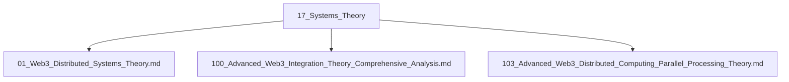

# 17_Systems_Theory 系统理论主题分层导航

## 目录结构
- 分布式系统理论
- 集成理论
- 并行处理理论
- 归档（见 99_Recycle_Bin 或 00-备份）

## 主题导航
- 返回 [全局索引](../00_Index_and_Classification.md)
- 交叉引用：[知识图谱](../00_Knowledge_Graph.md)

## Mermaid知识图谱锚点
