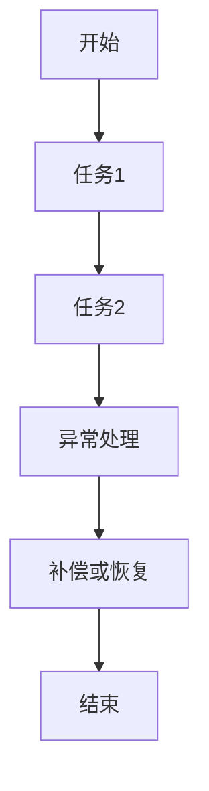

# 同伦论视角下的分布式工作流系统

## 目录

- [同伦论视角下的分布式工作流系统](#同伦论视角下的分布式工作流系统)
  - [目录](#目录)
  - [1. 引言：同伦论与分布式工作流](#1-引言同伦论与分布式工作流)
  - [2. 同伦等价与工作流路径](#2-同伦等价与工作流路径)
  - [3. 组合性与代数结构](#3-组合性与代数结构)
  - [4. 异常补偿与容错](#4-异常补偿与容错)
  - [5. 范畴论建模](#5-范畴论建模)
  - [6. 流程图与代码示例](#6-流程图与代码示例)
  - [7. 结论与展望](#7-结论与展望)

## 1. 引言：同伦论与分布式工作流

同伦论为分布式工作流的路径等价、组合性和容错性提供了数学基础。

## 2. 同伦等价与工作流路径

**定义 2.1** (同伦等价) 两条工作流执行路径$\gamma_1, \gamma_2$，若存在同伦$H$使得$H(t,0)=\gamma_1(t), H(t,1)=\gamma_2(t)$，则等价。

## 3. 组合性与代数结构

- 顺序组合$\circ$、并行组合$\parallel$
- 满足结合性、不变性

**定理 3.1** (组合性) $(W, \circ, \parallel)$为代数系统，存在到同伦群的同态。

## 4. 异常补偿与容错

- 错误处理$E$满足$E(w_1 \circ w_2)=E(w_1)\circ E(w_2)$
- 补偿操作$\bar{w}$，$w\circ\bar{w}\sim id$

**代码示例**：

```rust
trait Workflow { fn execute(&self) -> Result<(), Error>; fn compensate(&self); }
```

## 5. 范畴论建模

- 对象：系统状态
- 态射：工作流转换
- 组合：顺序执行

## 6. 流程图与代码示例



## 7. 结论与展望

同伦论与范畴论为分布式工作流的健壮性和可组合性提供了理论基础，未来可结合类型理论和自动化验证进一步提升系统可靠性。
