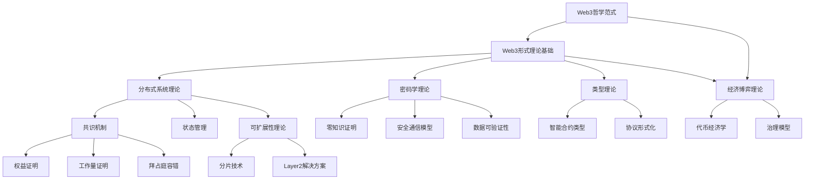
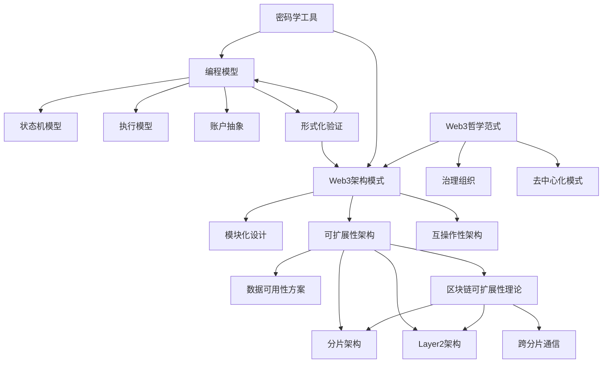
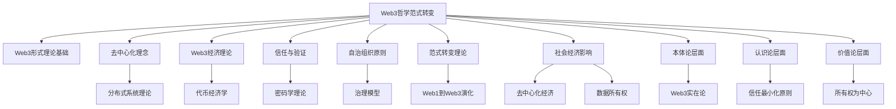
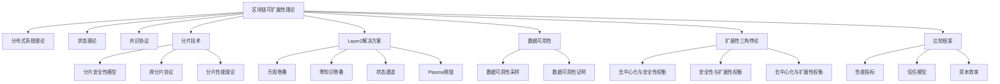
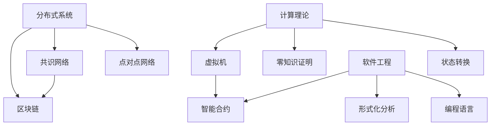
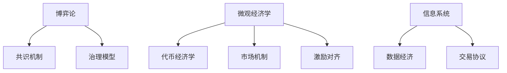
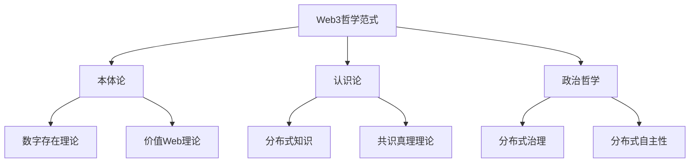

# Web3内容关系图谱

## 1. 概述

本文档描述了Web3内容分析项目中各主题内容之间的连接关系和知识图谱，帮助理解知识体系的整体结构和内容之间的依赖关系。此关系图谱将持续更新，以反映项目的发展和新增内容。

## 2. 核心理论关系图

## 3. 技术实现连接图

## 4. 新增内容连接关系

### 4.1 Web3哲学范式转变与已有内容关系

### 4.2 区块链可扩展性理论与已有内容关系

## 5. 跨学科连接关系

### 5.1 计算机科学与Web3

### 5.2 经济学与Web3

### 5.3 哲学与Web3

## 6. 内容依赖关系

### 6.1 基础依赖

| 内容主题 | 依赖内容 | 依赖类型 |
|--------|---------|---------|
| 分布式系统理论 | 形式理论基础 | 基础支持 |
| 密码学应用 | 密码学理论基础 | 概念依赖 |
| 智能合约 | 形式语言、类型理论 | 理论支持 |
| 治理模型 | 经济博弈理论 | 分析框架 |
| Web3哲学范式 | 形式理论基础、经济理论 | 概念支持 |
| 区块链可扩展性理论 | 分布式系统理论、状态管理理论 | 理论基础 |

### 6.2 应用依赖

| 应用领域 | 依赖内容 | 依赖类型 |
|--------|---------|---------|
| DeFi | 代币经济学、智能合约、可组合性 | 功能实现 |
| DAO | 治理模型、智能合约、代币经济学 | 组织结构 |
| NFT | 数字所有权、密码学证明、元数据标准 | 技术实现 |
| Web3社交 | 身份系统、数据所有权、隐私保护 | 架构支持 |
| Layer2扩展 | 区块链可扩展性理论、数据可用性 | 设计依据 |

## 7. 概念和主题映射

| 核心概念 | 相关主题 | 文档位置 |
|--------|---------|---------|
| 去中心化 | 分布式系统、Web3哲学范式、治理模型 | `/01_Foundations/14_Philosophical/01_Decentralization_Philosophy.md` |
| 可扩展性 | 分片、Layer2、区块链可扩展性理论 | `/04_Scalability/01_Sharding/Blockchain_Scalability_Theory.md` |
| 安全性 | 密码学、共识安全、形式化验证 | `/01_Foundations/Web3_Cryptography_Foundations.md` |
| 互操作性 | 跨链通信、桥接协议、标准化 | `/07_Interoperability/Cross_Chain_Communication_Models.md` |
| 可组合性 | 智能合约设计、DeFi协议、接口标准 | `/09_Smart_Contracts/Composability_Design_Patterns.md` |
| 隐私保护 | 零知识证明、隐私计算、加密技术 | `/08_Privacy/Zero_Knowledge_Applications.md` |
| 范式转变 | Web3哲学范式、社会经济影响、体系结构变革 | `/01_Foundations/14_Philosophical/Web3_Paradigm_Shift.md` |

## 8. 关键术语映射

| 术语 | 标准定义位置 | 相关概念 |
|-----|------------|--------|
| Web3 | `/23_Progress_Tracking/Web3_Terminology_Standardization.md` | 去中心化网络、价值互联网 |
| 区块链 | `/23_Progress_Tracking/Web3_Terminology_Standardization.md` | 分布式账本、共识机制 |
| 去中心化 | `/23_Progress_Tracking/Web3_Terminology_Standardization.md` | 权力分散、无信任交互 |
| Layer2 | `/23_Progress_Tracking/Web3_Terminology_Standardization.md` | 扩展性解决方案、状态通道、Rollup |
| 智能合约 | `/23_Progress_Tracking/Web3_Terminology_Standardization.md` | 自动执行程序、链上逻辑 |

## 9. 最新更新关系

### 9.1 新增文档的主要连接点

1. **Web3哲学范式转变**:
   - 连接到Web3形式理论基础（理论支撑）
   - 连接到去中心化理念（哲学核心）
   - 连接到代币经济学（经济模型）
   - 连接到社会经济影响（应用影响）

2. **区块链可扩展性理论**:
   - 连接到分布式系统理论（基础理论）
   - 连接到分片技术（实现方法）
   - 连接到Layer2解决方案（扩展选择）
   - 连接到数据可用性（关键挑战）
   - 连接到扩展性三角悖论（理论限制）

### 9.2 核心知识节点

1. **Web3范式理论节点**:
   - Web3形式理论基础
   - Web3哲学范式转变
   - 去中心化理念形式化
   - 社会经济影响模型

2. **可扩展性理论节点**:
   - 区块链可扩展性理论
   - 分片技术形式化模型
   - Layer2解决方案形式化
   - 扩展性三角悖论
   - 跨分片通信模型

---

**更新日期**: 2023年12月2日
**更新人**: Web3内容分析团队
