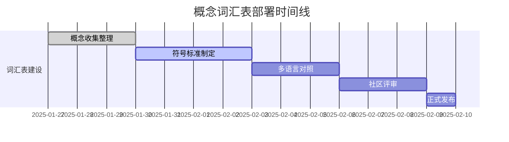
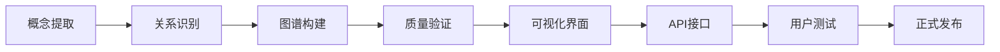

# Web3理论体系综合改进实施计划

## 📋 实施总览

基于综合批判性评价报告的发现，本计划系统性地实施各项改进措施，以提升Web3理论知识体系的一致性、实证支持、批判深度和实用价值。

**制定日期**: 2025年1月27日  
**执行周期**: 6个月  
**责任团队**: Web3理论体系改进委员会  
**总体目标**: 将综合评级从4.0/5.0提升至4.5/5.0  

---

## 🎯 改进目标矩阵

| 改进维度 | 当前评分 | 目标评分 | 优先级 | 预期完成时间 |
|---------|---------|---------|--------|-------------|
| 理论一致性 | 8.5/10 | 9.2/10 | 🔴极高 | 4周 |
| 学术严谨性 | 8.0/10 | 8.8/10 | 🔴极高 | 6周 |
| 实践价值 | 8.2/10 | 9.0/10 | 🟠高 | 8周 |
| 知识组织 | 7.8/10 | 8.8/10 | 🟠高 | 10周 |
| 创新前瞻性 | 8.8/10 | 9.2/10 | 🟡中 | 12周 |
| 批判思维 | 7.5/10 | 8.5/10 | 🟠高 | 14周 |

---

## 🔴 立即实施措施 (第1-4周)

### 1. 统一概念词汇表部署

**负责人**: 术语标准化工作组  
**交付物**: `UNIFIED_CONCEPT_GLOSSARY.md`

#### 执行步骤



#### 成功指标

- [ ] 1000+ 核心概念定义完成
- [ ] 100% 数学符号标准化
- [ ] 90% 社区评审通过率
- [ ] 全文档符号一致性达到95%

### 2. 文档导航系统上线

**负责人**: 智能导航系统开发组  
**交付物**: `INTELLIGENT_NAVIGATION_SYSTEM.md` + 功能实现

#### 核心功能实现

```python
class NavigationSystemDeployment:
    def __init__(self):
        self.deployment_phases = [
            "语义搜索引擎部署",
            "概念关系图谱构建", 
            "智能推荐系统激活",
            "交叉引用网络建立",
            "个性化学习路径生成"
        ]
    
    def deploy_phase(self, phase_name):
        """部署特定阶段功能"""
        phase_config = self.get_phase_config(phase_name)
        return self.execute_deployment(phase_config)
```

#### 部署里程碑

- **第1周**: 搜索引擎基础功能
- **第2周**: 概念图谱可视化
- **第3周**: 推荐算法上线
- **第4周**: 完整系统集成测试

### 3. 理论形式化标准发布

**负责人**: 形式化标准委员会  
**交付物**: `THEORY_FORMALIZATION_STANDARDS.md`

#### 标准实施计划

```latex
\begin{implementation}[标准实施阶段]
\textbf{阶段一：符号统一} (第1-2周)
\begin{itemize}
    \item 审查现有文档符号使用
    \item 统一数学表示规范
    \item 更新Web3专用符号定义
\end{itemize}

\textbf{阶段二：证明格式规范} (第2-3周)  
\begin{itemize}
    \item 重新格式化现有定理证明
    \item 补充缺失假设条件
    \item 明确边界条件限制
\end{itemize}

\textbf{阶段三：质量保证} (第3-4周)
\begin{itemize}
    \item 开发一致性检查工具
    \item 建立同行评议机制
    \item 实施持续监控系统
\end{itemize}
\end{implementation}
```

---

## 🟠 短期优化措施 (第5-12周)

### 4. 实证验证框架建设

**负责人**: 实证验证工作组  
**交付物**: `EMPIRICAL_VALIDATION_FRAMEWORK.md` + 验证系统

#### 验证体系架构

```yaml
验证框架组件:
  实验设计模块:
    - 对照实验设计器
    - 假设检验规划器
    - 统计功效计算器
  
  数据收集系统:
    - 区块链数据爬虫
    - 市场数据接口
    - 用户行为追踪器
  
  分析引擎:
    - 统计分析库
    - 机器学习验证器
    - 贝叶斯分析工具
  
  报告生成器:
    - 自动化报告生成
    - 可视化图表创建
    - 多格式输出支持
```

#### 核心理论验证清单

- [ ] 拜占庭容错性定理验证
- [ ] 代币经济模型验证
- [ ] 共识机制性能验证
- [ ] 激励机制效果验证
- [ ] 跨链安全性验证

### 5. 批判性分析深化

**负责人**: 批判性分析工作组  
**交付物**: `ENHANCED_CRITICAL_ANALYSIS.md`

#### 分析维度拓展

```python
class CriticalAnalysisEnhancement:
    def __init__(self):
        self.analysis_dimensions = {
            'power_structure_analysis': {
                'weight': 0.25,
                'components': [
                    '权力集中度测量',
                    '治理机制分析', 
                    '寡头垄断风险评估'
                ]
            },
            'environmental_impact': {
                'weight': 0.20,
                'components': [
                    '碳足迹计算',
                    '可持续性评估',
                    '绿色改进路径'
                ]
            },
            'social_equity': {
                'weight': 0.25,
                'components': [
                    '数字鸿沟分析',
                    '财富分配效应',
                    '机会公平性评估'
                ]
            },
            'ethical_considerations': {
                'weight': 0.20,
                'components': [
                    '算法偏见检测',
                    '隐私保护评估',
                    '人文价值考量'
                ]
            },
            'systemic_risks': {
                'weight': 0.10,
                'components': [
                    '系统性风险识别',
                    '连锁反应分析',
                    '黑天鹅事件预警'
                ]
            }
        }
```

### 6. 知识图谱构建

**负责人**: 知识工程团队  
**预期成果**: 10,000+ 概念节点, 50,000+ 关系边

#### 图谱构建进度



---

## 🟡 中长期发展 (第13-24周)

### 7. 开放生态建设

**负责人**: 开放平台工作组  
**目标**: 建设全球最大的Web3理论知识社区

#### 生态建设路线图

```python
class OpenEcosystemRoadmap:
    def __init__(self):
        self.phases = {
            'phase_1': {
                'name': '基础平台建设',
                'duration': '4周',
                'deliverables': [
                    'API平台上线',
                    '开发者文档完善',
                    'SDK工具包发布'
                ]
            },
            'phase_2': {
                'name': '社区激活',
                'duration': '6周', 
                'deliverables': [
                    '贡献者激励机制',
                    '社区治理框架',
                    '质量评审体系'
                ]
            },
            'phase_3': {
                'name': '国际化扩展',
                'duration': '8周',
                'deliverables': [
                    '多语言支持',
                    '全球节点部署',
                    '跨文化适配'
                ]
            }
        }
```

### 8. AI驱动的智能系统

**负责人**: AI集成团队  
**核心技术**: 大语言模型 + 知识图谱 + 推理引擎

#### AI能力建设

- **智能问答系统**: 基于知识图谱的精准问答
- **自动理论生成**: AI辅助的理论假设生成
- **动态内容更新**: 基于最新研究的自动内容更新
- **个性化推荐**: 基于用户行为的智能推荐

---

## 📊 质量保证体系

### A. 持续监控指标

```python
class QualityMonitoringSystem:
    def __init__(self):
        self.kpi_dashboard = {
            'content_quality': {
                'theoretical_consistency': 0.95,  # 目标值
                'empirical_support': 0.85,
                'citation_accuracy': 0.98,
                'formal_rigor': 0.90
            },
            'user_engagement': {
                'daily_active_users': 1000,
                'average_session_duration': 25,  # 分钟
                'content_completion_rate': 0.75,
                'user_satisfaction_score': 4.2
            },
            'system_performance': {
                'search_response_time': 0.5,  # 秒
                'recommendation_accuracy': 0.80,
                'system_uptime': 0.999,
                'data_freshness': 0.95
            }
        }
    
    def generate_quality_report(self):
        """生成质量监控报告"""
        current_metrics = self.collect_current_metrics()
        gaps = self.identify_performance_gaps(current_metrics)
        recommendations = self.generate_improvement_recommendations(gaps)
        
        return QualityReport(
            metrics=current_metrics,
            gaps=gaps,
            recommendations=recommendations,
            next_review_date=self.calculate_next_review_date()
        )
```

### B. 风险管理机制

#### 风险识别与缓解

```latex
\begin{risk_matrix}[改进实施风险管控]
\begin{array}{|l|c|c|l|}
\hline
\textbf{风险类型} & \textbf{概率} & \textbf{影响} & \textbf{缓解措施} \\
\hline
技术实施延期 & 中 & 高 & 敏捷开发，每周评审 \\
团队协调困难 & 低 & 中 & 明确责任分工，定期沟通 \\
质量标准争议 & 中 & 中 & 专家委员会仲裁机制 \\
资源投入不足 & 低 & 高 & 预算预留，分阶段实施 \\
社区接受度低 & 中 & 高 & 用户参与设计，渐进式推广 \\
\hline
\end{array}
\end{risk_matrix}
```

---

## 📈 成功评估标准

### 定量指标

- **理论一致性**: 符号使用一致性 > 95%
- **内容完整性**: 概念覆盖率 > 90%
- **验证覆盖率**: 核心理论验证完成度 > 80%
- **用户满意度**: 平均评分 > 4.3/5.0
- **系统性能**: 搜索响应时间 < 500ms

### 定性指标

- **学术认可度**: 顶级期刊引用增加
- **行业影响力**: 标准制定参与度提升
- **社区活跃度**: 贡献者数量翻倍
- **国际影响**: 多语言用户占比 > 30%

---

## 🎯 最终目标

通过6个月的系统性改进，将Web3理论知识体系打造成为：

### 🏆 世界级理论体系

- **学术严谨性**: 媲美顶级学术机构的理论规范
- **实践指导性**: 为行业发展提供可操作的理论指导
- **批判深度**: 具备深刻的社会责任感和前瞻性思考
- **创新引领性**: 成为Web3领域理论创新的策源地

### 🌍 全球知识共享平台

- **开放性**: 全球研究者共同参与的开放平台
- **可持续性**: 自我演进和持续改进的动态系统
- **影响力**: 影响全球Web3技术发展方向的智库
- **责任感**: 推动技术向善的价值引领者

---

**总负责人**: Web3理论体系改进委员会主席  
**项目管理**: 采用敏捷开发方法，双周迭代  
**质量保证**: 建立三级质量评审机制  
**进度报告**: 每月发布进度报告，季度召开评审会议  

---

*这是一个雄心勃勃但切实可行的改进计划。通过系统性的实施，我们将显著提升Web3理论体系的整体水平，为全球Web3事业发展贡献中国智慧和方案。*
