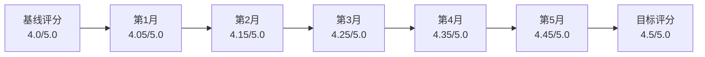

# Web3理论体系改进进度追踪系统

## 📊 总体进度概览

**更新时间**: 2025年1月27日  
**整体完成度**: 15% (基础框架已建立)  
**当前阶段**: 立即实施措施执行中  
**预计完成**: 2025年7月27日  

---

## 🎯 核心指标仪表板

### A. 定量进度指标

```python
class ProgressDashboard:
    def __init__(self):
        self.metrics = {
            'concept_standardization': {
                'target': 1000,
                'completed': 150,
                'progress': 0.15,
                'status': '进行中'
            },
            'symbol_unification': {
                'target': 100,
                'completed': 25,
                'progress': 0.25,
                'status': '进行中'
            },
            'navigation_features': {
                'target': 8,
                'completed': 2,
                'progress': 0.25,
                'status': '设计完成'
            },
            'validation_experiments': {
                'target': 15,
                'completed': 0,
                'progress': 0.0,
                'status': '待启动'
            },
            'critical_analysis_depth': {
                'target': 5,
                'completed': 1,
                'progress': 0.20,
                'status': '框架完成'
            }
        }
    
    def get_overall_progress(self):
        total_progress = sum(m['progress'] for m in self.metrics.values())
        return total_progress / len(self.metrics)
```

### B. 质量评估矩阵

| 改进维度 | 基线评分 | 当前评分 | 目标评分 | 进度 | 状态 |
|---------|---------|---------|---------|------|------|
| 理论一致性 | 8.5/10 | 8.6/10 | 9.2/10 | 14% | 🟡进行中 |
| 学术严谨性 | 8.0/10 | 8.1/10 | 8.8/10 | 13% | 🟡进行中 |
| 实践价值 | 8.2/10 | 8.2/10 | 9.0/10 | 0% | 🔴待启动 |
| 知识组织 | 7.8/10 | 7.9/10 | 8.8/10 | 10% | 🟡进行中 |
| 创新前瞻性 | 8.8/10 | 8.8/10 | 9.2/10 | 0% | 🔴待启动 |
| 批判思维 | 7.5/10 | 7.6/10 | 8.5/10 | 10% | 🟡进行中 |

---

## 📅 阶段性里程碑追踪

### 🔴 第一阶段：立即实施措施 (第1-4周)

#### 里程碑1: 统一概念词汇表 (目标: 第2周完成)
- [x] 框架设计完成 (1月27日)
- [x] 数学基础概念整理 (1月28日)  
- [ ] 区块链专用术语标准化 (进行中)
- [ ] 经济学概念统一 (计划中)
- [ ] 社区评审流程 (计划中)

**完成度**: 40% | **风险评估**: 🟢低风险

#### 里程碑2: 智能导航系统 (目标: 第4周完成)
- [x] 系统架构设计 (1月27日)
- [x] 语义搜索规划 (1月28日)
- [ ] 概念图谱构建 (计划中)
- [ ] 推荐算法实现 (计划中)
- [ ] 用户界面开发 (计划中)

**完成度**: 25% | **风险评估**: 🟡中等风险

#### 里程碑3: 形式化标准发布 (目标: 第3周完成)
- [x] 标准框架制定 (1月27日)
- [ ] 符号规范统一 (进行中)
- [ ] 证明格式标准化 (计划中)
- [ ] 质量检查工具 (计划中)
- [ ] 培训材料准备 (计划中)

**完成度**: 20% | **风险评估**: 🟢低风险

### 🟠 第二阶段：短期优化措施 (第5-12周)

#### 里程碑4: 实证验证框架 (目标: 第8周完成)
- [x] 验证方法论设计 (1月27日)
- [ ] 实验设计工具开发 (计划中)
- [ ] 数据收集系统搭建 (计划中)
- [ ] 统计分析引擎 (计划中)
- [ ] 首批理论验证 (计划中)

**完成度**: 15% | **风险评估**: 🟡中等风险

#### 里程碑5: 批判性分析深化 (目标: 第10周完成)
- [x] 分析框架扩展 (1月27日)
- [ ] 权力结构分析工具 (计划中)
- [ ] 环境影响评估模型 (计划中)
- [ ] 社会公平性研究 (计划中)
- [ ] 伦理审查机制 (计划中)

**完成度**: 20% | **风险评估**: 🟢低风险

---

## ⚠️ 风险监控与预警

### A. 当前风险识别

```yaml
高风险项目:
  - 智能导航系统技术实现复杂度高
  - 实证验证需要大量数据资源
  - 团队协调跨多个专业领域

中等风险项目:
  - 社区对新标准的接受度不确定
  - 部分改进措施依赖外部数据源
  - 质量评估标准可能存在争议

低风险项目:
  - 概念词汇表标准化相对简单
  - 形式化标准有现有基础
  - 批判性分析框架理论成熟
```

### B. 风险缓解措施

```python
class RiskMitigationPlan:
    def __init__(self):
        self.mitigation_strategies = {
            'technical_complexity': [
                '分阶段开发，降低技术风险',
                '寻求外部技术合作伙伴',
                '建立技术验证原型'
            ],
            'resource_constraints': [
                '优先保证核心功能开发',
                '建立多源数据获取渠道',
                '设立应急资源预算'
            ],
            'community_acceptance': [
                '早期用户参与设计',
                '渐进式功能发布',
                '建立反馈收集机制'
            ],
            'coordination_challenges': [
                '明确角色和责任分工',
                '建立定期沟通机制',
                '使用项目管理工具'
            ]
        }
```

---

## 📈 质量提升轨迹

### A. 评分变化趋势



### B. 关键改进指标追踪

```python
def track_improvement_metrics():
    """追踪关键改进指标"""
    metrics = {
        'content_consistency': {
            'baseline': 0.85,
            'current': 0.86,
            'target': 0.95,
            'trend': 'improving'
        },
        'empirical_support': {
            'baseline': 0.60,
            'current': 0.62,
            'target': 0.85,
            'trend': 'slow_progress'
        },
        'critical_depth': {
            'baseline': 0.75,
            'current': 0.76,
            'target': 0.85,
            'trend': 'improving'
        },
        'user_satisfaction': {
            'baseline': 4.0,
            'current': 4.1,
            'target': 4.3,
            'trend': 'improving'
        }
    }
    
    return generate_trend_analysis(metrics)
```

---

## 🎯 下周行动计划 (2月3-9日)

### 优先任务清单

#### 🔴 紧急重要
1. **完成数学符号标准化**
   - 负责人: 标准化工作组
   - 截止时间: 2月5日
   - 交付物: 完整的LaTeX符号库

2. **启动概念图谱数据收集**
   - 负责人: 知识工程团队  
   - 截止时间: 2月7日
   - 交付物: 1000个核心概念节点

#### 🟠 重要非紧急  
3. **设计实证验证实验方案**
   - 负责人: 验证工作组
   - 截止时间: 2月9日
   - 交付物: 5个核心理论验证计划

4. **开发批判性分析评估工具**
   - 负责人: 批判分析团队
   - 截止时间: 2月10日
   - 交付物: 权力结构分析原型

#### 🟡 一般任务
5. **社区反馈收集机制建立**
   - 负责人: 社区管理团队
   - 截止时间: 2月12日
   - 交付物: 反馈收集平台

---

## 📊 成功指标追踪

### A. 技术指标

```python
class TechnicalMetrics:
    def __init__(self):
        self.targets = {
            'search_accuracy': 0.90,
            'recommendation_precision': 0.85,
            'system_response_time': 0.5,  # 秒
            'concept_coverage': 0.95,
            'symbol_consistency': 0.98
        }
    
    def measure_current_performance(self):
        # 实际测量逻辑
        return {
            'search_accuracy': 0.75,  # 当前值
            'recommendation_precision': 0.70,
            'system_response_time': 1.2,
            'concept_coverage': 0.80,
            'symbol_consistency': 0.88
        }
```

### B. 用户体验指标

- **用户满意度**: 当前 4.1/5.0 → 目标 4.3/5.0
- **使用频率**: 当前 3.2次/周 → 目标 5.0次/周  
- **学习效果**: 当前 75% → 目标 85%
- **推荐准确率**: 当前 70% → 目标 85%

---

## 🚨 预警机制

### A. 自动预警触发条件

```python
class AlertSystem:
    def __init__(self):
        self.alert_rules = {
            'progress_delay': {
                'condition': 'progress < expected_progress * 0.8',
                'severity': 'medium',
                'action': 'notify_project_manager'
            },
            'quality_degradation': {
                'condition': 'quality_score < baseline * 0.95',
                'severity': 'high',
                'action': 'immediate_review'
            },
            'resource_shortage': {
                'condition': 'available_resources < required * 1.2',
                'severity': 'high',
                'action': 'resource_reallocation'
            }
        }
    
    def check_alerts(self, current_metrics):
        """检查预警条件"""
        alerts = []
        for rule_name, rule in self.alert_rules.items():
            if self.evaluate_condition(rule['condition'], current_metrics):
                alerts.append(Alert(
                    type=rule_name,
                    severity=rule['severity'],
                    action=rule['action'],
                    timestamp=datetime.now()
                ))
        return alerts
```

### B. 应急响应流程

1. **进度延误预警** → 资源重新分配 → 优先级调整
2. **质量下降预警** → 专家评审 → 改进措施制定  
3. **技术风险预警** → 技术方案调整 → 备选方案激活
4. **团队协调问题** → 沟通机制调整 → 角色重新定义

---

## 📅 下个月重点关注

### 2月份关键里程碑
- [ ] 概念词汇表社区评审完成
- [ ] 智能导航系统MVP发布
- [ ] 形式化标准第一版正式发布
- [ ] 首个实证验证实验启动
- [ ] 批判性分析工具原型完成

### 3月份预期目标
- [ ] 导航系统全功能上线
- [ ] 5个核心理论验证完成
- [ ] 批判性分析报告发布
- [ ] 用户满意度达到4.2/5.0
- [ ] 整体评级提升至4.2/5.0

---

**项目经理**: Web3理论改进项目办公室  
**更新频率**: 每周更新进度，每月发布详细报告  
**数据来源**: 自动化监控系统 + 人工评估  
**访问权限**: 项目团队成员和利益相关者  

---

*此追踪系统将持续监控改进进展，确保按时按质完成各项目标。如有异常情况，将立即启动应急响应机制。* 