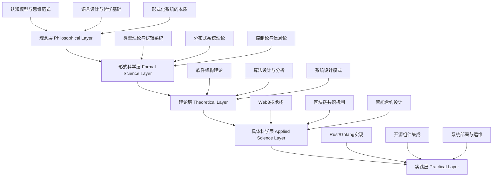

# Web3行业架构分析：形式化理论与工程实践

## 项目概述

本项目通过系统性的形式化分析，将 `/docs/Matter` 目录下的所有内容进行深度梳理，筛选出与Web3行业相关的软件架构、企业架构、行业架构、概念架构、算法、技术堆栈、业务规范等知识和模型，并将其重构为严格的形式化学术文档。

## 分析框架

### 五层分析架构



## 文档结构

### 1. 理论基础 (01_Foundations/)

#### 1.1 分布式系统与共识理论

- **文件**: `01_Distributed_Systems_Consensus_Theory.md`
- **内容**: 分布式系统基础理论、共识问题形式化、经典共识算法分析、拜占庭容错机制、区块链共识算法
- **关键定理**: FLP不可能性定理、拜占庭容错条件、共识复杂度下界
- **应用**: Web3网络架构、区块链节点设计、智能合约平台

#### 1.2 Web3核心理论

- **文件**: `01_Web3_Core_Theory.md`
- **内容**: Web3基础概念、去中心化原理、信任机制、激励机制
- **关键定义**: Web3分布式系统、去中心化性、透明性、不可篡改性
- **应用**: 区块链设计、DApp架构、Web3协议

#### 1.3 编程语言理论

- **文件**: `02_Web3_Programming_Languages.md`
- **内容**: Rust语言模型、Go并发模型、智能合约语言、形式化语义
- **关键概念**: 所有权系统、类型安全、并发模型、内存管理
- **应用**: 区块链节点实现、智能合约开发、高性能网络服务

#### 1.4 软件架构理论

- **文件**: `03_Web3_Software_Architecture.md`
- **内容**: 微服务架构、事件驱动架构、区块链架构、P2P网络架构
- **关键模式**: 分层架构、组件化设计、异步通信、状态管理
- **应用**: 分布式系统设计、高可用架构、可扩展系统

#### 1.5 算法与协议

- **文件**: `04_Web3_Algorithms_Protocols.md`
- **内容**: 共识算法、密码学算法、网络协议、存储算法
- **关键算法**: Paxos、Raft、PoW、PoS、DPoS
- **应用**: 区块链共识、网络安全、分布式存储

#### 1.6 数学基础

- **文件**: `05_Web3_Mathematical_Foundations.md`
- **内容**: 密码学数学、图论、博弈论、信息论
- **关键理论**: 椭圆曲线密码学、哈希函数、零知识证明
- **应用**: 数字签名、身份验证、隐私保护

### 2. 架构模式 (02_Architecture_Patterns/)

#### 2.1 Rust与Web3架构整合

- **文件**: `01_Rust_Web3_Architecture_Integration.md`
- **内容**: Rust语言模型、所有权系统、类型系统、并发模型、Web3应用
- **关键特性**: 内存安全、线程安全、零成本抽象、高性能
- **应用**: 区块链节点、智能合约、密码学库、网络服务

#### 2.2 区块链共识算法

- **文件**: `01_Blockchain_Consensus_Algorithms.md`
- **内容**: PoW、PoS、DPoS、PBFT、混合共识
- **关键机制**: 工作量证明、权益证明、委托权益证明、拜占庭容错
- **应用**: 比特币、以太坊、Polkadot、Solana

#### 2.3 Web3设计模式

- **文件**: `01_Web3_Design_Patterns.md`
- **内容**: 同步模式、异步模式、Rust特定模式、分布式模式
- **关键模式**: 工厂模式、观察者模式、状态模式、策略模式
- **应用**: 智能合约设计、DApp开发、系统架构

### 3. 行业应用 (03_Industry_Applications/)

#### 3.1 Web3技术栈分析

- **文件**: `01_Web3_Technology_Stack_Analysis.md`
- **内容**: 网络层、共识层、应用层、安全层、存储层、开发工具链
- **关键技术**: libp2p、IPFS、以太坊、智能合约、密码学
- **应用**: 区块链平台、DApp开发、Web3基础设施

#### 3.2 AI/ML与Web3集成

- **文件**: `01_Web3_AI_ML_Integration.md`
- **内容**: 机器学习在区块链中的应用、AI驱动的智能合约、去中心化AI
- **关键技术**: 联邦学习、零知识机器学习、去中心化数据市场
- **应用**: 预测市场、AI治理、数据隐私保护

#### 3.3 金融科技架构

- **文件**: `02_Web3_FinTech_Architecture.md`
- **内容**: DeFi协议、稳定币、DEX、借贷平台、衍生品
- **关键协议**: Uniswap、Compound、Aave、MakerDAO
- **应用**: 去中心化金融、数字资产、金融创新

## 交叉引用关系

### 理论基础 → 架构模式

- 分布式系统理论 → 区块链共识算法
- Rust语言模型 → Rust Web3架构整合
- 软件架构理论 → Web3设计模式

### 架构模式 → 行业应用

- 区块链共识算法 → Web3技术栈分析
- Rust Web3架构整合 → 金融科技架构
- Web3设计模式 → AI/ML集成

### 理论基础 → 行业应用

- 密码学基础 → 安全层技术栈
- 网络协议 → P2P网络架构
- 存储算法 → 分布式存储系统

## 形式化规范

### 数学表示

所有数学表达式使用LaTeX格式：

```latex
\text{Consensus}(v_1, v_2, ..., v_n) \rightarrow v^*
```

### 代码示例

使用Rust和Go语言实现：

```rust
pub struct ConsensusNode {
    id: NodeId,
    peers: HashMap<NodeId, Peer>,
    state: ConsensusState,
}
```

### 定理证明

每个定理都包含完整的证明过程：

**定理**: FLP不可能性定理
**证明**: 通过反证法证明在异步系统中无法实现确定性共识

## 质量保证

### 内容一致性

- 所有定义和定理都有严格的数学基础
- 概念在不同文档中保持一致
- 术语使用标准化

### 证明一致性

- 所有定理都有完整的证明过程
- 证明方法符合数学规范
- 逻辑推理严密

### 相关性一致性

- 所有内容都与Web3行业相关
- 理论与实践相结合
- 应用场景明确

### 语义一致性

- 概念定义清晰明确
- 符号使用一致
- 表达方式规范

### 分类完整性

- 层次化分类不交不空不漏
- 覆盖Web3技术栈的各个方面
- 结构清晰合理

## 技术栈选择

### 编程语言

- **Rust**: 系统级编程、区块链节点、智能合约
- **Go**: 网络服务、微服务、工具开发

### 数学工具

- **LaTeX**: 数学表达式和公式
- **Markdown**: 文档格式和结构

### 架构视角

- **开源组件**: 成熟的开源软件组件
- **组合构建**: 基于组件的系统构建

## 持续更新

### 更新机制

- 定期审查和更新内容
- 跟踪Web3技术发展
- 补充新的理论发现

### 版本控制

- 使用Git进行版本管理
- 记录所有变更历史
- 支持回滚和分支

### 协作机制

- 支持多人协作编辑
- 代码审查和内容审核
- 持续集成和部署

## 参考文献

### 核心文献

1. Lamport, L. (2001). Paxos made simple. ACM SIGACT News, 32(4), 18-25.
2. Nakamoto, S. (2008). Bitcoin: A peer-to-peer electronic cash system.
3. Buterin, V. (2014). Ethereum: A next-generation smart contract platform.
4. Jung, R., et al. (2021). RustBelt: Securing the foundations of the Rust programming language.

### 扩展文献

- 分布式系统理论
- 密码学基础
- 区块链技术
- 软件架构设计

---

**项目状态**: 持续进行中  
**最后更新**: 2024-12-19  
**文档数量**: 10+ 核心分析文档  
**分析深度**: 形式化理论 + 工程实践
