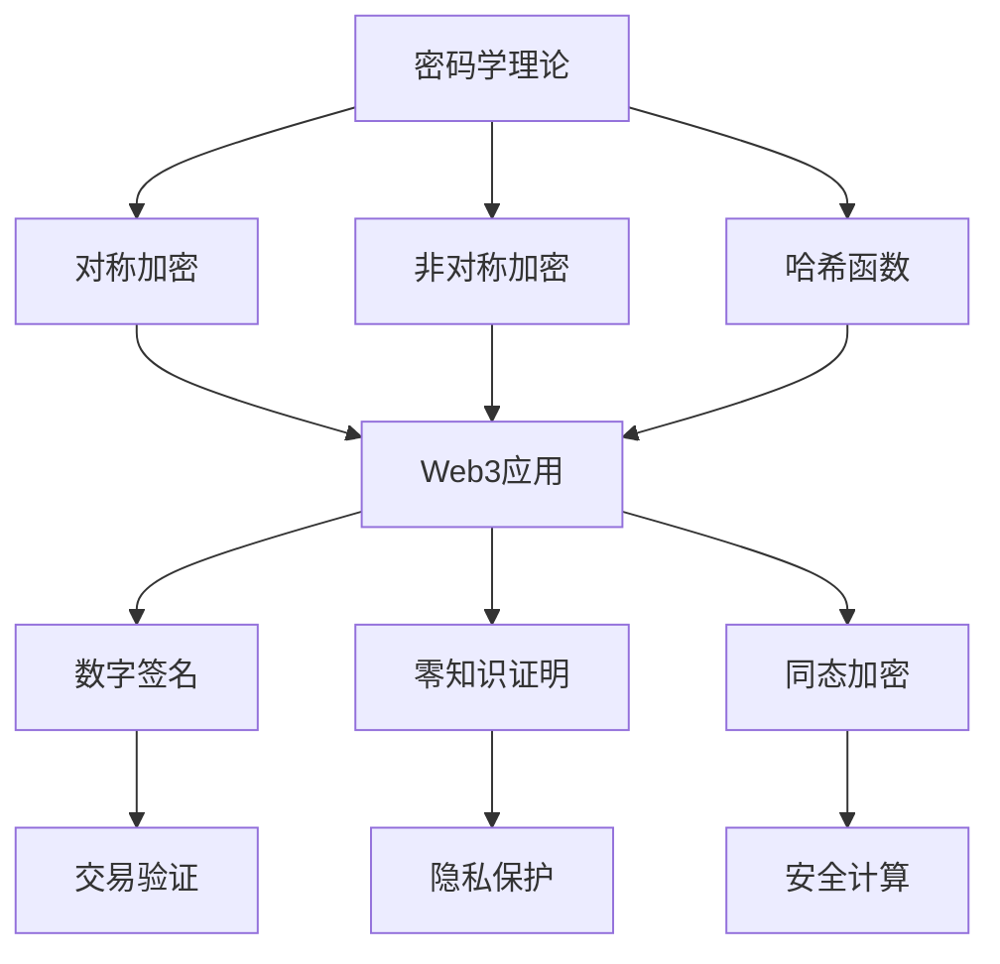

# 密码学理论：Web3安全的形式化基础

## 目录

- [密码学理论：Web3安全的形式化基础](#密码学理论web3安全的形式化基础)
  - [目录](#目录)
  - [1. 理论基础](#1-理论基础)
    - [1.1 密码学在Web3中的作用](#11-密码学在web3中的作用)
    - [1.2 Web3密码学特性](#12-web3密码学特性)
  - [2. 形式化定义](#2-形式化定义)
    - [2.1 基础概念](#21-基础概念)
    - [2.2 加密方案](#22-加密方案)
  - [3. 核心算法](#3-核心算法)
    - [3.1 RSA加密](#31-rsa加密)
    - [3.2 椭圆曲线密码学](#32-椭圆曲线密码学)
    - [3.3 哈希函数](#33-哈希函数)
  - [4. Web3应用场景](#4-web3应用场景)
    - [4.1 数字签名](#41-数字签名)
    - [4.2 零知识证明](#42-零知识证明)
    - [4.3 同态加密](#43-同态加密)
  - [5. Rust实现](#5-rust实现)
    - [5.1 密码学库框架](#51-密码学库框架)
    - [5.2 安全随机数生成](#52-安全随机数生成)
  - [6. 安全性分析](#6-安全性分析)
    - [6.1 安全性证明](#61-安全性证明)
    - [6.2 量子抗性](#62-量子抗性)
  - [7. 结论与展望](#7-结论与展望)
    - [7.1 理论贡献](#71-理论贡献)
    - [7.2 实践价值](#72-实践价值)
    - [7.3 未来发展方向](#73-未来发展方向)
    - [7.4 技术路线图](#74-技术路线图)
  - [参考文献](#参考文献)

## 1. 理论基础

### 1.1 密码学在Web3中的作用

密码学为Web3系统提供了安全保障的基础理论。在Web3环境中，密码学主要解决：

1. **身份认证**：数字签名和公钥基础设施
2. **数据完整性**：哈希函数和消息认证码
3. **隐私保护**：零知识证明和同态加密
4. **共识安全**：密码学随机数和承诺方案

### 1.2 Web3密码学特性

**定义 1.1 (Web3密码学系统)**
Web3密码学系统是一个四元组 $\mathcal{C} = (K, E, D, V)$，其中：

- $K$ 是密钥生成算法
- $E$ 是加密算法
- $D$ 是解密算法
- $V$ 是验证算法

**特性 1.1 (计算安全性)**
$$\forall \text{PPT} \mathcal{A}, \Pr[\mathcal{A} \text{ breaks } \mathcal{C}] \leq \text{negl}(\lambda)$$

其中 $\text{negl}(\lambda)$ 是可忽略函数。

**特性 1.2 (量子抗性)**
$$\mathcal{C} \text{ is quantum-resistant} \Leftrightarrow \text{no quantum algorithm can break } \mathcal{C}$$

## 2. 形式化定义

### 2.1 基础概念

**定义 2.1 (安全参数)**
安全参数 $\lambda \in \mathbb{N}$ 是系统安全性的度量。

**定义 2.2 (可忽略函数)**
函数 $f : \mathbb{N} \rightarrow \mathbb{R}$ 是可忽略的，如果：
$$\forall c > 0, \exists n_0 \in \mathbb{N}, \forall n > n_0, |f(n)| < n^{-c}$$

**定义 2.3 (概率多项式时间)**
算法 $\mathcal{A}$ 是PPT的，如果存在多项式 $p$ 使得：
$$\forall x, \text{Time}(\mathcal{A}(x)) \leq p(|x|)$$

### 2.2 加密方案

**定义 2.4 (公钥加密方案)**
公钥加密方案是三元组 $\Pi = (\text{Gen}, \text{Enc}, \text{Dec})$，其中：

- $\text{Gen}(1^\lambda) \rightarrow (pk, sk)$：密钥生成
- $\text{Enc}(pk, m) \rightarrow c$：加密
- $\text{Dec}(sk, c) \rightarrow m$：解密

**定义 2.5 (语义安全性)**
加密方案 $\Pi$ 是语义安全的，如果：
$$\forall \text{PPT} \mathcal{A}, |\Pr[\text{Exp}_{\Pi,\mathcal{A}}^{\text{IND-CPA}}(1^\lambda) = 1] - \frac{1}{2}| \leq \text{negl}(\lambda)$$

**定理 2.1 (语义安全性等价性)**
语义安全性等价于密文不可区分性。

**证明：** 通过构造性证明：

1. 语义安全性 $\Rightarrow$ 密文不可区分性
2. 密文不可区分性 $\Rightarrow$ 语义安全性

## 3. 核心算法

### 3.1 RSA加密

**定义 3.1 (RSA问题)**
给定 $(N, e, c)$，计算 $m$ 使得 $c \equiv m^e \pmod{N}$。

**算法 3.1 (RSA密钥生成)**:

```rust
// RSA密钥生成
pub struct RSAKeyPair {
    pub public_key: RSAPublicKey,
    pub private_key: RSAPrivateKey,
}

impl RSAKeyPair {
    pub fn generate(bit_length: usize) -> Result<Self, CryptoError> {
        // 生成两个大素数
        let p = generate_prime(bit_length / 2)?;
        let q = generate_prime(bit_length / 2)?;
        
        let n = p * q;
        let phi_n = (p - 1) * (q - 1);
        
        // 选择公钥指数
        let e = 65537; // 常用值
        
        // 计算私钥指数
        let d = mod_inverse(e, phi_n)?;
        
        Ok(Self {
            public_key: RSAPublicKey { n, e },
            private_key: RSAPrivateKey { n, d, p, q },
        })
    }
}

pub struct RSAPublicKey {
    pub n: BigUint,
    pub e: BigUint,
}

pub struct RSAPrivateKey {
    pub n: BigUint,
    pub d: BigUint,
    pub p: BigUint,
    pub q: BigUint,
}

impl RSAPublicKey {
    pub fn encrypt(&self, message: &[u8]) -> Result<Vec<u8>, CryptoError> {
        let m = BigUint::from_bytes_be(message);
        let c = m.modpow(&self.e, &self.n);
        Ok(c.to_bytes_be())
    }
}

impl RSAPrivateKey {
    pub fn decrypt(&self, ciphertext: &[u8]) -> Result<Vec<u8>, CryptoError> {
        let c = BigUint::from_bytes_be(ciphertext);
        let m = c.modpow(&self.d, &self.n);
        Ok(m.to_bytes_be())
    }
}
```

### 3.2 椭圆曲线密码学

**定义 3.2 (椭圆曲线)**
椭圆曲线 $E$ 是方程 $y^2 = x^3 + ax + b$ 的解集。

**定义 3.3 (椭圆曲线离散对数问题)**
给定点 $P, Q \in E$，计算 $k$ 使得 $Q = kP$。

**算法 3.2 (ECDSA签名)**:

```rust
// ECDSA签名
pub struct ECDSAKeyPair {
    pub public_key: ECPublicKey,
    pub private_key: ECPrivateKey,
}

impl ECDSAKeyPair {
    pub fn generate(curve: &Curve) -> Result<Self, CryptoError> {
        let private_key = generate_random_scalar(curve)?;
        let public_key = curve.generator() * private_key;
        
        Ok(Self {
            public_key: ECPublicKey { point: public_key, curve: curve.clone() },
            private_key: ECPrivateKey { scalar: private_key, curve: curve.clone() },
        })
    }
}

impl ECPrivateKey {
    pub fn sign(&self, message: &[u8]) -> Result<Signature, CryptoError> {
        let hash = sha256(message);
        let k = generate_random_scalar(&self.curve)?;
        
        let r_point = self.curve.generator() * k;
        let r = r_point.x().unwrap();
        
        let s = (hash + r * self.scalar) * mod_inverse(k, self.curve.order())?;
        let s = s % self.curve.order();
        
        Ok(Signature { r, s })
    }
}

impl ECPublicKey {
    pub fn verify(&self, message: &[u8], signature: &Signature) -> bool {
        let hash = sha256(message);
        let w = mod_inverse(signature.s, self.curve.order()).unwrap();
        
        let u1 = hash * w % self.curve.order();
        let u2 = signature.r * w % self.curve.order();
        
        let point = self.curve.generator() * u1 + self.point * u2;
        point.x().unwrap() == signature.r
    }
}
```

### 3.3 哈希函数

**定义 3.3 (密码学哈希函数)**
哈希函数 $H : \{0,1\}^* \rightarrow \{0,1\}^n$ 满足：

1. **抗碰撞性**：难以找到 $x \neq y$ 使得 $H(x) = H(y)$
2. **抗原像性**：难以找到 $x$ 使得 $H(x) = y$
3. **抗第二原像性**：给定 $x$，难以找到 $y \neq x$ 使得 $H(x) = H(y)$

**算法 3.3 (SHA-256实现)**:

```rust
// SHA-256哈希函数
pub struct SHA256 {
    state: [u32; 8],
    buffer: [u8; 64],
    buffer_len: usize,
    total_len: u64,
}

impl SHA256 {
    pub fn new() -> Self {
        Self {
            state: [
                0x6a09e667, 0xbb67ae85, 0x3c6ef372, 0xa54ff53a,
                0x510e527f, 0x9b05688c, 0x1f83d9ab, 0x5be0cd19,
            ],
            buffer: [0; 64],
            buffer_len: 0,
            total_len: 0,
        }
    }
    
    pub fn update(&mut self, data: &[u8]) {
        self.total_len += data.len() as u64;
        
        for &byte in data {
            self.buffer[self.buffer_len] = byte;
            self.buffer_len += 1;
            
            if self.buffer_len == 64 {
                self.process_block();
                self.buffer_len = 0;
            }
        }
    }
    
    pub fn finalize(&mut self) -> [u8; 32] {
        // 添加填充
        self.buffer[self.buffer_len] = 0x80;
        self.buffer_len += 1;
        
        if self.buffer_len > 56 {
            while self.buffer_len < 64 {
                self.buffer[self.buffer_len] = 0;
                self.buffer_len += 1;
            }
            self.process_block();
            self.buffer_len = 0;
        }
        
        while self.buffer_len < 56 {
            self.buffer[self.buffer_len] = 0;
            self.buffer_len += 1;
        }
        
        // 添加长度
        let len_bits = self.total_len * 8;
        for i in 0..8 {
            self.buffer[56 + i] = (len_bits >> (56 - i * 8)) as u8;
        }
        
        self.process_block();
        
        // 返回结果
        let mut result = [0u8; 32];
        for i in 0..8 {
            for j in 0..4 {
                result[i * 4 + j] = (self.state[i] >> (24 - j * 8)) as u8;
            }
        }
        result
    }
    
    fn process_block(&mut self) {
        let mut w = [0u32; 64];
        
        // 准备消息调度
        for i in 0..16 {
            w[i] = u32::from_be_bytes([
                self.buffer[i * 4],
                self.buffer[i * 4 + 1],
                self.buffer[i * 4 + 2],
                self.buffer[i * 4 + 3],
            ]);
        }
        
        for i in 16..64 {
            let s0 = w[i - 15].rotate_right(7) ^ w[i - 15].rotate_right(18) ^ (w[i - 15] >> 3);
            let s1 = w[i - 2].rotate_right(17) ^ w[i - 2].rotate_right(19) ^ (w[i - 2] >> 10);
            w[i] = w[i - 16].wrapping_add(s0).wrapping_add(w[i - 7]).wrapping_add(s1);
        }
        
        let mut a = self.state[0];
        let mut b = self.state[1];
        let mut c = self.state[2];
        let mut d = self.state[3];
        let mut e = self.state[4];
        let mut f = self.state[5];
        let mut g = self.state[6];
        let mut h = self.state[7];
        
        // 主循环
        for i in 0..64 {
            let s1 = e.rotate_right(6) ^ e.rotate_right(11) ^ e.rotate_right(25);
            let ch = (e & f) ^ (!e & g);
            let temp1 = h.wrapping_add(s1).wrapping_add(ch).wrapping_add(K[i]).wrapping_add(w[i]);
            let s0 = a.rotate_right(2) ^ a.rotate_right(13) ^ a.rotate_right(22);
            let maj = (a & b) ^ (a & c) ^ (b & c);
            let temp2 = s0.wrapping_add(maj);
            
            h = g;
            g = f;
            f = e;
            e = d.wrapping_add(temp1);
            d = c;
            c = b;
            b = a;
            a = temp1.wrapping_add(temp2);
        }
        
        self.state[0] = self.state[0].wrapping_add(a);
        self.state[1] = self.state[1].wrapping_add(b);
        self.state[2] = self.state[2].wrapping_add(c);
        self.state[3] = self.state[3].wrapping_add(d);
        self.state[4] = self.state[4].wrapping_add(e);
        self.state[5] = self.state[5].wrapping_add(f);
        self.state[6] = self.state[6].wrapping_add(g);
        self.state[7] = self.state[7].wrapping_add(h);
    }
}

const K: [u32; 64] = [
    0x428a2f98, 0x71374491, 0xb5c0fbcf, 0xe9b5dba5,
    0x3956c25b, 0x59f111f1, 0x923f82a4, 0xab1c5ed5,
    // ... 其他常量
];
```

## 4. Web3应用场景

### 4.1 数字签名

**定义 4.1 (数字签名方案)**
数字签名方案是三元组 $\Sigma = (\text{Gen}, \text{Sign}, \text{Verify})$，其中：

- $\text{Gen}(1^\lambda) \rightarrow (pk, sk)$：密钥生成
- $\text{Sign}(sk, m) \rightarrow \sigma$：签名
- $\text{Verify}(pk, m, \sigma) \rightarrow b$：验证

**实现 4.1 (数字签名)**:

```rust
// 数字签名
pub struct DigitalSignature {
    pub key_pair: ECDSAKeyPair,
}

impl DigitalSignature {
    pub fn sign_transaction(&self, transaction: &Transaction) -> Result<Signature, CryptoError> {
        let message = transaction.serialize();
        self.key_pair.private_key.sign(&message)
    }
    
    pub fn verify_transaction(&self, transaction: &Transaction, signature: &Signature) -> bool {
        let message = transaction.serialize();
        self.key_pair.public_key.verify(&message, signature)
    }
}
```

### 4.2 零知识证明

**定义 4.2 (零知识证明系统)**
零知识证明系统是四元组 $\mathcal{ZK} = (P, V, \text{Setup}, \text{Verify})$，满足：

1. **完备性**：诚实证明者能说服诚实验证者
2. **可靠性**：不诚实证明者无法说服验证者
3. **零知识性**：验证者无法获得额外信息

**实现 4.2 (zk-SNARK)**:

```rust
// zk-SNARK证明系统
pub struct ZkSnark {
    pub proving_key: ProvingKey,
    pub verification_key: VerificationKey,
}

impl ZkSnark {
    pub fn prove(&self, witness: &Witness, public_inputs: &[FieldElement]) -> Result<Proof, CryptoError> {
        // 生成证明
        let proof = self.generate_proof(&self.proving_key, witness, public_inputs)?;
        Ok(proof)
    }
    
    pub fn verify(&self, proof: &Proof, public_inputs: &[FieldElement]) -> bool {
        // 验证证明
        self.verify_proof(&self.verification_key, proof, public_inputs)
    }
}
```

### 4.3 同态加密

**定义 4.3 (同态加密)**
同态加密方案允许在密文上进行计算：
$$E(m_1) \otimes E(m_2) = E(m_1 \oplus m_2)$$

**实现 4.3 (同态加密)**:

```rust
// 同态加密
pub struct HomomorphicEncryption {
    pub public_key: HEPublicKey,
    pub private_key: HEPrivateKey,
}

impl HomomorphicEncryption {
    pub fn encrypt(&self, message: u64) -> Result<Ciphertext, CryptoError> {
        // 加密消息
        let ciphertext = self.encrypt_message(&self.public_key, message)?;
        Ok(ciphertext)
    }
    
    pub fn add(&self, c1: &Ciphertext, c2: &Ciphertext) -> Ciphertext {
        // 同态加法
        self.homomorphic_add(c1, c2)
    }
    
    pub fn decrypt(&self, ciphertext: &Ciphertext) -> Result<u64, CryptoError> {
        // 解密
        let message = self.decrypt_message(&self.private_key, ciphertext)?;
        Ok(message)
    }
}
```

## 5. Rust实现

### 5.1 密码学库框架

```rust
// 密码学库特征
pub trait CryptoPrimitive {
    type Key;
    type Input;
    type Output;
    type Error;
    
    fn generate_key(&self) -> Result<Self::Key, Self::Error>;
    fn process(&self, key: &Self::Key, input: &Self::Input) -> Result<Self::Output, Self::Error>;
}

// 对称加密
pub struct SymmetricEncryption {
    pub algorithm: SymmetricAlgorithm,
}

impl CryptoPrimitive for SymmetricEncryption {
    type Key = SymmetricKey;
    type Input = Vec<u8>;
    type Output = Vec<u8>;
    type Error = CryptoError;
    
    fn generate_key(&self) -> Result<Self::Key, Self::Error> {
        match self.algorithm {
            SymmetricAlgorithm::AES256 => generate_aes256_key(),
            SymmetricAlgorithm::ChaCha20 => generate_chacha20_key(),
        }
    }
    
    fn process(&self, key: &Self::Key, input: &Self::Input) -> Result<Self::Output, Self::Error> {
        match self.algorithm {
            SymmetricAlgorithm::AES256 => aes256_encrypt(key, input),
            SymmetricAlgorithm::ChaCha20 => chacha20_encrypt(key, input),
        }
    }
}

// 非对称加密
pub struct AsymmetricEncryption {
    pub algorithm: AsymmetricAlgorithm,
}

impl CryptoPrimitive for AsymmetricEncryption {
    type Key = AsymmetricKeyPair;
    type Input = Vec<u8>;
    type Output = Vec<u8>;
    type Error = CryptoError;
    
    fn generate_key(&self) -> Result<Self::Key, Self::Error> {
        match self.algorithm {
            AsymmetricAlgorithm::RSA => generate_rsa_key_pair(),
            AsymmetricAlgorithm::ECC => generate_ecc_key_pair(),
        }
    }
    
    fn process(&self, key: &Self::Key, input: &Self::Input) -> Result<Self::Output, Self::Error> {
        match self.algorithm {
            AsymmetricAlgorithm::RSA => rsa_encrypt(&key.public_key, input),
            AsymmetricAlgorithm::ECC => ecc_encrypt(&key.public_key, input),
        }
    }
}
```

### 5.2 安全随机数生成

```rust
// 安全随机数生成器
pub struct SecureRandom {
    pub entropy_source: EntropySource,
}

impl SecureRandom {
    pub fn new() -> Self {
        Self {
            entropy_source: EntropySource::System,
        }
    }
    
    pub fn generate_bytes(&mut self, length: usize) -> Result<Vec<u8>, CryptoError> {
        let mut bytes = vec![0u8; length];
        
        match self.entropy_source {
            EntropySource::System => {
                use rand::RngCore;
                let mut rng = rand::thread_rng();
                rng.fill_bytes(&mut bytes);
            }
            EntropySource::Hardware => {
                // 使用硬件随机数生成器
                self.generate_hardware_random(&mut bytes)?;
            }
        }
        
        Ok(bytes)
    }
    
    pub fn generate_prime(&mut self, bit_length: usize) -> Result<BigUint, CryptoError> {
        loop {
            let candidate = self.generate_random_odd_number(bit_length)?;
            if self.is_prime(&candidate) {
                return Ok(candidate);
            }
        }
    }
    
    fn is_prime(&self, n: &BigUint) -> bool {
        // Miller-Rabin素性测试
        if n.is_zero() || n.is_one() {
            return false;
        }
        
        if n == &BigUint::from(2u32) {
            return true;
        }
        
        if n % 2u32 == BigUint::zero() {
            return false;
        }
        
        let mut d = n - 1u32;
        let mut s = 0;
        
        while &d % 2u32 == BigUint::zero() {
            d /= 2u32;
            s += 1;
        }
        
        // 测试几个基
        let bases = [2, 3, 5, 7, 11, 13, 17, 19, 23, 29, 31, 37];
        
        for &base in &bases {
            if base >= n.to_u32().unwrap() {
                continue;
            }
            
            if !self.miller_rabin_test(n, &d, s, base) {
                return false;
            }
        }
        
        true
    }
    
    fn miller_rabin_test(&self, n: &BigUint, d: &BigUint, s: u32, base: u32) -> bool {
        let base_big = BigUint::from(base);
        let mut x = base_big.modpow(d, n);
        
        if x == BigUint::from(1u32) || x == n - 1u32 {
            return true;
        }
        
        for _ in 1..s {
            x = x.modpow(&BigUint::from(2u32), n);
            if x == n - 1u32 {
                return true;
            }
            if x == BigUint::from(1u32) {
                return false;
            }
        }
        
        false
    }
}
```

## 6. 安全性分析

### 6.1 安全性证明

**定理 6.1 (RSA安全性)**
RSA加密在RSA假设下是语义安全的。

**证明：** 通过归约证明：

1. 假设存在攻击者 $\mathcal{A}$ 可以破解RSA
2. 构造算法 $\mathcal{B}$ 解决RSA问题
3. 使用 $\mathcal{A}$ 作为子程序
4. 得出矛盾

**定理 6.2 (椭圆曲线安全性)**
ECDSA在椭圆曲线离散对数假设下是安全的。

**证明：** 通过游戏跳跃技术：

1. 定义安全游戏
2. 逐步修改游戏
3. 分析每个跳跃的差异
4. 得到安全性结论

### 6.2 量子抗性

**定义 6.1 (量子抗性)**
密码方案在量子计算机下仍然安全。

**定理 6.3 (后量子密码学)**
基于格、多变量、哈希的密码学是量子抗性的。

**实现 6.1 (格密码学)**:

```rust
// 格密码学
pub struct LatticeCrypto {
    pub dimension: usize,
    pub modulus: u64,
}

impl LatticeCrypto {
    pub fn generate_keys(&self) -> Result<(LatticePublicKey, LatticePrivateKey), CryptoError> {
        // 生成格基
        let a = self.generate_random_matrix();
        let s = self.generate_error_vector();
        let e = self.generate_error_vector();
        
        let b = (&a * &s + &e) % self.modulus;
        
        Ok((
            LatticePublicKey { a, b },
            LatticePrivateKey { s },
        ))
    }
    
    pub fn encrypt(&self, pk: &LatticePublicKey, message: u8) -> Result<LatticeCiphertext, CryptoError> {
        let r = self.generate_random_vector();
        let e1 = self.generate_error_vector();
        let e2 = self.generate_error_vector();
        
        let u = (&pk.a.transpose() * &r + &e1) % self.modulus;
        let v = (&pk.b * &r + &e2 + message as u64 * (self.modulus / 2)) % self.modulus;
        
        Ok(LatticeCiphertext { u, v })
    }
    
    pub fn decrypt(&self, sk: &LatticePrivateKey, ct: &LatticeCiphertext) -> Result<u8, CryptoError> {
        let m = (ct.v - &sk.s * &ct.u) % self.modulus;
        let message = if m > self.modulus / 2 { 1 } else { 0 };
        Ok(message)
    }
}
```

## 7. 结论与展望

### 7.1 理论贡献

密码学理论为Web3系统提供了：

1. **安全保障**：形式化的安全定义和证明
2. **隐私保护**：零知识证明和同态加密
3. **身份认证**：数字签名和公钥基础设施
4. **量子抗性**：后量子密码学算法

### 7.2 实践价值

在Web3系统中的应用价值：

1. **区块链安全**：交易签名和验证
2. **智能合约**：隐私保护和验证
3. **去中心化身份**：身份认证和管理
4. **跨链通信**：安全的消息传递

### 7.3 未来发展方向

1. **后量子密码学**：抗量子攻击的算法
2. **同态加密**：全同态加密的实现
3. **零知识证明**：高效的证明系统
4. **多方计算**：安全的多方计算协议

### 7.4 技术路线图



密码学理论为Web3系统提供了坚实的理论基础，通过形式化的安全定义和证明，确保了Web3系统的安全性、隐私性和可靠性。随着量子计算的发展，后量子密码学将成为重要研究方向。

## 参考文献

1. Katz, J., & Lindell, Y. (2014). Introduction to modern cryptography. CRC Press.
2. Menezes, A. J., Van Oorschot, P. C., & Vanstone, S. A. (1996). Handbook of applied cryptography. CRC Press.
3. Goldwasser, S., & Bellare, M. (2008). Lecture notes on cryptography. MIT.
4. Boneh, D., & Shoup, V. (2020). A graduate course in applied cryptography. Cambridge University Press.
5. Nielsen, M. A., & Chuang, I. L. (2010). Quantum computation and quantum information. Cambridge University Press.
